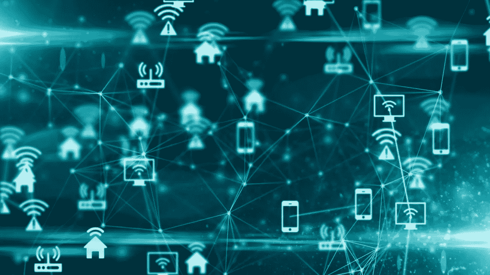
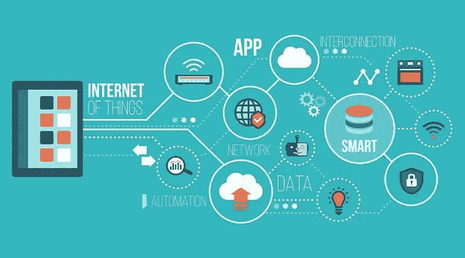
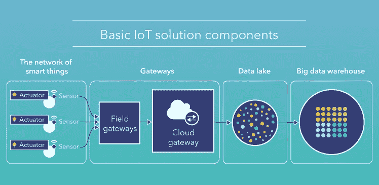
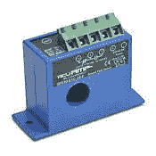
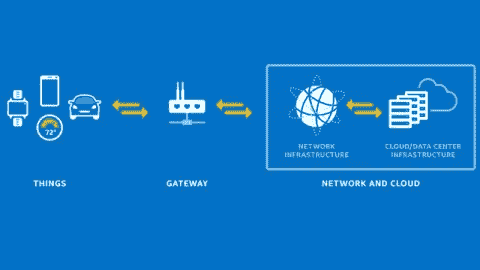
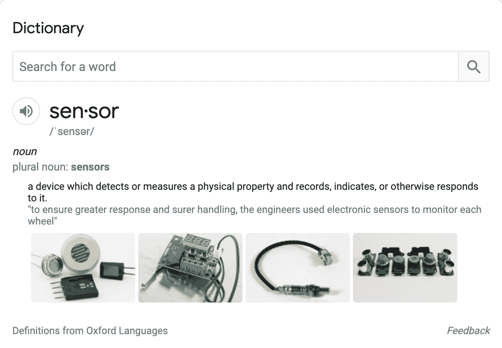
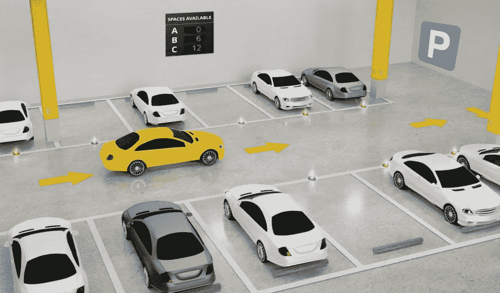

# 利用智能地球的未来

> 原文：<https://medium.datadriveninvestor.com/leveraging-the-future-of-a-smart-earth-a73bc5346d1a?source=collection_archive---------32----------------------->

## 介绍

## 深入探究当前推动我们经济发展的因素…

## 如果没有我们认为理所当然的现代技术，生活会是什么样子？首先，我们将拥有包含成千上万永无止境页面的真正的百科全书，而不是我们亲爱的朋友维基百科。还有谷歌。

很难想象在我们的指尖没有互联网的生活。它是在没有谷歌地图的情况下进行公路旅行吗？或者在紧要关头从亚马逊得到礼物？这两种情况听起来都像是突然陷入混乱(曾经有过，做过)。

从 50 年前到 2021 年，是什么推动了地球经济的技术进步？

互联网刚起步的时候，只有服务器上的东西，比如社交媒体应用，才能相互交互。

但是现在，一个新时代的开始出现了。这是天启，

> 物联网。

## IoT 是什么？

1970 年，联网设备这个牵强的想法产生了。

但是没有连接到互联网的事物之间的连接性的想法呢？不，至少在 2008 年之前不会。

但以某种不可思议的方式，物联网诞生了。

*物联网*是连接到互联网的物理对象网络，允许它们发送、接收、操作和交换数据。现在，这种技术为无关的可能性打开了大门，比如把椅子和我们的灯泡开关连接到互联网上！

基本的物联网设备由以下四部分组成:

1.  **硬件**——存储信息的有形物体
2.  **数据**——它能理解什么东西，它们如何相互作用。数据正在成为技术的通用语言。就像你和我如何理解一种语言(即英语)并能够连贯地相互交流一样，同样的概念也适用于这些设备。
3.  **软件** -它如何解释来自硬件的数据，并让它做有价值的动作项目，例如，如果这个按钮被按下，然后激活开关。
4.  **连接性** -拼图块的粘合剂。使一切顺利进行的系统。所有物联网生态系统点之间的定义连接，如传感器、网关、路由器等。

现在，我们已经了解了物联网设备的基本组成，系统如何运行和执行？

## 但是怎么做呢？

如前所述，数据是所有平台和传感器都能理解的通用语言。对数据进行进一步分析，并考虑有价值的信息。

该过程可以在各种来源中实现，如条形码阅读器，传感器收集的有用数据可以发送到云中，供人类分析并得出结论。一旦数据被发送到云中，软件就会对其进行处理和分析。

有些甚至可以更加人性化。用户界面允许用户进行更改，更改被发送到云，然后发送回传感器进行必要的更改。

路径如下:
传感器/设备→连接性→数据处理→用户界面

一个例子就是用你的手机点击一个按钮来调节你的恒温器系统的温度！

## 应用程序

物联网如今有各种各样的实现方式！其中包括通过使用家庭安全系统来增强智能供应链和构建智能家庭！门铃或 Nest 恒温器系统是物联网传感器的主要例子。或者，你的洒水器会自动开启，全部由你的手机控制？

一家公司致力于通过放置传感器和向人们发出停车信号来改善公共停车。该公司仅这一项每年就赚了 5000 万美元！

物联网在短短一二十年间获得了如此大的潜力，标志着一个**网关**(或许是预示？)为了更光明的未来！

## 优势

物联网将在 2025 年价值 11 万亿美元，这是有原因的。总的来说，它的优势包括:

*   技术优化
*   改进数据收集
*   减少浪费
*   提高客户满意度和参与度

物联网对经济最重要的影响之一是行业。为了获得最佳效率，大型企业使用物联网，物联网考虑了以下因素:

*   工厂数字化
*   产品流监控
*   存货管理
*   安全和保障
*   质量管理
*   包装优化
*   物流和供应链优化

最后但同样重要的是，它如何彻底改变了能源节约。每年在配电系统上花费 510 亿美元。但是在物联网的帮助下，成本会大大降低，而且维护费用也会大大降低。一个主要的例子是安装智能电表。这有助于:

*   更快地识别停机，有时还能在停机发生前预测到它们
*   从根本上防止停机或比以前更快地修复停机
*   以更低的成本减少停机时间并提高可靠性。

但众所周知，似乎永无止境的优点中总有缺点，例如故障检测传感器。

## 故障检测传感器

故障检测传感器旨在准确可靠地指示和定位永久和瞬时故障。由于不经常维护，旧系统会随着新的更新而落后。因此，一些故障检测传感器变得过时了。

如前所述，物联网将很快达到每年 110 亿美元的价值，原因如下…

## 解决方案:物联网网关

一个*物联网网关*是一个物理设备或软件程序，作为云和传感器之间的连接点。网关充当传感器/设备和云之间的桥梁。**传感器与网关对话，吸收并解释信息，然后网关与云对话**。

有了物联网网关，故障检测传感器可以继续运行，直到物联网网关的寿命结束，而不是在更新落后时造成严重破坏。它允许传感器通过蓝牙低能耗连接，并通过网格的蜂窝网络传输数据。这使得传感器能够实时推送数据，保障电网安全。

物联网网关极大地提高了物联网设备的性能，如预处理和过滤数据，延长电池寿命，减少内存存储。

但是，故障检测传感器只是引导我们技术行业的众多传感器类型之一…

## 传感器类型

传感器是构成物联网的关键功能。常用的传感器类型包括但不限于:

**温度传感器**:温度传感器测量热源中的热能数量，从而检测温度变化并将这些变化转化为数据。

**湿度传感器**:这些传感器测量空气或其他气体中的水蒸气含量。湿度传感器常见于供暖、通风和空调系统中。

**压力传感器:**压力传感器感知气体和液体的变化。当压力发生变化时，传感器会检测到这些变化，并将其传递给连接的系统。

**接近传感器**:接近传感器发射电磁场或红外线等辐射束，用于传感器附近物体的非接触检测。

**液位传感器**:液位传感器用于检测物质的液位，包括液体、粉末和颗粒物质。这在石油制造业中被大量使用。

**加速度计**:加速度计检测物体的加速度，也可以检测重力变化。

**陀螺仪**:陀螺仪传感器测量角速度或速度，通常定义为测量速度和绕轴旋转。

**气体传感器**:这类传感器监控和检测空气质量的变化，包括有毒、易爆或有害气体的存在。

**红外传感器**:这些传感器通过发射或检测红外辐射来感知周围环境的特征。他们还可以测量物体散发的热量。它们可以用来简化血流和血压的监测。

**光学传感器**:光学传感器将光线转换成电信号。

在不同的场景中使用不同的传感器来提供最佳效率。例如，汽车制造商使用光学和接近传感器为司机停车。

但是如何在线存储你的在线技术服务呢？向…问好

> 云计算！！

## 云计算

云计算是一个宽泛的术语，包括计算、存储和为需要者提供的服务。它通过互联网提供点播资源。它还提供对云提供商(如 AWS)提供的大量技术服务的访问。此外，它可以从世界任何地方访问，并具有快速的弹性。

为了获得额外的安全性，它可以是公共云、私有云或混合云。云计算服务的常见类型包括:

**SaaS** →，又名*软件即服务，通过互联网交付*应用程序——即服务。您不用安装和维护软件，而是通过互联网访问它，将您从复杂的软件和硬件管理中解放出来。SaaS 的一个例子是 *Dropbox* ！

**PaaS** →又名*平台即服务*；云中完整的开发和部署环境，资源使您能够交付从简单的基于云的应用程序到复杂的支持云的企业应用程序的一切。许多开发者使用的 PaaS 是 Heroku。

**IaaS** →又名*基础设施即服务*；基于云的服务，为存储、网络和虚拟化等服务付费。它是通过互联网提供和管理的。IaaS 的一个典型例子就是 *Azure* 。

这四种主要的云计算服务有助于在物联网中导航，实现全球访问和使用，并提供用户友好的资源来开发自己可用的物联网设备。

## 个人笔记

查看我的 [**LinkedIn**](https://www.linkedin.com/in/fatimah-hussain/) ， [**Instagram**](https://www.instagram.com/fxtimxhh/?hl=en) ，关注我的 [**中**](https://medium.com/@fatimahandhussain) 。我最近发表了我的 [**网站**](https://fatimahhussain.com/)**；检查一下！当我写这些文章的时候，我总是付出 100%的努力和奉献，所以我希望你过得愉快！敬请关注，点击“关注”按钮，获取每周更新和引人入胜的项目！**