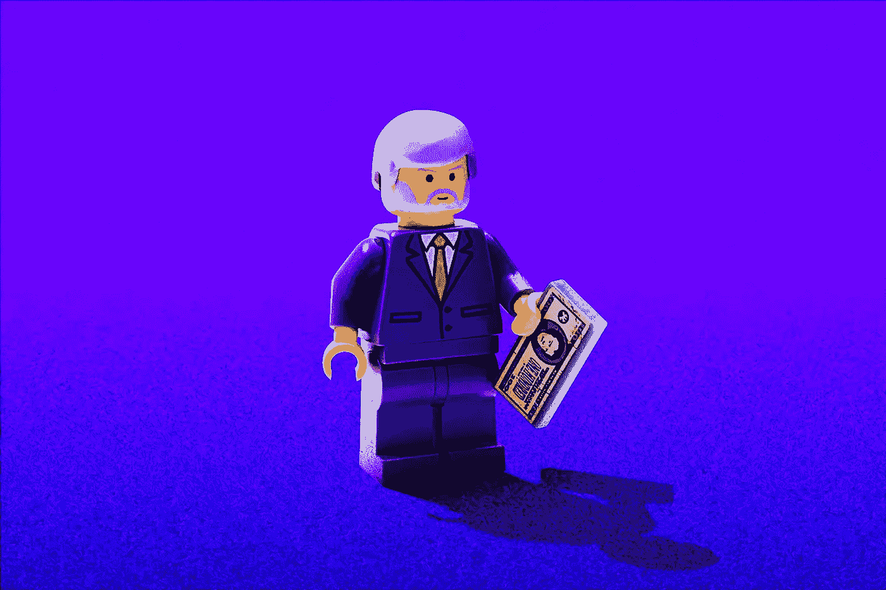

# LIBOR:一个迷人的传奇！

> 原文：<https://medium.datadriveninvestor.com/libor-an-enthralling-saga-794e2bb2c97c?source=collection_archive---------20----------------------->

## 从创造历史到成为历史。

Photo by [Morning Brew](https://unsplash.com/@morningbrew?utm_source=unsplash&utm_medium=referral&utm_content=creditCopyText) on [Unsplash](https://unsplash.com/?utm_source=unsplash&utm_medium=referral&utm_content=creditCopyText)

**伦敦银行同业拆放利率(LIBOR)是国际银行间市场短期借款的最重要基准利率之一。LIBOR 是全球公认的基准，代表伦敦银行同业拆放利率。**

LIBOR 也是全球各国消费者贷款的基础，因此像金融机构一样影响消费者。信用卡、汽车贷款和可调利率抵押贷款等各种信贷产品的利率基于伦敦银行同业拆放利率浮动。

利率的这种变化有助于确定银行和消费者之间借贷的难易程度。结果，在 2012 年 LIBOR 骗局后，许多国家机构和市政当局对投资银行提起诉讼，要求赔偿它们因恶意上调/下调 LIBOR 利率而遭受的损失。

# 伦敦银行同业拆放利率基础

全球主要银行使用伦敦银行同业拆借利率作为其贷款活动的平均利率。主要五种货币美元、英镑、欧元、日元和瑞士法郎是 LIBOR 的基础。

> LIBOR 的到期日有七种不同的方式，包括隔夜或即期、一周、1 个月、2 个月、3 个月、6 个月和 12 个月。
> 
> 根据货币和到期日，每天计算并提交总共 35 个 LIBOR 利率。而最常见的利率标签是 3 个月期美元利率，也就是当前的伦敦银行同业拆放利率。

就像伦敦银行同业拆放利率一样，还有其他类似的地区性利率在全球范围内广受关注。

 [## 金钱:冠状病毒疫情期间的投资|数据驱动的投资者

### 在我将近 20 年的金融服务生涯中，我曾经负责监督整个…

www.datadriveninvestor.com](https://www.datadriveninvestor.com/2020/07/29/money-investing-during-the-coronavirus-pandemic/) 

例如，欧洲有欧洲银行同业拆放利率(EURIBOR)，日本有东京银行同业拆放利率(TIBOR)，中国有上海银行同业拆放利率(SHIBOR)，印度有孟买银行同业拆放利率(MIBOR)。

# LIBOR 的有趣历史

1969 年 8 月 15 日，伦敦 j . p . mor gan legacy bank Manufacturers Hanover ltd .的董事总经理、希腊银行家弥诺斯·宗姆巴纳基斯(Robert Zombanakis)在为一笔 8000 万美元的银团贷款做经纪时，创立了 LIBOR。

第一笔交易 10 个月后，1970 年 6 月 5 日，制造商宣布第二笔 5 年期贷款 1 亿美元，利率浮动，“以伦敦 6 个月银行同业拆借利率为基础”。这些是 LIBOR 的第一批记录。

此后，伦敦银行同业拆放利率在 20 世纪 70 年代变得相当流行，成为离岸欧洲美元市场交易的参考利率。

1984 年，利率互换、外汇期权和协议等新的市场工具开始从全球投资银行获得大量资金。这些交易主要基于伦敦银行同业拆借利率，但随着时间的推移，银行家们对该利率的未来增长和一致性感到怀疑。

结果，在 1984 年 10 月，代表银行和金融服务业的英国银行家协会(BBA)制定了 BBA 利率结算利率，这最终导致了 BBA 利率互换标准的产生，也被称为“BBAIRS”条款。

从 1985 年 9 月 2 日起，BBAIRS 条款成为标准的市场惯例。尽管在 1986 年 1 月 1 日之前，BBA Libor 定价并没有正式开始。

# 伦敦银行同业拆借利率丑闻浮出水面

Photo by [Hello I’m Nik 🎞](https://unsplash.com/@helloimnik?utm_source=unsplash&utm_medium=referral&utm_content=creditCopyText) on [Unsplash](https://unsplash.com/s/photos/lego?utm_source=unsplash&utm_medium=referral&utm_content=creditCopyText)

伦敦银行同业拆借利率丑闻始于总部位于英国的投资银行巴克莱银行对伦敦银行同业拆借利率的不当操作，主要有两个原因。第一个是通过提供有利的利率让客户在交易中受益，以进一步获利，另一个是在 2008 年全球危机中保持其财务地位。

从 2005 年到 2008 年，巴克莱交易员多次要求负责提交 LIBOR 的同事修改 LIBOR，以便让处于他们位置的客户受益。

这一举动也导致巴克莱银行要求其对手银行操纵利率，这种做法最终蔓延开来。巴克莱还在 2007 年至 2009 年间提交了较低的 LIBOR 利率，良心发现较高的利率会导致投资者质疑公司的流动性和财务健康状况，因为较高的利率当然会提高贷款和借款的价格。

除了巴克莱，其他投资银行，包括德意志银行、苏格兰皇家银行、瑞士瑞信银行、花旗集团和摩根大通，也因伦敦银行同业拆借利率的不当行为而受到指责。从逻辑上来说，这一丑闻可以与通过内幕消息进行的丑闻相提并论。

# **刑事诉讼:罚款和指控**

这一丑闻导致了对相关投资银行的刑事诉讼。2012 年 2 月 28 日，美国司法部对交易员与投资银行家进行直接沟通以进行设置或更改的指控进行了刑事调查。

> 巴克莱被商品期货交易委员会罚款 2 亿美元，被美国司法部罚款 1.6 亿美元，被英国金融服务管理局罚款 5950 万美元

在此之后，巴克莱董事长马库斯·阿吉乌斯和首席执行官鲍勃·戴蒙德分别从该行辞职。巴克莱的首席运营官德尔·米西尔也辞职了，但他向英国银行家协会承认参与了伪造 LIBOR。

> 瑞银也被罚款 15 亿美元，苏格兰皇家银行(RBS)因其在全球利率操纵丑闻中的角色被罚款 6.12 亿美元。

2012 年 10 月 4 日晚些时候，美国共和党参议员查克·格拉斯利和马克·柯克(Mark Kirk)宣布，他们正在调查财政部长蒂姆·盖特纳(Tim Geithner)参与利率操纵丑闻，并指控他掌握损害州、市和地方政府的利率操纵知识。

# **花了多少钱？**

骗局发生后，很明显**操纵已经发生，并导致美国各州、县和地方政府至少 60 亿美元的欺诈性利息支付，超过 40 亿美元**州和地方政府已经不得不花费来解除他们暴露于利率操纵的头寸。

由于治理水平低下以及 2008 年后伦敦银行同业拆放利率下的基础资产减少，导致成立了一个名为替代参考利率委员会(ARRC)的委员会，其母公司是美联储董事会和美联储银行。

2016 年，ARRC 发布了一份关于要求其他参考利率的中期报告。随后在 2017 年 7 月，英国金融行为监管局(FCA)已要求银行提交替代参考利率(ARRs)以取代 LIBOR，从 2021 年起不再要求银行提交 LIBOR 报价。

**问题来了，哪个利率将取代伦敦银行同业拆借利率？嗯，在这条线上有许多竞争对手，如担保隔夜金融利率(SOFR)，复合设置拖欠率(CSAR)，和英镑隔夜指数平均(索尼亚)，但这是一个其他时间的讨论，直到那时保持关注！**

*原载于 2020 年 7 月 29 日 https://www.datadriveninvestor.com**[*。*](https://www.datadriveninvestor.com/2020/07/29/libor-an-enthralling-saga/)*

***访问专家视图—** [**订阅 DDI 英特尔**](https://datadriveninvestor.com/ddi-intel)*