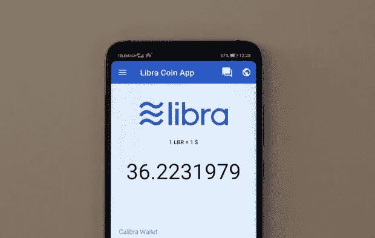

# 天秤座可能是脸书的末日-第二部分

> 原文：<https://medium.datadriveninvestor.com/libra-may-be-the-end-for-facebook-part-2-de41cba6f9ea?source=collection_archive---------34----------------------->

*The USD went off Gold in the 70s*

脸书选择发行一个集中的、半匿名的、得到许可的 T2 令牌令人费解。首先，脸书对现代货币概念的理解充其量似乎是模棱两可的，这是因为脸书表明天秤座将由一篮子货币和金融资产支持。而自从美国在 70 年代放弃金本位制以来，T4 的法定货币一直受到信任的支持；目前还不清楚为什么 Libra 会得到菲亚特篮子的支持。这可能是一种给天秤座披上合法外衣的营销选择，或者是吸引货币当局的一种方式。

> *“将 Libra 与固定资产篮子挂钩是没有意义的，它将波动风险转移到篮子本身的可能性最小。”*

发行货币时有一些重要的因素需要考虑，这是脸书和任何其他类似项目首先需要理解的。它们如下:

*   政府监管:发行一种货币通常受到政府的严格监管，以控制货币的供求。试图避免这一点将导致发行人面临法律挑战。
*   隐私和逃税:如果脸书希望 Libra 成为真正的私人象征，脸书将有责任掩盖逃税事件，例如，商家和买家可以在不收取销售税的情况下进行交易。在很大程度上，这将削弱天秤世界政府有效收税的能力。这一效应将加剧政府因缺乏对货币发行的监管而带来的痛苦。
*   [货币波动](https://www.kantox.com/en/glossary/currency-volatility/):全球货币体系本来就不稳定。Libra 的全球策略将面临流动性限制、产品和服务价格变动等问题。将 Libra 与一个基于菲亚特的资产篮子挂钩是没有意义的，它将波动性风险转移到篮子本身的可能性最小。

*Pegging Libra to FIAT asset is Meaningless*

# 脸书作为中央发行实体:利弊

中央政府实体发行和记录货币交易有许多好处。一些最重要的优势是:第一，能够在出错的情况下撤销交易。第二，在无效/犯罪/未授权活动的情况下返还货币的能力。第三，使用货币支付包括税收在内的政府服务的能力(政府承兑)。

 [## 加密货币行业是死是活？数据驱动的投资者

### 九月初，我们在 X-Order 内部就代币市场的未来进行了一场辩论。有趣的是，我们的观点是…

www.datadriveninvestor.com](https://www.datadriveninvestor.com/2019/12/12/will-the-cryptocurrency-industry-be-dead-or-alive/) 

然而，优点伴随着许多缺点，由于市场动态，中央发行实体通常面临通货膨胀压力。此外，控制中心实体更容易成为对手的目标。中央发行货币的用户的另一个缺点是，中央实体可以对交易施加限制，并为某些交易建立批准要求。

*The Federal Reserve System’s headquarters*

任何企业要想长期成功并为股东创造价值，都必须建立在良好的商业战略之上。正如我们之前提到的，脸书一直并且仍然完全依赖广告作为其收入模式的核心。这一现实带来了被下一个主流社交广告技术所颠覆或取代的迫在眉睫的风险。这将破坏脸书广告业务的长期可持续性，尤其是在已经拥挤不堪的科技领域。

毫无疑问，脸书的优势在于拥有一个庞大而稀疏的网络，并拥有数百万的个人数据。然而，该公司仍在试图证明它可以像微软和 Alphabet 一样成为一股长期的颠覆性力量。

> *“脸书过去和现在都完全依赖广告作为其收入模式的核心。”*

# 脸书能做什么？

从战略角度来看，任何拥有与脸书类似受众的科技公司在研究外汇业务时，都应该做到以下几点:

*   花费资源研究和理解[密码经济学](https://blockgeeks.com/guides/what-is-cryptoeconomics/)。
*   抛弃一个公司品牌的项目“天秤座”,采用像“瑞士联邦理工学院”和“BTC”这样的项目。
*   推出一款[钱包](https://www.datadriveninvestor.com/glossary/wallet/)，允许为 ETH 和 BTC 兑换任何货币，并在此基础上进行交易。
*   投资构建有用的货币工具，利用网络和平台构建应用程序，如运行在 ETH [区块链](https://www.datadriveninvestor.com/glossary/blockchain/)上的 [DApps](https://en.wikipedia.org/wiki/Decentralized_application) 。