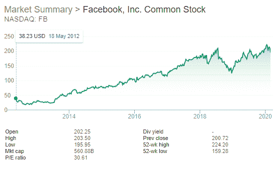
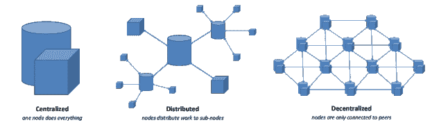

# 天秤座可能是脸书的末日——第一部分

> 原文：<https://medium.datadriveninvestor.com/libra-may-be-the-end-for-facebook-part-i-e04eb6c16e35?source=collection_archive---------9----------------------->

2019 年，脸书越过了一条红线。公司公布了[天秤座项目](https://libra.org/en-US/)。在深入了解[天秤座](https://libra.org/en-US/)之前，我们先来上一堂关于[脸书](https://www.facebook.com/)的简短历史课。

早在 2000 年，马克·扎克伯格，一个 23 岁内向的哈佛大学[计算机科学学院的辍学生，在试图克服一次糟糕的分手时，创办了](https://www.harvard.edu/)[Facebook](https://en.wikipedia.org/wiki/History_of_Facebook)网站作为副业。[扎克伯格据称从双胞胎](https://www.telegraph.co.uk/news/worldnews/1558128/Facebook-founder-stole-the-idea.html)[哈佛兄弟](https://en.wikipedia.org/wiki/Winklevoss_twins) [**卡梅隆**](https://en.wikipedia.org/wiki/Cameron_Winklevoss) [和](https://en.wikipedia.org/wiki/Winklevoss_twins) [**泰勒文克莱沃斯**](https://en.wikipedia.org/wiki/Tyler_Winklevoss) [那里窃取了这个想法。尽管如此，马克还是建立了他的网站，并很快在大学和学院中非常流行。现在该网站已经转型成为现存最大的在线定向广告公司之一。](https://en.wikipedia.org/wiki/Winklevoss_twins)

脸书在 2004 年以一家私人公司的身份成立，八年后才上市。脸书 2012 年的首次公开募股(IPO)股价为 38 美元，截至 2020 年 2 月，该公司的价值为 5600 亿美元(T2)、5600 亿美元(T4)、700 亿美元(T7)。脸书见证了 8 年间 452%的估值增长。这种增长帮助 facebook 收购了其他有影响力的公司，如 instagram 和 WhatsApp。脸书目前控制着互联网**7.79%的流量和社交网络**86%的流量。脸书的光辉使命是连接世界；脸书实际上正在使用[机器学习](https://en.wikipedia.org/wiki/Machine_learning)来管理用户生成的内容，以抓住人类的注意力，从而销售广告。除了围绕该公司的争议之外，脸书还拥有卓越的技术，这有助于它实现超越任何其他竞争对手的技术优势。这一事实将我们带到了 2019 年，当时脸书宣布了天秤座。天秤座项目是一个声明，它清楚地表明，脸书认为它是大于生命的。****

> *****FACEBOOK 目前控制着互联网 7.79%的流量和社交网络 86%的流量。*****

********

****脸书的商业模式多年来一直面临的一个主要风险是它对一种收入来源的依赖；[网络广告](https://en.wikipedia.org/wiki/Online_advertising)。这种商业模式不同于其他大型科技公司亚马逊、微软甚至谷歌，它们有不止一个成功的收入来源。为了应对这种风险，脸书一定在想更好的办法来利用其在 T4 的强大网络，创造新的收入来源。脸书认为，通过发行自己的[令牌](https://en.wikipedia.org/wiki/Token)，或者换句话说，一种[集中的](https://www.datadriveninvestor.com/glossary/centralized/)数字货币，涉足货币业务，就可以实现这一点；天秤座。****

********

****在软件世界里，代币在游戏中很典型。像 [EA、](https://www.ea.com/) [Rockstar](https://www.rockstargames.com/) 、 [Ubisoft](https://www.ubisoft.com/en-us/) 这样的游戏公司发行游戏代币来围绕他们的产品创造经济以维持其运转。****

********

****然而，[货币](https://www.investopedia.com/terms/c/currency.asp)与**数字[代币](https://www.datadriveninvestor.com/glossary/token/)有着本质的不同**。数百年前，货币以其被广泛接受的形式，曾经是一种像金属一样容易交换的贵重资产。在我们的现代经济中，直到 70 年代，货币都是由一个保管人持有的贵金属储备支持的(贵金属通常是黄金)。然后一个新的体系出现了，法定的现代货币体系出现了，它取消了黄金支持，取而代之的是信托。最近，随着互联网的丰富，新的货币理念应运而生，比如比特币(BTC)和以太坊(Ethereum)。这些是 ***去中心化、分布式、假名、公共账本*** *、*类似于[法定现金](https://en.wikipedia.org/wiki/Fiat_money)，但以 ***无权限数字形式*** 存在。这些方法的主要前提是发表声明。这种说法认为 [**分权**](https://medium.com/@VitalikButerin/the-meaning-of-decentralization-a0c92b76a274)[**隐私**](https://en.wikipedia.org/wiki/Privacy) 是未来处理现代货币的更好方式。****

********

****我们不能强调区分发行一种替代现代货币的货币和发行一种类似游戏代币的集中代币的重要性。我们认为，脸书作为一家软件公司，未能做出这种区分，因为脸书天生就偏向于对货币概念的理解*，而不是创造 Libra 作为一种创新或下一级技术。*****

***** [## 使用谷歌搜索趋势预测首次申请失业救济人数|数据驱动的投资者

### 几年来，我的重点一直是使用多种替代数据来预测宏观经济统计数据…

www.datadriveninvestor.com](https://www.datadriveninvestor.com/2020/03/25/using-google-search-trends-to-predict-initial-jobless-claims/) 

发行货币不同于游戏代币或任何其他集中式代币，因为:货币的发行者必须关注通货膨胀。说到这一点，脸书作为 Libra 的**中央**发行人，将与政府保持一致。脸书将不得不对其货币天秤的全球需求做出回应，这种需求可能如此之高，以至于对其将盯住的[一揽子资产](https://www.cnbc.com/2019/10/21/facebooks-david-marcus-libra-could-use-currency-pegged-stablecoins.html)产生压力，否则货币将会出现通胀，在天秤和其以美元为主的一揽子法定货币和资产之间产生意想不到的波动和双向反馈效应。换句话说，脸书将面临无法提供统一的全球银行安全网的紧迫风险。

脸书可能面临的另一个问题本质上是意识形态问题。如果天秤座是成功的，这是一个与身份相关的问题。脸书需要回答一个基本问题:如果 Libra 是成功的，为什么脸书会参与公开市场？该公司很容易私有化，因为它不需要公开市场为其活动提供资金，因为它将拥有 Libra。这将是任何公司历史上最大的转变。

> FACEBOOK 需要回答一个基本问题:如果 LIBRA 是成功的，为什么 FACEBOOK 要参与公开市场？

以上两个问题只是我们研究的许多其他问题中的一个例子。投资者在审视脸书时，应该评估这些问题。

只有时间才能证明脸书是否会选择天秤座，天秤座是否会成为比世界上大多数政府更强大、更有效的经济调解人。

在我们的下一篇文章中，我们将讨论脸书对现代货币的理解，以及我们对脸书或其他类似实体如何推进其项目的建议。*****