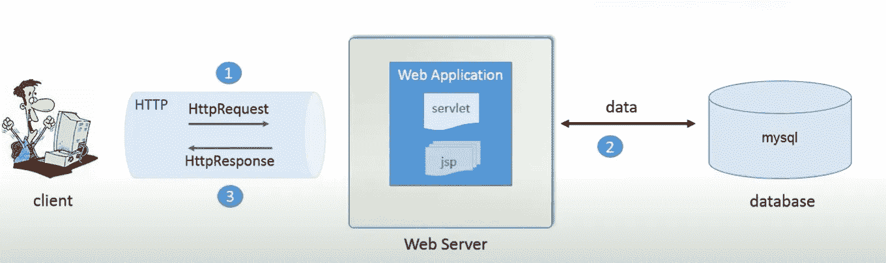
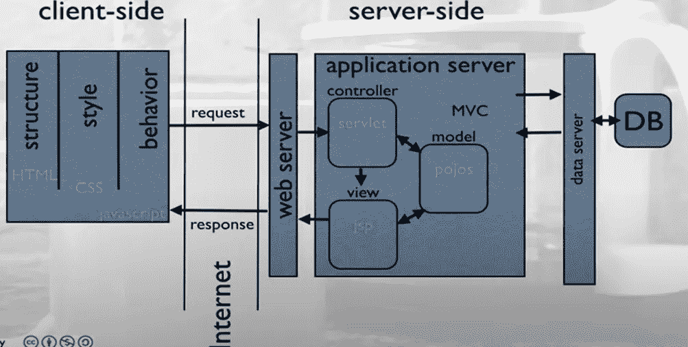

# 软件工程实习生活—了解 JSP Servlets 01

> 原文：<https://medium.datadriveninvestor.com/life-at-software-engineering-internship-understanding-jsp-servlets-01-ceacdeac75cf?source=collection_archive---------11----------------------->


所以我正好可以在 Epic 技术集团实习，他们的主要领域是银行业。在入职培训后，我们被分配了一些任务，我将分享我在实习的前三周学到的一些知识。

**Java Web 应用。**



Overview of a Java Web Application.

上图显示了 java web 应用程序及其组件的基本概况。如果我们一部分一部分地解释图像，第一个人是客户，他是在计算机上工作的人/想通过互联网完成工作的人。

第二部分是 web 服务器，它处理请求和响应。然后是 MySQL 数据库，我们在其中存储需要检索并显示给客户端的数据。根据题目我们需要谈谈 JSP 和 Servlets！话不多说，让我们深入内容！

在进入内容之前，让我们清除关键词，

01. **JSP** : Java 服务器页面，也是一个包含动态数据的脚本表。它主要处理动态部分和我们从客户端看到的页面。

02. **Servlet** :基于 Java 的服务器端 web 技术，它是 Java EE 中的一个特殊类，负责响应请求和响应。

03. **Request** :由 web 服务器创建，当来自客户端的请求到达时，它保存关于请求的信息。

04.**响应**:由 web 服务器创建，当请求被处理，数据从数据库发送到 web 服务器时，服务器将需要发送给客户端的数据附加到一个响应中。

如果我们谈论一个动态 Web 应用程序，有 3 个主要部分，即客户端、Web 服务器和数据库。在 java 中，动态 web 项目我们使用的主要前端页面类型是 JSP，它代表 Java 服务器页面。它是在处理请求后显示给客户机的页面。让我们把上面的图片我已经附上，并明确的事情了！每次我们访问互联网，它都是请求和响应。当客户端想要从网站获取一些数据时，网站会向服务器发送 HTTP 请求来获取信息。然后 Servlet 处理请求，接着与数据库通信，然后将请求的数据附加到 HTTP 响应中，最后发送回客户机。

# MVC 架构。



正如你已经知道的，我们几乎在每一个运行在 java 上的框架中都有 MVC 架构。考虑到 JSP 页面，我们通常使用 HTML 构建页面，然后使用 CSS 制作样式，使用 JS 控制行为。

谈到场景的后端，Servlets 充当控制器，POJO/Java 数据文件充当模型，JSP 文件充当视图。考虑到 MVC 完成的工作，控制器负责获得请求并决定下一步做什么。它使用组件来完成工作。然后，它将实现传递给视图，并负责用 HTML 做出响应。在简单的情况下，模型是普通的旧 java 模型。

让我们举一个例子来看看 servlets 是如何工作的，假设我们想访问脸书网站，然后 web 服务器将 JSP 文件加载到 web 浏览器，然后您输入用户名和密码。然后用户名和密码作为 HTTP 请求发送到服务器，servlet 捕获请求中的登录信息，并将其发送到 POJOs。然后，pojos 获取用户名和密码，与数据库进行匹配，并将结果发送给 servlet。然后 servlet 将结果作为 HTTP 响应对象传递给 JSP 页面，并指出需要加载什么样的 JSP 页面。大多数情况下，请求从客户端开始，然后发送到服务器端，响应从服务器端开始，然后发送到客户端。

[](https://www.datadriveninvestor.com/2019/01/23/which-is-more-promising-data-science-or-software-engineering/) [## 数据科学和软件工程哪个更有前途？数据驱动的投资者

### 大约一个月前，当我坐在咖啡馆里为一个客户开发网站时，我发现了这个女人…

www.datadriveninvestor.com](https://www.datadriveninvestor.com/2019/01/23/which-is-more-promising-data-science-or-software-engineering/) 

您始终需要记住的一点是，JSP servlets 中没有持久性，这意味着为每个新的请求和响应创建一组请求和响应对象，并且请求只能在 servlet 中使用。

我用 JSP Servlets 做了一个简单的 CRUD 操作项目，你可以从[*这个链接下载源代码。*](https://github.com/Adore96/Servlets-CRUD) *不要犹豫，联系我，询问/澄清你想出的任何代码。(*[](https://www.facebook.com/kasunkalhara.perera)**，*[*Linkedin*](https://www.linkedin.com/mwlite/in/kalhara-perera-a45026136)*，Instagram)* 这些我在媒体简介描述*中也有分享。*谈到 JSP Servlets 中页面运行的流程，*

***01** 。你可以使用任何你喜欢的 web 容器来部署这个项目(我已经使用了 tomcat 和 glassfish，它们仍然很好，但是 glassfish 有一些 bug，souts 不能在 Netbeans 中打印出来，tomcat 与 [*IntelliJ IDEA*](https://www.jetbrains.com/idea/) 配合得很好。)我这里用过 tomcat v9。此外，在映射文件时，我使用了 Servlet 映射，您也可以使用注释来路由页面。*

***02** 。首先，项目通过运行 *web.xml* 文件开始，然后搜索并执行欢迎文件。*

***03** 。例如，我们假设，在这个项目中，第一个页面是 login，它的 JSP 页面有一个带有 action="Login "的表单*

```
*<form action="Login" method="post">
    <input type="text" id="uname" class="fadeIn second" name="uname" placeholder="UserName">
    <input type="text" id="password" class="fadeIn third" name="password" placeholder="Password">
    <input type="submit" class="fadeIn fourth" value="Log In">
</form>*
```

*然后，带有“ *Login* ”动作的请求转到 web.xml 文件，搜索“ */Login* ”，然后映射负责该 JSP 的 servlet 类。在 servlet 页面中，根据请求中传递数据的方法，我们有 doPost 和 doGet 方法。因为这是一次登录，所以我已经提交了值，并在 doPost 方法中捕获了请求。然后 doPost 方法有数据库和 DAO 的对象。Servlet 将数据传递给这些对象，并获取登录用户的状态。然后它发送响应，如果登录成功就加载 Dashboard.jsp，如果不成功就加载 Error.jsp。*

****感谢各位的阅读，下篇文章再见！！快乐阅读！❤****

***获取专家观点—** [**订阅 DDI 英特尔**](https://datadriveninvestor.com/ddi-intel)*