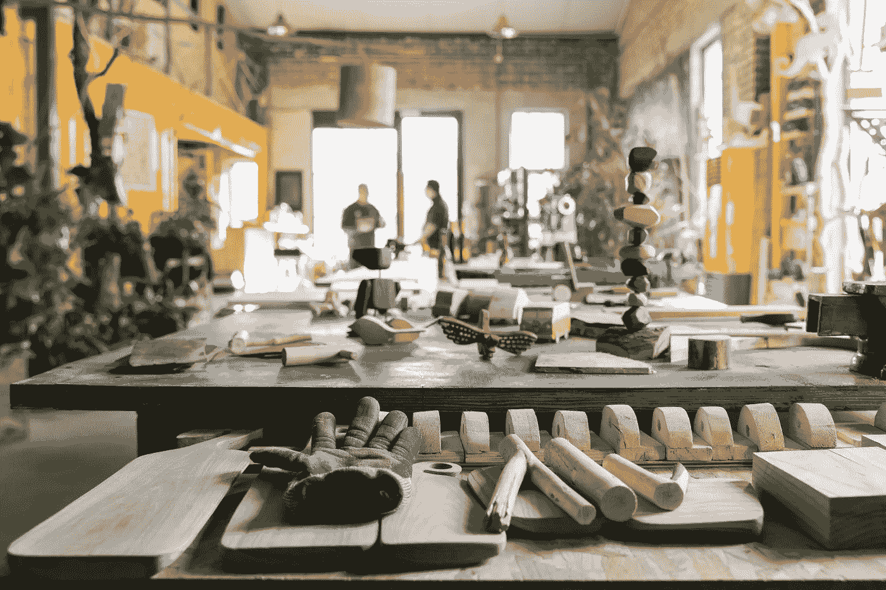
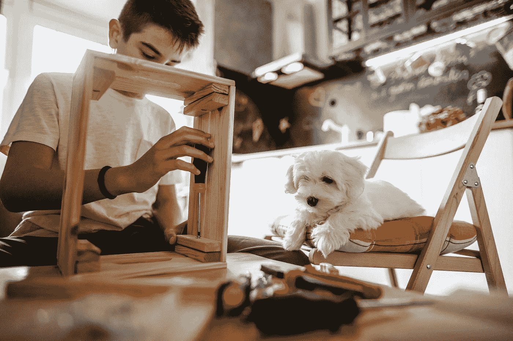
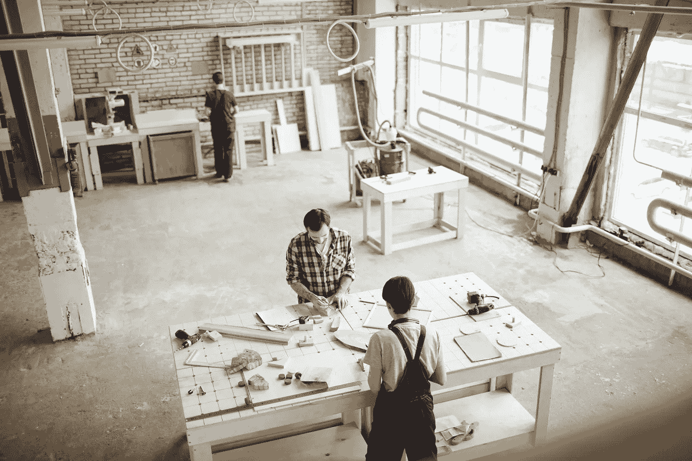
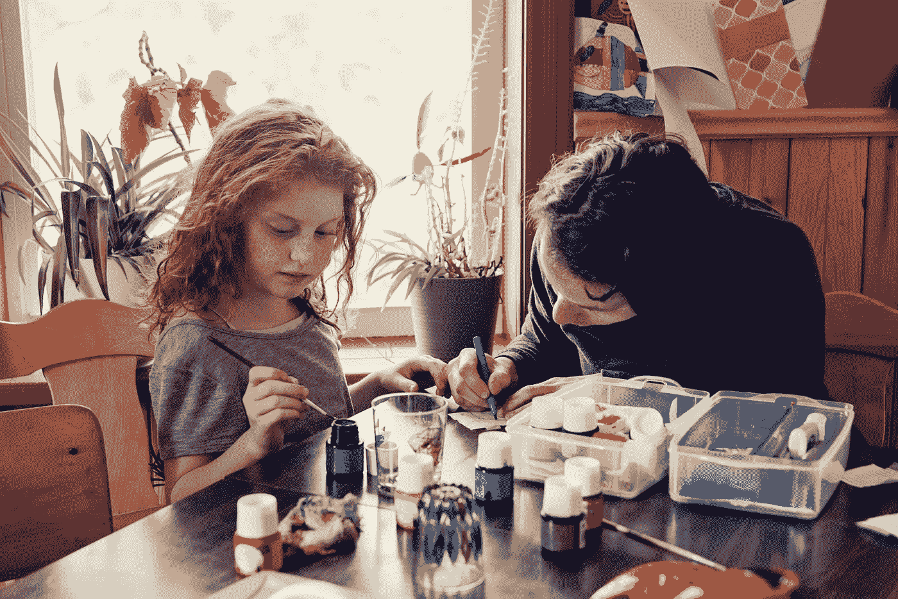

# 生活帮:STEM 制造商空间

> 原文：<https://medium.datadriveninvestor.com/life-hack-the-stem-makerspace-ff904e7d6974?source=collection_archive---------4----------------------->

## 解决常见错误以节省时间和金钱

Image: Getty# 514404636 / Young Woman Holding Tablet In A Makerspace

*作者:* [*安德鲁·b·劳普*](https://medium.com/u/d8c8d333927a?source=post_page-----bc7b73a1ac7b----------------------)*/*[*@ stem CEO*](https://twitter.com/stemceo)

F 或 STEM(科学、技术、工程&数学)学习要想真正有效，必须既用心又动手。我们这个快节奏的世界的现实是，仅仅通过教授学生死记硬背的内容和主题，是不可能让他们为未来的工作做好准备的。今天教的计算机科学课程，过不了几年就会过时。

 [## 认知计算——一套被广泛认为是……

### 作为它的用户，我们已经习惯了科技。这些天几乎没有什么是司空见惯的…

www.datadriveninvestor.com](https://www.datadriveninvestor.com/2020/02/19/cognitive-computing-a-skill-set-widely-considered-to-be-the-most-vital-manifestation-of-artificial-intelligence/) 

相反，最有价值的 STEM 浓缩是那种专注于可以应用于广泛行业的技能。科学方法、创造性解决问题、 [TRIZ 方法论](http://umich.edu/~scps/html/07chap/html/powerpointpicstriz/Chapter%207%20TRIZ.pdf)和基于证据的规划/评估始终适用。让学生练习这些课程的最好方法之一就是给他们提供大量的真实世界的经验。

Image: Getty# 923297324 / Zen Makerspace

进入创客空间。[创客空间](https://www.makerspaces.com/what-is-a-makerspace/)是协作工作空间，旨在将人们聚集在一起解决问题。他们通常提供一系列工具和用品，从基本的积木和美术用品到 3D 打印机和激光切割机。对于 STEM 学生来说，创客空间提供了探索电子、工程、编码等更多领域的机会——所有这些都以构建特定问题的真正解决方案为名。

**设计创客空间的常见陷阱**

创客空间是学习和建立社区的令人兴奋的地方，所以难怪它们变得如此受欢迎。但是成功的创客空间需要仔细的计划和愿意慢慢来。

人们犯的一个最大的错误是用他们能找到的最新最棒的小玩意填满他们的新空间。这些东西通常都很贵，而且未经测试:仅仅因为一家公司在卖令人兴奋的东西，并不意味着它是必需品。STEM 产品的用途通常非常狭窄，这将限制它们对学生的吸引力，而乐高积木和磁性积木等灵活的经典产品将得到大量使用。

Image: Getty# 1190789701 / Boy Woodworking With His Dog

购买的最佳方式是仔细研究。首先从基本的工具和材料开始，随着时间的推移逐步进行更大的投资。这使得你可以跟随学生的领导，因为你的项目的个性开始形成。购买前先试一试，并对任何考虑中的物品寻求多种意见。这包括学生和教师的反馈，而不仅仅是来自销售代表的信息

**校本 STEM 创客空间**

每个学校建筑和社区都不一样，所以每个创客空间都会不一样。但是当你为你的学校开发创客空间时，有一些最佳实践可以遵循。

1.选择一个每个人都能到达的地方。[学校图书馆](https://knowledgequest.aasl.org/makerspace-made-easy/)是一个很好的选择，因为它对所有人开放，但任何开放的空间，所有学科教师都可以使用。

2.为包容和协作而设计。[选择可以根据不同协作类型重新配置的家具](https://knowledgequest.aasl.org/makerspace-made-easy/)，并确保考虑有行动问题和其他残疾的学生。

3.考虑一下房间的质量。光线，温度，空气质量，布局，甚至油漆颜色都应该有利于学习，但这些几乎从来不考虑。理想的情况是，找一个有大量自然光、许多插座、公用水槽和白色或非常淡的墙漆的地方。可洗地板是必须的！

Image: Getty# 1170466424 / Open Workshop

4.决定你将关注什么类型的项目。理想情况下，创客空间是灵活的，但有限的预算意味着你必须从一个特定的重点开始。你的工作是关于编码、木工还是纸板创作？电子学还是纸模型？你必须从某个地方开始！

5.投资一门课程。为了给学习打好基础，你需要建立[对行为、努力和爱护空间的明确期望](https://www.gettingsmart.com/2016/04/top-10-things-a-makerspace-needs/)。它可以帮助你从现有的课程开始，并启发你发展自己的挑战和活动。

6.计划扩张。有一个为你的创客空间添加新工具和材料的策略是值得的。继续研究和计划。你提前做得越多，就越容易做预算和筹集资金来帮助你成长。

**STEM makers spaces:家庭版**

对于父母来说，在家里建立一个创客空间需要一点创造力。如果你有多余的房间，你可以考虑用一些教室的小技巧来布置它。添加儿童尺寸的工作台和椅子，以及用于整理材料的橱柜和箱子，将有助于保持物品整洁，尤其是如果你还将房间用作书房或游戏室。

如果你没有多余的空间，试着用一辆手推车装上干净的建筑材料、艺术用品和一些高质量的 STEM 玩具。到了做饭的时候，把手推车推到厨房，把柜台或桌子用作工作空间。如果需要，一盏好的夹式台灯可以增加照明。

Image: Getty# 824575012 / Father And Daughter Coloring

虽然许多孩子会让他们的想象力天马行空，但有些孩子需要鼓励。通过提供要解决的[创客挑战](https://sites.google.com/a/kmsd.edu/kmelementarymakerspace/build-challenges)来帮助孩子们开始。例子包括建造最快的过山车轨道，最坚固的饮用稻草桥，或者最高的积木塔。你也可以让你的孩子解决实际问题，比如想办法在房子周围节约用水或者让狗多运动。有一个“任务”或挑战是激发创造力和集中孩子努力的好方法。

总部位于弗农山庄的 hand2mind 为在家学习创建了一系列[免费资源](https://www.hand2mindathome.com/)，包括几个 STEM 提示和项目。这些活动可以用你家里的材料来完成，是促进和鼓励创造性思维的好方法。他们允许年轻的学习者通过实际的、自己动手的构建任务将他们的设计想法带入生活。

无论是在学校还是在家里，创客空间都为创造性解决问题、实验和科学思考提供了场所。从一些允许孩子先构建的基础开始，尽可能地扩大规模。事实上，你的年轻创客们肯定对如何扩张有着你从未想过的想法——这是他们成长为足智多谋、意志坚定的成年人的标志。

Image: Getty# 1146552979 / Boy In Makerspace Tinkering

这篇文章最初发表在 2020 年 5 月 8 日的*STEM.org 新闻周刊*上，并于 2020 年 6 月 7 日*更新为*媒体*。*

[安德鲁·b·劳普](https://medium.com/u/d8c8d333927a?source=post_page-----bc7b73a1ac7b----------------------)是创始人/执行董事 [@stemdotorg](https://twitter.com/stemdotorg) 。*“通过健全的政策使科学、技术、工程和数学(STEM)教育民主化&实践……应用 STEM 更好地理解它”*