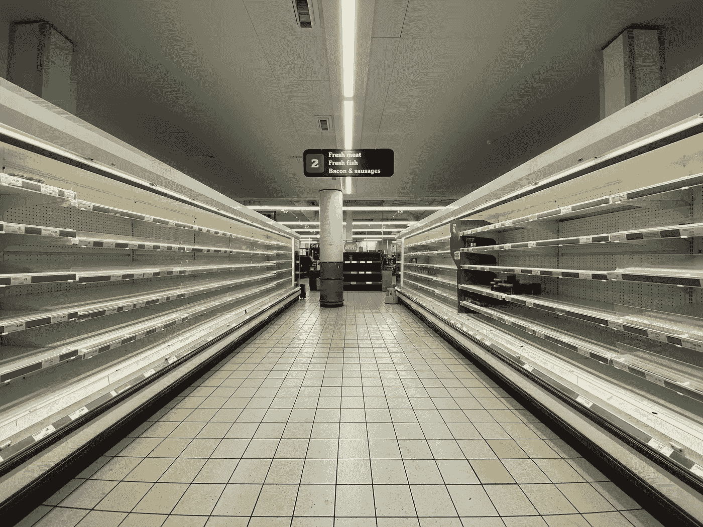

# 疫情的生活

> 原文：<https://medium.datadriveninvestor.com/life-in-the-midst-of-pandemic-c81a6af7d390?source=collection_archive---------12----------------------->

Photo by [John Cameron](https://unsplash.com/@john_cameron?utm_source=unsplash&utm_medium=referral&utm_content=creditCopyText) on [Unsplash](https://unsplash.com/s/photos/pandemic?utm_source=unsplash&utm_medium=referral&utm_content=creditCopyText)

当我们进入自我隔离的第三个星期时，我的街道、我的邻居、我的城市都出奇的安静。我们用短信、电话、FaceTime 和 Zoom 与家人见面和交谈。我们与朋友和其他人的联系也是通过同样的方式。这就是我们的现实。我们将自己孤立起来，限制与外界的所有接触，并将自己附在电子设备上，以保持与世界的联系，同时试图了解这一时刻并预测未来的生活。

这一切似乎不真实。首先，这只是新闻报道。它离我们很远，只影响到其他人。这似乎没什么大不了的。我们相信中国会迅速控制病毒。事情变化之快令人吃惊。前一天，我们所有的活动和日常事务都在进行，第二天，一切都停止了，突然间，我们被封闭和限制在我们的家、公寓或其他住处。我们与世界其他地方的物理连接被切断了，取而代之的是一个通过连接到我们的电子设备而维系在一起的虚拟连接。

 [## 保护主义、政治和经济动荡|数据驱动的投资者

### 美国股市昨日出现 400 多点的大幅反转，为未来的事情发出了警告信号。市场…

www.datadriveninvestor.com](https://www.datadriveninvestor.com/2018/06/28/protectionism-politics-economic-turmoil/) 

今天，我们发现我们都在一起，独自一人。在内心深处，我们感觉到我们的世界，那个我们一直生活和工作的世界已经不在了。取而代之的将会在未来的几周甚至几个月内揭晓。现在，我们都分享着未知的黑暗。

我们美国人并不比地球上任何其他人类群体更不喜欢面对现实，也许更不喜欢。我们也不喜欢面对和不得不解决困难的问题，这可能会告诉我们一些关于我们根源的重要事情。

我们的许多祖先来到这个大陆是为了逃避由于许多原因而变得无法忍受的生活。这里有被流放或判刑的重罪犯和不受欢迎的人；这是英国摆脱不受欢迎的人的方式。其他人是被无限机遇的故事和创造新开始的愿望所吸引。

当然，一旦到了这里，他们和他们的后代就不满足于留在大西洋海岸附近。空旷土地和丰富资源的故事吸引了许多人走上了这条道路，在历史上很短的时间内，遍布北美的定居者殖民主义也成为了我们今天的样子。

最近，这种不安见证了白人逃往郊区以逃避城市及其问题。我们搬到南部和西部去躲避寒冷，去追求梦想和机遇。我们用手指一弹或说出一个命令就能换台。我们丢弃而不是重复使用容器。现在，我们已经强奸和掠夺了地球，并迅速使我们的家园不适合居住，一些人告诉我们不要担心。我们将在空中建造环形世界，这样我们就可以逃避我们在地球上制造的问题。

我们是一个被困在幻想中的民族，这些幻想是由那些从我们自身中获益最多的人推动的。我们对此感到满意。我们不想被打扰。我们不想去想。我们不想被告知我们必须一起工作，做出牺牲，放弃许多我们珍惜的快乐，这样我们的孙辈的孙辈才能生活并享受我们所拥有的机会。

听身居高位的政客和官员告诉我们，解决大问题和做出牺牲以确保我们的未来是不必要的，甚至对我们的生活方式有害，这要容易得多。我们被告知气候变化和流行病是假新闻和阴谋，是由我们国内外的敌人所推动的。我们大多数人都觉得这些信息令人欣慰和放心，我们被它们抚慰人心的话语所诱惑，强化了我们的怀疑和错觉。毕竟，他们对我们的要求很少或根本没有，只是继续滋养当前的系统，就像一个瘾君子生活在否认中，滔滔不绝地为继续他/她的习惯寻找借口，好像一切都很好。

我像你们大多数人一样长大，被告知我们美国人是最棒的。不管是什么，我们都是第一名。我们创造最好的一切，我们发明一切，拥有最重要的一切。我们的政府和机构优于一切。我们瞧不起其余的人，认为他们值得同情或嘲笑。我们才是最重要的。我们最清楚，如果这个星球上的其他人只是简单地跟随我们的领导，做我们正在做的和已经做的事情，这个世界将会是一个美好的地方。这是一个简单的处方，这个想法在美国社会的各个层面得到了推广:政府、教育、商业、宗教和媒体。

一直运作的很好，直到盔甲开始被现实刺穿。对我来说，第一次打击发生在 1957 年 10 月，当时苏联发射了人造卫星，成为第一个将人造物体送入太空的国家。这是我一生中令人大开眼界的事件。我当时 12 岁，是一个真正的信徒。就在那一刻，我对我所吃的任何东西的绝对信念走到了尽头，并开始崩溃。留下的至今仍在崩溃。

美国不同于大多数其他国家。它不是也从来不是单一民族的。它在民族、种族、宗教以及你想衡量的任何其他方面都是多样化的。把我们联系在一起的不是这些东西。这是一个想法。美国依赖于群体认同。《政治部落:群体本能和国家命运》一书的作者蔡美儿注意到了这一点。是我们的超群身份将我们维系在一起。

蔡美儿认为，美国是一个超级团体，因为我们对身为美国人意味着什么有着共同的想法而团结在一起。这基本上是将我们团结在一起的所有东西，在今天派系林立的气候下，围绕着特定的想法，我们把自己分成越来越小的团体，我们正在把这种结构拉紧到崩溃的边缘。蔡美儿假设，如果我们继续拉绳子，它最终会散开，我们会分裂成许多实体，都拉向不同的方向。

今天，面对全球性的疫情，它对美国的影响才刚刚开始，这提醒了我，随着冠状病毒在我们的土地上传播，我们日益增长的脆弱性被放大和扩大。人们担心家人的健康和安全。我们已经看到了某些基本产品商店被清空的恐慌迹象。

在这种不确定的时期，最重要的是从负责领导职位的人那里获得及时准确的信息。拥有能够定下基调来平息我们的恐惧并给我们带来希望的领导人，对于我们保持冷静并相信我们的领导人正在尽最大努力保护我们并克服我们面临的障碍至关重要。不幸的是，我们所看到的和我们所得到的信息经常是混乱的、矛盾的、不准确的和误导的。看着和听着占据最高领导位置的人，每当他站在讲台前笨手笨脚地说话时，总统就会暴露出他的领导能力不足，经常说出基本上不连贯的话，无法表达有意义的想法。

剩下的就是我们自己去领导自己了。我们必须找到为我们保护自己和家人提供有意义信息的来源，与我们的其他当选官员沟通，鼓励他们在有助于拯救生命的地方施加压力，并忽略从这个来源继续泄漏的错误信息和平庸。