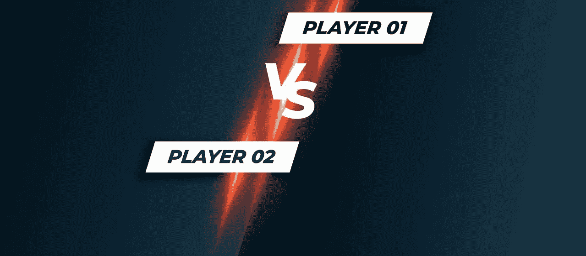
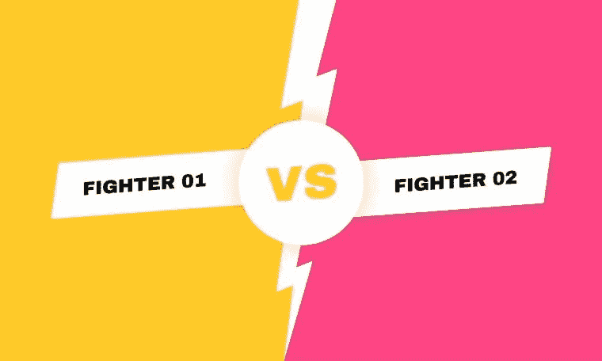
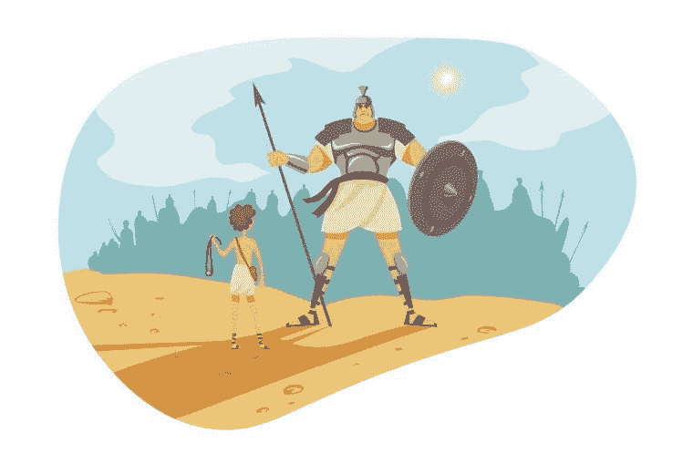
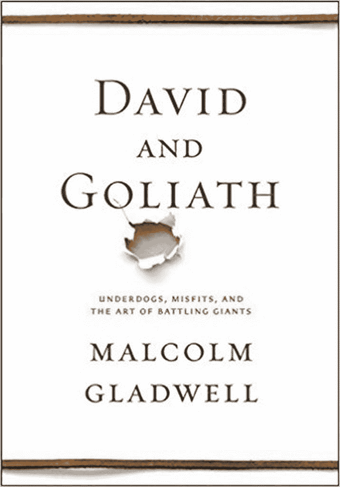

# 生活是一场游戏。以下是如何提升你的游戏。学习战争艺术。跳出框框思考。做大卫，不做歌利亚

> 原文：<https://medium.datadriveninvestor.com/life-is-a-game-23b74d29a6c6?source=collection_archive---------32----------------------->

Life is a game learn how to up your game. Photo by @freepik via freepik.com

# 生活是一场游戏。以下是如何提升你的游戏。学习战争的艺术

生活是一场游戏，以下是如何提升你的游戏，跳出框框思考，学习战争的艺术，最终表现得像大卫而不是歌利亚。当我们玩游戏时，无论是像网球或篮球这样的运动，还是像扑克这样的纸牌游戏，我们在玩游戏的同时获得乐趣，当我们赢的时候感觉良好，当我们输的时候感到失望；但无论游戏走向何方，我们都知道我们会把游戏放在一边(毕竟它只是一个游戏)，回到由家庭生活、职业生活、社交生活或公共生活组成的“现实生活”中去。

只不过生活是一场游戏，就像所有其他游戏一样，只是我们没有意识到这一点。我们每个人都根据自己的世界观和信念制定了一套规则(我们的价值观)，我们认为自己的规则是正确的，本质上是正确的，其他人的规则是错误的。除了我们自己的规则之外，我们还必须遵守我们所居住国家的法律。有许多规则需要操作，知道如何以熟练的方式玩这个游戏需要你聪明，跳出框框思考，战略性地思考，就像一个将军会做的那样；我不知道还有比孙子更好的将军来教导我们一两件关于战争艺术的事情。

Life is a game. Up your game by learning the Art of War. Photo by @freepik via freepik.com

孙子是中国古代的将军、军事家和哲学家。他是《孙子兵法》的作者，这本书被公认为是军事战略方面的杰作，也是关于这个主题的最好的书；它经常被将军、学者和商人引用。孙子的作战方法并不把蛮力放在战略的中心，他更注重战斗的替代方案，使用间谍，建立和保持联盟，使用欺骗，利用地形，天气和敌人的士气作为强大的武器。现在，我们称之为*盒子外的思维*。

生活是一场游戏。通过学习战争的艺术来提升你的游戏。图片由@ free pik via freepik.com 提供

> *“兵法对国家至关重要。这是生死攸关的问题，是通往安全或毁灭的道路。因此，这是一个不容忽视的调查主题"*
> 
> *“强则显得*弱，弱则显得*”。*
> 
> *“极其微妙，甚至到了无形的地步。极其神秘，甚至到了无声的地步。从而你可以导演对手的命运"*
> 
> *“如果你在河边等的时间够长，你敌人的尸体就会漂过来”*
> 
> *孙子兵法。*

# 生活是一场游戏。以下是如何提升你的游戏。学习跳出框框思考的艺术

生活是一场游戏。以下是如何提升你的游戏，跳出框框思考。跳出框框思考是一个众所周知的老生常谈，在商业世界中被大量使用。似乎每个人都痴迷于这个新潮的概念。但这意味着什么呢？

有时候，我们陷入了自己的方式，我们喜欢以他们一贯的方式做事，因为为什么要重新发明轮子，对吗？没错，除了如果每个人都在盒子里舒适地操作*就没有增长，没有进化，只有停滞。*打破常规思维*意味着以非常规的方式面对问题，创造性地自由思考，鼓励经常挑战现状。*

**

*Life is a game. Learn how to up your game by thinking outside the box. Photo by@freepik via freepik.com*

*跳出框框思考要求我们通过问诸如“为什么？”这样的问题来定期质疑现状，“如果呢？，“我们怎么可能…？”人类不会同时创造性地和顺从地运作:一个排斥另一个。服从要求你超越自己的想法，按照外部命令行事，或者你遵从标准的做事方式。创造力通常与艺术努力、某些职业和工艺联系在一起，但不仅仅如此。创造力就是带来以前没有的东西。跳出框框思考，需要通畅的思维；也来自于把点点滴滴串联起来，对事物有更广阔的视角。新思想就是这样被引入世界的。*

*有两种情况需要打破常规思考。第一种是当我们面对一个问题，而我们试图通过手头的所有逻辑和传统解决方案都无法成功解决时。第二种类型是当没有迫切的改变或新奇的需要，但它们仍然会导致改进。*

# *大卫和歌利亚的故事是一个很好的例子，说明一个人如何跳出框框思考和行动*

*大卫和歌利亚的著名战役发生在古巴勒斯坦北部的以拉谷。犹太军队正与非利士人对峙，由于地形原因，双方都坚守在相对的山丘上，处于僵持状态；任何一支军队从一边跑到另一边都是自取灭亡，使他们容易受到敌人的攻击。*

*非利士人派出了他们的冠军战士歌利亚。他是一个巨人，穿着将近 100 磅重的盔甲，带着剑和盾。他来到山谷，要求以色列人给他派一个对手来进行一对一的战斗，胜者将决定哪支军队获胜。*

**

*Life is a game. Learn how to up your game by being a David and not a Goliath. Photo by @freepik via freepik.com*

*没有一个以色列士兵挺身而出对抗歌利亚，除了一个名叫大卫的小牧童为了他的子民挺身而出，志愿对抗歌利亚。扫罗王看着他，表达了他的担忧，像他这样一个没有军事经验的小男孩没有机会对抗训练有素的战士歌利亚。作为回应，大卫坚持说他有猎杀偷他羊的狮子和熊的经验。最终，国王索尔同意派他去和巨人战斗，可能是因为没有其他人自愿，并给了大卫他自己的盔甲；但是大卫拒绝了。*

*歌利亚认为他将在肉搏战中挑战他的对手。然而，大卫心里另有所图。他知道如果他按照巨人的条件战斗，他没有机会，所以他拒绝了国王索尔给他的盔甲，说他在这么大的重量下移动不够快。相反，大卫拿起一把石头，带着他的弹弓跑下山谷。当歌利亚看到以色列军队派谁来和他战斗时，他笑着对快速走近的大卫说:“你拿着棍子来找我，难道我是一条狗吗？”大卫毫不畏惧，迅速将一块石头扔进弹弓，击中了歌利亚的前额。歌利亚倒在地上，这时大卫跑向歌利亚，拿起他的剑，砍下了巨人的头。*

# *我们从大卫和歌利亚的故事中学到了什么？*

*马尔科姆·格拉德威尔将帮助我们回答这个问题，他写了一本关于这个有趣主题的书，名为《大卫和歌利亚:失败者、不合群者和与巨人战斗的艺术》我们都认为我们已经搞清楚了大卫和歌利亚的整个故事，也就是说，这个小人物战胜了所有的困难，因为他有勇气和足智多谋。我们假设这个故事是关于弱者在纯粹的盲目信仰、几块石头和一个弹弓的帮助下击败强者。*

**

*但是格拉德威尔认为我们都错了。脆弱的是歌利亚。他巨人般的体格使他行动缓慢而笨拙，很可能他是半盲的(复视是人类生长激素过量的常见副作用)。他能打败大卫并赢得一对一战斗的唯一方法是让他亲手抓住大卫；但是大卫很聪明，他知道他不需要靠近歌利亚，他可以在安全的距离内非常准确地攻击，这正是他所做的。古代军队中有投石机，可以在 200 码外精准致命。大卫并不是为了遵守传统的决斗规则而战；他充分利用了他的弹弓技术，这使他可以远距离作战，并改变了决斗规则。*

*大卫的另一个明智之举是说服以色列人，单一的战斗不一定意味着剑与剑的对抗，而可以是任何你喜欢的武器。从这个角度来看，看起来歌利亚和大卫的胜算不亚于一个拿着剑的人和一个拿着自动武器的人的胜算。*

*格拉德威尔的结论是，如果从正确的角度来看整个情况，那么*强*的人是令人惊讶的*弱*，而看似弱小的人可能会变得令人惊讶的强大。*

*不要做歌利亚，要敢于做大卫。我亲爱的朋友，这就是你的追求。*

**

*Joanne Reed The Author
Author of “This Is Your Quest”. You can’t buy happiness but you can buy books. Your mission, should you wish to accept it is to experience happiness*

*获得专家视图— [**订阅 DDI 英特尔**](https://datadriveninvestor.com/ddi-intel)*