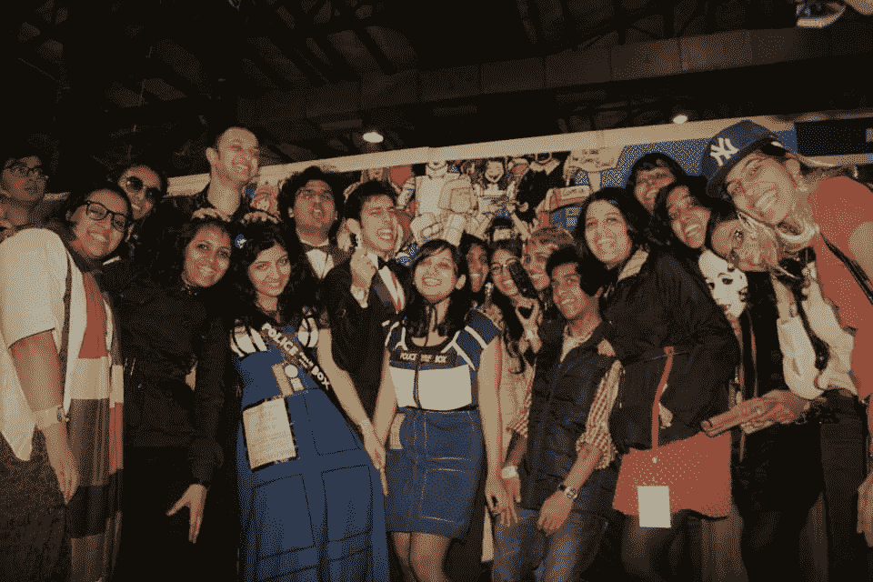

# 来自一个永恒女孩的人生教训

> 原文：<https://medium.datadriveninvestor.com/life-lessons-from-an-eternal-fangirl-21dd9caffa64?source=collection_archive---------20----------------------->

## 当你在粉丝、幻想和娱乐中找到意义和慰藉时——即使是成年人。

我注意到，当人们遇到“Fangirl”这个词时，会有一定程度的鄙视。它让人想起一个“疯狂尖叫的少女”的形象，很多时候，人们对这种刻板印象有一种居高临下的反应。另一方面，我认为典型的“fangirl”是一个对他们热爱的事物充满激情和欢乐的人的例子——这种纯粹的感觉随着他们的成长而被遗忘。

就我个人而言，我认为社会总的来说喜欢批评年轻女性做的任何事情。人们认为年轻女性一无所知，她们喜欢的任何东西都是愚蠢且毫无意义的。想想化妆，迪斯尼电影，时尚，男孩乐队，任何以年轻女性为主的爱好。任何和女人有关的东西。*这些绝对是无害的追求。但是当你提到他们的兴趣时，你会发现很多人皱起了鼻子，有时是真的。不够酷，不够聪明，不够有成效…只是不够好，不能被认为是有效的。*

另一方面，年轻男性不会因为坐在沙发上看板球/足球或玩电子游戏或非常喜欢《星球大战》而被明显地看着畏缩或嘲笑——这些事情除了娱乐之外绝对没有其他意义，这是理所当然的。他们或他们的爱好不会被一概而论地轻视——年轻人不会因为喜欢他们为了娱乐而做的事情而被认为愚蠢或虚荣。人们并不认为她们这样做是为了吸引注意力，或者只是盲目地追随潮流(年轻女性经常被*指责)。别跟我说什么男人如何做到“学习策略”或“手眼协调”之类的废话，98%的电视迷从来不会在现实世界中使用这些东西。如果你只是为了好玩而做事，那就没问题。你不需要根据你喜欢什么无害的东西来判断——这应该适用于每个人。*

但事实并非如此。

从很多方面来说，我认为成为一个骄傲的 fangirl 是对一个非常低劣、傲慢和无趣的社会的反叛。

这种对拥有这些品味背后的“智慧”(或缺乏智慧)的不断质疑，在他们周围的话语中以各种方式表现出来，让我对自己的品味产生了相当多的质疑。关于这一点可以写一整篇文章，但对我来说，结果基本上是这样的——我出于兴趣分析了 ***狗屎*** 。

因此，作为一个非常喜欢流行文化的人，同时也是一个将她所喜欢的东西剖析到原子水平的人，并且还想弄清楚她为什么喜欢她所喜欢的东西——我从作为一个粉丝中学到了一些东西。

## 1.你可以从你的榜样身上学习，不管是不是虚构的。

我做的事情之一(许多 fangirls 也这样做)是分析我们 fangirling 的主题。它可能是一个乐队的成员，一本书或一个节目中的人物，或者是你感兴趣的领域中你所敬仰的某个人。他们所做的一切都令人着迷，你可以观察他们几个小时，他们的习惯和行为得到心理分析，他们的文化/宇宙成为研究和讨论的对象，简而言之，他们成为你着迷的对象。

如果你在这种混合中加入一点自我意识，如果你愿意，你可以从这些角色或艺术家身上学习。人们转向自助/励志书籍或亿万富翁或生活教练或精神导师——我转向《哈利·波特》、《神秘博士》或 BTS。从表面上看，这些都是娱乐。看《神秘博士》或《哈利·波特》时，我可以暂停我的信仰，但我仍然可以从中吸取教训。

我可以欣赏 BTS 的歌曲和表演，嘲笑他们的愚蠢，被他们迷住，但完全意识到他们是富有同情心的，有才华的，成功的，有趣的，穿着得体的努力工作的人。我想成为那样的人。我可以列出我从每个成员身上具体学到的东西。[但那是完全不同的文章？)].一位朋友提到，她通过观看表演来了解表演。

我可以从医生那里得到积极的态度。学会如何不把每个人都看得太重。对新的发现或经历充满热情。永远保持好奇，永远准备好学习——像赫敏一样。

## 2.天才不需要不友善。

流行文化中充满了反社会、迟钝和冷酷的天才人物和人物。他们中的许多人被大众崇拜，不仅因为他们的大脑，还因为他们苛刻、反社会的个性，他们把别人当成擦鞋垫，因为他们是*所以*比这些*普通*人聪明得多*咳* BBC 夏洛克*咳*豪斯*咳*。咳咳。

听着，我喜欢聪明人。我喜欢天才。我想被他们包围。但是我不太喜欢不友善和没有同情心的人。当然，我会尊重他们的专业知识，但不是他们的为人，我当然不会把他们当作任何榜样。

所有我真心喜爱的节目、书籍和人物让我明白，天才不需要变得不友好。

赫敏、邓布利多、布纳恩博士、博士——他们都是精英中的精英——但对他们周围的人来说，他们并不是绝对的混蛋。像布纳恩博士这样的人物不老练或缺乏感情，但她并不故意缺乏同情心，并准备好做得更好。医生是善良、富有同情心的天才。BTS 的 RM 和 Suga 都是高智商的人，选择了对别人的同情。

不要嘲笑完全自然的情感，不要嘲笑周围一般不聪明的人。纯阶级而已。

在我看来，真正的天才不会否定善良，也不会认为善良是一种弱点，而是意识到善良是人类不可或缺的一部分，而不是一台没有感情的机器。

## 3.如果某件事给了你快乐，人们怎么说都没关系。

我相信人们一直在重复这一点，但它需要提醒。如果某件事真的给了你快乐和平静——无论人们对它说什么，通常都是白噪音。

有人问我“有什么特别的地方让你如此开心？”从我还是一个过度兴奋的 12 岁小孩迷上哈利波特开始。当我宣布自己是 BTS 的狂热粉丝时，我发现人们更加困惑了。(‘那不是给十几岁的女孩子看的吗？').很多时候，我甚至试着低调一点，或者不要对我喜欢的东西表现出太多的兴奋。我也想过，也许这些事情并没有我想象的那么好。

我错了。当然了。

直到今天，我喜欢的每一件事都比我见过的大多数人带给我更多的快乐。 *我喜欢一切，我这样做是有充分理由的。*

这是对那些艺术作品或创造这些作品的人的证明，他们让我笑，让我哭，超过了我认识的 98%的人。心想要心想要的。

## 4.成为社区的一员是一种令人愉快的经历。

它(再一次)从哈利·波特开始。我有很多新的经历，因为我是一个“制陶者”——我有了我的第一批网上朋友，遇到了粉丝艺术、粉丝小说和围绕小说作品的实际社区的概念。

我在大学礼堂和 50 个我完全不认识的人一起看了《神秘博士》的特别一集。我和他们一起为医生欢呼鼓掌。如果你看到我们晚上的谈话，你会认为我们很久以前就认识了，而事实上我们是那天下午认识的。我和他们一起打扮成 TARDIS 去了动漫展，那是我最开心的一天！

我向 BTS 粉丝以 BTS 会员的名义发起的几个筹款活动捐款。他们向 BLM 捐款，资助夜校，帮助阿萨姆邦的洪水灾民，等等。我制作 BTS fanart，粉丝们对此非常鼓励和喜爱。

成为社区的一部分是一种快乐的，有时甚至是压倒一切的经历。当你需要视角，或感到孤独或失落，想成为更大的事情的一部分，或只是需要有人讨论下一季/专辑理论时，社区就在那里——你知道，为了好玩。我们是社交动物，粉丝社群只是人社交的方式之一。

## 5.别人的创作可以激发你的创造力。

我无法解释我的创作灵感有多少来自流行文化。自从我通过《哈利·波特》接触到粉丝艺术的概念，我就被在我喜欢的东西上建造的想法吸引住了。连续剧中的场景，电影或连续剧中的角色，歌曲和艺术家本身都对我产生了影响，以至于我无法阻止自己去思考它，直到我从中获得灵感。

有意义的歌词让我改变了我的创作之旅的方向，音乐视频或电视连续剧中令人惊叹的镜头让我学会了不同媒介的不同技术，艺术家们谈论他们的工艺让我思考我的观点和决定。

有可能只是为了好玩而喜欢某些东西，但也有可能是你受到了其他人工作的启发，这对你的工作有所帮助。

## 6.你喜欢的东西让你了解自己。

我喜欢聪明人，但我讨厌混蛋聪明人。我喜欢冷酷的逻辑，但我不喜欢忽视人类基本情感的逻辑。我喜欢不停挖掘的人。我喜欢并钦佩那些不断努力的人——我想成为那样的人。我崇拜自信的人——我想借用这种自信。

我发现这一切是因为我想知道为什么我会发现一个角色是我最喜欢的，或者为什么我会和 7 人乐队中的一个人有更多的联系。你可以发现很多自己没有意识到的事情。

它还让我根据他人的喜好，对他们有了一些小小的了解。例如，如果有人*崇拜* BBC 夏洛克台，我知道这个人会很讨厌。

## 7.你选择消费什么，你就是什么。

现在是消费时代。我们必须非常小心我们消费的东西，因为[我们看的、读的和消费的东西会影响我们的思维、智力和行为。](https://www.nytimes.com/2019/07/25/upshot/social-effects-television.html#:~:text=Other%20than%20sleeping%20and%20working,even%20affecting%20our%20cognitive%20ability.)

我喜欢看能给我快乐、希望、视角、灵感和创造力的东西。世界上已经有足够多的绝望，因为我通过新闻消费，所以当我想逃离现实寻求娱乐时，我很少故意选择一些可怕或暴力的东西。

我确实发现，当我选择消费的东西来反映一个更积极的结果时，我比仅仅选择流行的东西更快乐。我可以去看《绯闻女孩》,想出一个绘画灵感和一个放松的大脑，或者去看《权力的游戏》/Paatal Lok，然后沮丧焦虑地走出来。我不在乎人们认为《权力的游戏》/Paatal Lok 是“更酷”和“更聪明”还是“现实/坚韧”(翻白眼)的选择。如果它让我看后感到沮丧和焦虑，那就不是明智的选择。

我们消费的媒体影响我们的情绪，我们的情绪影响我们的健康和行动。我寻找能让我成为积极、有成效的好人的东西，而不是愤世嫉俗、厌倦和令人扫兴的东西。我对自己消费的东西更加小心，对我推荐别人消费的东西更是如此。所以当我真的推荐一些你可以打赌的东西时，我真的认为这是对你的时间和头脑的一个很好的利用。

总而言之，我可以写得更多，但我可以坚持这七点。据我所知大部分都没有谈及。我可以想象有人会说，‘没那么深！’这里所有的点。但是我也能想象我举起双手说‘哦，但它是!’!“你打算怎么办，”

也许你只需要成为一个古怪的人就能得到它。*耸耸肩*