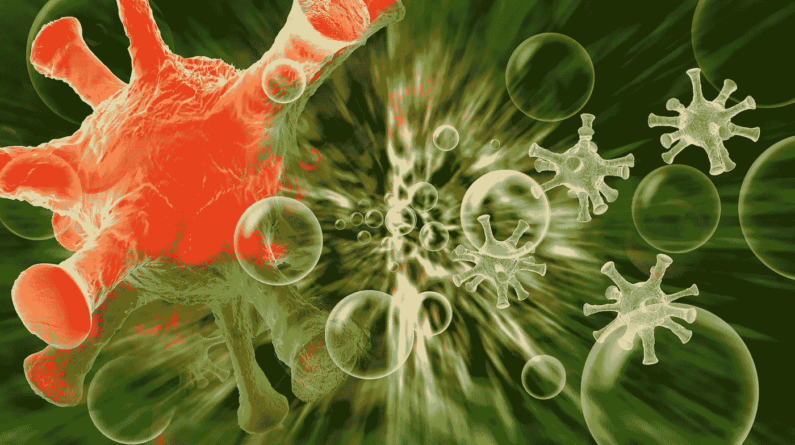

# 没有错误的生活是没有经历的生活…

> 原文：<https://medium.datadriveninvestor.com/life-without-mistakes-is-life-without-experiences-ba0b7d077a3?source=collection_archive---------2----------------------->

在我理想的一天，我早上 5 点起床，喝干净的水，做对我身体每块肌肉和小骨头都有好处的运动，然后吃营养早餐，这给了我充足的能量和所有必需的元素，所以我每天都变得越来越健康……然后， 我脸上带着灿烂的笑容开始工作——显然是在我真正喜欢的项目上，它带来了非常好的收入……我知道做什么和怎么做，每个人都对我的工作结果感到满意，总是及时，总是在截止日期之前。

当然，随着时间的推移，我会有越来越多这样的日子，但在我到达那里之前**我会犯一堆错误**，经历各种转变，做大量的阅读和分析，经常在错误的地方寻找方向，听取对我来说不太适用的建议- **错误是不可避免的，不可避免的**。

**事实上，**我很难在 7-30 起床，有时会忘记喝水，并进行轻快的运动，希望对我身体的至少几块肌肉有好处……营养早餐？-至少很好吃。至于工作…好吧，现在我有一点休息来写这篇文章…我总是尽我所能，提供好的工作，并尊重最后期限，但是，可悲的是，我还没有到可以选择真正激励我的项目的地步。

也许，如果不是因为我犯的那些错误，我会做得更好，但是如果我害怕犯那些错误，事情可能会变得更糟。

错误是生活的一部分。如果我不接受这样一个事实，即我会在前进的道路上陷入困境，并学会原谅自己的错误，那么很难想象一个生动而富有成效的生活。

但是即使我知道这个事实并且几乎平静地接受它，我仍然为我犯的每一个新错误感到痛苦，并且在自我怀疑上浪费了很多时间

我们讨厌错误，所以我们否认它们的存在，掩盖它们，假装它们不是我们生活的一部分……

“抓住机会，犯错误。你就是这样成长的。”——玛丽·泰勒·摩尔。

毫无疑问，有些人变得更加坚强，不管昨天发生了什么以及他们犯了多少错误，他们都保持积极的态度，但是有些人，包括我在内，害怕迈出第二步，因为他们知道，坦率地说，以前的错误非常愚蠢。

 [## 在家工作如何提高我的工作效率|数据驱动型投资者

### 在家工作确实激发了我最大的潜能，让我更有效率。因为在家工作给了我…

www.datadriveninvestor.com](https://www.datadriveninvestor.com/2020/07/29/how-working-from-home-increased-my-productivity/) 

这就像在你不知道如何游泳的情况下游过河一样…让你漂浮的救生衣有几个洞，并不断发出空气逸出的声音…换句话说，很可怕，但你必须以某种方式到达河的对岸…

如果我和有类似恐惧的人花更多的时间从我们的错误中学习，而不是沉思过去，表现得好像错误是可能发生的最糟糕的事情一样，我们都会成为更好的人。

几乎每个人一生中都至少说过一次**“这不是我的错”**明知那不是真的。在 18 世纪的古典书籍中，绅士和淑女们非常清楚地知道**接受他们的错误**是正确的事情，而 21 世纪似乎支持这样一种文化，即**鼓励我们隐藏和掩饰自己的错误，并将责任推给别人** …

**我们感到被卡住了，因为我们经常不分析，不接受自己的错误…**

**承认我们犯了错误对我们的自我意识威胁太大，会导致尴尬、羞愧和内疚，所以我们试图寻找证据来证明我们已经相信的事情——“我没有犯错……是某人或其他什么事情”。**

**当拥有一点骄傲没有错的时候，这种骄傲会在个人和职业生活中的艰难处境中帮助你。健康的自信和固执的自我之间有一条狭窄的分界线，如果你不能承认你对自己和他人的错误——确定你没有站在正确的一边……最终，这将对你个人的成长不利。**

**当犯错并不是我们所能做的最糟糕的事情时，为什么我们会把生活搞得如此复杂？最糟糕的事情是**否认或埋葬它**。**

**那些认为他们可以不犯错误的人犯了最大的错误。**

**无数的错误塑造了历史。有些在人类的理解中发挥了巨大的作用，有些只是令人尴尬，但那些没有被及时承认和修复的已经造成了灾难性的后果。**

**为什么不召回一部分呢？…**

**以倾斜著称的比萨斜塔根本不是为了倾斜而设计的。有些人隐瞒了一个事实，那就是地面太软了，无法支撑它的重量，在施工过程中它开始倾斜。**

****

**到 1525 年，整个中国舰队都被摧毁了，这是因为中国的精英们担心从国际贸易中受益的中产阶级的地位会上升。因此，政府听取了他们的意见，放火焚烧船只，一些船只被留在港口腐烂。经济学家认为，它削弱了中国的经济，极大地降低了中国的世界影响力。**

**200 多年前，**拿破仑的军队**试图入侵俄国，当时他们没有足够的食物，也没有为严酷的冬天做好准备。如果他们拒绝了呢？也许 500，000 人可以活得更久一点…也许，法语会成为现在世界上的主导语言…**

**在 1788 年 9 月 18 日**奥土战争期间**，一群奥地利士兵从吉普赛人那里买了一些杜松子酒。他们喝醉了，以为土耳其人来了。惊慌失措的士兵开始向“土耳其入侵者”开枪，到第二天早上，他们发现自己杀死了 10，000 名士兵。**

**在实际事故发生之前很久,**泰坦尼克号的船员**就收到了该地区有冰山的警告，但他们想节省时间，没有理会。这一错误夺去了 1517 人的生命。**

**1958 年，在毛时代，成千上万只麻雀被杀，因为人们认为它们是害虫。它导致蝗虫和其他昆虫的增加，严重破坏了中国的农作物，导致中国大饥荒，造成 2000-4500 万人死亡。**

****深水地平线石油泄漏**是始于 2010 年 4 月 20 日的工业灾难，发生在英国石油公司运营的墨西哥湾 Macondo 油田，被认为是石油工业历史上最大的海上石油泄漏。这是因为英国石油公司更喜欢速度而不是安全，并且偷工减料…**

**人们认为**新冠肺炎**具有人畜共患病的起源，并且与蝙蝠冠状病毒有着密切的遗传相似性，这表明它是从蝙蝠携带的病毒中出现的…**

**最初，人们被告知戴口罩无助于防止它的传播…**

****

**错误可能很难消化，它们会导致心理学家所说的认知失调。当一个人持有矛盾的信念、想法或价值观时，就会发生这种情况，通常表现为心理压力…**

**这种不和谐迫使人们试图以不同的方式来缓解这种不适，比如“解释事情”或拒绝与他们现有信念相冲突的新信息。**

**“我们坚持旧的做事方式，即使新的方式更好、更健康、更聪明。我们坚持那些早已过了保质期的自我挫败的信念。我们让我们的伴侣、同事、父母和孩子非常非常生我们的气。”塔夫里斯女士说**

**但也许如果我们接受——错误是不可避免的，我们必须从中吸取教训，当我们都为自己的错误负责时，我们将会回到创造一个更加友善的世界**

**作者海伦娜·马克舍姆，lenkamaxem@gmail.com**

**视频:**

****访问专家视图—** [**订阅 DDI 英特尔**](https://datadriveninvestor.com/ddi-intel)**