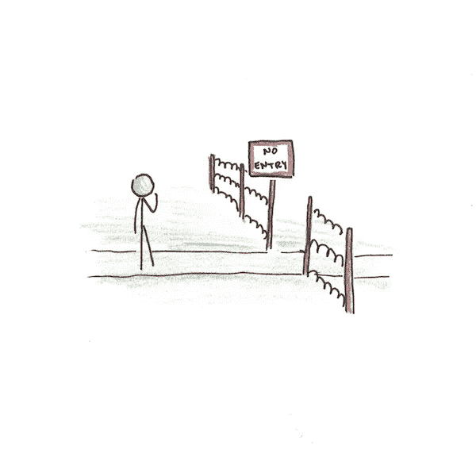
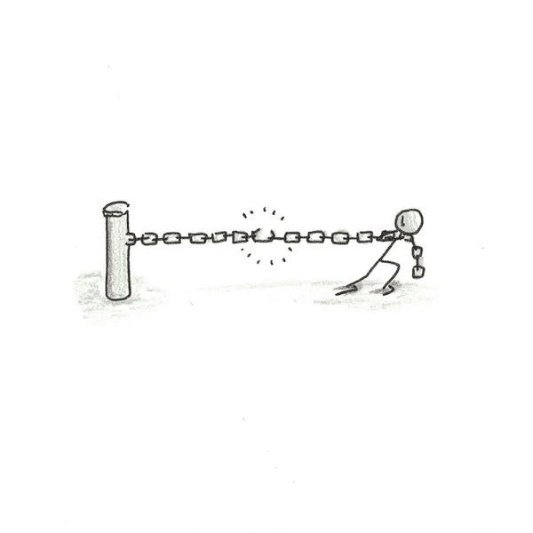

# 习惯的局限性

> 原文：<https://medium.datadriveninvestor.com/limitations-of-habits-6556dfaee7f8?source=collection_archive---------13----------------------->

我写的第一组文章引起了我博客的关注，是一个叫做[习惯性掌握](https://www.scotthyoung.com/blog/2006/05/09/introduction-habitual-mastery-series/)的系列。那时，我已经花了几年时间，通过 30 天的试验，广泛地培养我的习惯。这一系列文章试图将我的观察浓缩成有用的建议。

对于从未认真努力培养新习惯的人来说，这个概念可能会改变生活。很多谈论自我提升的作家都是从习惯开始的。一个原因似乎是，一旦你养成了养成习惯的习惯，它会变得如此彻底，以至于你不得不开始写下来。

因此，可以公平地说，我提倡把养成习惯作为一种工具。

然而，我认为正是像习惯培养这样的工具的力量也会造成一些过度。一些我认为通过足够的训练可以做到的事情没有实现。在其他情况下，习惯只是在某些目标上取得进展的错误思维方式。

在这篇文章中，我想探讨一下我所看到的有益实践的局限性。

# 习惯的限制

# 1.习惯不是常规

一个限制非常简单:不是所有的行为都可以容易地自动化。

正如 [Nir Eyal 在这里所说的](https://www.nirandfar.com/habits/)，很多我们所说的习惯仅仅是例行公事。需要努力和注意力的认知努力活动。因此，严格来说，没有学习一个困难的话题或在健身房进行艰苦锻炼的习惯。没有人会变得心不在焉，突然清醒过来，意识到自己正在进行一次卧推。

习惯，在这个更严格的意义上，是那些从一组提示中自动无意识流动的行为。套路是我们反复做的行为，但是涉及很多刻意的动作，不经过一些努力和思考是做不到的。

这意味着要对自己的习惯目标多加小心。如果想法是一个行为在充分习惯化之后可以零努力的进行下去，你可能会失望。随着时间的推移，例行公事会变得更容易，但它们很少需要零努力。

 [## 基于人工智能的聊天机器人如何帮助你形成更好的长期习惯

### 当我们思考我们的日常行为时，我们经常没有意识到，我们所做的行为占了多大的比例…

www.datadriveninvestor.com](https://www.datadriveninvestor.com/2020/02/03/how-an-ai-based-chatbot-can-help-you-form-better-long-term-habits/) 

# 2.习惯往往是脆弱的

这导致了习惯的第二个限制:它们很少是永久的。

由于许多习惯实际上是例行公事——自动的和有意的行为的混合——我们很少关心不需要持续努力来维持的习惯。

我以前写过为什么我认为[习惯通常是亚稳定的](https://www.scotthyoung.com/blog/2015/03/25/permanent-habits/)。只要你生活中的其他一切都是静止的，它们就不需要太多的努力来维持。因为这个假设很少成立，所以总是需要一些努力来重申你想要的常规。

锻炼就是一个明显的例子。如果你一整年每天都去健身房，没有失败，可以肯定地说，当你完成时，你会感觉很自然。很大一部分原因是你所做的承诺让锻炼变得非常重要。因此，继续下去可能会感觉相当容易。

除了你换工作、搬家或受伤以及你的时间表改变。你会错过几天，甚至几周。当然，重建比第一次锻炼容易，但这需要付出不小的努力。

当你想保持多个习惯时，这一点尤为重要。保持一两个好习惯就可以了。但是如果你需要维护几十个，所有这些都有非零的时间承诺？你可能会遇到一种情况，那就是[长期](https://www.scotthyoung.com/blog/2018/12/13/productivity-guilt/)站不住脚。

# 3.习惯不是承诺

我已经讲过习惯和常规的区别了。后者需要积极的努力，不能完全自动化。你最大的希望是自动完成一些设置或开始的工作，这样会更顺利一些。

承诺是另一件看似类似于习惯的事情[，但却大不相同](https://www.scotthyoung.com/blog/2019/03/08/habits-vs-commitments/)。承诺是你为自己制定的规则。这个规则可能是这样的，“我必须每周至少锻炼 5 次，”或者，“我在工作日不吃甜点。”

同样，就像例行公事一样，有一些要素随着重复应用变得更加容易。第一次在办公室生日派对上对巧克力蛋糕说不感觉怪怪的，但是做了几个月后就没事了。

但是习惯的特点是，一种行为是由触发情境自动产生的。自我实施的规则并非如此。否则，规则甚至不需要明确，它只是你不加思考就去做的事情。

类似地，许多承诺如果被违反会导致倒退。如果健康饮食是一种习惯，你会期望那些节食的人在出现失误的情况下慢慢转变为不健康饮食。相反，经常会看到大的倒退——暂时吃得比节食开始前还要差。在这种情况下，是规则“我应该做 X”的自我意识力量在抑制暴饮暴食，而不是无意识和自动的习惯。

反复做，承诺的元素可以成为一种习惯——从不吃肉的人不会想到在烧烤时吃肉。但是，像例行公事一样，承诺可能需要持续的努力投入才能维持。如果违反导致倒退，这可能意味着维持行为的力量不是一种习惯。

# 4.习惯往往太慢

养成习惯的哲学——你应该慢慢地、稳步地做事，因为积极的、自动的行为会随着时间的推移而复合——有很大的好处。但在许多领域，这种策略并不适用。

创业的人可能只有几个月的时间来实现盈利，否则他们会耗尽资本。开始一份新工作，回到学校，接受一个困难的项目，都经常涉及到类似的大量前期投入，而且无法抹平。

问题不在于习惯与紧张的项目无关——很明显它们是相关的。问题是，如果你认真对待缓慢而稳定的处方，你最终往往会选择一个与你考虑付出强迫性努力完全不同的策略。重要的不是慢而稳，一般来说是 T2，是否优于快而固执，而是你所选择的具体策略的有效性。

在某些情况下，缓慢而稳定会导致更可持续的策略，从长远来看效果很好。例如，写博客可能需要几年的时间来建立一个读者群——即使你真的很棒。因此，稳扎稳打可能比你应该知道一个月后是否会成功的假设更好。

相比之下，我发现语言学习的缓慢和稳定往往是灾难性的(在开始的时候)。原因是它往往会将人们推向真正无效的被动学习技术——玩手机而不是实际交流。后来，一旦你在这门语言中站稳了脚跟，慢慢地、稳步地开始变得更加有效。

这里的重点不是对你应该走得快还是慢开出一个通用的处方。相反，它是说当选择一种方法时，[最重要的决定是做什么工作](https://www.scotthyoung.com/blog/2020/05/11/hard-is-easy/)。有时候，这是一个慢慢积累长期习惯的过程。其他时候，需要更认真、更执着的努力。(而且，有时候两者都需要。)

错误在于假设慢或快总是最好的，然后用它来决定你选择的策略，而不管这个特定的策略是否特别有效。

# 5.人性是有极限的

习惯是一个重要的工具，但它们只是一个工具。就像锤子或锯子一样，它们在某些事情上非常好用(敲钉子、锯木头)，但在其他事情上却很糟糕(画画、抚摸小猫)。

在我早期设定习惯的时候，我想象人性几乎是[无限可塑](https://www.scotthyoung.com/blog/2006/05/13/experimentation-habitual-mastery-series/)。因此，我从事了许多新的项目，这些项目假设我可以以任何我想要的方式改变我的行为，只要有足够的时间，新的行为就会像我的旧习惯一样。

我已经谈过为什么在常规和承诺的情况下不是这样的(我们想要培养的大多数有用的行为都是这样的)。但是，那里的限制主要是程度的问题。不，你通常不能指望一个努力的行为变得毫不费力——但即使让它变得简单一点也会有很大帮助。

相比之下，其他的习惯我认为特别难以维持，因为它们与我们基本的生理和心理需求背道而驰。要求你只睡四个小时的习惯不仅仅是一个条件反射的问题——在某个时刻，你会感到疲惫不堪。极端的饮食、锻炼计划甚至工作节奏都是不可持续的。条件反射无法克服生理剥夺。

同样的道理，只是用更微妙的方式，为了我们的心理需求。人类对自主、能力和关系有着根深蒂固的需求。任何一贯否认这些需求的习惯都不会持久。

# 习惯在哪些地方效果好？

鉴于所有这些负面因素，我想我最好澄清一下我最初的观点:习惯是好的，养成习惯的方法非常有用。

尤其是，在以下情况下，注重习惯非常有用:

*   最有效的方法更多地依赖于长时间的耐心坚持，而不是克服短暂但强烈的障碍。
*   你想要的行为最终可以在你的生活背景中运行，不需要大量的深思熟虑和努力。
*   你希望对你的日常生活或生活方式做出长期的改变，而不是在特殊情况下的临时改变。

理解习惯的局限性是让习惯变得强大的部分原因。如果你怀着正确的期望，你就更有可能坚持下去。

## 获得专家视图— [订阅 DDI 英特尔](https://datadriveninvestor.com/ddi-intel)