# 线性回归

> 原文：<https://medium.datadriveninvestor.com/linear-regression-35f8a65d83b9?source=collection_archive---------1----------------------->

## 简单和多元线性回归基础

1.  **简介**

线性回归是监督学习方法。特别是，线性回归是预测连续值(目标值)的有用方法，它试图对目标值和一个或多个预测值之间的线性关系进行建模。

**2。简单线性回归(一个预测值)**

简单线性回归名副其实:简单地说，就是找到一个预测值(𝑥)和目标值(y)之间的关系。数学上，我们可以把这种线性关系写成

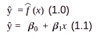

在等式 1 中，ŷ是目标，𝑥是预测，𝜷₀和𝜷₁(系数)是两个未知常数，表示线性模型中的截距和斜率项。简单的线性回归试图产生模型系数的估计𝜷₀和𝜷₁。𝜷₀和𝜷₁获得了，我们可以预测目标。

**2.1 剩余**

线性回归实际响应

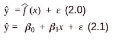

e 是剩余误差。从数学上讲，我们可以将线性回归中的残差写为

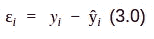

这是第 I 个实际值和第 I 个预测值之差。我们将 *RSS* (残差平方和)定义为

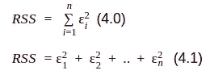

或者等同于

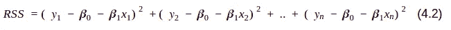

**2.2 估计系数**

𝜷₀和𝜷₁are 未知。因此，在使用等式 1.1 进行预测之前，我们必须使用数据来估计系数。如等式 4.2 所述，最小二乘法选择𝜷₀和𝜷₁来最小化 *RSS* 。使用一些微积分𝜷₀和𝜷₁我们可以写为

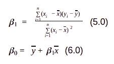

其中 y_hat 是 y(目标)的平均值，x_hat 是𝑥(预测)的平均值。在实践中，我们使用电视、广播、报纸中的广告案例作为预测，以销售额作为目标。为了实现简单的线性回归，在实践中将使用唯一的 TV 预测器。销售和电视图表如下:

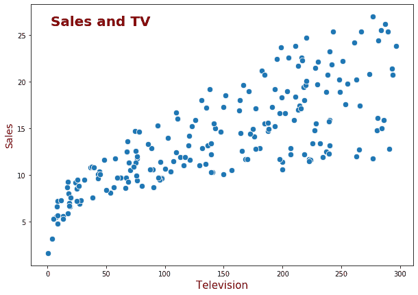

**2.3 实施**

如上所述，我们仅使用电视作为𝑥(预测值)，销售额作为 y(目标值)，数据数量为 200 行( [github](https://github.com/arifromadhan19/linear_regression) )

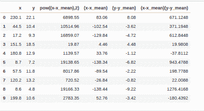

首先，我们用**方程 5.0** 求解系数𝜷₁(斜率)，y_hat = 14.0225，x_hat = 147.0425

𝜷₁ = 69727.65 / 1466818.94

𝜷₁ = 0.047536644161412324

𝜷₁ = 0.048

一旦我们知道了系数𝜷₁的值，我们就可以用**等式 6.0** 求解系数𝜷₀(截距):

𝜷₀ = 14.022 - (𝜷₁ * 147.04)

𝜷₀ = 7.033

因此，回归方程为

ŷ = 7.033 + (0.048 * 𝑥)

销售和电视的回归图如下:

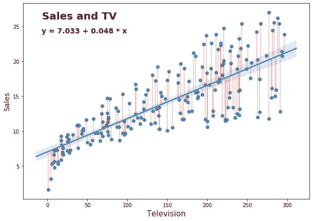

**2.4 如何使用回归方程**

由于我们有回归方程，我们可以预测新数据(电视)的销售。在我们的例子中，电视的新数据是 100，100 台电视的预测销售额如下

ŷ= 𝜷₀ + 𝜷₁𝑥

ŷ = 7.033 + (0.048 *新数据)

ŷ = 7.033 + (0.048 * 100)

ŷ = 11.833

销售额= 11.833

**2.5 用 Python sklearn 实现**

[github 库](https://github.com/arifromadhan19/linear_regression)

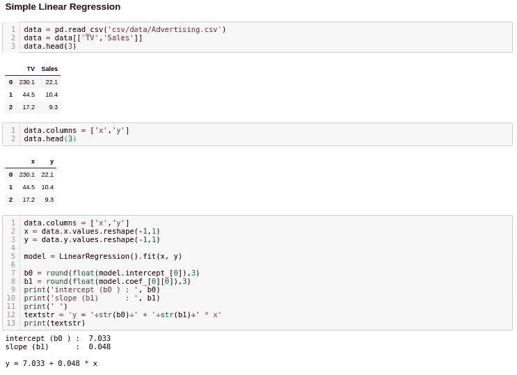

**3。多元线性回归(预测值> 1)**

处理如此大量的值和运算时，计算机往往会高效地执行矩阵运算，为了用矩阵形式表示回归方程，我们需要定义三个矩阵:𝑦、𝜷和𝑥.

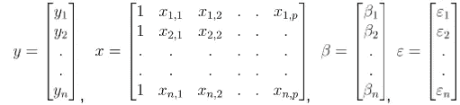

通用参数方程:

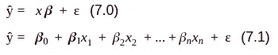

以矩阵形式表示**方程 7.0**

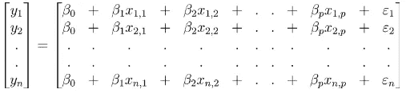

**3.1 剩余**

与简单线性回归相似，多元线性回归也计算以矩阵形式表示的残差

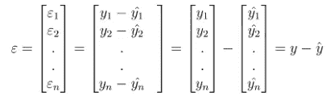

*等式 4.0 中的 RSS* 可改写为

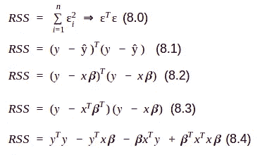

**3.2 估计系数**

计算多元回归中的系数与简单线性回归中的相同，即最小化 *RSS* (残差平方和)。利用一些微积分计算系数可以写成

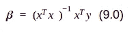

**3.3 实施**

与简单的线性回归一样，我们也使用电视和广播中的广告案例作为预测因素，销售额作为目标。电视、广播和销售图表如下:

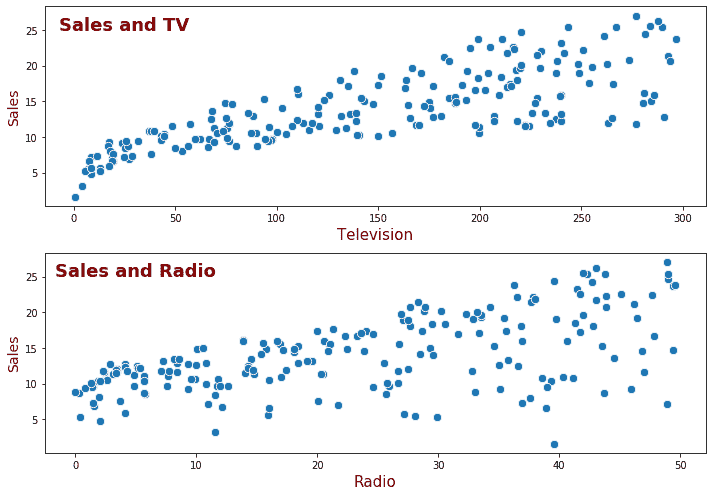

接下来呢？我们定义𝑥，𝑥 *转置*，计算𝑥 *转置* * 𝑥，求逆𝑥 *转置* * 𝑥，定义𝑦from 这个表其中电视为𝑥1，广播为 2，销售为

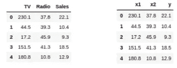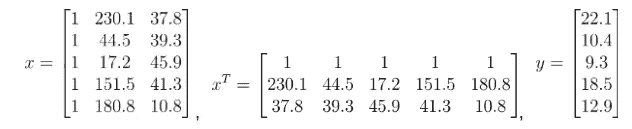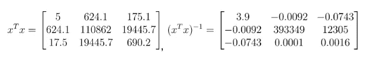

继𝑥之后，𝑥 *转置*，𝑥 *转置** 𝑥，逆𝑥 *转置** 𝑥，还有𝑦.我们可以用**式 9.0**

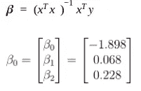

**3.4 如何使用回归方程**

由于我们有回归**方程 7.0，**我们可以预测新数据(电视和广播)的销售。在我们的示例中，电视的新数据为 100，收音机为 200，100 台电视的预测销售额如下

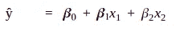

ŷ = -1.898 + (0.068*新数据电视)+ (0.228*新数据广播)

ŷ = -1.898 + (0.068 * 100) + (0.228 * 200)

ŷ = 50.502

销售额= 50.502

**3.5 用 python sklearn 实现**

[github 库](https://github.com/arifromadhan19/linear_regression)

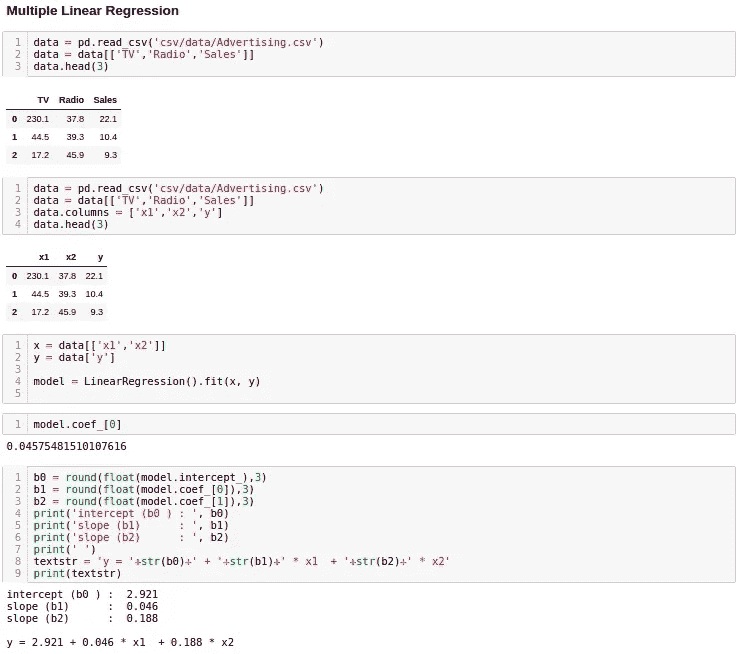

**结果与第 3.3 点不同，因为在本节课中使用了所有数据集**

**关于我**

我是一名数据科学家，专注于机器学习和深度学习。你可以通过[媒介](https://medium.com/@arifromadhan19)、 [Linkedin](https://www.linkedin.com/in/arif-romadhan-292116138/) 或 [Github](https://github.com/arifromadhan19/linear_regression) 联系我。

**我的网站:**[**【https://komuternak.com/】**](https://komuternak.com/)

**参考**

1.  [统计学习简介](http://faculty.marshall.usc.edu/gareth-james/ISL/)
2.  [https://towards data science . com/linear-regression-detailed-view-ea 73175 F6 e 86](https://towardsdatascience.com/linear-regression-detailed-view-ea73175f6e86)
3.  [https://stat trek . com/multiple-regression/regression-coefficients . aspx](https://stattrek.com/multiple-regression/regression-coefficients.aspx)
4.  [https://www.youtube.com/watch?v=K_EH2abOp00](https://www.youtube.com/watch?v=K_EH2abOp00)