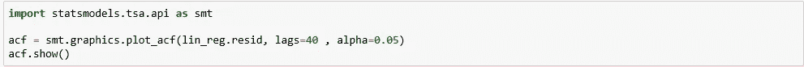
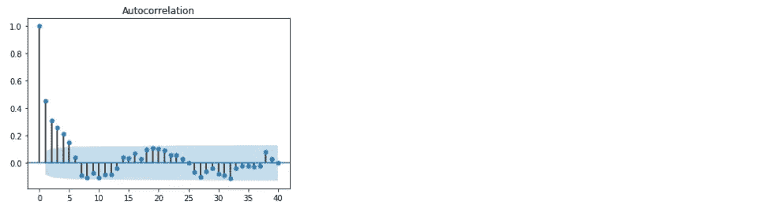
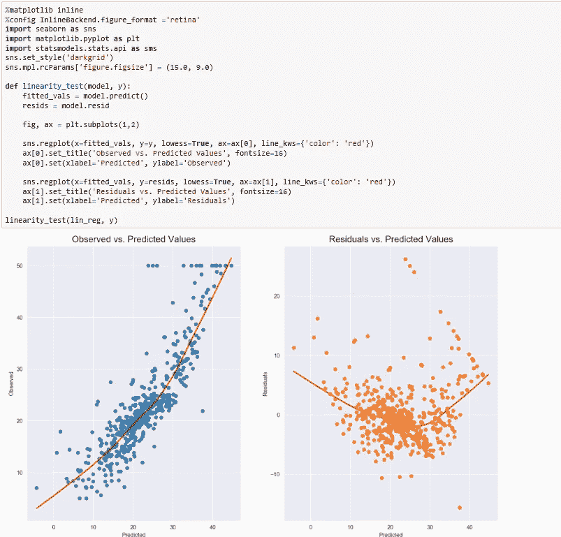
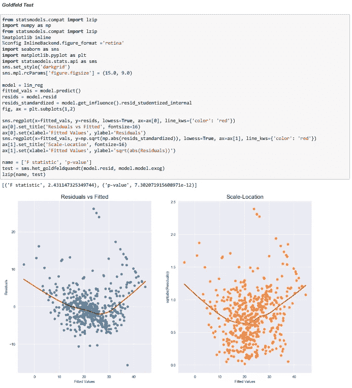
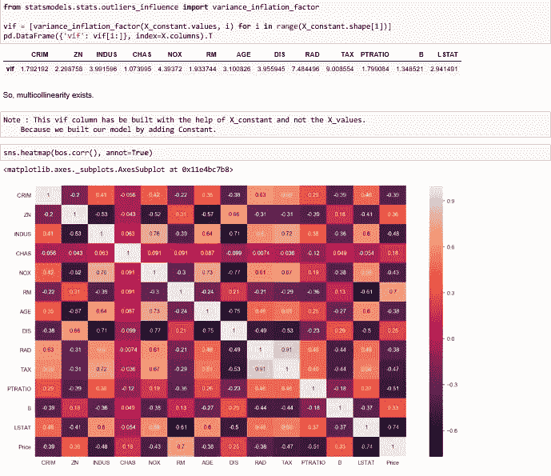

# 线性回归:5 个假设

> 原文：<https://medium.datadriveninvestor.com/linear-regression-5-assumptions-792fa4b645cf?source=collection_archive---------5----------------------->

在统计学中，线性回归是一种对因变量和一个或多个自变量之间的关系进行建模的线性方法。设 X 为自变量，Y 为因变量。我们将定义这两个变量之间的线性关系如下:

这是你在高中时学过的一条线的方程。m 是直线的斜率，c 是 y 轴截距。

我取了波士顿数据集，并对它做了 5 个线性假设。

# **假设 1 :** 没有自相关

**自相关**函数是用来发现数据模式的工具之一。具体来说，**自相关**函数告诉你被各种时滞分开的点之间的相关性。

需要测试:**德宾-沃森测试。**
其取值范围为**0–4**。如果杜宾-沃森的值在 0-2 之间，它被称为**正自相关。**
如果数值范围在**2–4**之间，称为**负自相关。**
如果数值正好是 **2** ，则表示**没有自相关。**
**对于一个好的线性模型来说，它应该具有很低或者没有自相关。**

 [## 认知计算——一套被广泛认为是……

### 作为它的用户，我们已经习惯了科技。这些天几乎没有什么是司空见惯的…

www.datadriveninvestor.com](https://www.datadriveninvestor.com/2020/02/19/cognitive-computing-a-skill-set-widely-considered-to-be-the-most-vital-manifestation-of-artificial-intelligence/) 

我们在这里可以看到都柏林沃森检验(正态性检验)的值:1.078(正自相关)

从下图中，我们可以很容易地看到，有一定程度的正自相关。

# ***假设 2——残差的正态性***

第二个假设是残差的正态性。为此，我们做了一个测试。对于一个好的模型，残差应该是正态分布的。Jarque Bera 检验值越高，残差的正态分布越小。**我们通常倾向于较低的 Jarque bera 测试值。**

jar que–Bera 检验是一种拟合优度检验，用于检验样本数据
的偏斜度和峰度是否符合正态分布。
和 jarque-bera 检验(正态性检验):783.126 **jarque bera 检验检验样本数据的偏度和峰度是否符合正态分布。**
请注意，该测试通常适用于足够大数量的数据样本(> 2000)，因为测试统计渐进地具有自由度为 2 的卡方分布。

# ***假设 3 —残差的线性度***

**线性**表示回归中的预测变量与结果变量有直线关系。

**为了检测非线性，可以检查观察值与预测值或残差与预测值的关系图。**
在这两种情况下都可以看到具有低线性度的残差。

# 假设 4 —同质性检验(使用戈德菲尔德检验)或(贝氏货车检验)

**同异方差-** 如果残差在趋势上呈**对称分布**，则称之为同异方差。

**异方差-** 如果残差在整个趋势上**不对称**，则称为异方差。在这种情况下，残差可以形成箭头形状或任何其他非对称形状。

该检验基于假设检验，其中无效假设和替代假设为:
**H0 =残差中的恒定方差。(异方差)
Ha =异方差。**

**残差应该是同质的。**

我们也可以使用两个统计测试 **Breusch-Pagan 和 Goldfeld-Quandt** 。在这两种情况下，零假设都假设同异方差，而低于某一水平(如 0.05)的 p 值表明我们应该拒绝零假设而支持异方差。

这里，p 值小于 0.05，所以是同方差分布。
H0 =恒定方差(Homoscedacity)
Ha =异方差

# ***假设 5-无多重共线性***

对 VIF 的解释如下:给定变量 VIF 的平方根显示了与该预测因子与模型中的其他特征不相关的情况相比，标准误差有多大，
。如果没有相关的特征，那么 VIF 的所有值都将是 1。

通过绘制热图可以看到列之间的多重共线性。

没有用于确定多重共线性存在的正式 VIF 值。超过 10 的 VIF 值通常被视为表示多重共线性。

**如何修复多重共线性？**

1)从模型中移除高度相关的预测值。如果您有两个或更多具有高 VIF 的因子，请从模型中移除其中一个。

2)使用偏最小二乘回归(PLS)或主成分分析，这种回归方法将预测因子的数量减少到一个较小的不相关成分集。

**谢谢，继续学习:)**