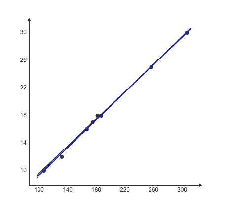

# 线性回归——解释简单。

> 原文：<https://medium.datadriveninvestor.com/linear-regression-explained-easy-dad3420d87d3?source=collection_archive---------13----------------------->

**回归模型**通过对观测数据拟合一条线来描述变量之间的关系。线性回归模型使用直线，而逻辑和非线性回归模型使用曲线。回归允许你估计一个[因变量](https://www.scribbr.com/methodology/types-of-variables/#independent-vs-dependent)如何随着自变量的变化而变化。

**线性**一个变量被认为是解释变量，另一个被认为是因变量。

***因变量*** ***变量*** —我们要解释或预测的变量是谁的值

***独立*** 或解释性 ***变量***——解释其他变量的变量。价值观是独立的。

因变量很容易被记住，因为孩子总是问为什么，依赖父母。

自变量很容易被记住为前男友/女友 **X** 谁独立或者不依赖、不需要你。

让我们看一个例子来更好地理解线性回归。

A Waiter at a restaurant

在一家好餐馆里，服务员的小费主要取决于账单总额。

这是简单线性回归的一个好例子。

因此，假设服务员想要开发一个模型来预测给定账单金额下的小费金额。所以，他开始收集比如说 10 顿饭的数据。

他想预测作为因变量 y 的小费。

Y-17，18，10，18，16，18，25，30，12 的数据

小费取决于账单金额，这将是自变量 x。

X 的数据— 168，175，100，180，160，175，250，300，125

包含一个图表会有所帮助，这样我们可以更好地理解。我们可以简单地在 x 和 y 轴上绘制观察值，然后包括回归线和回归函数:

用于计算回归的公式为

y = mX+b+误差项。

我将在我的下一篇博客中详细描述这个图表中涉及的数学。

总结一下，

[***简单线性回归***](https://www.scribbr.com/statistics/simple-linear-regression/) 是用直线估计一个自变量和一个因变量之间关系的回归模型。两个变量都应该是定量的。

谢谢你的来访！