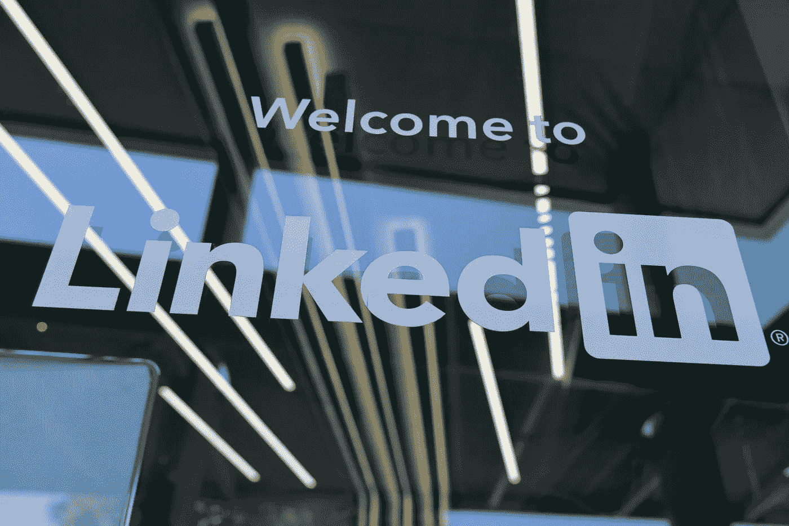

# 将你的财富与你的品牌联系起来

> 原文：<https://medium.datadriveninvestor.com/link-your-fortunes-to-your-brand-b0abbddb9327?source=collection_archive---------7----------------------->

## 如何在 LinkedIn 上寻找工作和建立业务联系

Photo by Greg Bulla on Unsplash

在工作甚至职业生涯的关键时刻，在 LinkedIn 上拥有一个闪亮的个人品牌比以往任何时候都重要。

LinkedIn 是潜在雇主和雇员互相了解对方存在的地方。这个平台的性质比其他网站更能让工作等式两边的人相信。

[温迪·韦纳](https://twitter.com/TheWritingGuru/)已经从多个角度解决了 LinkedIn 的问题。这位语言大师的写作天赋在很小的时候就被父母创造性地命名为写作大师。她作为一名作家的旅程始于短篇小说、诗歌和散文，这些现在都收录在她母亲汇编的一本集子里。

在工作世界中，母亲的爱只有这么多价值，韦纳解决、掌握并揭示了职业成功的秘密。

“我写的是《你的职业和生意，LinkedIn》中的个人品牌，以及我如何利用我的法学学位摆脱法律，”她带着一丝自豪说道。

 [## LinkedIn 做得好几乎是神奇的

### 这是一个宣传你的个人品牌和故事的好地方

medium.datadriveninvestor.com](/linkedin-done-right-is-almost-magic-805094be7bb6) 

韦纳和数字营销专家和社交媒体传播者 [Madalyn Sklar](https://twitter.com/MadalynSklar) 讨论了 LinkedIn 和个人品牌——关于如何穿越就业泥沼并毫发无损地脱颖而出的一切。

“当有人用谷歌搜索你的名字时，你的 LinkedIn 个人资料会出现在搜索结果的顶部，”韦纳说。" [LinkedIn 是你的职业品牌](https://www.datadriveninvestor.com/2020/01/22/employing-linkedin-is-job-1/)和数字足迹。人们在网上就是这么看你的。

“你的工作是你做什么，但你的个人品牌是你是谁，”她说，并补充了这些问题来解开这个品牌:

*   你的独特价值是什么？
*   是什么使你的工作与众不同？
*   对一家公司来说，你的核心资产是什么？
*   别人怎么看你？

# **在评委的注视下**

求职者需要确保他们的 LinkedIn 简历和个人资料是专业的，经过修饰的，因为任何潜在的雇主都可能在任何时候路过。

“LinkedIn 是公司研究你的第一个地方，”韦纳说。“94%的招聘人员在 LinkedIn 上搜索候选人。如果你是一名求职者，你在 LinkedIn 上的表现应该足以吸引招聘人员和招聘经理。

“求职者可以通过求职门户网站在 LinkedIn 上申请工作，”她说。“他们可以联系公司的关键人物，跟踪这些公司，联系招聘人员，甚至接触招聘经理。”

职业生涯悬而未决，现在不是走捷径的时候。

韦纳说:“重要的是:不要把你的简历放到你的 LinkedIn 个人资料里。“我给[写了一篇 LinkedIn 帖子](https://www.linkedin.com/posts/thewritingguru_resume-linkedin-career-activity-6623195786773610496-t04E)解释原因。

“你的简历是亲手交给特定的受众的，”她说。“LinkedIn 的覆盖面更广。还要把机密数据放在 LinkedIn 之外。”

 [## 插上你从未用过的电动工具

### LinkedIn 是一种思维工具，可以建立人际关系

blog.markgrowth.com](https://blog.markgrowth.com/plug-in-the-power-tool-youve-never-used-569a34ce3b84) 

最重要的是，确保你的信息确实是你自己的。

“我最讨厌的事 LinkedIn 上的抄袭率如此之高，”韦纳说。“这就是为什么你的总结需要有创意——并且准确——来展示*你的*职业生涯。

“LinkedIn 上有‘简单申请’按钮，可以让你直接申请，”她说。“尽管如此，我还是建议使用后续信息来个性化介绍。”

它的多功能性让企业家和非求职者受益于 LinkedIn。

“该网站是企业主展示和营销其产品和服务的绝佳场所，”韦纳说。“事实上，LinkedIn 允许你将你为企业提供的服务发布到你的个人资料中。

“这个功能让 LinkedIn 会员免费向你发送关于你的服务的信息，”她说。“在你的个人资料中公开展示这一点会让*的品牌更具知名度*。”

# **一般不一般**

尽可能具体，从基础开始。

“如果你是一个企业主，一定要告诉我们除了你公司的名字之外你还做什么，”韦纳说。例如:XYZ 工具公司的老板。向小型企业主销售 IT 软件解决方案。”

LinkedIn 个人资料应该包括基本要素。

“你的网址——定制它，”韦纳说。“有一个强有力的标题，令人信服的总结，教育，经验和技能。

“在搜索结果中排名靠前的必备条件包括标题、摘要、位置、技能和背书，”她说，并具体说明了以下几点:

*   你的标题应该有围绕你所做的事情的关键词。
*   求职者需要在有针对性的招聘信息中找到关键词。
*   企业主应该关注使用谷歌搜索关键词的[搜索引擎优化](https://www.datadriveninvestor.com/2018/12/29/for-seo-the-words-are-key/)。

 [## 雇佣 LinkedIn 是工作 1

### 从头脑中有一个清晰的计划开始，来支持你的主张

medium.datadriveninvestor.com](/employing-linkedin-is-job-1-101ee036c548) 

“SEMrush 和 [Ahrefs](https://twitter.com/ahrefs/) 是我最喜欢的两个搜索关键词的网站，”韦纳说。

“这是额外的小费，”她说。“如果你是一名求职者，有一个简单的模板和策略来创建一个强大的 LinkedIn 标题:职位或目标角色|行业|你的增值技能。”

在一篇文章中，韦纳[解释了她的策略](https://www.linkedin.com/posts/thewritingguru_linkedin-personalbranding-jobsearch-activity-6656562823218413569-fn-6)。她还警告不要在 LinkedIn 的个人资料上附上简历。

LinkedIn 摘要需要特别注意。

“想想你的价值、技能、目标、社区和影响，”韦纳说。“不要只是把简历摘要复制到你的 LinkedIn 上。说出你的故事。把它分成小段。使用项目符号在智能手机上更容易阅读。

“用第一人称写你的 LinkedIn 摘要，因为你是在人际交往，”她说。包括职业目标、背景、对行业的价值以及你目前所担任的角色。想想什么能让你对雇主或客户有吸引力。”

# **停留在目标上**

内容应该跳出来给读者看。

“关注关键词、技能和其他行业特有的项目——相关的认证和培训——这将使你在平台上更具战略性地定位，”韦纳说。"这样你就能引起目标雇主或客户的注意."

和其他社交媒体平台一样，LinkedIn 需要吸引人的内容。

“LinkedIn 是一个展示你技能的网站，尤其是写作，”韦纳说。“你可以在上面发布原创文章，或者从 Medium 等网站上链接内容。源头并不重要，重要的是让最好的你闪耀出来。

“考虑写一系列内容，”她说。“变化是生活的调味品。包括激励技巧、观点和你学到的教训，以及与你所在行业和受众相关的建议、技巧和策略。”

 [## 2.6 亿人支持 LinkedIn

### 这个平台应该是任何社交媒体战略的一部分

medium.datadriveninvestor.com](/260-million-people-endorse-linkedin-628ddbc0850) 

就像简历一样，帖子应该反映出你最大的努力。

“关注内容的质量而不是数量，”韦纳说。“我喜欢写职业和简历建议、LinkedIn 战略、个人品牌建议，甚至是个人奋斗和成就的故事。将专业知识和个性与你的听众联系起来。

“如果你刚刚开始使用 LinkedIn，当谈到发布或张贴自己的内容时，缓慢而稳定是最好的方法，”她说。“我非常喜欢让你的内容多样化。这也有助于扩大你的受众。”

不玩数字，高效工作。

“LinkedIn 和 Instagram 是那种你必须让内容随着时间增长的地方，”韦纳说。“如果我看到人们在一个帖子上立刻获得很多赞，很明显他们是在通过朋友群玩算法游戏。”

# **网络逐渐壮大**

尽管现在每个人都想拥有一个大的网络，但这个结构是一砖一瓦建立起来的。

“通过评论你在 LinkedIn 上看到的人的帖子来吸引他们，”韦纳说。“那可能会促使他们跟着你。你也可以主动关注他们，包括附上一封精美的邀请函。

“从跟随行业领袖和专家开始，”她说。“你还可以选择 LinkedIn 用户关注的相关标签，以帮助提高你的订阅和连接能力。”

 [## 强大的网络不仅仅是一个梦想

### 对话会带来更多的联系

medium.datadriveninvestor.com](/powerful-networks-are-more-than-a-dream-61c666b9a1fe) 

良好的参与实践是习惯的形成。

“一定要喜欢，评论，参与，分享和发布，”韦纳说。“这是一个循环。LinkedIn 有算法可以推送某些内容。他们给高价值的内容打分，并根据分数奖励你。内容是王道，关系才是女王。”

在 LinkedIn 上和对你有意义的人联系。为跟随而跟随只是一个数字游戏，你是唯一的玩家。

韦纳说:“如果你是 LinkedIn 的新手，通过与你公司的其他成员、校友以及全国乃至全世界你所在行业的专业人士联系，建立你的人际网络。”“考虑一下感兴趣的目标公司——星巴克、谷歌和亚马逊——的专业人士。

“我喜欢与作家和记者交流，”她说。“他们有很棒的内容。因此，我在各种文章中出现过。”

韦纳欢迎[在 LinkedIn](https://www.linkedin.com/in/thewritingguru/) 上的联系。

**关于作者**

吉姆·卡扎曼是拉戈金融服务公司的经理，曾在空军和联邦政府的公共事务部门工作。你可以在[推特](https://twitter.com/JKatzaman)、[脸书](https://www.facebook.com/jim.katzaman)和[领英](https://www.linkedin.com/in/jim-katzaman-33641b21/)上和他联系。