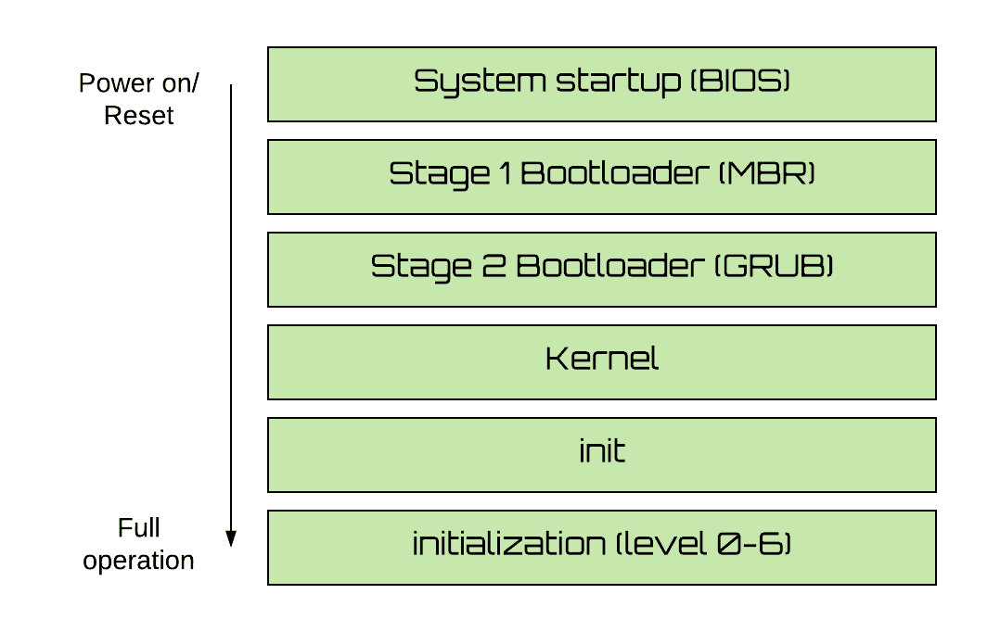
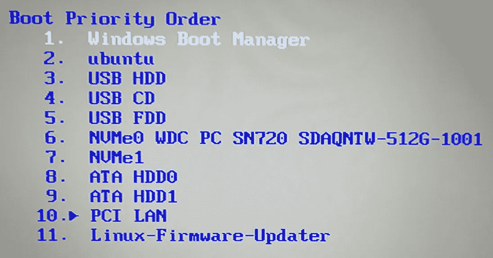
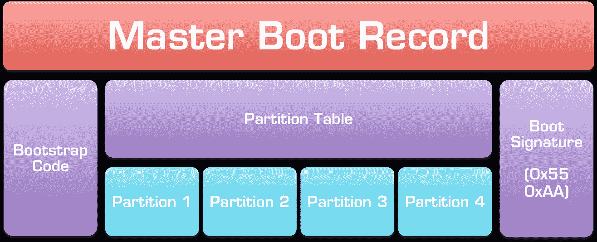
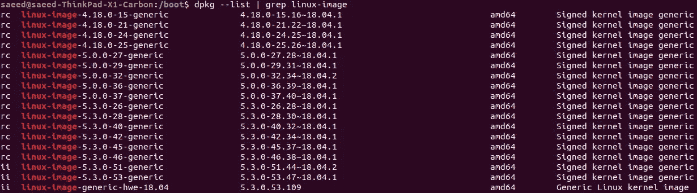
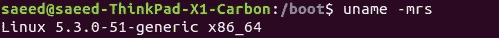
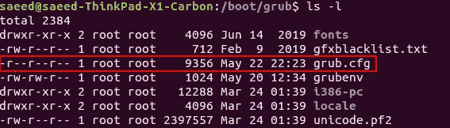
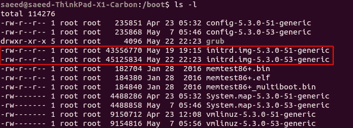
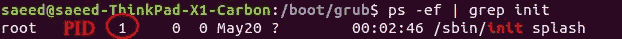
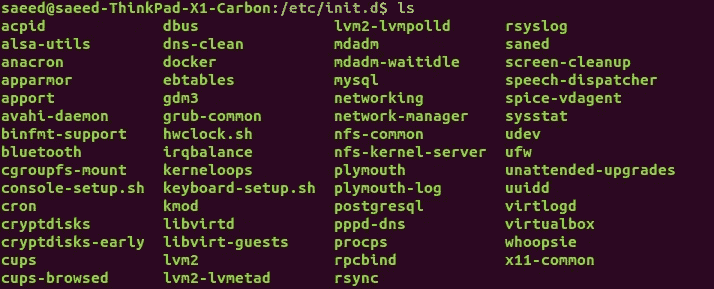

# Linux 引导 101

> 原文：<https://medium.datadriveninvestor.com/linux-bootstrapping-101-2c2a8c067253?source=collection_archive---------1----------------------->

## 对于 Ubuntu 18.04

Photo by [Adi Goldstein](https://unsplash.com/@adigold1?utm_source=unsplash&utm_medium=referral&utm_content=creditCopyText) on [Unsplash](https://unsplash.com/s/photos/start?utm_source=unsplash&utm_medium=referral&utm_content=creditCopyText)

让我们从维基百科如何描述**引导**开始:

> 一般来说，**自举**通常指的是一个**自启动过程**，它应该在没有外部输入的情况下进行。在计算机技术中，这个术语(通常简称为**引导**)指的是开机后将基本软件加载到计算机内存中的过程，特别是操作系统，它将根据需要负责加载其他软件。

The saying “to pull oneself up by one’s bootstraps” was an old phrase referring to an impossible task.

在 Linux 中，典型的引导过程有 6 个不同的阶段。在这里，我试图用一些例子来清晰地描述每个阶段。下面，你可以看到高层的引导过程。

Typical booting processes

引导从 BIOS 开始。BIOS 是什么？它代表“**基本输入/输出系统**”，是一个在可引导介质(如硬盘、光盘、USB 等)上寻找引导加载程序的小程序。

BIOS 程序完全独立于操作系统，它在任何其他引导过程之前执行。它对 CPU、内存和其他存储设备执行简短的完整性检查，以确保系统是可引导的。它还收集所有可用的可引导设备的列表，并根据其可配置的优先级列表开始引导它们。如果它不能引导一个设备，它将转到列表中的下一个设备。例如，下面是一个引导优先级顺序列表的示例。

A list of available Bootable media. You can change this order as you wish.

在这些可引导介质的每一个上，都有一个包含引导加载程序信息的小文件。这个文件被称为**主引导记录(MBR)** ，BIOS 的工作是找到它并读取指令以定位引导加载程序。

MBR 是一个非常小的文件(512 字节大小)，位于可引导磁盘(如硬盘、USB 等)的第一个扇区。该文件包含主引导程序、分区表和 MBR 验证检查的信息。

第一部分，**主引导加载程序**，包含作为已安装操作系统的加载程序的可执行代码——由于其有限的小尺寸，它通常用于将控制传递给加载程序的第二阶段(GRUB)。第二部分，**分区表**，包含关于包含文件系统的逻辑分区如何在该介质上组织的信息(例如，分区的数量及其类型)。最后一部分是 **MBR 验证检查**，是 2 字节签名(又名幻数)。如果是(0x55，0xaa)(十六进制格式)，那么 BIOS 将尝试引导系统。如果不是，那么你会从你的 BIOS 得到一个错误信息，说它没有找到一个引导盘。

Master Boot Record(MBR), which is always located at cylinder 0, head 0, and sector 1, the first sector on the disk. source: [https://neosmart.net/wiki/mbr-boot-process/](https://neosmart.net/wiki/mbr-boot-process/)

一旦 BIOS 找到引导加载程序，它就会将引导代码加载到内存中，启动引导加载程序进程。

在 Ubuntu 中，第二阶段引导程序是 GRUB。代表 **GR** 和**U**ni fied**B**oot loader，属于 GNU 项目。

它是一个负责启动操作系统并了解文件系统的小软件包。如果您的计算机上安装了多个内核映像，或者特定操作系统有多种配置，GRUB 允许您引导其中一个。它会显示一个闪屏，等待几秒钟，如果没有用户输入，那么它会加载配置文件中指定的默认内核映像。下面，你可以看到我的电脑上安装了很多内核镜像。你可以在 CLT 上输入`$ dpkg --list | grep linux-image`来查看这个列表。

List of all available linux kernel images on my computer

The default linux kernel on my computer.

对于每个操作系统或内核配置，GRUB 都有一组写在配置文件中的指令。该配置位于`/boot/grub/grub.cfg`上。

配置文件包含关于内核和`initrd`(初始 RAM 磁盘)映像的信息。`initrd`映像包含加载实际操作系统文件系统所需的模块/驱动程序。内核使用这些映像作为临时根文件系统。一旦加载了根文件系统，内核就会卸载这些临时文件并加载真正的文件系统。

The contents of boot directory. You can see initrd images on the directory

现在，内核接管了。但是内核是什么呢？它是操作系统的核心，提供对服务和硬件的访问。它是一个压缩的图像文件，其位置在 GRUB 配置文件中指定。

现在，当内核被加载到内存中时，开始检查处理器家族和架构。内核执行许多硬件特定的操作。它使用“initramfs”来读取驱动程序和引导系统所需的模块。它还挂载 GRUB 配置文件中指定的“根文件系统”。

在这个阶段，内核执行`/sbin/init`二进制。它是 Linux 内核在用户空间中执行的第一个程序。你可以检查这个二进制的进程 ID (PID)，它总是 1。

You can check a program’s PID with $ ps -ef command

在这个阶段，init 程序启动 init 进程，该进程运行一系列被称为`init.d` bash 脚本的初始化脚本。你可以在`/etc/init.d`目录下查看这些脚本。每个守护进程或服务都有一个脚本。

init.d scripts

该初始化从运行程序级别 0 至 6 ( `init 0`至`init 6`)的`init`开始。程序分为 6 个目录(每个`init`级别)。目录名的格式是`/etc/rc.*d`，每个目录包含特定于该程序级别的文件。根据运行级别(目标)，内核从以下目录之一开始执行程序:

*   位于`/etc/rc0.d`上的 init 0 `halt`文件
*   位于`/etc/rc1.d`上的 init 1 `single-user mode`文件
*   位于`/etc/rc2.d`上的初始化 2 `multi-user mode without NFS`文件
*   位于`/etc/rc3.d`上的 init 3 `multi-user mode with NFS`文件
*   初始化位于`/etc/rc4.d`上的 4 个`unused`文件
*   初始化位于`/etc/rc5.d`上的 5 个`X11- GUI mode`文件
*   初始化位于`/etc/rc6.d`上的 6 个`Reboot`文件

在每个目录中，有两种类型的文件，一种是以字母`S`开头的启动脚本，另一种是以字母`K`开头的停止/终止脚本。第一个字母后有一个数字，表示执行的顺序。

## 参考

*   Linux 启动过程——它是如何执行的([链接](https://medium.com/linux-point/linux-boot-process-how-it-executes-2089c0b2c648)
*   Linux 引导过程([链接](https://medium.com/the-devops-journey/linux-booting-process-a43554dc72cd))
*   Linux 启动过程([链接](https://medium.com/@genexu/linux-booting-process-f7d1f8574580))

我希望你喜欢读这篇文章。如果你愿意支持我成为一名作家，考虑注册成为一名媒体成员。每月只需 5 美元，你就可以无限制地使用 Medium。