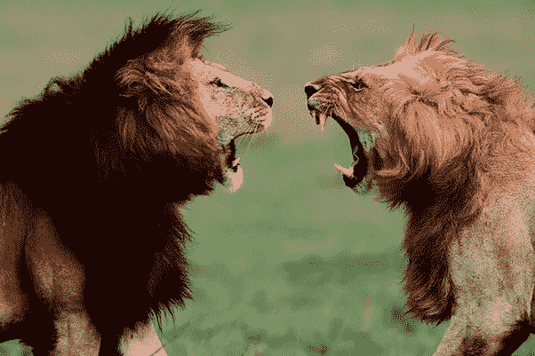
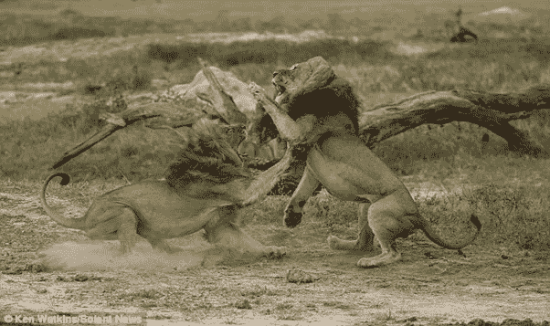

# 狮子和领袖

> 原文：<https://medium.datadriveninvestor.com/lion-leader-a2b427445753?source=collection_archive---------4----------------------->

最有争议的话题是“领导者是天生的还是后天培养的”。在这方面，我们不打算讨论领导素质是天生的还是在人类发展过程中发展起来的。本文将从两个角度讨论从《狮子洞》到《公司》的领导属性: **1。肢体语言 2。语音通信**

Source : McGraw — Hill

**1。共同点**

**肢体语言**

**狮子:**狮子使用**百分之九十**的肢体语言作为他们不断交流的工具。这包括**他们看哪里，他们想传达什么**，如果其他人不知道他们在传达什么，就无法理解真正的猖獗发生在哪里，这是很危险的。

Source : Courses in Chaos

前面提到过，他们拥有直接的交流能力，这与他们自己的能力有关，其余的与参与者一起使情况平静或恶化。

**领导:**让我们借助**“沟通模型—阿尔伯特·梅赫拉比安”**来证明这一点，这就是所谓的**7–38–55**规则简介它包括 7%的口语、38%的语调和 55%的肢体语言。和狮子一样，肢体语言对领导者来说也起着重要的作用。在这种情况下，55%的肢体语言使用受到以下因素的影响:

**全身**

*   力量姿势
*   重量分布:
*   监控姿势
*   带着权威行走
*   向内倾斜

Source : Executive coach Ny

**面部表情**

*   面向前方
*   忧郁的微笑
*   昏昏欲睡的
*   目光接触

一些与狮群或企业界接受度有关的建议。人们应该知道以下各项之间的主要区别:

*   被尊重
*   被接受
*   有知识的
*   成为家庭的一员

如果你身处狮穴，像狮子一样思考，像狮子一样行动，这同样适用于企业界。

**声乐**

**狮子:**狮子使用 10%的发声交流。它将用于极度关注或警告。

Source : Into the wild

比钻石更珍贵的强大工具是声音交流。根据占 7%的沟通模型，以传达准确的内容。

Source : Anxiety.org

有效沟通的一些品质如下:

*   声音图像
*   比赛
*   暂停的力量
*   战略性中断

**2。尊重**

狮子:我们可以看到狮子一个压一个。不会每次都这样，他们重视彼此的隐私和他们需要的空间。有时候，当他们不喜欢的时候，他们会马上让别人知道。

Source : Into the wild

作为警告信息，他们使用肢体语言，如果不尊重以上，他们开始与口头，如果没有改善，他们开始猖獗。

**领导:**可惜尊重没有捷径。这涉及到领导和员工之间的关系。这不可能在一秒钟内完成。如何赢得尊重？。在从别人那里获得它之前，先给予别人应有的尊重，这是一个循环。

Source : Executive coach Ny

*   保持一致
*   准时
*   反应灵敏
*   大部分时间都是对的，但是对自己的错误感到舒服
*   原谅别人和自己的错误
*   当对方是对是错时，要尊重对方

**3。爪子的用法和手——手臂**

**狮子:后爪—** 它们大多不能完全控制后爪。前爪——他们将会看到谁主宰谁。

Source : Daily mail

类似于狮子，手和胳膊的使用在公司世界中起着重要作用，以检查谁控制谁。如前所述，支配这个词并不意味着掰手腕，只是用强调的姿势轻轻握手就能判断一个人的态度。

Source : McGraw — Hill

*   用手来强调
*   移动的手
*   握手

**感谢您的阅读！**

**我希望你喜欢这篇文章**