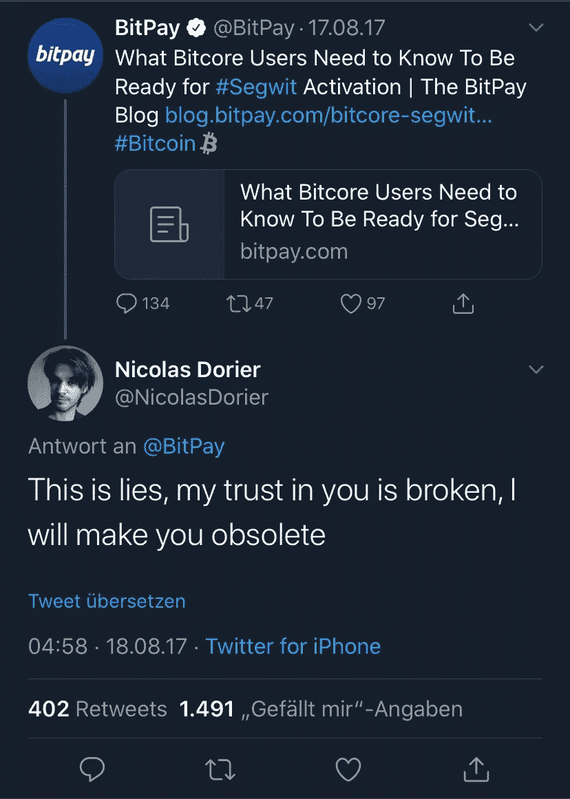
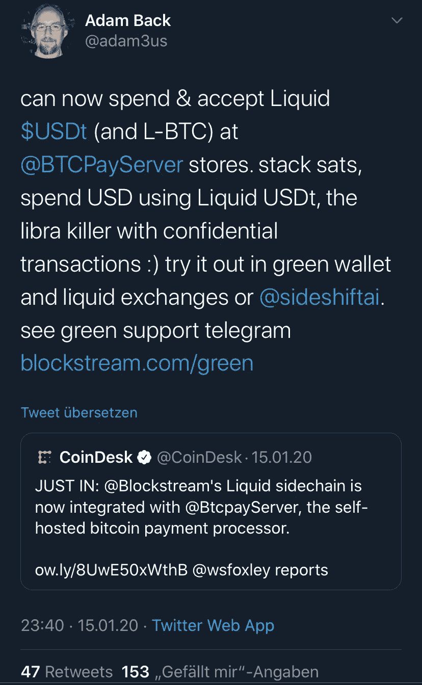

# BTCPayServer 中的液体系链

> 原文：<https://medium.datadriveninvestor.com/liquid-tether-now-in-btcpayserver-37b22dac733f?source=collection_archive---------5----------------------->

Blockstream 的液体侧链允许转移比特币和链外栓系。它的交易比比特币区块链更快、更私密、更便宜。现在，区块链液体(Blockchain Liquid)为热门的 BitPay 替代品 BTCPayServer 带来了液体。

“这些都是谎言，我对你的信任被打破了，我会让你成为多余的。”

随着这条推文，BTCPayServer 的历史开始了。在区块大小战争结束时，一些比特币公司希望用 SegWit2x 解决封锁。其中包括最大的比特币支付服务提供商 BitPay，Nicolas 的推文就是发给它的。

BTCPayServer 是一种开源工具，其功能大致与 BitPay 相同:它允许用户在商店或现场接受比特币(和其他加密货币)支付。但是没有 BitPay 这样的中间人。对 BitPay 的愤怒演变成了一场开源运动，很快发展出了比 BitPay 更大的势头。除了比特币，BTCPayServer 可选支持 12 个 Altcoins，兼容全节点和硬件钱包，还允许闪电支付。

> 这有点像 Linux 对抗 Windows。

# 液体系绳

现在，Blockstream 为 BTCPayServer 带来了流动性。液体就是所谓的侧链。比特币在比特币区块链上被冻结，可以在液态侧链上移动。这允许支付在不增加区块链负担的情况下扩展，并且可以在不改变基本协议的情况下集成新功能，例如更好的令牌化或通过保密交易进行更多私人支付。虽然这些信息仍然包含哪个地址向哪个地址发送了什么，但它们掩盖了发送的数量。

 [## 数字货币、区块链和货币的未来|数据驱动的投资者

### “区块链”、“加密货币”、“令牌化”，以及现在的“央行数字货币”已经成为…

www.datadriveninvestor.com](https://www.datadriveninvestor.com/2020/02/18/digital-currencies-blockchain-and-the-future-of-money/) 

Blockstream 开发的共识程序保护了 liquid sidechain，该程序只需大约两分钟即可完成交易。该过程使用多重签名脚本；这有点类似于 Ripple consensus，但交易的验证不是公开和免费的，而是保留给流动财团成员中数量可控的公司。

在本文中，您将了解更多关于液体侧链在技术上是如何工作的。

Blockstream 在公告中写道，通过 Liquid，“用户还可以选择发行象征性的法定货币，如 USDt [Tether]，而不是珍贵的 L-BTC”。L-BTC 的意思是“液态比特币”。用户在 Liquid sidechain 上访问比特币和 Tether 最简单的方法是通过 Blockstream 开发的钱包 Green。

这对 Blockstream 来说意义重大。首席执行官亚当回推:

流动侧链上的系绳美元是比特币许多问题的解决方案。它们比比特币区块链上的比特币更快得到确认——交易所可以在一两分钟后接受它们，这要归功于私下的保密交易，也要归功于根据区块流更好地扩展侧链，而且因为它们是美元代币而不是比特币，它们的波动性也更小。这是不是意味着所有的先决条件都满足了才能在主流中起飞？

# 比特币去哪儿了？

另一方面…这和比特币还有关系吗？该计划实际上是比特币将引发一种货币改革，它将成为货币——即一种支付手段——现在可能再次通过像 Liquid 和 Lightning 这样的非链方法成为可能。那么，接受并再次使用法定货币(这要求购买力保持在美元而非比特币上)会不会适得其反？这难道不是与初衷完全相反吗？

不同于区块链的本土代币——即比特币——稳定的硬币对其稳定性贡献甚微。为了保持安全，比特币需要强大的矿工；如果比特币价格上涨，矿商赚得更多，可以保持强势。Stablecoins 最多通过让用户付费与他们进行交易来帮助他们。然而，有了 Liquid 这样的侧链，这些交易费不再归矿商所有，而是归财团成员所有。他们与矿商争夺数字支付验证的收入。在某种程度上，它们破坏了系统的长期安全性。

此外，从技术上或政治上来说，液态醚倾向于表达比特币所代表的对立面:尽管软件是开源的，但它是由一家拥有(防御性)专利的公司运营的；该系统不再免于许可，因为只有选定的合作伙伴才能操作验证交易和收费的超级节点。

这当然可能是系绳美元打算作为一个特洛伊木马。得益于液态区块链上的原子互换，tether 无需任何中介即可兑换比特币；在同一个区块链上的整合将使得在不远的将来从技术上从美元转换到比特币变得非常容易。最后，液态区块链只是一个侧链，人们可以使用，但不必如此；它保护主链免受交易垃圾邮件的破坏。

但这足以让我们退一步向前迈一步吗？

我在每月一期的 [**简讯中分享了更多私密的想法，你可以在这里**](https://mailchi.mp/bf8f8e8ed697/keep-in-touch-with-lukas) 查看。请在评论中告诉我，并在各种社交媒体平台上加入我:

[**推特**](https://twitter.com/WiesfleckerL)●[**insta gram**](https://www.instagram.com/lukaswiesflecker/)●[**脸书**](https://www.facebook.com/lukaswiesfleckerr)●[**Snapchat**](https://www.snapchat.com/add/luggooo)**●[**LinkedIn**](https://www.linkedin.com/in/lukas-wiesflecker-1b11251a5/)**

**无论你做什么，都要带着爱和激情去做！**

****访问专家视图—** [**订阅 DDI 英特尔**](https://datadriveninvestor.com/ddi-intel)**