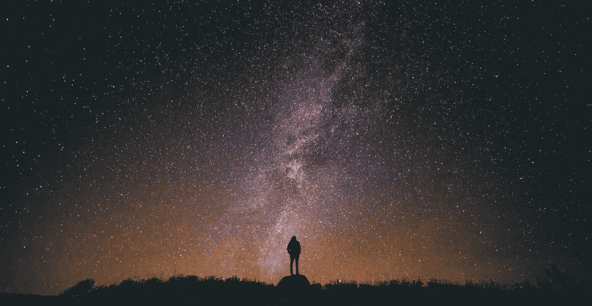

# 生活在悖论中

> 原文：<https://medium.datadriveninvestor.com/living-in-a-paradox-405b839e962d?source=collection_archive---------18----------------------->

Photo by [Greg Rakozy](https://unsplash.com/@grakozy?utm_source=medium&utm_medium=referral) on [Unsplash](https://unsplash.com?utm_source=medium&utm_medium=referral)

我要写的是我自己的想法，来自我所看到的和我认为我知道的。当然，事情的背后是有科学依据的，这一点总是有争议的。也许我错了(我不知道)，但在我脑海中与几个朋友谈论这个话题后，他们说我有道理。希望我能让正在读这篇文章的人明白。

我开始意识到，我们越是朝着未来前进，你就越想与过去的事情联系在一起。我是一个 90 后的孩子。那时候真的很简单，上学，然后和朋友出去运动。没有太多的电子游戏或电视。有太多的活动，体力活动，我们似乎永远不会累。今天，我有一份全职工作，我坐在椅子上看着电脑屏幕编码，或者学习，下班回家后，我筋疲力尽。虽然，我开始工作时感觉精神饱满，这可能是因为我早上锻炼。那是体力活动，它让你感到新鲜。它让你感觉良好，精力充沛，身体健康。这对你的精神也有帮助。

 [## 摔倒不是失败。数据驱动的投资者

### 你只有在放弃的时候才会失败。每个英雄都会倒下，我们活着就是为了失败者出现的时刻；上升到…

www.datadriveninvestor.com](https://www.datadriveninvestor.com/2019/01/17/falling-isnt-failing/) 

这么多有趣的应用程序让我们的生活变得更轻松，但这只会让我们一天比一天懒惰和虚弱。我可以打赌，在我这个年龄，我的父母可能比我不去健身房更健康。

这也可以归结为其他事情，作为人类，我们是游牧民族。我们不能也不应该和解。我的朋友和所有其他人谈论他们将要追求的东西，谈论安定下来。我也不明白。有时候，人们决定他们的生活，小到每天的每一秒钟，大到十年后。他们已经计算过了。我不明白。我不是说，你不应该有一个计划，或者不应该追求你想要的东西。但是关于安顿下来和计算一切的事情，你可以很容易地说你 50 年后的价值。

在一个地方，一种惯例，一种工作方式，一种回家的方式，你不会扩展你的思维，消除你的恐惧，或者发现、体验新事物。我的朋友读到过这样的话，“在你上班的路上，偶尔尝试一些其他的路线，也许是绕道，但要尝试一下”。保持新事物，保持不同，会有帮助的。我强烈建议你们每个人在上班、上学或上大学的路上也尝试一下。套路扼杀创造力。

我们的饮食习惯。每天吃 2 餐会比吃 5 餐感觉好。是真的。我去健身房锻炼，有人告诉我你需要每隔 2-2.5 小时吃一顿饭。也许，只是我，对我没用。人们甚至遵循 OMAD(一天一餐)，健康得要命。此外，所有的加工食品和零食，所有的消费…所有的食物对你没有任何帮助。以前人类用来狩猎获取食物。原始人比现代人强壮得多，所以我读过。

人类是一种群居动物。当与人交流或沟通出现问题时，我能理解。我不是提倡变得更外向。我的意思是，与其在网飞直播，有时走出去体验更多的东西会更好。人们现在更喜欢呆在家里，在自己舒适的“空间”里看一部热门的新电视剧或一部新电影、一部新纪录片，并可能连续播放到深夜。回避社交，零思想交流，零成长。睡眠质量差会导致免疫力下降，最终导致抑郁或焦虑。

我没有议程。这只是我的一点想法。有时做一些矛盾的事情(与通常相反)，也是“原始的”可能是最好的事情。想法是成为一个更好的人。成长为一个人，变得更加自信。你会接触到新的想法。你最终会更加了解自己。离科技越远，对科技的了解就越多。对技术的需求源于技术的缺乏。想想吧。