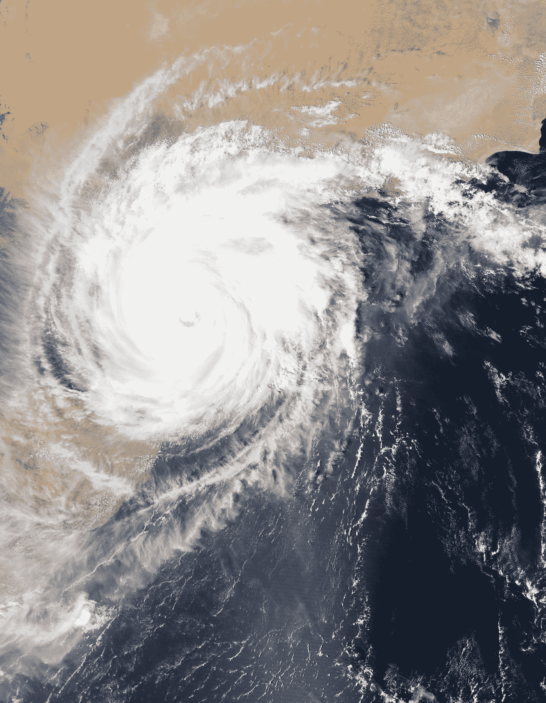

# 生活在一场罕见的经济灾难中——与新冠肺炎有关，但心存感激？

> 原文：<https://medium.datadriveninvestor.com/living-in-a-rare-economic-disaster-related-to-covid-19-but-grateful-eacbb6801c0d?source=collection_archive---------24----------------------->

Photo by [NASA](https://unsplash.com/@nasa?utm_source=medium&utm_medium=referral) on [Unsplash](https://unsplash.com?utm_source=medium&utm_medium=referral)

“祸不单行”这句谚语适用于大多数南部非洲国家。2021 年 1 月下旬，热带气旋艾洛伊丝首先在莫桑比克中部造成了大范围的破坏和严重的洪水。据 earthobservatory.nasa.gov 称，这场风暴导致非洲东南部几个国家的 16，000 多人流离失所，摧毁了约 17，000 所房屋，造成十多人死亡。我认为这是灾难性的:鉴于大多数国家都在努力应对与新冠肺炎相关的国家紧急情况。更糟糕的是，这场噩梦已经笼罩了不发达国家的所有地区，这似乎从各个方向打击了社区。

有人可能会问，我可以用这些信息做什么？我的回答是这样的:我希望激发对这个地方的共鸣和宣传，并进一步描绘出事情可能会更糟的画面。例如，尽管有一个全球性的疫情需要处理，我们仍然可以庆祝像生活本身这样的小事，以及再试一次的多种可能性。请看灾难中希望和团结的伟大例子的链接。

[https://cdn.bignewsnetwork.com/n241613047294.jpg](https://cdn.bignewsnetwork.com/n241613047294.jpg)

事实上，生活在这场与新冠肺炎相关的罕见经济灾难中对我们所有人来说都是一个挑战，但我敢打赌，对于今年热带气旋艾洛伊丝的受害者来说，情况会更糟。因此，我敦促我们使用经过充分研究和值得信赖的捐助平台来促进这些人的康复。我作为一个与这一局势有着密切联系的南非侨民提出这一建议，我个人也为解决这一问题作出了贡献。