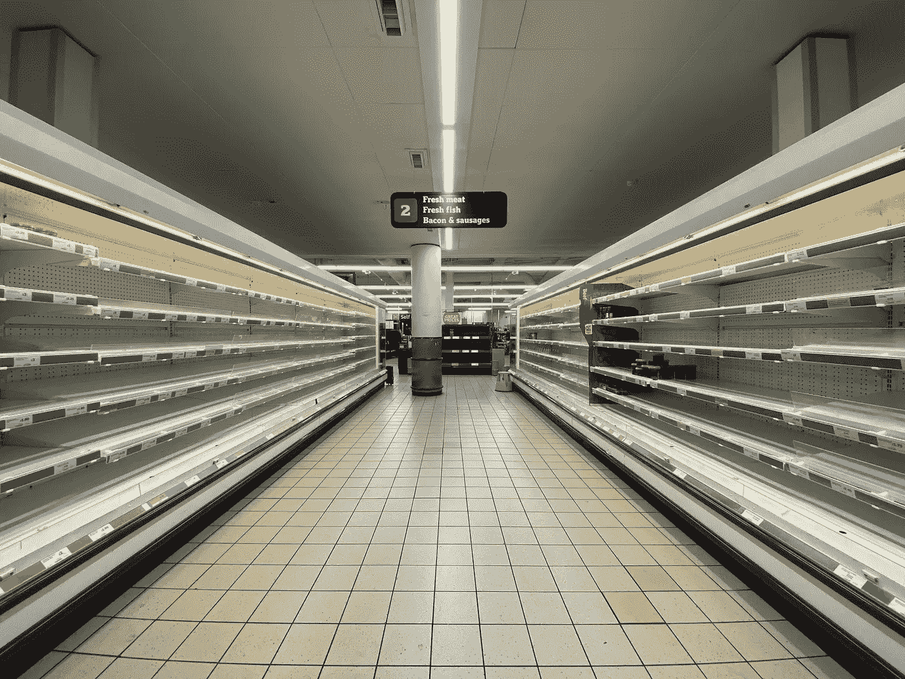

# 生活在封闭状态下

> 原文：<https://medium.datadriveninvestor.com/living-under-lockdown-acb6130cca19?source=collection_archive---------7----------------------->

## 应对冠状病毒爆发的最佳对策是什么？

Photo by [John Cameron](https://unsplash.com/@john_cameron?utm_source=unsplash&utm_medium=referral&utm_content=creditCopyText) on [Unsplash](https://unsplash.com/s/photos/lockdown?utm_source=unsplash&utm_medium=referral&utm_content=creditCopyText)

如今，想、说或写其他任何东西都很困难。我现在生活在一个近乎封闭的社会里。学校、餐馆和越来越多的商店都关门了。建议人们远离街道，保持距离。

我是大学老师，老婆开餐馆。我们密切关注新闻。几乎每小时都有新信息发布。事情正在以闪电般的速度变化。毫无疑问，最近事件的发展速度令人恐惧。

疫情的爆发让人们从不同的角度看待问题。例如，假期、节日和体育赛事不再重要。

“唯一”重要的是我们的健康以及我们社会的社会和经济健康。我们的未来取决于抗击冠状病毒的爆发。几周前，有一种“不要惊慌”的方法。现在每个人都清楚形势是严峻的。

 [## 医疗保健的未来正在被一场大型技术入侵所塑造|数据驱动型投资者

### 过去十年，全球经济的所有部门都经历了大规模的数字颠覆，而卫生部门现在…

www.datadriveninvestor.com](https://www.datadriveninvestor.com/2018/11/02/the-future-of-healthcare-is-being-shaped-by-a-big-tech-invasion/) 

当然，最重要的问题是我们应该如何应对当前的危机？

在回答这个问题时，病毒学、流行病学、传染病和公共卫生保健领域的医学专家和科学家目前处于主导地位。政府和我们大多数人都依赖他们的意见。理所当然，他们最有资格在这个问题上发表权威意见。

但是新冠肺炎是新的。专家们也没有就最佳对策达成共识。我们需要更多的研究、更多的测试和更多更好的数据。

在我们对这种病毒有了更好的科学了解并开发出一种治疗方法和疫苗之前，也可以在社会上找到对这种病毒的可能反应。

# 专家怎么说？

专家怎么说？在我看来，在没有疫苗的情况下，科学家和其他专家给了我们三种选择。

**没有动作。关于这一点，几乎没有疑问。不回应不是一个选项。如果我们不中断或试图消除病毒的人际传播，卫生系统将承受巨大压力。**

接下来的两个策略似乎更现实。它们基于流行病学和数学模型，这些模型在帮助政府引入现有的反病毒措施方面发挥了重要作用。T2 帝国理工学院新冠肺炎应对小组上周发表了一篇论文，详细描述了这两种策略。我们可以总结如下:

**抑制/封锁。**这种方法是围绕人口的“社会距离”这一理念建立的。想想家庭隔离、家庭隔离、禁止大规模集会以及旅行禁令和限制。关闭学校、餐馆和咖啡馆通常是下一步，有时随后是其他封锁限制，这应该有助于阻止冠状病毒的传播。

目标是帮助减轻卫生系统的压力。不幸的是，这一策略并不能保证我们能长期战胜冠状病毒。开发一种疫苗需要很长时间(据说是 12-18 个月)。此外，最初的疫苗可能不起作用，在这种情况下，一旦抑制措施取消，病毒威胁很可能会再次出现。

**减灾。**冠状病毒的受控传播是缓解策略的主要原则。这个想法并不是要完全抑制疫情，而是要集中精力保护老年人和其他“高危”人群。从冠状病毒感染中康复的年轻人和健康人越多，人们(大概)对再次感染的免疫力就越高。这将有助于建立“群体”或群体免疫力，进而导致传播的显著下降。

但这一策略代价沉重。数学模型预测许多住院和死亡。

因此，目前的选择是在我们开发疫苗的几个月“抑制”(封锁)或大量死亡(产生群体或群体免疫的成本)之间。

考虑到这种选择，越来越多的国家选择某种形式的压制也就不足为奇了。

这个选择说起来容易做起来难。例如，帝国理工学院论文的作者明确表示，他们不考虑可能的策略的社会或经济影响。那么，社会将如何应对我们在世界各地目睹的镇压措施？

这是一个我们可以——也应该——提出的问题。这是一个每个人的意见都很重要的问题。尤其是因为任何封锁策略最终都取决于普通人配合限制的意愿。

# 确定性和挑战

生活在封闭状态下是很困难的。非常难。对于我们许多人来说，冠状病毒和随后的抑制措施已经彻底改变了我们的生活。孤独。压力。恐惧。

然而，鉴于我们对冠状病毒的所有了解，抑制策略是首选。让我试着从一个教师兼餐厅合伙人(餐厅老板/经理的配偶)的角度来解释为什么。

## 社会确定性

不采取行动或缓解不仅极其危险。他们让我们中的许多人无所适从。

在政府介入并迫使我们关门之前，我和妻子就这家餐馆进行了长时间的讨论。我们做什么呢客人数量在下降。一些人被建议呆在家里，因为他们有流感样症状。其他人因为害怕感染而取消了预约。

我们的客人和员工的健康和安全一直是我们最优先考虑的事情。但是，如果我们自己决定关闭餐馆，我们会向市场发出什么信号呢？

这听起来很奇怪，但政府下令关闭餐馆的消息让人松了一口气。

是的，仍然有许多问题和不确定性我们必须处理。既然主要收入来源消失了，我们该怎么办？无法产生任何收入的想法是毁灭性的，我的妻子正在与不经营餐馆的想法作斗争。它是我们生活中重要的一部分，却突然意外地停止了。

但抑制措施是明确的，使我们能够专注于两件最重要的事情:确保每个相关人员的个人健康，以及为企业的近期和长期未来开发新的想法。

在学校宣布关闭之前，我还不得不处理学生旷课增加的问题。一些学生离开的原因和我们餐厅的客人一样。若无其事地继续上课毫无意义。不清楚和模糊的方向导致了很多不确定性，并且对学生和我来说都是一个巨大的干扰。

再说一次，我不想说封锁是件好事。不，整个情况是毁灭性的。但封锁的决定至少在一个关键和具有挑战性的时刻提供了某种程度的澄清。当不确定性大量存在时，这很重要。

当然，我们意识到封锁的“确定性”是一个短期的解决方案。如果健康专家是正确的，抑制措施可能需要持续一段时间。我们只能暂时关闭餐馆。我们不能停止教学一年左右。

这就是抑制方法的问题。它提供了短期的安全，但没有提供长期的解决方案或计划。

为了应对迫在眉睫的社会和经济不确定性，世界各国政府推出了各种财政刺激和支出计划。这些计划非常受欢迎，尤其是对餐馆或其他中小型企业主而言。但是它们不能提供长期或永久的解决方案。

## 数字现实

但是，封锁战略和配套的经济刺激方案给了我们一些时间和动力，让我们在做任何事情时变得更有创造力和创新性。

只要冠状病毒控制着世界，我们就在很大程度上依赖数字解决方案。数字时代的压抑和社交距离是不同的。数字技术提供了独一无二的机会，这在二十年前是不可能的。我们是足智多谋的生物，我们使用可用的数字工具惊人地适应新情况。

我们使用社交媒体来联系。在线办公工具允许我们继续与同事一起工作和协作。虚拟午餐是有组织的。越来越多的长距离/远程健身比赛开始了。数字工具有助于协调令人惊叹和温暖人心的计划。上周五，我体验了 30 多个国家的 180 多家广播电台如何同时播放“*你永远不会独行*”以展示团结一致对抗冠状病毒。谁曾想到，我们会含着眼泪听着盖瑞&的《步行者》。事情变化得多快啊。

还有更多。一级防范禁闭的环境提供了一个学习的机会。即使是我认识的最“反数字”的人也被迫接受数字解决方案。数字和虚拟的运营方式不会很快消失。

对我和妻子来说，目前的封锁让我们能够发挥创造力，专注于餐厅的数字解决方案。我们正在尝试数字交付平台，并在网上分享食谱。我们甚至在考虑推出一个家庭烹饪频道。新的数字商业模式正迅速成为新的常态，即使对于最传统的企业，如餐馆。

播客、教学视频、在线作业和虚拟办公时间对于任何处于封闭状态的教师来说都比以往任何时候都更重要。我主要教一群国际学生。他们中的许多人已经回家了。为了给他们提供与课堂上相似的体验，我从游戏行业学到了很多。我已经有了在教学中融入游戏元素的想法，但是封闭的环境迫使我更加认真地去做。在线资源和同事分享经验的意愿也非常有帮助。

通过这种方式，即使远非最佳，封锁也可以刺激新现实的构建，而这种新现实将在当代背景下由数字技术的能力驱动。

# 一个新世界

2015 年，[比尔·盖茨](https://www.gatesnotes.com/Health/We-Are-Not-Ready-for-the-Next-Epidemic)警告我们，告诉我们我们还没有为下一次疫情做好准备。不幸的是，他的预言变成了现实。我们还没准备好！

世界在很短的时间内发生了变化。希望专家和科学家能够很快找到解决方案。在那之前，我非常感谢许多卫生工作者，他们尽一切努力，冒着一切风险来控制疫情。

而且不止于此。我们都有责任减轻疫情的社会和经济影响。抑制策略给了我们一些(但不是很多)时间来调整和引入在这个陌生的新现实中工作和学习的创新方式。