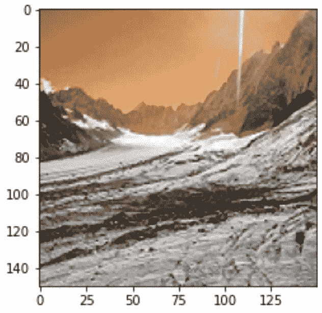
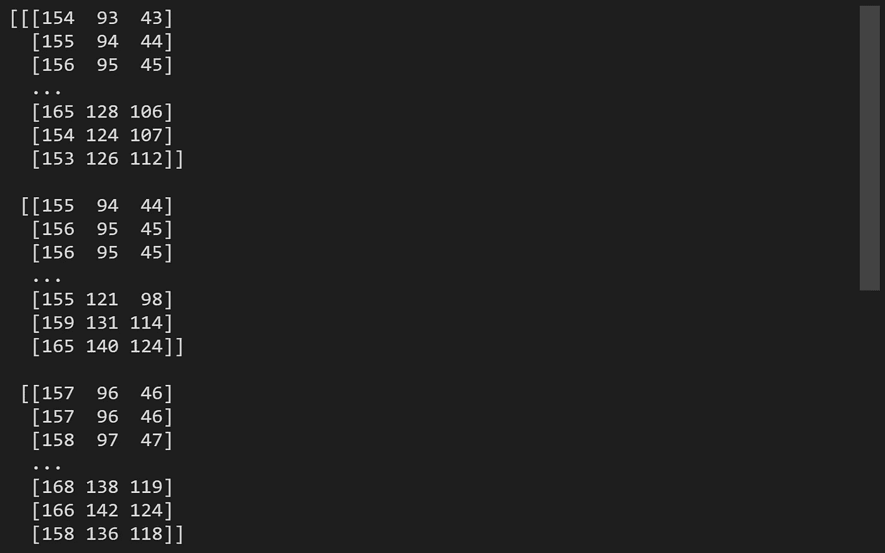

# 载入影像分类数据

> 原文：<https://medium.datadriveninvestor.com/load-in-image-classification-data-e2dfec6dfcb6?source=collection_archive---------1----------------------->

*一个技术博客*

我在谷歌上搜索了图像分类数据。我看到一个文件，里面有建筑、森林、冰川、山脉、海洋和街道的图片。如果您点击下面的链接，您会看到我使用了第 6 号，英特尔图像分类。

[](https://lionbridge.ai/datasets/top-10-image-classification-datasets-for-machine-learning/) [## 机器学习的 10 大图像分类数据集| Lionbridge AI

### 为了帮助您构建对象识别模型、场景识别模型等，我们编制了一份最佳…

lionbridge.ai](https://lionbridge.ai/datasets/top-10-image-classification-datasets-for-machine-learning/) 

我下载了之前的文件并解压。然后我愣住了，我意识到我不知道如何在 Python 中加载图像数据集。我已经习惯了将 csv 文件导入熊猫数据框架，但是加载图像是不同的！所以我在 YouTube 上快速搜索了一下，想知道我应该怎么做。我在下面附上了我跟随的 YouTube 教程。

**流程**

首先导入必要的包。导入 NumPy 是因为我们将使用多维数组对象。导入 Matplotlib 用于绘图。操作系统模块已导入，因此您计算机上的文件可以轻松读取和加载。最后，cv2 是一个用于解决计算机视觉问题的 python 库。要安装 cv2，进入 *pip 安装 opencv-python* 到你的终端。同时输入 *pip install keras。* Keras 是一个用于神经网络的 API。

```
import numpy as np
import matplotlib.pyplot as plt
import os
import cv2
```

接下来，DATADIR 是分配给包含训练数据的文件路径的字符串。我决定只处理两个数据集，冰川和山脉图片。基于上述类别，类别被分成一个列表。

```
DATADIR = "insert_file_path_here/archive/seg_train/seg_train"
CATEGORIES = ['glacier', 'mountain']
```

接下来创建一个循环来访问这两个类别的图像。os.path.join 方法连接路径，因此训练数据(DATADIR)的文件路径与 glacier and mountains 文件夹(category)连接。

```
for category in CATEGORIES:
    path = os.path.join(DATADIR, category) 
```

这个 for 循环遍历文件路径中的所有图像。listdir()将返回一个文件名列表。cv2.imread()从联合文件路径(训练路径和类别)加载图像。中断被插入，所以只打印一个图像。

```
for category in CATEGORIES:
    path = os.path.join(DATADIR, category)
    for img in os.listdir(path):
        img_array = cv2.imread(os.path.join(path,img))
        plt.imshow(img_array)
        plt.show()
        break
     break
```



The break is used to stop the loop after the first image is outputted. Here is the first image.

要显示一张照片的数据，需要打印图像数组。这三列代表蓝色、绿色和红色。

```
print(img_array)
```



Blue Green Red

```
print(img_array.shape)
```

图像的形状是(150，150，3)。这个特殊的图像是相同的形状，但在图像形状改变的情况下，我已经加入了程序，以确保图像大小保持不变。

IMG 大小控制图像的质量。数字越低，质量越差。例如，10 将使图像看起来像一堆像素。

```
IMG_SIZE = 100
```

cv.resize()将调整图像数组的大小，plt.imshow(new_array)将显示新数组

```
new_array = cv2.resize(img_array, (IMG_SIZE, IMG_SIZE))
plt.imshow(new_array)
plt.show()
```


接下来创建一个训练数据集。索引循环将用于将照片与类别冰川或山脉进行匹配。如前所述，下一个 for 循环遍历文件路径中的图像。listdir()将返回一个图像列表。cv2.imread()从联合文件路径加载图像。创建一个新数组来调整新图像的大小。所有这些都被追加到训练数据的列表中，因为 append 方法只接受一个参数，而列表允许我们保存两个参数。

```
training_data = []def create_training_data():
    for i in range(len(CATEGORIES)):
        category = CATEGORIES[i]
        path = os.path.join(DATADIR, category)
        for img in os.listdir(path):
            img_array = cv2.imread(os.path.join(path,img))
            new_array = cv2.resize(img_array, (IMG_SIZE, IMG_SIZE))
            training_data.append([new_array, i])
```

要查找训练数据的长度，请打印该长度。

```
print(len(training_data))
```

长度为 4916。有 4916 张冰川和山脉的图片。

让我们数一数有多少照片是冰川，有多少是山脉，以确保山脉和冰川之间有一个平均的分界线。

```
count_glaciers = 0
count_mountains = 0 
for image in training_data:
    if image[1] == 0:
        count_glacier += 1
    else:
         count_mountains +=1
print('Glaciers:', count_glaciers, 'Mountains:', count_mountains)
```

冰川图片 2404 张，山地图片 2512 张；相当平均的分配。将来，可以给模型赋予权重以更精确地平衡数据集。

接下来，数据被随机打乱以进行预测。

```
import randomrandom.shuffle(training_data)
```

打印出随机洗牌的前 10 个。样本[0]是实际的图像数组，样本[1]是类别。

```
for sample in training_data[:10]:
    print(sample[1])
```

混洗后的数据将被分类到 X(特征)和 y(标签)中。列表不能传递给神经网络，因此 X 必须转换为 numpy 数组。np.array(X)需要整形。整形括号中的-1 表示任意数量/种类的要素。IMG 尺寸代表图像尺寸，数字 3 代表彩色图像，数字 1 代表灰度图像。将 X 写成一个 numpy 数组并对其进行整形只是 keras 让我们做的事情。

```
X = []
y = []for features, label in training_data:
    X.append(features)
    y.append(label)X = np.array(X).reshape(-1, IMG_SIZE, IMG_SIZE, 3)
```

下一次导入 pickle，这样您就不必每次都重新生成数据。加载和构建训练数据需要花费大量时间。腌制会让你更有效地利用你的时间。Pickle 会保存我们的数据。为 X 和 y 创建 Pickle out。

```
import picklepickle_out = open('X.pickle', 'wb')
pickle.dump(X, pickle.out)
pickle_out.close()pickle_out = open('y.pickle', 'wb')
pickle.dump(y, pickle_out)
pickle_out.close()
```

使用 pickle_in 重新插入我们的 pickle 文件。

```
pickle_in = open('X.pickle', 'rb')
X = pickle.load(pickle_in)
```

# **建模**

在终端中写下 *pip 安装张量流-集线器*和 *pip 安装张量流*。

```
import tensorflow as tf
from keras.models import Sequential
from keras.layers import Dense, Dropout, Activation, Flatten, Conv2D, MaxPooling2D
import pickle
```

在加载之前的数据之后。

```
X = pickle.load(open('X.pickle', 'rb'))
y = pickle.load(open('y.pickle', 'rb'))
```

然后

```
y = np.array(y)
X = X/225.0model = Sequential()
model.add(Conv2D(64, (3,3), input_shape = X.shape[1:]))
model.add(Activation("relu")) 
model.add(MaxPooling2D(pool_size=(2,2)))model.add(Conv2D(64, (3,3)))
model.add(Activation("relu")) #rectified linear
model.add(MaxPooling2D(pool_size=(2,2)))model.add(Flatten())
model.add(Dense(64))model.add(Dense(1))
model.add(Activation('sigmoid'))model.compile(loss='binary_crossentropy',
                optimizer="adam",
                metrics=['accuracy'])model.fit(X, y, batch_size=32, epochs=3, validation_split=0.2)
```

