# 基于随机森林和支持向量机的借款人分类

> 原文：<https://medium.datadriveninvestor.com/loan-borrower-classification-using-random-forest-and-support-vector-machine-5226c81bcf02?source=collection_archive---------3----------------------->

## 了解如何实现虚拟变量、使用 StandardScaler 缩放特征、通过 GridSearchCV 优化参数以及选择最佳模型。


Photo by [Alexander Schimmeck](https://unsplash.com/@alschim?utm_source=medium&utm_medium=referral) on [Unsplash](https://unsplash.com?utm_source=medium&utm_medium=referral)

# 背景

[Lending Club](http://www.lendingclub.com/) 把需要钱的人(借款人)和有钱的人(投资人)联系起来。投资者倾向于把钱给那些风险较小、更有可能还贷的人。也就是说，我们将预测借款人是否全额偿还了贷款。

为此，我们将使用相同的训练/测试数据创建一个随机森林模型*和*一个支持向量模型。**最终模型将最大限度地减少预测已全额偿还贷款但实际上没有偿还的借款人数量**(我们的模型选择标准)。换句话说，我们希望**最小化我们的 I 型错误**的大小，这与最小化假阳性的总数是一回事。

[](https://www.datadriveninvestor.com/2019/01/30/machine-learning-for-stock-market-investing/) [## 算法交易的机器学习|数据驱动的投资者

### 当你的一个朋友在脸书上传你的新海滩照，平台建议给你的脸加上标签，这是…

www.datadriveninvestor.com](https://www.datadriveninvestor.com/2019/01/30/machine-learning-for-stock-market-investing/) 

该数据集包含以下特征:

*   **credit.policy** :如果客户符合 LendingClub.com 的信用核保标准，则为 1，否则为 0
*   **用途**:贷款用途
*   **利率**:贷款的利率，按比例计算
*   **分期付款**:借款人在贷款到位的情况下所欠的每月分期付款
*   **log.annual.inc** :借款人自报年收入的自然日志
*   **dti** :借款人的债务收入比
*   **fico** :借款人的 fico 信用评分
*   **天数:借款人拥有信用额度的天数**
*   **循环余额**:借款人的循环余额
*   **循环使用**:借款人循环额度使用率
*   **inq.last.6mths** :借款人最近 6 个月被债权人查询的次数
*   **拖欠 2 年**:在过去的 2 年中，借款人逾期付款超过 30 天的次数
*   **pub.rec** :借款人的贬损公共记录数量
*   **未足额偿还** : 1 表示借款人未足额偿还贷款，0 表示借款人已足额偿还贷款

*点击* [*这里*](https://github.com/mokaiser/loan-borrower-classification-rf-svm) *获取数据集，在 GitHub 上看我的完整代码。*

# 导入库和数据

```
import pandas as pd
import numpy as np
import matplotlib.pyplot as plt
import seaborn as sns
%matplotlib inlinedf = pd.read_csv('loan_data.csv')
df.head()
```

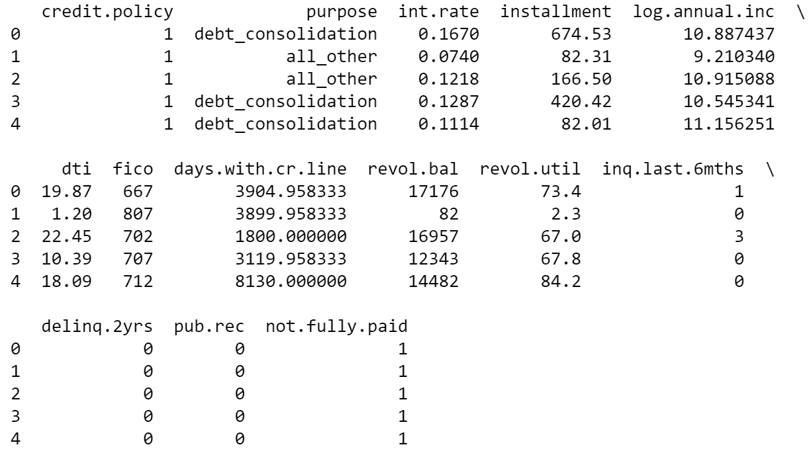

# 探索性数据分析

“在进行任何操作之前，先弄清楚我们在处理什么。”

```
df.info()
```

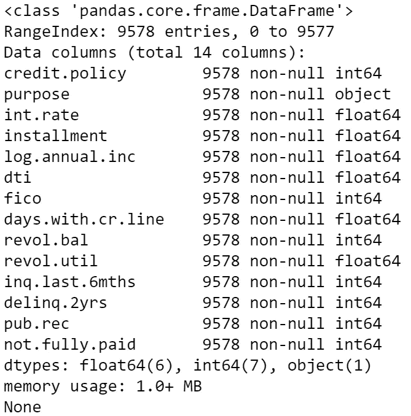

其中:

*   共 14 列
*   9578 行
*   没有空值
*   **目的**列属于对象 dtype - >提示:稍后需要转换它

```
df.describe()
```

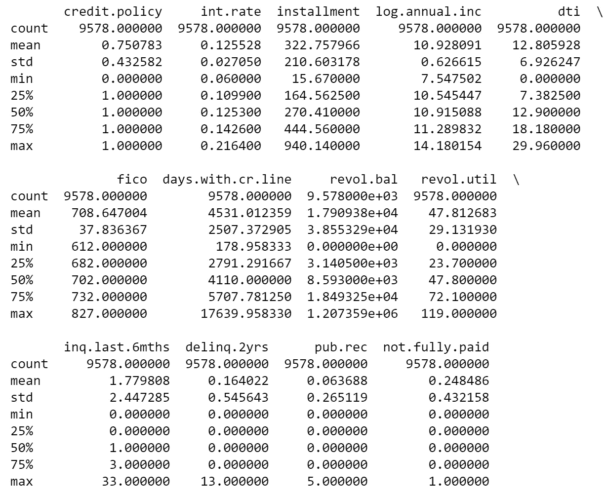

这是所有 14 个专栏的快速统计摘要。检查最大值。请注意，与其他列的最大值( **days.with.cr.line max = 17，639** )相比，一些列的最大值( **int.rate max = .21** )非常小？这是一个**指标，表明在通过我们的模型运行数据之前，我们需要调整数据**。

来自 [scikit-learn 文档](https://scikit-learn.org/stable/auto_examples/preprocessing/plot_scaling_importance.html):

> “标准化包括重新调整要素的比例，使其具有均值为零、标准差为一的标准正态分布的属性。”

简而言之，数据标准化就是当我们把我们的特征(也就是自变量，也就是预测值，也就是数字列)放在一个相似的尺度上。这就是我们如何最大限度地减少对某些功能赋予过多权重而导致结果失真的可能性。

# 数据清理

还记得我给你的关于*目的*列是对象数据类型的提示吗(参见探索性数据分析部分)？这意味着这是一个分类变量，我们现在需要把它转换成哑变量。如果我们不这样做，那么我们的模型就不能读取我们的数据。

```
purpose = pd.get_dummies(df['purpose'])
purpose.head()
```

其中:

*   [pd.get_dummies](https://towardsdatascience.com/the-dummys-guide-to-creating-dummy-variables-f21faddb1d40) 创建一个名为*目的*的新数据帧，由 0 和 1 组成
*   *目的*将有一个 1，这取决于贷款的目的

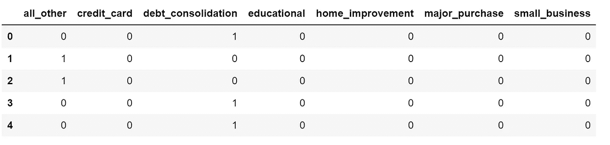

在删除原始“目的”列的同时，将原始数据帧与新创建的目的数据帧连接(也称为组合)。

```
df2 = pd.concat([df, purpose], axis=1)
df2.drop(['purpose'], axis=1, inplace=True)
df2.head()
```

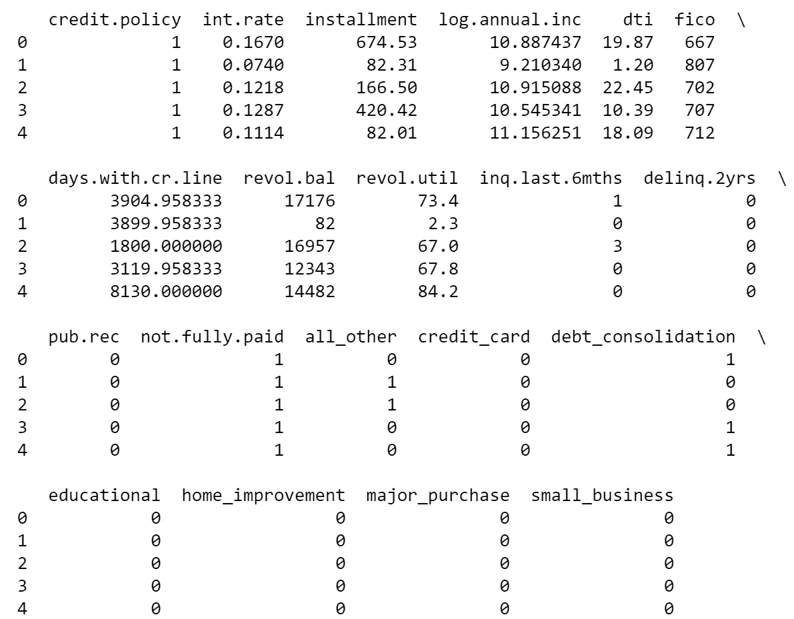

# *数据预处理*

*请注意* [*基于树的算法*](https://www.geeksforgeeks.org/python-how-and-where-to-apply-feature-scaling/) *(我们的随机森林模型)不受特征缩放的影响，因为它们不是基于距离的，然而，我们的 SVM 模型是。因为我们对两个模型使用相同的训练和测试集，所以我们仍然需要扩展我们的功能。*

## 步骤 1:将数据分成 X 和 y 两部分

```
from sklearn.model_selection import train_test_splitX = df2.drop('not.fully.paid', axis=1)
y = df2['not.fully.paid']
```

## 步骤 2:特征缩放

```
**# scaling all features - important step here!** from sklearn.preprocessing import StandardScalersc = StandardScaler()
X_scaled = sc.fit_transform(X)
```

## 步骤 3:将数据分为训练集和测试集

```
X_train, X_test, y_train, y_test = train_test_split(X_scaled, y,
                                                    test_size=0.30)
```

现在，我们已经扩展了我们的功能并将数据分为训练集和测试集，我们可以构建我们的随机森林模型和支持向量机模型。:)

# 随机森林分类器

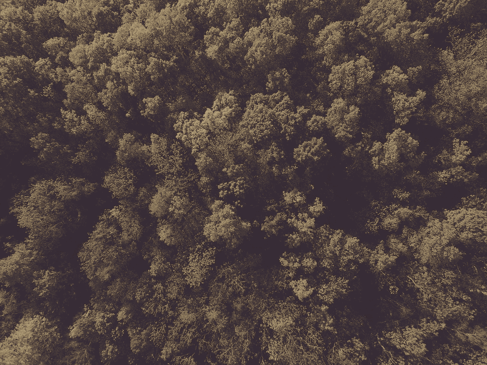

Photo by [Ozark Drones](https://unsplash.com/@ozarkdrones?utm_source=medium&utm_medium=referral) on [Unsplash](https://unsplash.com?utm_source=medium&utm_medium=referral)

## 步骤 1:构建、训练和预测

```
from sklearn.ensemble import RandomForestClassifierrfc = RandomForestClassifier(random_state=42)
rfc.fit(X_train, y_train)
rfc_pred = rfc.predict(X_test)
```

## 第二步:评估(没有 GridSearchCV)

```
from sklearn.metrics import classification_report,confusion_matrix
confusion_matrix(y_test, rfc_pred)
```

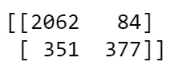

```
classification_report(y_test, rfc_pred)
```


## 步骤 3:设置 GridSearchCV

让我们通过测试以下内容来找到 RFC 的最佳参数:

*   n _ 估计值:10，50，100，200，300，500，800
*   最大深度:4，5，6，7，8
*   标准:熵、基尼系数

```
from sklearn.model_selection import GridSearchCV
rfc_param_grid = {'n_estimators': [10, 50, 100, 200, 300, 500, 800],
                  'max_depth': [4, 5, 6, 7, 8],
                  'criterion': ['entropy', 'gini']}rfc_grid = GridSearchCV(estimator=rfc,
                        param_grid=rfc_param_grid,
                        refit=True,
                        verbose = 3)**# fitting our model with optimized parameters** rfc_grid.fit(X_train,y_train)**# finding our best estimators** optimizedRFC = rfc_grid.best_estimator_
optimizedRFC
```

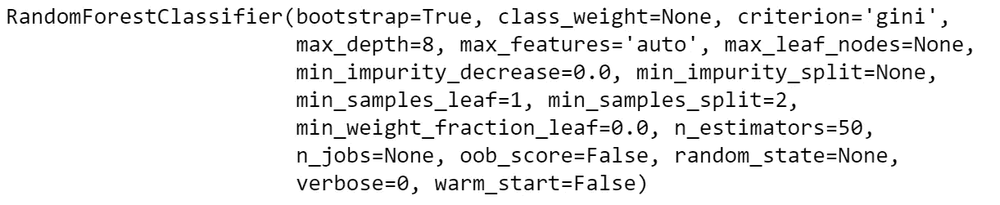

## 步骤 4:重新运行预测并评估(使用 GridSearchCV)

```
**# re-running preds** rfc_grid_pred = optimizedRFC.predict(X_test)**# re-evaluating** confusion_matrix(y_test, rfc_grid_pred)
```

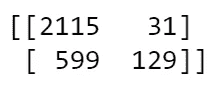

```
classification_report(y_test, rfc_grid_pred)
```

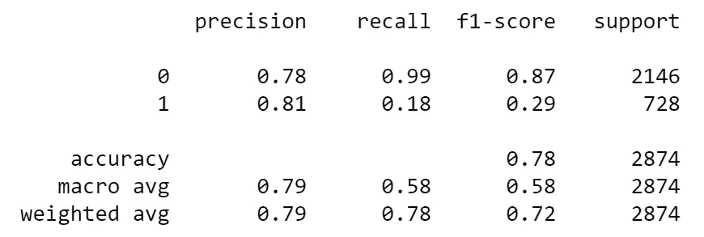

## 步骤 5:比较我们的 1 型误差的大小

*让我们看看将 GridSearchCV 用于我们的随机森林分类器模型如何影响我们的准确性和假阳性总数。*

**RFC**

*   84 次误报
*   96.1%的准确率

**优化的 FC**

*   31 次误报
*   98.6%的准确率

# 支持向量机

## 步骤 1:构建、训练和预测

```
from sklearn.svm import SVC
svm = SVC()
svm.fit(X_train, y_train)
svm_pred = svm.predict(X_test)
```

## 第二步:评估(没有 GridSearchCV)

```
confusion_matrix(y_test, svm_pred)
```

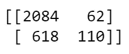

```
classification_report(y_test, svm_pred)
```

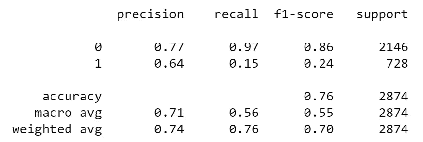

## 步骤 3:设置网格搜索

让我们通过测试以下内容来找到 SVM 的最佳参数:

*   c 值:0.1，1，10
*   伽玛值:“自动”、“缩放”
*   内核:' poly '，' linear '，' rbf '

```
svm_param_grid = {'C': [0.1, 1, 10],
                 'gamma': ['auto','scale'],
                 'kernel': ['poly','linear','rbf']}svm_grid = GridSearchCV(estimator=svm,
                        param_grid=svm_param_grid,
                        refit=True,
                        verbose=3)**# fitting our model with optimized parameters** svm_grid.fit(X_train,y_train)**# finding our best estimators** optimizedSVM = svm_grid.best_estimator_
optimizedSVM
```

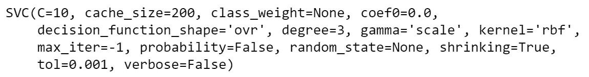

## 步骤 4:重新运行预测并评估(使用 GridSearchCV)

```
**# re-running preds** svm_grid_pred = optimizedSVM.predict(X_test)**# re-evaluating** confusion_matrix(y_test, svm_grid_pred)
```

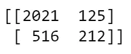

```
classification_report(y_test, svm_grid_pred)
```

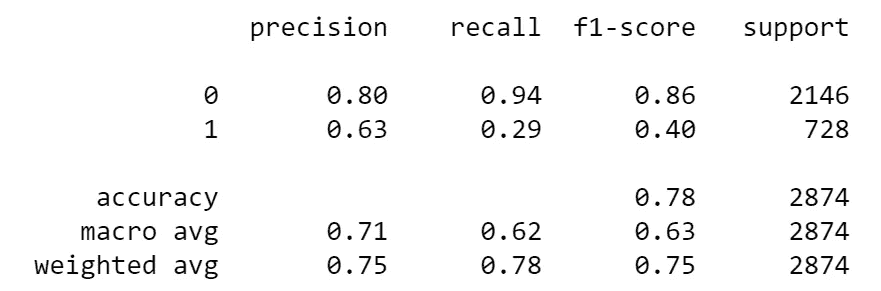

## 步骤 5:比较我们的 1 型误差的大小

*让我们看看将 GridSearchCV 用于我们的支持向量分类器模型如何影响我们的准确性和假阳性总数。*

**SVM**

*   62 次误报
*   97.1%的准确率

**优化的虚拟机**

*   125 次误报
*   94.2%的准确率

等等，我们所谓的*优化过的*模型怎么表现得更差？ [GridSearchCV 默认执行 K 重交叉验证](https://stackoverflow.com/questions/52935644/gridsearchcv-performs-worse-than-vanilla-svm-using-the-same-parameters)，将数据拆分为训练和验证。这意味着该模型从不使用整个数据集进行训练，而是使用未经训练的数据进行预测/验证。

# 结论

我们的模型选择标准是选择最小化 I 型错误(也就是假阳性的数量)的模型。根据我们的数据，我们问自己**哪种模型可以最大限度地减少预测会全额偿还贷款但实际上没有偿还的借款人数量？**

*   RFC 预测了 84 个假阳性(96.1%的准确度)
*   **OptimizedRFC 预测了 31 个假阳性** (98.6%的准确率)
*   SVM 预测了 62 个假阳性(97.1%的准确率)
*   优化的 SVM 预测了 125 个假阳性(94.2%的准确率)

也就是说， **OptimizedRFC 模型是我们的最终赢家，因为它具有最低的误报率和最高的准确率；因此，最大限度地减少我们的 1 型误差。**

# 文档链接

[sk learn . preprocessing . standard scaler](https://scikit-learn.org/stable/modules/generated/sklearn.preprocessing.StandardScaler.html)

[pandas.get_dummies](https://pandas.pydata.org/pandas-docs/stable/reference/api/pandas.get_dummies.html)

[sklearn.model_selection。GridSearchCV](https://scikit-learn.org/stable/modules/generated/sklearn.model_selection.GridSearchCV.html#sklearn.model_selection.GridSearchCV.fit)

# 参考

[什么是特征缩放](https://www.quora.com/What-is-feature-scaling)

[如何以及在哪里应用特征缩放](https://www.geeksforgeeks.org/python-how-and-where-to-apply-feature-scaling/)

[为什么缩放对于 SVM 分类很重要](https://stackoverflow.com/questions/15436367/svm-scaling-input-values)

[为什么数据标准化很重要](https://humansofdata.atlan.com/2018/12/data-standardization/)

[创建虚拟变量的虚拟指南](https://towardsdatascience.com/the-dummys-guide-to-creating-dummy-variables-f21faddb1d40)

[GridSearchCV 的表现如何不如标准 SVM](https://stackoverflow.com/questions/52935644/gridsearchcv-performs-worse-than-vanilla-svm-using-the-same-parameters)

# 作者注释

*感谢阅读！请随时关注我的* [*中*](https://medium.com/@kaiserm) *和*[*LinkedIn*](https://www.linkedin.com/in/kaisermorgan)*。我很乐意继续对话，听听你的想法/建议。*

*   *莫*