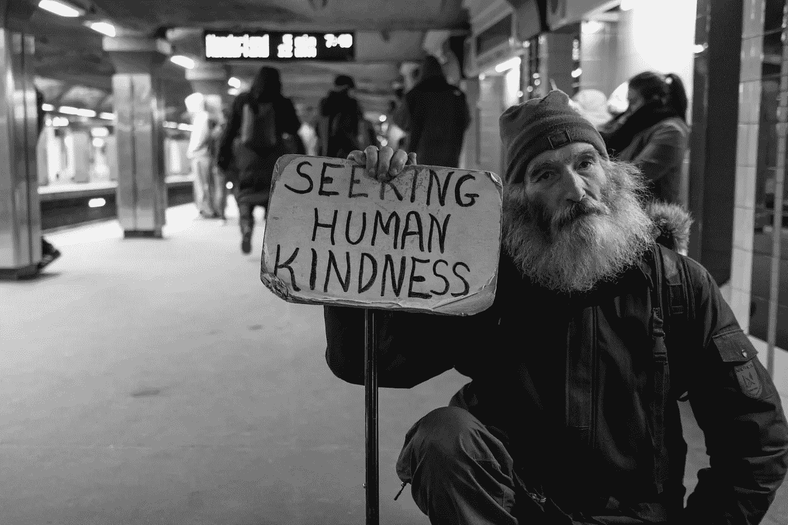
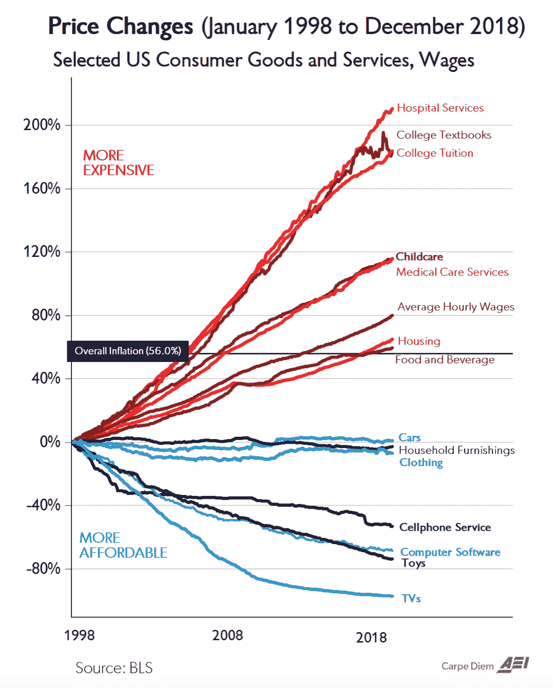
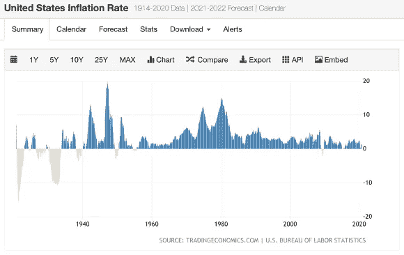

# 杀死或使我们更强大的贷款

> 原文：<https://medium.datadriveninvestor.com/loans-that-kill-or-make-us-stronger-5ec371b7799e?source=collection_archive---------9----------------------->

## 对贷款的恐惧的反思，以及被那些欠你一两三英镑……肉的人追赶

Photo by [Huang Yingone](https://unsplash.com/@yingone?utm_source=unsplash&utm_medium=referral&utm_content=creditCopyText) on [Unsplash](https://unsplash.com/s/photos/dinosaur?utm_source=unsplash&utm_medium=referral&utm_content=creditCopyText)

# **1。** **青春恐惧的智慧……**

当我还是个孩子的时候，我深不可测的恐惧之一就是生活在一座桥下或一个带漩涡的洗衣机盒子里，乞讨猫食罐头。我不知道那种恐惧从何而来。我生长在一个典型的中产阶级，第一代移民，受过高等教育的家庭，在我的记忆中没有任何贫困的迹象。我记得在我父亲获得核工程博士学位时，我们开始租房子住，十年后，我们在郊区拥有了一套三居室的小房子。我回忆起小时候坐在家里的车里旅行，想象每一个地下通道都是我的家。我想，我将如何收到我的邮件(孩子们担心如此重要的事情)。这些恐惧(我认为)演变成了我成年后对贷款的态度。

最终，我上了大学，然后去了研究生院，成为了一名新的工程师。这是一个可怕的想法——我不知道拿螺丝刀或卡钳的哪一端，但我是一名专业工程师。我开始在中西部的一家医疗器械公司工作。所以，下次当你躺在轮床上准备接受人工髋关节、膝关节或大脑植入手术时，想想这些吧——那些刚毕业的大学生，他们辛辛苦苦地研究这些关键设备的设计，不知道路在何方。

但是，与此同时，随着我拼命工作，以疯狂的速度学习新东西，那些无家可归的噩梦逐渐消失了。相反，他们以一种明智而有用的方式留下了伤疤。

Photo by [Matt Collamer](https://unsplash.com/@breakyourboundaries4?utm_source=unsplash&utm_medium=referral&utm_content=creditCopyText) on [Unsplash](https://unsplash.com/s/photos/homeless-person?utm_source=unsplash&utm_medium=referral&utm_content=creditCopyText)

取而代之的是对贷款和对他人任何形式义务的恐惧。我希望我的命运掌握在自己手中，而不是别人手中。

我一直认为贷款很简单:

*   贷款人是长着大牙齿的掠夺者——如果要贷款的话，要谨慎使用
*   好的贷款投资于你的未来(现在就支付学费、专业证书和能提升你未来职业或收入的东西)
*   不良贷款为你过去的购买买单(现在为你多年前的购买决定买单，比如汽车或房子)

我仍然相信投资你的未来是对贷款的明智使用。但是，为消费产品、汽车、房子或度假而借款就没那么多了。你会看到我是如何在这个相当困难的贷款二分法中导航的。

# **2。** **第一笔贷款……**

我爸爸是个超级聪明的人，但不是个好人。我经常发现，聪明和随和是截然相反的特质。

这些问题是我父母之间的问题，但很明显，这种冲突作为附带损害影响了我们这些孩子。离婚后，我知道我们这些孩子中没有人能指望在大学贷款上得到任何帮助。母亲独自抚养了三个孩子，尽管她拥有音乐硕士学位，却在西尔斯百货商店的货架上拿着最低工资。她是一个了不起的女人和妈妈，我今天所拥有的一切都来自于她。

我足够聪明去上大学，而且是最好的私立大学之一，但是我不够聪明去获得足够的助学金和奖学金来支付账单。我大学的大部分时间都是靠贷款资助的，其次是勤工俭学的工资，然后是我设法争取到的少量佩尔助学金和奖学金。

Price changes of goods and services, 1998–2018\. The author is using this website image under the fair use doctrine.

当我手里攥着两个工程学士和一个硕士学位毕业时，我也有了一份工作，但没有车。我在东海岸。我的第一份工作在半个大陆之外。我需要一辆车。那是我的第二笔贷款。看到上图中大学教育的膨胀让我意识到我有多幸运，我在那时接受了教育。

所以我在这里，一个新的专业工程师，在中西部的玉米地开始了他的第一份工作。公司支付了我所有的搬家费用，让我在一家酒店住了几周，并帮我找到了一套一居室的小公寓。

我有房租、水电、食物、衣服和汽车——这就是我的全部开销。几个月来我一直带着手提箱生活。我把整个大学期间用作书架的牛奶箱作为我的多功能家具。为什么我不把这些新获得的专业薪水和签约奖金挥霍在家具、热水浴缸、雪地摩托和摩托车上呢？

因为我有贷款。学校贷款和汽车贷款。这些困扰着我。它们像无家可归的残余噩梦一样困扰着我，不安地搅动着。

我想弄清楚这些事情是如何影响我和我的未来的。

我注意到的第一件事是，我的学校贷款十年的年利率在 4%到 6%之间。我的汽车贷款五年来年息超过 12%。

U.S. annual inflation rate from 1914–2020\. The author is using this website image under the fair use doctrine.

我注意到通货膨胀率等于或高于我的学校贷款利率。我的汽车贷款是通货膨胀率的两倍。我认为汽车贷款是非常昂贵的钱(相对于通货膨胀的高利率)，而学校贷款是廉价的钱(低利率)。

我的第一个决定是尽快还清汽车贷款，因为提前还款没有罚款，并在整整十年内继续持有学校贷款。我两年还清了汽车贷款，十年还清了学校贷款。

# **3。** **建筑年代……**

我的第一份工作很棒。我爱这里的人们。我喜欢这份工作。我喜欢旅行。我特别喜欢负责制造帮助人们的重要医疗设备。而且，我从与外科医生、销售人员、学术研究人员，甚至是我的工程师同事一起工作中得到极大的乐趣。

但这不是我该做的。我能从骨子里感觉到。工程学对我来说还可以。但不是一个好的或完美的适合。尽管我出生在中西部，但那里也没有家的感觉。

五年后，我离开并搬回东部，在不同的公司做类似的工作。不是一个好的举动。我的新老板是一个混蛋，他是我遇到的许多聪明的混蛋中的第一个，这些聪明的混蛋处于他们没有准备好的权力位置。但是感谢我妈妈的勇气，尽管她自己没有什么市场技能，但她选择并离开了一个聪明但爱虐待人的伴侣……我意识到，我不再受困于工作狂，就像我妈妈受困于居家混蛋一样。我给每位老板不超过一两年的时间来观察他们是否会有所改进。

Photo by [Icons8 Team](https://unsplash.com/@icons8?utm_source=unsplash&utm_medium=referral&utm_content=creditCopyText) on [Unsplash](https://unsplash.com/s/photos/yelling-boss?utm_source=unsplash&utm_medium=referral&utm_content=creditCopyText)

在那一两年里，我努力工作，获得了尽可能多的项目经验，也利用了每一个受教育的机会。我获得了专业认证，我参加了本科和研究生水平的大学课程，所有费用都由公司支付。如果老板继续是个混蛋，我就离开。

我总是很高兴听到我离开的老板们对他们有相当多的业内传言——就像乌云一样——人们会说闲话。不开心的人话多。我会听到工程师和技术人员证实我对糟糕老板的糟糕印象。互联网使得这种现象更加普遍。

快速换工作的好处是巨大的:从旧工作中获得的所有经验和额外的教育转化为新工作中快速提升的薪水。我发现你工作过的旧公司不会像新公司那样重视你(尤其是和一个混蛋做老板)。因此，作为一名年轻的专业人士，我认识到每隔几年搬家的好处远远多于坏处。我也知道了我从来不需要一个狗屎老板的推荐。

因此，我的收入在那些年里呈指数增长，远远超过了通货膨胀率(这是大多数年度加薪的比率)。

在这几年的建设中，我专注于几件事:

*   控制我的开销，确保它们不会随着我的薪水一起增加
*   根据我的计划偿还我的贷款
*   尽可能多地储蓄，明智地投资
*   并且不接受任何新的贷款(信用卡或任何其他形式的金融债务)。注意:我有信用卡来“建立我的信用评分”——但是我每个月都会虔诚地还清全部金额)

# **4。** **为过渡做准备……**

我娶了一个很棒的女人，生了两个很棒的孩子。事情是这样的。我的妻子，就在我遇见她之前，正在从中学教师职业向科技职业进行巨大的转变。我们结婚时，她刚刚升职，现在是一名工程师。她很聪明——从低薪职业转向高薪职业。我们家有两个工程师。

但是我去了相反的方向。我曾觉得工程是令人兴奋和有趣的——但不是我生来要做的。我想做科学。所以我开始上夜校，大部分费用由公司支付。最终，我参加了研究生水平的课程，看看我是否能应付学术严谨的水平。然后我参加了研究生入学考试(GRE ),当我的成绩、考试分数和推荐信都准备好了——我被一个研究生项目录取了——我放弃了我的工程生涯。我当时 46 岁。

我很幸运，我参加的博士项目支付了所有费用，提供了医疗保险，还支付了一笔津贴(虽然微薄，但年轻人可以靠它生活)。因此，虽然我失去了作为一名工程师/经理的所有收入，但也没有与我在风车上倾斜和作为一名老教师回到学校相关的费用。

我认为自己在很多方面都很幸运。首先，我娶了一位聪明、专业的女性，尽管她不情愿，但还是同意我放弃一份收入丰厚的工作和职业，去做一名收入微薄的学生，去做一名收入微薄的科学家。第二，被一个好的研究生项目录取，这个项目涵盖了所有的费用，所以我没有任何损失(除了失去的工程工作的收入)。第三，储蓄和投资做得很好，它们弥补了我投资组合收益中的很大一部分收入损失(尽管不是现金流)。第四，妻子的工程收入足以支付家庭的运营费用——所以我们不需要动用储蓄——只要她还在工作。

所以今天，我已经过渡到了学术界。我没有完成博士课程，但由于我在课程的第六年染上了莱姆病，所以暂停了课程。尽管如此，我仍在同一所研究生院担任科研人员，与伟大的人一起从事基础生物学研究——最终我感觉自己在做我应该做的事情。这是我工程生涯中所缺少的完美契合。

# **5。** **最后一笔贷款……**

我非常幸运的另一个原因是，在我工程生涯的头几十年里，我从未被解雇过。我按照自己的条件和时间表离开每家公司——我经常确保在工作间隙抽出四到六周的时间去旅行。我和妈妈一起去了日本，另一次是独自一人徒步穿越苏格兰和威尔士一个月，还有一次是在法国南部和科西嘉度过了我们拖延已久的长达一个月的蜜月……但在那 20 年里，除此之外，我都是全职工作。这包括 2001 年的网络泡沫和 2008 年的房地产泡沫。

关键是我从来不需要动用存款来支付数月或数年的失业。

房地产泡沫破裂几年后，我离开工程界进入学术界，当时我的投资组合还没有恢复到泡沫前的高点。然而，作为一名收入微薄的学者和学生，我为自己的新世界建立了投资组合，并购买了比平时更保守的股票。

在我的工程生涯中，我积极投资，利用股票共同基金(主要是 S&P500 指数基金)建立了坚实的基础，然后买了一些积极的个股。生活的改变者是像网飞、亚马逊、苹果这样的公司(还有最近我在这里提到的特斯拉)。

 [## 特斯拉的平流层发射继续进行

### 回顾历史数据，展望 2020 年第 3 季度收益电话会议

medium.com](https://medium.com/datadriveninvestor/teslas-stratospheric-launch-continues-b0d242497cf2) 

另一个重要的财务问题是，我拒绝买房。我在 46 岁时离开了工程界，那时我还没有房子。这是一个与妻子和一个非常好的朋友(他是我们房地产买家的代理人)发生激烈争论的领域。

但最后，几年前，我让步了。我们在一个好镇上买了一栋建于 20 世纪 90 年代的房子，那里有很好的学校供孩子们上学，离我自己的学校和妻子的工作单位都很近。这显然是我一生中最大的一笔贷款，也是让我相当担心的一笔。我们对家乡和城镇都很满意。我也不后悔推迟买房。

但是房屋贷款有个问题。像我以前的学校贷款一样，房屋贷款的利率大约等于通货膨胀率(~3%)。此外，房屋贷款的利率低于我投资的回报。通常，像 S&P500 这样的多元化美国股票指数基金可能会在几十年内平均每年增长 7-8%。虽然我有投资来支付更多的房子，但我决定将投资与房屋贷款进行套利，在房屋贷款的 30 年里，我应该通过保持投资不变来获得 4-5%的净值，而不是偿还贷款。

因此，我对住房贷款的做法与我对学校贷款的做法一模一样——延长贷款期限，因为相对于通胀和我的投资回报，利率较低。

因此，尽管在我简单的二分法模型中，房子不符合“好贷款”的条件，但它也不是“坏贷款”。就像生活中的许多事情一样，它是好与坏的结合。黑白分类在现实世界中不起作用。

# **6。** **后期脚本……**

几年前，妻子失业了。她获得了一笔相当于一年大部分时间的丰厚遣散费。但是在她的遣散费结束后，她又一年找不到工作。今年早些时候，当她终于找到一份工作时，冠状病毒来袭，她也失去了那份工作。莱姆病限制了我工作的精力，我现在只能做兼职。

这些是我们理论上考虑过但从未认真想过会发生的因素。

尽管如此，几十年来积极的储蓄和投资，以及最大限度地减少开支，已经回报了我们，也很好地覆盖了我们。尽管这些储蓄原本是为了以后上大学(孩子们还有几年才上大学)和退休后用的，但它在维持我们今天的日常生活方面找到了很好的用途。我们知道我们是幸运的。

但是，把原本用于送孩子上大学的投资——以及我们的黄金岁月——用于支付今天的家庭运营开支，这种感觉从来都不好。住在高速公路立交桥下的老噩梦又开始了。

但是，我们还是很幸运。妻子最近找到了一份在家工作的全职技术工作。我们不知道这项工作会持续多久。

尽管有这些问题，尽管有疫情，尽管有这位卑鄙的总统，我的祝福还是很多的，我可以说我优先考虑的是家庭、健康和幸福，它们远远高于职业、收入和财务问题。也就是说，经济问题是许多家庭冲突的基础，并降低了幸福感。

不明智地使用贷款是导致财务困境的主要常见途径之一。

如果你是幸运的，请在疫情期间帮助那些没有你幸运的人。无家可归者的人数增长惊人。至少，请向慈善机构捐款，如人类家园或松树街酒店(我们最喜欢的两个慈善机构)或许多其他帮助无家可归者的慈善机构。谁知道呢，那里可能有一个你可能认识的人。；)

感谢您的阅读，并请分享。

注意:我也在这里写了网飞:

 [## 网飞文化战争

### 好好看看一场有影响力但被误解的文化大革命

medium.com](https://medium.com/illumination-curated/reed-hastings-and-the-netflix-culture-wars-cfe8777e1a6a)