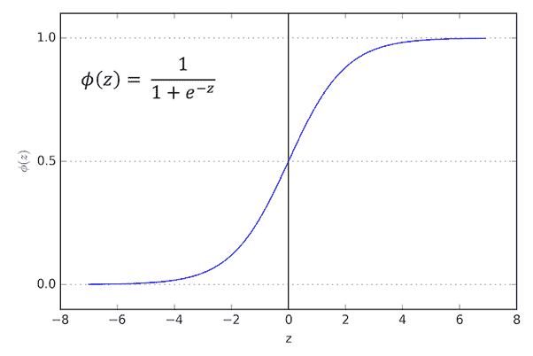
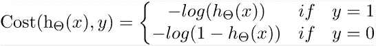
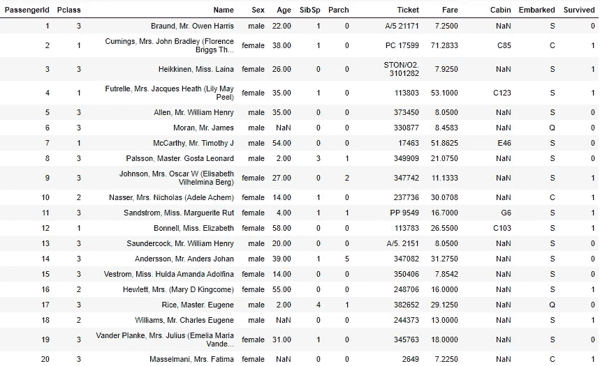
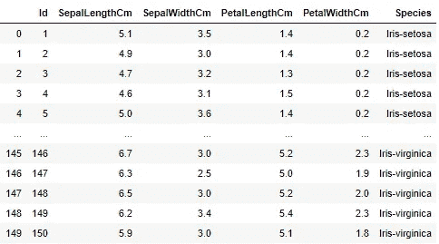
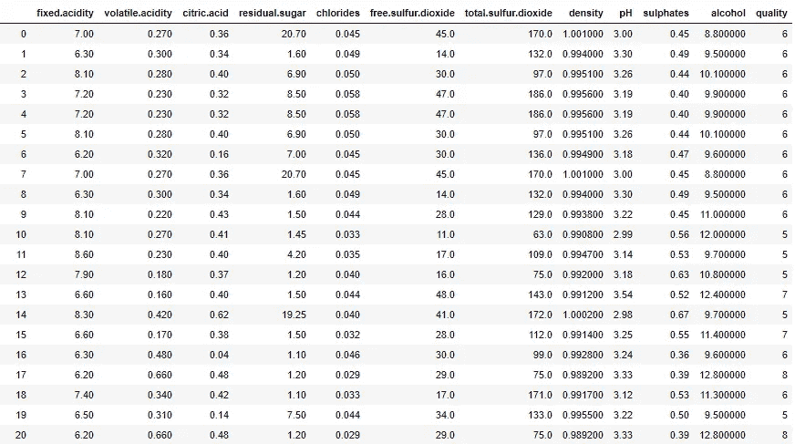

# 逻辑回归—简单、多项式和序数

> 原文：<https://medium.datadriveninvestor.com/logistic-regression-simple-multinomial-and-ordinal-b2bc886bb974?source=collection_archive---------0----------------------->

只要目标变量是分类的，就使用逻辑回归。逻辑回归有助于将数据分为不同的类别。

例如，如果我们想知道图片是猫还是狗。在这种情况下，图像是两种动物中的任何一种，因此我们的输出可以是 0(对于狗)或 1(对于猫)。

逻辑回归类似于二进制分类问题，其中输出是二进制的 0 或 1。如果我们想过滤电子邮件，不管它们是不是垃圾邮件。


Linear Regression v/s Logistic Regression

由于这些问题是二元分类，并且值必须介于 0 和 1 之间，因此我们不能使用线性回归。线性回归是无限的，因此它可以超过 0 和 1 的范围。sigmoid 函数是逻辑回归的基础。因为 sigmoid 函数的值位于 0 和 1 之间。因此，逻辑回归可用于预测二元分类问题。



Sigmoid function

## 逻辑回归的类型

有三种不同类型的逻辑回归算法，它们是:

1.  简单的逻辑回归:分类只分为两类。例如，如果一名乘客死亡或幸存。
2.  多项逻辑回归:分类可以分为三个或更多的类别，但没有顺序。例如，鸢尾属植物可以分为三种，“Setosa”，“Versicolor”或“Virginica”。
3.  有序逻辑回归:分类可以按照顺序分成三个或三个以上的类别。例如，葡萄酒的质量可以在 1-10 之间评级。

[](https://www.datadriveninvestor.com/2020/02/19/cognitive-computing-a-skill-set-widely-considered-to-be-the-most-vital-manifestation-of-artificial-intelligence/) [## 认知计算——一套被广泛认为是……

### 作为它的用户，我们已经习惯了科技。这些天几乎没有什么是司空见惯的…

www.datadriveninvestor.com](https://www.datadriveninvestor.com/2020/02/19/cognitive-computing-a-skill-set-widely-considered-to-be-the-most-vital-manifestation-of-artificial-intelligence/) 

现在，我们将尝试了解更多关于逻辑回归的知识，并使用三个不同的数据集构建这三个模型。数据集分别是泰坦尼克号数据集、虹膜数据集和白葡萄酒质量数据集。

## 价值函数



Cost function

> ***简单逻辑回归***



Titanic dataset

我们将参考 titanic 数据集来理解简单的逻辑回归。泰坦尼克号数据集包含了标志性的泰坦尼克号上乘客的信息。该数据集包含姓名、性别、年龄、旅行舱位等级等信息。使用数据集中可用的信息，我们将尝试预测谁幸存，谁死亡。

我们知道妇女和儿童有更高的生存概率，因为他们被优先考虑，因此，性别可能是一个至关重要的特征。年轻人将比老年人优先，所以年龄是一个对我们的预测有用的特征。另一方面，我们有一些不必要的特征，如客舱、机票，它们根本没有用，所以我们将从数据集中移除这些特征。

**实现**

```
#importing the libraries
import pandas as pd
from sklearn.linear_model import LogisticRegression#loading the dataset
dataset=pd.read_csv("F:\\datasets\\titanic.csv")#drop columns that are not necessary for predictions
columns_to_drop = ['Name','Cabin','Embarked','Ticket']
dataset = dataset.drop(columns_to_drop, axis=1)#assigning input and target values
X = dataset.iloc[:, :-1]
Y = dataset.iloc[:, -1]#creating the logistic regression model
regressor = LogisticRegression()
regressor.fit(X, Y)#evaluating the score of the model
score = model.score(X, Y)
print(score)
```

> ***多项逻辑回归***



Iris dataset

多项式逻辑回归的运行原理与简单逻辑回归相似。它们之间的唯一区别是逻辑回归将数据分为两类，而多项式将数据分为三类或更多类。如果我们想将鸢尾属植物分类到它的种类中，那么我们可以使用多项逻辑回归，因为鸢尾属植物可以分为三个种类，并且没有特定的分类顺序。我们将使用 iris 数据集实现该模型。

**实施**

```
#importing the libraries
import pandas as pd
from sklearn.linear_model import LogisticRegression
from sklearn.preprocessing import StandardScaler#loading the dataset
dataset=pd.read_csv("F:\\datasets\\iris.csv")#applying feature scaling on the input data
scaler = StandardScaler()
X = scaler.fit_transform(X)#creating the multinomial logistic regression model
regressor = LogisticRegression(random_state=0, multi_class='multinomial', solver='newton-cg')
regressor.fit(X, Y)#evaluating the score of the model
score = model.score(X, Y)
print(score)
```

> **有序逻辑回归**



White wine quality dataset

当数据被分成三个或更多的类别并且这些类别是有序的时，有序逻辑回归就发挥作用了。我们使用“白葡萄酒质量数据集”实施有序逻辑回归，我们应该在 1-10 的范围内对质量进行评级。因为目标值是有序的。

```
#importing the libraries
import pandas as pd
from mord import LogisticAT
from sklearn.preprocessing import StandardScaler#loading the dataset
dataset=pd.read_csv("F:\\datasets\\white_winequality.csv")#applying feature scaling on the input data
scaler = StandardScaler()
X = scaler.fit_transform(X)#creating the multinomial logistic regression model
regressor = LogisticAT(*alpha=1.0*, *verbose=0*)
regressor.fit(X, Y)#evaluating the score of the model
score = model.score(X, Y)
print(score)
```

您也可以尝试用其他数据集实现算法，并检查数据与模型的拟合程度。