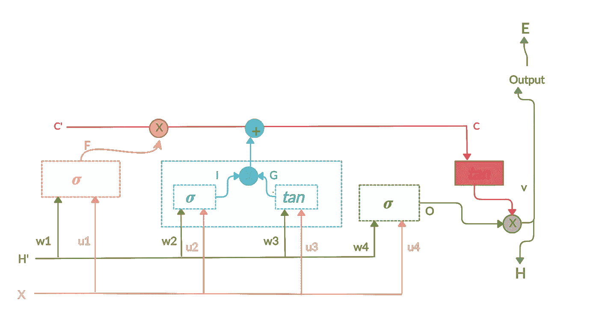

# 长短期记忆网络数学—第一部分

> 原文：<https://medium.datadriveninvestor.com/long-short-term-memory-maths-part-1-d99b3c3b09d0?source=collection_archive---------2----------------------->

这是我学习神经网络背后的基础数学系列的第四篇文章。你可以在这里查看我以前的文章:

1.  [神经网络数学](https://medium.com/datadriveninvestor/neural-network-maths-in-5-minutes-f385eeddf783)
2.  [卷积神经网络数学](https://medium.com/datadriveninvestor/convolution-neural-network-maths-intuition-6b047cb48e90)
3.  [递归神经网络数学](https://medium.com/datadriveninvestor/recurrent-neural-network-maths-69214e4d69e1)

来到 LSTM，这是最令人生畏的。不相信我！看一看就知道了..

第一次看的时候我的心就漏跳了一拍(当然是以不好的方式:P)。但是，事实证明这并不难理解。像往常一样，我会试着用简单的语言来解释它，并且只关注它背后的直觉。

# 更长的序列！

因此，从上一篇[文章](https://medium.com/datadriveninvestor/recurrent-neural-network-maths-69214e4d69e1)中，我们发展出一种直觉，即每当我们有一个序列时，我们就去寻找 RNNs。LSTM 的工作有点不同，因为它有一个在所有输入中维持的全局状态。所有先前输入的上下文基本上都通过全局状态转移到将来的输入。并且由于这种性质，它不会遭受消失和爆炸梯度问题。

 [## 人工智能、深度学习和医疗实践|数据驱动的投资者

### 人工智能和深度神经学习的效用看起来可能是合法和有前途的，特别是…

www.datadriveninvestor.com](https://www.datadriveninvestor.com/2020/06/24/disclosure-and-resolution-program-wont-prevent-physicians-from-practicing-defensive-medicine/) 

# LSTM 解码

从表面上看，这真的令人望而生畏，但实际上不是。但实际上只是多个简单片段的顶点。让我们分别讨论每一部分。这是一个更简单的版本，其中 X 和 Y 显然是我们的输入和输出。

***单元格状态:*** 这一行基本上是包含输入的上下文的记忆层。

***隐藏状态:*** 这一层类似于我们在 RNN 将以前输入的输出反馈给新输入。

***忘门:*** 决定是否因为新的 X，要我们 ***清除以前记忆*** 的网络。比如——“*拉姆是个男孩。拉玛是个女孩*”。当 *Rama* 将作为输入输入时，应该忘记 *Ram* 的先前上下文。

***输入门:*** 决定是否因为新的 X，要 ***更新网络的先前记忆* y** 。比如——“*拉姆是个男孩。拉玛是个女孩*”。当 *Rama* 将作为输入被提供时，人的先前上下文应由 *Rama* 更新。

***Output Gat* e** :每个输入都应根据当前输入、上一层输出和持久存储单元给出输出。这个门也有同样的责任。

# 正向传播

通常，我倾向于忽略激活功能。但是，这里我将把它们合并在一起，因为不理解它们，就无法帮助我们理解整个网络。

真的很抱歉上面选择的颜色，但如果没有奇怪的颜色编码，真的很难理解流程。

*X —输入
H’—前一层的输出
输出—给定 X 的网络输出
H —反馈给下一层的输出
E—Y(预测)和输出(实际)之间的均方误差*

## 忘记大门

黄色虚线框是我们的遗忘框。

*   如您所见，这只是将两个输入加权相加。我们还乘以 sigma 作为激活函数，以减少(0，1)之间的输出集。
*   另外，你可以看到，这与我们的存储单元(C’)相乘。原因是这是一个遗忘之门。如果输入值结果是 0，当与存储单元相乘时，我们将能够成功地删除这些值。

## 输入门

这是我们的浅蓝色虚线框。

*   如你所见，它是一个 a 2 运算函数。和谭都是先计算后再相乘的。为什么会这样呢？
*   所以，答案在它的输出范围内。适马函数的输出范围在(0，1)之间，即总是正的。因此，由于这个门负责设置内存状态中的值，所有的值显然都会被设置。这就是它乘以 tan 的原因，tan 的输出范围为(-1，1)。所以，现在只有那些值会被设置到内存中，内存中的值趋向于 1，而趋向于-1 的值也可以删除它们。
*   JFYI，G 也称为候选状态。因为，这是一个临时状态，它将在某个时候反映在主存储器中。

## 存储状态

这是用 c 标记的红色线。

这基本上将来自遗忘门和输入门的值相加，并计算最终的存储值。

## 输出状态

这是绿色虚线框。到目前为止，我们只是更新存储单元。现在，这一层基本上负责通过将新输入和最终存储单元相乘来找到最终输出。同样，C 乘以 tan，因此其输出范围可以在(-1，1)之间，并且在必要时更容易移除值。

这些总结了我们所有的向前传播的公式。

看起来这对于一篇文章来说已经是太多的信息了。将在下一篇文章中讨论反向传播。

**进入专家视角—** [**订阅 DDI 英特尔**](https://datadriveninvestor.com/ddi-intel)