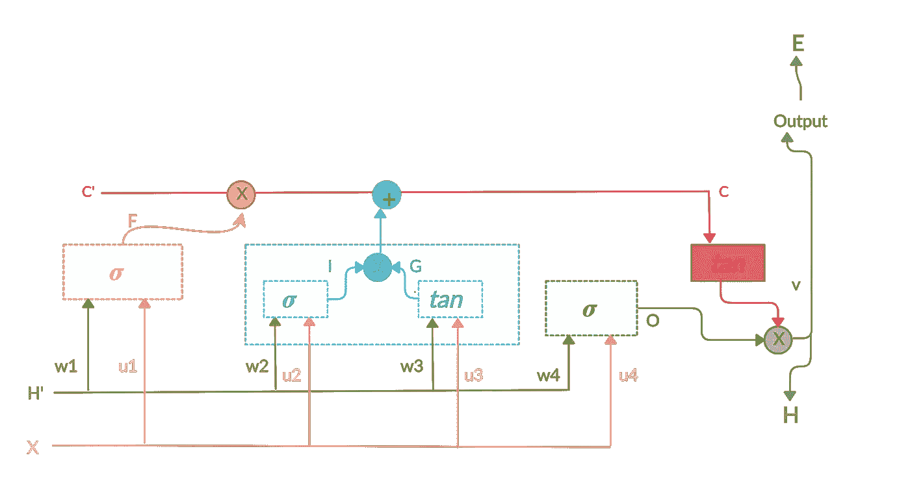
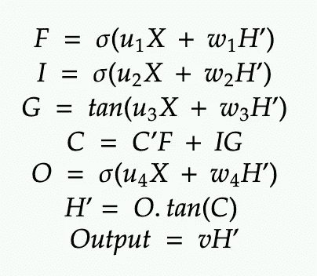
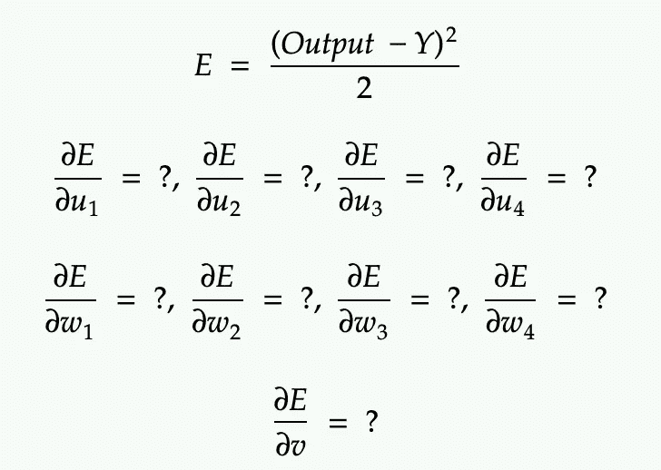
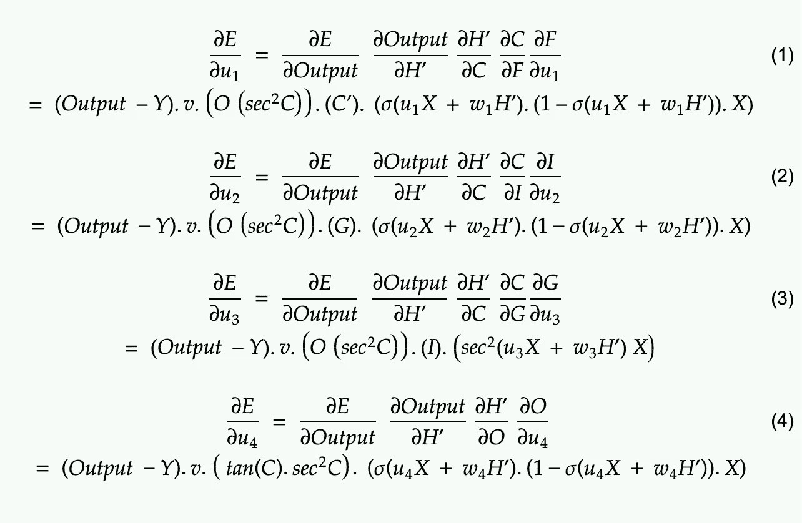
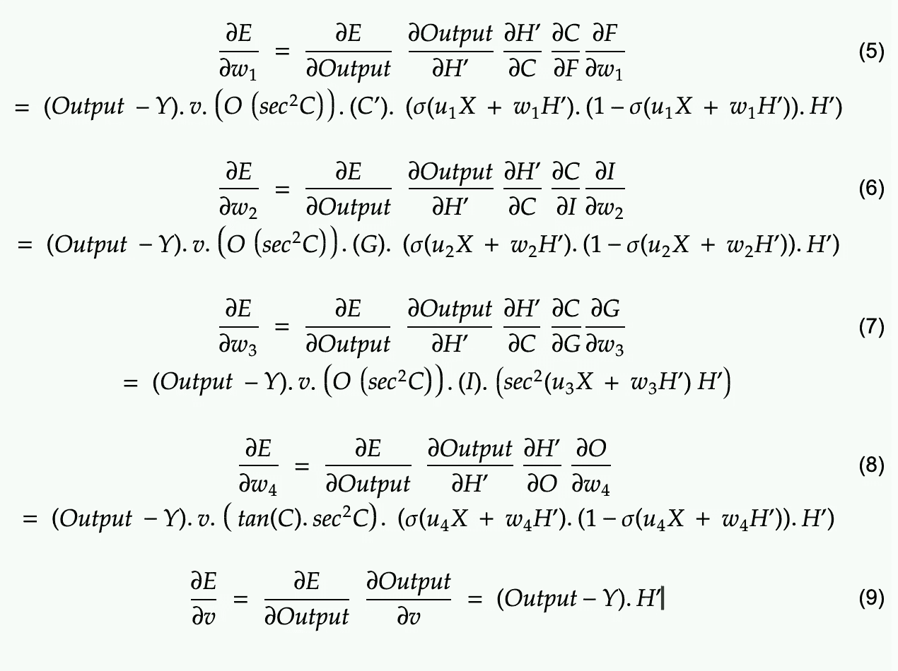
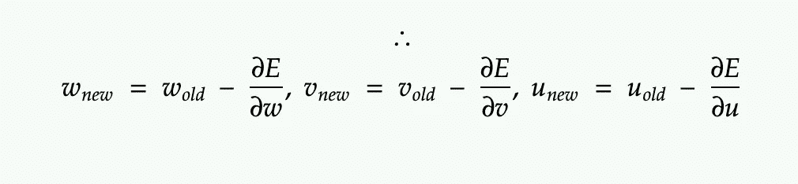

# 长短期记忆数学—第二部分

> 原文：<https://medium.datadriveninvestor.com/long-short-term-memory-maths-part-2-e938b1b42f74?source=collection_archive---------7----------------------->

这是我学习神经网络背后的基础数学系列的第五篇文章。你可以在这里查看我以前的文章:

1.  [神经网络数学](https://medium.com/datadriveninvestor/neural-network-maths-in-5-minutes-f385eeddf783)
2.  [卷积神经网络数学](https://medium.com/datadriveninvestor/convolution-neural-network-maths-intuition-6b047cb48e90)
3.  [递归神经网络数学](https://medium.com/datadriveninvestor/recurrent-neural-network-maths-69214e4d69e1)
4.  [长短期记忆数学—第一部分](https://medium.com/datadriveninvestor/long-short-term-memory-maths-part-1-d99b3c3b09d0)

在上一篇文章中，我们介绍了 LSTM 的基础知识，并讨论了它的前向传播。

# 修订本

这是我们为了理解 LSTM 而画的图表。在这一点上，如果你还没有浏览我之前的[文章](https://medium.com/datadriveninvestor/long-short-term-memory-maths-part-1-d99b3c3b09d0)，我强烈建议你在继续下一步之前查看一下。

这是我们上次提出的公式列表。

# 反向传播

因为反向传播的目标是——如何调整变量以减少误差。

 [## 一瞬间学会数据科学！？数据驱动的投资者

### 在我之前的职业生涯中，我是一名训练有素的古典钢琴家。还记得那些声称你可以…

www.datadriveninvestor.com](https://www.datadriveninvestor.com/2020/07/23/learn-data-science-in-a-flash/) 

此外，为了简化事情，我特意去除了等式中的偏差。此外，为了便于计算，我只考虑一个输入为基础的 LSTM。

现在，正如我们之前解释过的，通过链式法则和基本的微分学，我们应该能够区分它们。

**注意:**这些方程背后的思想只是为了得到一个链式法则的直觉，并弄清楚如何计算导数。这里可能有一些数学错误(因为，我只是一个软件工程师，而不是数学专家)。请不要直接复制它们。这些不是从任何其他站点复制粘贴的，而是手动计算的。如果有什么问题，欢迎在下面评论。

因此这些就是最终重量。

# 消失/爆炸渐变问题

如果你看到上面的反向传播方程，你会发现它们都是多重导数的乘积。所以，消失和爆炸梯度的问题也会发生，对吗？

所以，我为此做了很多研究，因为方程式告诉了我一些别的东西，而整个互联网也在告诉我一些别的东西。但是，显然数学赢了。

是的，没错。这是一个流行的神话，说因为 LSTM 的附加性质，这样的问题不会发生。但实际上这是可能发生的。只是因为 LSTM 的记忆单元和附加属性，这些梯度问题更容易管理。[来源](https://weberna.github.io/blog/2017/11/15/LSTM-Vanishing-Gradients.html)

这总结了我对不同神经网络的一系列数学。谢谢你们坚持阅读我所有的博客。请随意评论或添加任何对你不合适的东西的反馈。毕竟，我们都在学习:)

**访问专家视图—** [**订阅 DDI 英特尔**](https://datadriveninvestor.com/ddi-intel)