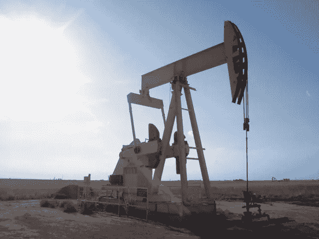

# 做好准备迎接原油价格再次下跌 33%

> 原文：<https://medium.datadriveninvestor.com/look-out-below-oil-prices-are-set-to-fall-further-dc4c59d2c8fd?source=collection_archive---------27----------------------->

By Flcelloguy, CC BY-SA 3.0, [https://commons.wikimedia.org/w/index.php?curid=2351321](https://commons.wikimedia.org/w/index.php?curid=2351321)

看下面。油价肯定会进一步下跌

这说明了一些问题，因为在周一的交易中，它们下跌了约 20%，从一年前的 57 美元跌至最近的 34 美元左右。

但分析师表示，情况可能会变得更糟。

一桶轻质低硫原油可能很快跌至每桶 23 美元，甚至低于 2016 年油价触及 26 美元的水平。

总部位于纽约的金融公司 Macro Risk Advisors 在最近的一份报告中指出，“有达到 23 美元的空间”。它认为当前的价格下跌是从金融危机开始的油价长期下跌的一部分。

促使周一采取行动的是全球第二大产油国沙特阿拉伯采取的行动。

# 沙特能源价格被砍掉

上周末，沙特开始下调向客户出售原油的价格。这些降价措施看起来将与沙特持续大幅增产紧密相连。

 [## 算法交易的机器学习|数据驱动的投资者

### 当你的一个朋友在脸书上传你的新海滩照，平台建议给你的脸加上标签，这是…

www.datadriveninvestor.com](https://www.datadriveninvestor.com/2019/01/30/machine-learning-for-stock-market-investing/) 

根据石油输出国组织(石油输出国组织)的最新数据，沙特的日产量为 970 万桶，但 4 月份的产量将超过 1000 万桶，随后还会进一步增加。

# 沙特的双胞胎兄弟瞄准了油田

周末的价格变动似乎源于沙特领导人的两个目标。首先，根据总部位于英国的外汇经纪商 OANDA 最近的一份报告，沙特阿拉伯以收入下降为代价获得更多的客户市场份额，该报告对这一战略做出了如下解释:

*   “沙特阿拉伯周末的定价举动表明，他们正在追求市场份额，所有迹象都表明，他们将在 4 月份迅速增产至每天 1000 万桶以上，短期内可能再增产 200 万桶。”

换句话说，沙特的产量可能很快就会达到每天 1，200 万桶，比目前水平至少高出 20%。

# 沙特眼中的美国页岩

第二个目标可能是试图伤害美国页岩油行业，该行业在过去十年里将美国从一个巨大的石油进口国变成了出口国。

沙特伤害美国页岩生产商的努力并不新鲜。但到目前为止，这些都没有成功，至少到目前为止。

“2014 年沙特领导的驱逐美国生产商的尝试被证明是徒劳的，但也许 2020 年的尝试会更成功，”货币经纪人 Bannockburn 最近的一份报告称。

据 Bannockburn 称，在德克萨斯州二叠纪盆地油田工作的几家美国运营商最近宣布裁员，钻机数量比去年同期下降了近 20%。

# 往下很远

对美国页岩生产商来说，坏消息是，即使油价跌至个位数，沙特也能赚钱。

“阿美石油公司的成本基础是世界上最低的，”牛眼财经简讯的创始人亚当·约翰逊说。“他们的一些油井利润在 5 美元或 6 美元，因为石油比其他任何地方都更接近地表。”

浅井钻探成本较低。

相比之下，美国页岩生产商的油井很深，成本差异很大。约翰逊说，即使是超高效的美国生产商，如在二叠纪盆地工作的生产商，每桶石油的开采成本也只有 20 多美元。

换句话说，在情况好转之前，油田的情况可能会变得更糟。

这是 2020 年 3 月 9 日首次在 Forbes.com 上发表的一篇报道的编辑版本。