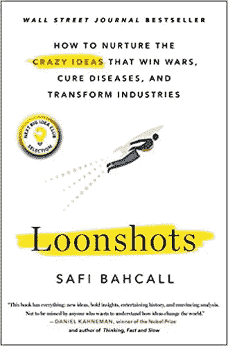
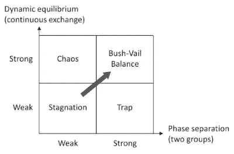

# 投篮和创新

> 原文：<https://medium.datadriveninvestor.com/loonshots-and-innovation-48636e95d4b?source=collection_archive---------17----------------------->

建立创新组织背后的关键理念。

Safi Bachall 的《Loonshots:如何培育赢得战争、治愈疾病和改变行业的疯狂想法》讨论了组织培育创新以解决重大问题的方法。这本书的关键前提是组织结构比文化更重要:

> 要求员工更具创新性而不首先投资于组织健康的领导者，就像要求自己的身体跑马拉松的休闲慢跑者一样。

这本书区分了 loonshots 和特许经营:**特许经营**是一个组织的支柱——在一个公司里，它是一棵摇钱树，如默克公司的他汀类药物或漫威的电影续集，年复一年地赚钱； **loonshots** 是那些能够带来超额回报、改变市场或者被分析师事后称为“颠覆”的新创新。Loonshots 被进一步描述为**产品 loonshots** (iPhone、特斯拉)和**策略 loonshots** (沃尔玛或苹果在 iTunes 中销售音乐单曲)。

我们通常会想到一个小的创新型创业公司在孤注一掷，而大公司通过特许经营在成熟的行业取得渐进的进步。

# 两条规则:分离和支持

Loonshots 和专营权需要平衡，因为它们相互加强——作者描述了这样做的两个关键规则:阶段分离和动态平衡。

*   **相位分离**:分离 loonshot 和特许经营组
*   **动态平衡**:两组之间的无缝交换

通过阶段分离和动态平衡的强大组织适应性，您可以实现健康增长所需的正确平衡。布什-维尔指的是万尼瓦尔·布什和西奥多·维尔在二战期间共同努力建立令人难以置信的创新和技术应用。

最初，初创公司需要高度的创新，并愿意尝试和失败。成功的创业公司发展到下一个阶段，成为一个更大的组织，并需要不同的技能来开始交付他们建立的特许经营权。这些技能更具操作性，需要更高的精确度、效率和有效性，以及传统的管理。《情感》这本书把为 loonshots 工作的人描述为艺术家，把为特许经营权工作的人描述为士兵——两者同样有价值和能力，但拥有不同的技能组合和不同的任务目标。

布什和维尔找到了提供分离的正确方法，这样 loonshots 就不会被士兵提前击落，艺术家也不会冒不必要的风险或妥协重要的特许经营努力。

# 系统思维

有几个重要的观察结果是关于培养更广泛的思维和创新所需的学习心态。

新的计划和努力将会有试验，它们将会有错误。一个组织如何应对这些错误，更重要的是，我们建立什么样的环境来应对这些“错误”，这是一个适合创新的组织和一个本质上不支持或鼓励创新的组织之间的关键区别。

这本书讨论了**假失败**的概念，并通常采用健康的批判性思维来分析决策:

> 但是假失败对于远射来说是常见的。这种类型的死亡风险永远无法完全消除——负面结果不会伴随着一个霓虹灯招牌，上面写着“你的想法是有缺陷的”或“你的测试是有缺陷的”

> 例如，一个失败的结果并不一定意味着其背后的决策或决策过程是糟糕的。**有好的决定也有坏的结果**。在相反的情况下，分别评估决策和结果同样重要:**糟糕的决策可能偶尔会带来好的结果**。

作者继续区分结果和系统思维模式:

*   *具有* ***结果心态*** *的团队，级别 1，分析项目或战略失败的原因。*
*   *团队以一种* ***的系统心态*** *，二级，探查失败背后的决策过程。*

这里建议的主要思想是对你的失败和成功保持高度开放和好奇:*当你的想法受到攻击时，克服捍卫和驳回的冲动，而是以开放的心态调查失败。*

# 人员和人才

我特别喜欢的最后一个关键领域是如何建立您的组织系统，以鼓励必要的人(和人才)动力，从而建立一个以 loonshot 为导向的组织。许多关键的想法让我想起了丹·平克的《动力》中的“掌握-自主-目的”原则。

我发现重要的关键领域是人们需要在一个他们成长、学习和拓展的地方:

> 没有被分配的项目搞得焦头烂额的员工，在项目上花更多的时间不会有什么收获。

特别是，确保合适的人在组织中处于合适的位置—例如，确保有才能的人有机会发挥他们的特殊才能并继续成长。

此外，同行的尊重和同行的压力——软权益——往往比纯粹的财务奖励更能推动认可和“补偿”。

> 可见性和自主性的结合创造了一种强大的动力:同辈压力。来自同事的认可是一种无形或软资产的形式。每个组织都可以找到机会来提高自主性、可见性和软资产。

这篇无关的文章很好地描述了在创新生命周期的不同阶段参与建设的不同类型的人:开拓者、定居者、城镇规划者。

 [## 持续创新的结构:先驱、定居者、城镇规划者-商业灵活性

### 你如何组织一个大企业进行持续不断的创新？在这本书里，我们引用了西蒙的作品…

agilebusinessmanifesto.com](https://agilebusinessmanifesto.com/agilebusiness/a-structure-for-continuous-innovation-pioneers-settlers-town-planners/) 

# 摘要

要点总结得很好:

**分离阶段**:分离你的艺术家和士兵根据阶段定制工具观察你的弱点:培养两种类型的 loonshots(产品和战略)

**创造动态平衡**:平等地爱你的艺术家和士兵管理转让，而不是技术:做一个园丁，而不是摩西任命和培训项目冠军，以弥合鸿沟

**传播系统思维:**不断询问组织为什么做出这样的选择不断询问如何改进决策过程识别具有结果思维的团队，并帮助他们采用系统思维

**提高神奇的数字**:降低政治回报使用软资产:确定并应用非财务奖励增加项目-技能匹配度投资于将扫描不匹配的人员和流程修复中间点:确定并修复不正当的激励，意外的后果拿起枪来决斗:在人才争夺战中的竞争对手可能使用过时的激励系统。引入一位艺术细节方面的专家——首席激励官。

# 资源:

*   [总结](https://alexandbooks.com/archive/loonshots-by-safi-bahcall)
*   [回顾](http://muratbuffalo.blogspot.com/2019/06/book-review-loonshots-how-to-nurture.html)