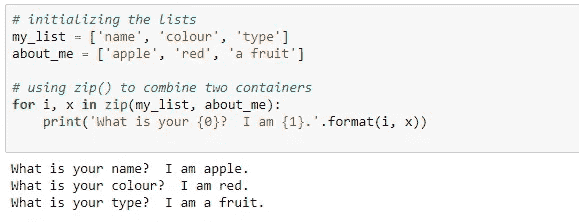

# Python 中的循环技术

> 原文：<https://medium.datadriveninvestor.com/looping-techniques-in-python-cb651782605b?source=collection_archive---------24----------------------->

## 主要使用枚举和压缩

Photo by [Tine Ivanič](https://unsplash.com/@tine999?utm_source=medium&utm_medium=referral) on [Unsplash](https://unsplash.com?utm_source=medium&utm_medium=referral)

## 什么是循环？

循环用于迭代一个序列或代码块，您希望重复固定的次数或直到满足某个条件。

Python 通过一些内置函数支持各种循环技术。这些方法在编程和维护代码的整体结构时非常有用。它们还有助于节省大量的时间和内存，因为不需要声明额外的变量，而这些变量是我们在传统的循环方法中声明的。

**让我们来看看 Python 中不同的循环技术:**

## **使用 enumerate():**

**enumerate()** 用于遍历容器，然后打印索引号以及该特定索引中的值。它接受一个集合(例如一个元组)并将其作为一个**枚举**对象返回。

**列举**指一一列举或列举事物。

*在上面的例子中，当枚举遍历这些值时，它打印出键及其对应的值。*

使用枚举的更多方法:

## **使用 zip():**

**zip()** 是用于组合相似类型的迭代器(list-list 或 dict- dict 等)，按顺序打印值。如果传递的迭代器长度不同，则项目最少的迭代器决定新迭代器的长度。跳过长度更大的迭代器的其他项。在空迭代器的情况下，它返回“无输出”。

Basic example to understand how ‘zip’ works

如果一个元组包含更多项，则忽略其他项:

Here ‘Python’ is the shortest tuple contains just 2 items

## 使用带压缩功能的*取消压缩:

## 结论:

在本教程中，我们了解了枚举和压缩是如何工作的。这些技术使用起来很快，减少了编码工作。循环技术比使用“for”或“while”循环使代码更简洁。它们不需要对容器进行任何结构改变。