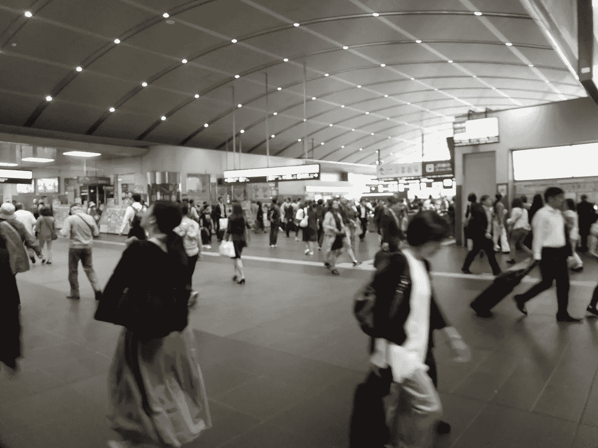

# 在疫情时代失去隐私

> 原文：<https://medium.datadriveninvestor.com/losing-privacy-in-times-of-pandemic-f52aff6eb0ab?source=collection_archive---------22----------------------->

我们对健康结果的追踪会消除个人隐私吗？

Public transit transformed, Christyl Rivers

## 收集数据和每日变化

许多医学专家认为，最糟糕的灾难还没有到来。

人们的日常生活和生计已经被打乱，许多人希望放松社会限制。与此同时，许多专家敦促在重新开放各种市场时要极度谨慎。

无论哪种方式，公共和私人领域都在经历着我们对监控、社会距离规范、媒体焦点和数据收集的期望的变化。

能够收集体温、情绪、意图、健康状况等信息的生物识别技术正在快速发展，以跟踪世界各地的人们。

 [## 人们对隐私的不理解是什么？数据驱动的投资者

### 你知道那种感觉。无论是访问应用程序、订阅还是你最喜欢的运动鞋。你按下…

www.datadriveninvestor.com](https://www.datadriveninvestor.com/2019/04/11/privacy-and-convenience/) 

许多人会欢迎侵犯隐私，如果它提供了“豁免证书护照”，或者如果它追踪他们的公共接触，试图查明谁可能是未知的新冠肺炎带菌者，谁可能会出现症状，因此应该避免。

## 工业和健康的全球影响

欧盟正在努力与谷歌(Google)和苹果(Apple)等科技巨头合作，开发既能保护消费者隐私，又能产生有用数据的应用，并在没有人对全球工业和健康前景非常乐观的时候，以某种方式取悦所有人。

例如，在与英国国民健康服务(National Health Service)的谈判中，苹果(Apple)和谷歌(Google)提出的一款联系人追踪应用遭到了英国官员的反对，尽管瑞士和奥地利表示支持同一项目。

## 监督资本主义下的财富和健康

《监控资本的时代》一书的作者肖莎娜·祖博夫创造了“监控资本主义”这个术语，它定义了我们的私人信息如何变成公共数据。祖博夫写道，监视资本主义“单方面宣称人类经验是转化为行为数据的免费原材料。”

或者，换句话说，如果有人可以通过观察你做什么和买什么来读取你的想法和偏好，他们就可以学会操纵这些选择。

但是，在我们以前的“正常世界”中，确定什么是公平市场并不容易。现在，这种行为规范，尤其是对于不确定的未来，几乎是不可能追踪的。

如果世界市场再次开放(这是一个很大的“如果”，更不用说什么时候了)，支持健康和推动财富的监控应用可能会出现，并在任何反对它们的人对此事有很大发言权之前得到充分确立。

基于数据收集的行业决策将继续成为预测未来市场的基础。这些未来市场“标记”将总是寻求尽可能多地了解消费者的消费习惯。当这些数据被记录在你的行踪上时，不难理解为什么政府会希望类似的数据来跟踪人类的行为，这既是出于安全原因，也是为了公共利益而被监视的新的社会期望。

## 深入你的皮肤，进入你的大脑

监测方面的最新创新之一是生物计量数据的收集。这就是尤瓦尔·诺亚·哈拉里所说的“皮下”监视。

使用复杂的传感器，跟踪和算法，大技术可能正在监视你，但它发出了警报，许多人对老大哥监视的想法感到不寒而栗，这种方式很容易被劫持，或重新转向专制控制。

或者如尤瓦尔·诺亚·哈拉里所说:

人们可以回顾 100 年后，将冠状病毒疫情视为一种新的监控机制接管的时刻，特别是皮下监控，这可能是 21 世纪最重要的发展，是黑客攻击人类的能力。

保持对监控的某种限制以保护那些容易受到隐私侵犯、人类生命、医学突破、数据收集和健康监控的人是很重要的，但它更有可能占据中心舞台。

至少在一段时间内，情况可能是这样的，因为目前和未来的人类健康危机比隐私更重要。

## 未来市场

如何预测未来市场，以及开辟新市场的数据驱动平台？

随着一切都在不断变化，比如远程办公、在家办公、上学和工作，继续收集数据的新市场将会关注趋势。

随着新危机的出现，其他领域将发生重大变化，无论是疫情还是海平面上升，都将影响人类行为、买卖考虑、产品制造和消费，

从最小的病毒到最大的全球性影响，如砍伐森林，我们的整个食品行业目前在许多方面都受到威胁，正在发生变化。政治动荡也会影响我们的全球稳定和团结。

## 人类历史上的关键时刻

像往常一样，技术上的修正会时好时坏，但对答案的更大需求将推动数据驱动的行业和公众舆论——以及对什么更有价值、自主性、自由和隐私的异议？或者是资本和资源的健康、财富和可持续性？

对完全重建的实际和社会基础设施的需求可能会影响我们上下波动的经济，以及未来几年我们实时变化的社会结构。

每个人有权拥有多少隐私在一段时间内也是不确定的。

那些制定政策的人，以及影响他们的人，应该对所有这些因素保持清醒的认识。这是为文明的命运做出明智决定的唯一途径。