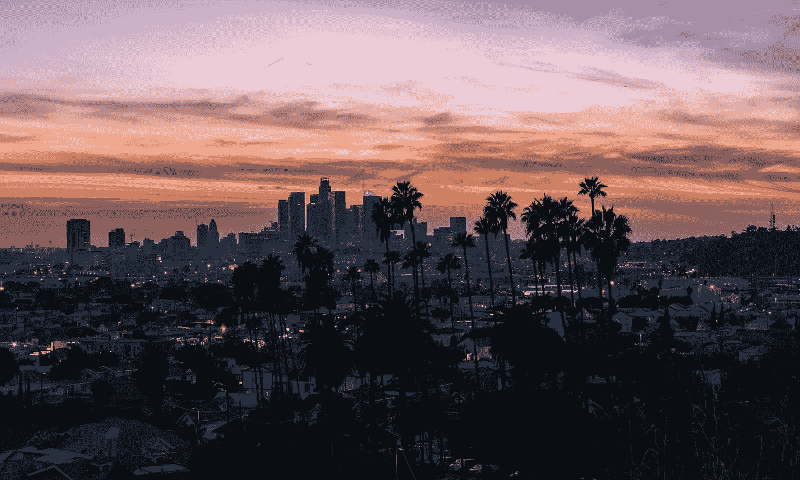
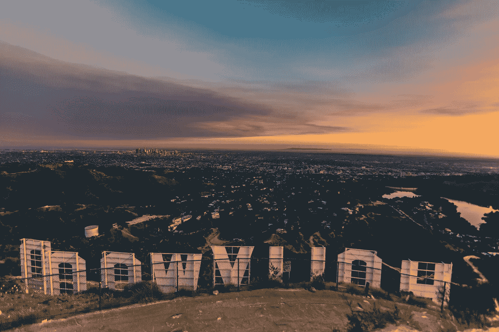
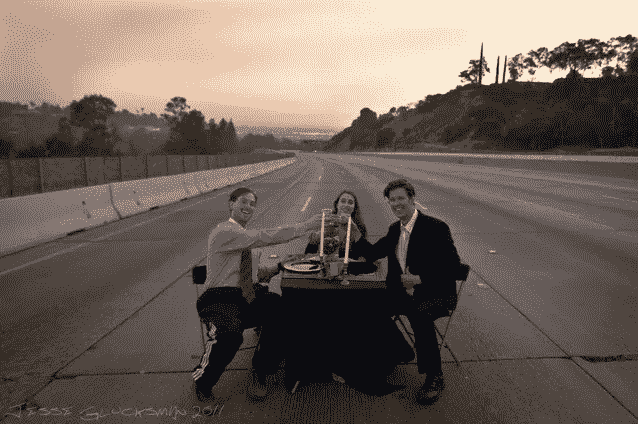

# 失落的洛杉矶

> 原文：<https://medium.datadriveninvestor.com/lost-angeles-4d6a116b10aa?source=collection_archive---------19----------------------->

## 洛杉矶迷失的灵魂如何使它成为世界上最好的城市

Image by [Sterling Davis](https://unsplash.com/@sterlingdavisphotola) on [Unsplash](http://unsplash.com)

洛杉矶:梦想之城，棕榈树和世界闻名的交通。也是钱包里的小狗、烟雾、无尽的燕麦牛奶广告、“休闲”文化和世界上最好的食物(我是说我在韩国城的泰国餐馆)的家乡。

有些刻板印象是真的，但大多数不是。但我最喜欢这座城市的一点是，我们是一个玩具破碎的小镇。这里的每个人都很有人情味。如此有缺陷。如此不停地寻找目标。这座城市的野心非常强烈。大多数人不是从这里来的，他们离开了他们的家乡，带着他们的家人和朋友来到这里，建立了丰富的事业和生活。现在他们在这里，寻找“它”。

> 这是一个迷失灵魂的城市，我每天都在这里发现无尽的美。

我在很多地方生活过，但从来没有像这个城市的人们那样，被他们的创造力、脆弱和雄心壮志所激励。

我永远不想离开。

Image by [Izayah Ramos](https://unsplash.com/@izayvh) on [Unsplash](http://unsplash.com)

那么是什么激发了安杰利诺的这种动力呢？首先是阳光。海滩！美丽的圣莫尼卡山脉。波光粼粼的海洋和可爱的，温和的天气是灵魂滋养。但真正特别的是人。

**这里有一个独特的搜索社区。**

这座城市非常分散，所以很快就会变得很孤独。这不像在纽约，你要把人们挡在左右。在尤拉，你可以在自己的公寓里醒来，开车去上班，和你每天见到的 12 个人一起工作一整天，开车回家，回家后有时间独自做晚饭和喝酒。一整天。没有任何有意义的人类接触。(也许除了饮水机旁的苏珊或者在 La Cienega 拦住你的那个愤怒的家伙)。

> 安吉利诺渴望人类的接触和联系。

这看起来很悲伤。但真的，很精彩。因为这里的每个人都想和别人联系！这有多特别？在其他大城市，拥有独处的空间和时间是罕见的。这是礼物。因为找朋友很难。这让每一段关系都变得如此特别。

**我在这个城市遇到了一些最优秀的人。**

我的第一个朋友是科迪。我在这里上的第一堂表演课认识了她。当#blacklivesmatter 骚乱在今年夏天达到高潮，大多数人都感到害怕，纷纷逃离城镇时，她说，“我会留在原地。感觉这个城市需要我。”她在骚乱的外围徘徊，为她认为是警察目标的少数民族挺身而出。

然后是阿什利和艾丽卡。我实际上是在大学认识他们的，但我们的友谊在洛杉矶加深了无数倍。当我第一次来到这里，我迷路了。我曾经迷失过。他们帮我做几乎所有的事情。找工作，看表演，见人。他们把我置于他们的羽翼之下，带我去所有最好的吃喝的地方，并邀请我去他们去的任何地方。开始是孤独的，但多亏了这两个人，我从未真正感到孤独。为此，我将永远站在他们一边。

哦，我有没有提到我在这里遇见了我的丈夫？嗯，往南一小时的路程。所以基本上在这里。我们是在一个朋友的生日聚会上喝酒认识的。他是我最喜欢的人和最好的朋友。当疫情启动时，他坚持要我们向无家可归者和医护人员捐赠食物。我们都失去了工作，我们社区的福祉仍然是他的首要任务。神魂颠倒。

认识了老公之后，又认识了几个亲爱的朋友。我们有一个小组，我们过去每周都和他们一起去野餐。婚礼前一周，他们和我一起熬到凌晨 3 点，帮我粉刷和粘合所有的婚礼装饰。当我试图给他们一瓶酒作为感谢时，他们反而在第二天晚上过来给我做晚饭，这样我就可以放松了。什么？！

我在这里遇到了很多非常棒的朋友，我可以继续说下去。我仍然不能相信我在这个城市遇到的所有特别的人。

> 安吉利诺非常慷慨。它让我的心脏每一天都同时膨胀和成长。这个城市给了我爱和关系，我无法想象没有它们我的生活会怎样。

还有真正迷失的灵魂。不像我这样的人——在咖啡和葡萄酒之间徘徊，寻找、社交、做家务。

> 街上迷失的灵魂。

> 洛杉矶的无家可归问题是我见过的最严重的问题之一。NPR 2020 年 6 月的一份报告显示，这一数字为 66433。这些数字令人震惊，对这一问题的仇恨和不容忍更令人心碎。在像孟买、伦敦、纽约这样的城市，无家可归者是存在的。毫无疑问。但是它被接受了。大多数公民对街上的人都有一定程度的同情。有社区。

 [## 蓝色起源能摧毁 SpaceX 的垄断吗？数据驱动的投资者

### 争夺太空主导权的战争即将升级吗？距离第一枚 SpaceX 猎鹰 9 号火箭升空已经过去 7 年了…

www.datadriveninvestor.com](https://www.datadriveninvestor.com/2020/11/26/could-blue-origin-demolish-the-spacex-monopoly/) 

在洛杉矶，无家可归者不得不自己谋生。警察经常转移他们。这里的大多数市民感觉“无家可归问题”正在好转！他们都走了耶！但是问题并没有被解决，只是被转移了。这里有一些令人难以置信的基层志愿者组织在拼命帮助无家可归的人。市长加尔塞蒂在这个问题上也付出了巨大的努力:[他为无家可归者的住房](https://laist.com/latest/post/20200612/garcetti-gives-updates-on-coronavirus-and-protests-in-losangeles)投入了数百万美元，包括“桥家园”——在每个行政区建立紧急避难所的运动。这些努力是美妙的，但增长空间仍然是震耳欲聋的。

在洛杉矶，我们每天都被提醒如果我们不坚持下去会发生什么。我们身边都有需要帮助的人。社交媒体不会掩盖这里的一切。向窗外看一眼，或者走过贫民窟，都会打开我们的心扉。一个繁荣的城市，如果大多数人都感到满意，就会达到自满。不在这里。

但最神奇的是，人们还保留着希望！太不平凡了！甚至(尤其是)无家可归的人也有这些巨大的梦想。许多人因为这些梦想而来到这里，然而他们仍然在前进！**如果他们仍然要去，我们怎么能不去呢？**

> 这座城市的人们狂热的梦想令人眩晕。

我们都在追求超越自我的东西。我们可以欺骗自己，让自己相信我们的经济地位让我们与众不同或与众不同。但事实并非如此。在洛杉矶，有一种明显的感觉，“嘿，伙计，我不知道你是谁，也不知道你是做什么的，但我想我们都在这里努力让生活变得美好。”

Image by [Benjamin Sow](https://unsplash.com/@bensow) on [Unsplash](http://unsplash.com)

那么是什么让洛杉矶与众不同呢？持续的阳光。寻找联系。人们的慷慨。创意者和企业家的驱动社区。集体寻找目标和失败的恐惧。当我们害怕的时候，闪闪发光的海洋提醒我们这个世界是多么美丽。坚持不懈的精神。迷失灵魂的团体都非常努力地工作，真诚地尽我们最大的努力。

## 我很荣幸成为一名天使。

我一直在寻找。我希望我永远不会停止。当我们停止寻找，我们就停止了学习。这座城市每天都在激励我成长。我喜欢这个城市提供的一切。我喜欢它的无限性。我爱这里的人们，食物，还有每天覆盖在我们头上的华丽的棕榈树。我喜欢旅行的独立性和私密性。我喜欢这样一个事实，我可以开着车去上班，听着我最喜欢的播客，旁边放着我的咖啡，开着空调。这在其他大城市是不存在的。但最重要的是，我爱迷失的灵魂。因为我们总能找到彼此。我迫不及待地想看到这座城市因此而成长。

Image by [Joshua Coleman](https://unsplash.com/@joshstyle) on [Unsplash](http://unsplash.com)

这是第 4 天，30 天旅程 30 个提示中的第 4 个提示！提示是:给你的城市起一个新名字，反映它是什么类型的地方，并解释你为什么选择这个名字。

在这里跟随我的 30 天旅程！

## 获得专家视图— [订阅 DDI 英特尔](https://datadriveninvestor.com/ddi-intel)