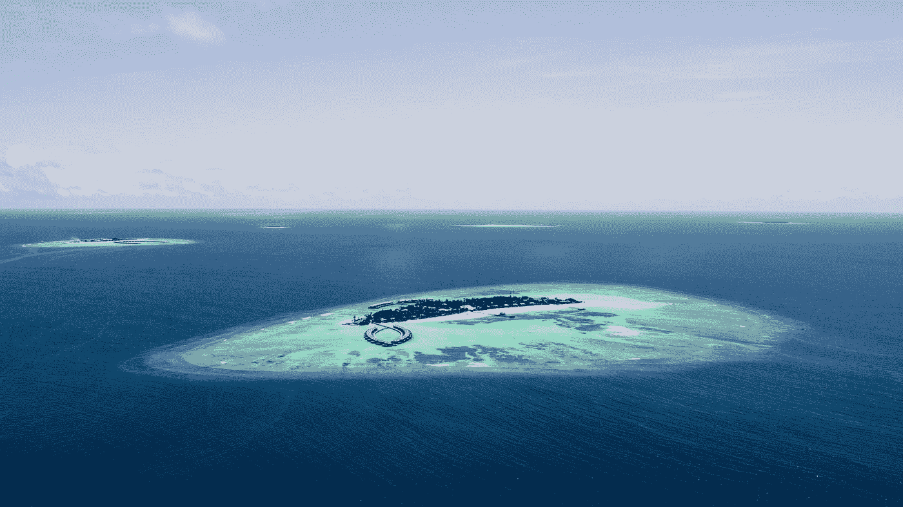
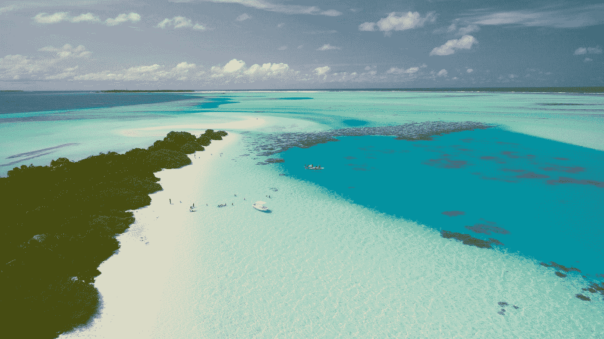

# 迷失在时间中，陷入沉思

> 原文：<https://medium.datadriveninvestor.com/lost-in-time-lost-in-thought-ab7d07ec883a?source=collection_archive---------3----------------------->

Photo by [Ibrahim Egan](https://unsplash.com/@eegan?utm_source=medium&utm_medium=referral) on [Unsplash](https://unsplash.com?utm_source=medium&utm_medium=referral) (not Mafia Island, but just as pretty)

## 凌晨四点的黑手党岛

用餐区很暗。只有几盏壁灯可以帮你四处走动。它的四周都是敞开的，让清晨的微风吹进来。因为这些微风，当我打开我的电脑时，虫子不像通常那样糟糕。昨天他们贴满了屏幕，尽管我喝了果汁，他们还是在我的脸上跳了一支吉格舞，因为我在当地互联网上挣扎。你发牌。有时候，不是用互联网。

在这里经常行不通。黑手党岛是个古老的地方。就在我写这篇文章的时候，停电了，随之而来的还有互联网。这在白天经常发生。唯一真正令人烦恼的时候是当你正试图从酷热中凉快下来，而风扇却不在的时候。从很多方面来说，不酷。但这就是岛上的生活。你和我都受制于与大陆隔绝的突发奇想。这是这个地方美丽的一部分。

很容易陷入沉思。现在有很多事情要考虑。说到思考，我想不出比 Mafia Island 更好的地方了，一个真正的世外桃源，凌晨 4 点，海风吹来，除了几只飞狐和象鼩，周围没有人。

组成这个热带群岛的小岛有着丰富的历史。写的不多。一些口述历史有助于理解，但并不多。有一些详细的德国记录，但都是最近的。黑手党的历史可以追溯到许多世纪以前。多年来，它一直位于至关重要的贸易路线的十字路口。Chole 小岛上仍然保留着德国人和葡萄牙人的遗迹。这些废墟与巨大的树根交织在一起，就像吴哥窟被当地森林的奇思妙想所取代一样，使这些古老的建筑成为一个视觉童话。在某些情况下，这些建筑之所以屹立不倒，是因为扼杀者无花果已经缠绕在建筑的珊瑚、砖块和古代系泊物之间。

黑手党岛最大的特色之一就是当地的潜水。这里的珊瑚礁是世界上最好的。虽然几乎没有研究支持这种说法，但当地人指出，在近年来几次经历珊瑚漂白后，它们的恢复速度也比其他珊瑚快得多，特别是大堡礁，它实际上已经死亡。

有很多要考虑的。黑手党是那些被时间遗忘的神奇地方之一，如果你愿意用一点点不便换取远离尘嚣的快乐，它会提供一种特殊的体验。部分偏远意味着这里的潜水是一流的。

 [## 面向 Noobs |数据驱动型投资者的数字身份

### 聪明人如何在增强现实中创造身份价值？我最近刚满 40 岁。作为一个生物…

www.datadriveninvestor.com](https://www.datadriveninvestor.com/2019/02/28/digital-identity-for-noobs/) 

三天前，我去了两次潜水，这是我七年来第一次潜水。这是我自 2002 年以来第一次真正具有挑战性的潜水，那次潜水事故差点要了我的命。我来这里的部分原因是为了回答我是否想继续这项运动的问题。正如我在别处所写的，我不希望恐惧成为我选择不参加运动的唯一原因。

答案是我还不知道。我的能见度有问题，我的浮力非常令人沮丧(过去不是)，鳍，即使有短靴，也刮了我的脚趾，这里的能见度不总是很好，因为不合季节的雨，我的耳朵给我带来了可怕的麻烦(两天后，我仍然听不清他们两个的声音)这是鲸鲨季节的标签结束，所以没有人可以看到，潜水船上有一个成熟的混蛋做了很好的工作，使这一天很难开始。我注意到，因为我什么也看不见，所以整个潜水过程大部分时间都是在离潜水教练很近的地方度过的，努力用我的 BCD 纠正契合度，不断与适量的空气斗争，让我漂浮，而不是寻找珍贵的珊瑚，并思考这什么时候才能结束？

这可能不是一个有趣的好指标。我真的不开心。这是一场斗争，但我知道这是可能的。

这不是任何人的错。任何时候你或我回到一项我们已经很久没有做的运动，保证我们会感觉像笨拙的傻瓜。好吧，反正我是个笨手笨脚的人，但这次更糟。这是笨拙的傻瓜加上笨拙的傻瓜。

我不是没有幽默。

不断纠正一个向一侧或另一侧倾斜的水箱，不断试图平衡你的耳朵，不断试图纠正浮力，这简直令人筋疲力尽，因为前一秒你像一个生日气球一样飘走了(只有在你尽最大努力释放足够的空气时，你才被鳍猛地拉回来)，下一秒，你的手放在你出于所有显而易见的原因确实不想触摸的珊瑚上，但你必须在某个地方支撑自己。各地的潜水者都有同感。

赤手放在珊瑚上意味着你以后要用手处理小问题。那也是。我带了止痒霜，很有效。

再说一次，这就是在很长一段时间的中断后重新回到某样东西上的感觉，尤其是用新的和不同的装备，尤其是在一次可怕的事故后。最重要的是，你和其他人一起在水里。如果你和我想的一样，你会担心你不会用鳍拍打某人的面具，或者出于任何原因，因为你自己的无能而导致整个群体浮出水面。

我很清楚，集体潜水顾名思义就是对整个群体保持警惕和敏感，如果有人遇险，我们都会站起来。然而，这些旅行对我们所有人来说都是昂贵的。我的自我会很难处理成为别人不得不缩短礁时间的原因。当然，那是我的问题，但你明白我的意思了。

凌晨 4 点，银河就在头顶上，最后一只狐蝠在头顶上飞舞。迷人的生物。有很多理由喜欢上黑手党。潜水只是来到这里的一部分。我很高兴来这里不容易。这可能是它保持魅力的方式之一。

我喜欢陷入沉思。迷失在时间里。

我喜欢再次呆在水下的部分时光。如果没有别的，能够面对我内心的困惑并保持冷静，深入下去，清理我的耳朵。两次潜水的第一部分都有不可避免的笨拙，每次潜水都有自己的装备问题和挑战，在这之后，我终于找到了一个放松和享受的地方。还是看不太清。这更多的是一种更有远见的功能，我一直都是这样，但年龄越来越影响到这一点。你可以拿到处方面膜。我处理的大部分问题都是齿轮问题，都是可以解决的。

公平地说，我成功地完成了潜水，而不是特别享受。也就是说，这里的老板马尔科，一生都在潜水，是那种超级热情的专业潜水员，他认为潜水是生活的必需品，当然值得解决这些小问题，以便我可以继续下去。我享受他的快乐，即使我不确定我是否分享。他指出，他是对的，如果我继续下去，我的舒适程度会恢复，我的能力也会恢复。

这些都不是问题。

当星星在头顶上慢慢旋转时，肥大、蜡质的叶子沙沙作响。白天，当你在用餐区吃饭时，邋遢的当地松鼠会在你头上扔下部分树枝。他们在筑巢。我们找不到在哪里，但树叶雨是证据。

陷入沉思。十五分钟后我要去观鸟。这里有很多事要做，包括什么都不做。有时候，这是最好的礼物。我爬上宽大的大床上，打了好几次盹，不为别的，只为不用做任何事或去任何地方的快乐。当我回到丹佛时，有很多这样的事情，那里的房子出售和寻找新的地方迫在眉睫。

我不再害怕潜水了。任务完成。仅此一点就值得留在这里。

但是继续？陪审团已经出来了。和所有的事情一样，我们将拭目以待。与此同时，我将享受探索神奇的黑手党岛，一个有狐蝠、微风和古老历史的地方。

迷失在时间里。陷入沉思。两者兼而有之的好地方。

Photo by [Ishan @seefromthesky](https://unsplash.com/@seefromthesky?utm_source=medium&utm_medium=referral) on [Unsplash](https://unsplash.com?utm_source=medium&utm_medium=referral)