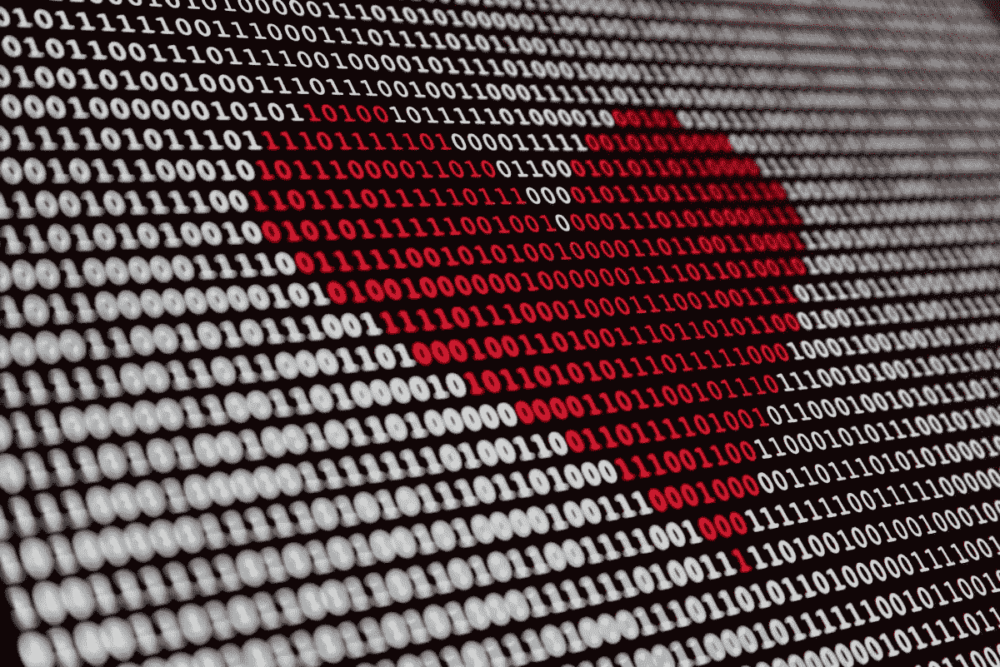

# 爱的极致——人工智能时代的约会游戏

> 原文：<https://medium.datadriveninvestor.com/love-apptually-the-dating-game-in-the-age-of-ai-f65e4c8792f1?source=collection_archive---------12----------------------->

## 我们不是每个人都有好莱坞式的“偶遇”，那么人工智能在帮助我们其他人找到完美伴侣方面做了些什么呢？

随着情人节的临近，我想知道你们中有多少人在打情骂俏地看着《T2》、《T3》和《T4》、《T5》。我没有时间去看我最喜欢的爱情电影之一，因为我丈夫肯定已经计划好了烛光晚餐(提示，提示)。

但是没关系。虽然我会错过休·格兰特在唐宁街 10 号的大厅里跳舞的场景，但我会很高兴地避免再次经历艾玛·汤普森饰演的角色的心碎场景——每次都让我痛不欲生！要是她有人工智能来帮她挑选男友就好了…

在线婚介业务利润丰厚，估计价值约为 30 亿英镑。它的发展速度也很快，每年都有新的人进入这个市场，越来越多的人选择通过这种方式遇见另一半。毫不奇怪，为了保持竞争力，最大的玩家正在向镇上最热门的夫妇寻求帮助:人工智能和大数据。

如果像 [Bumble](https://bumble.com/en/) 、 [Match](https://uk.match.com/?geo-redirection=www.match.com) 和 [Tinder](https://tinder.com/?lang=en-GB) 这样的网站想要超越他们的竞争对手，他们必须更好地了解用户的约会偏好。今天的爱情猎人对他们从一段关系中需要什么和想要什么更加挑剔。问题是，他们不像以前那样愿意投入工作。

约会应用减轻了用户的搜索负担，收集了大量的个人数据，然后依靠人工智能来做人类无法快速完成的事情——分析数据。数据经过分析后，会以各种方式进行部署，例如，它可用于:

*   优先考虑他们认为用户会喜欢的某些档案
*   通过面部识别技术( [Badoo](https://badoo.com/en/) )推荐那些看起来像用户前任或者他们觉得有吸引力的名人
*   建议聊些什么或者什么时候见面比较合适
*   根据从位置数据平台 Foursquare ( [Loveflutter](https://www.telegraph.co.uk/technology/2017/05/10/dating-app-will-read-tweets-find-personality-match/) )获取的信息，提议适合双方的首次约会地点。

甚至有一个完全语音操作的约会应用程序，名为 [AIMM](https://aimm.online/) ，它复制了人类约会服务的亲密度。它的人工智能与用户聊天一周，以很好地了解他们如何选择伴侣，随后选择潜力，进行介绍，并在整个过程中指导人们。它让用户从最初的电话到面对面的会面，再到后续跟进。我得说这是没有真人参与的相亲中最私人的事了，不是吗？

当然，这里提到的许多特征现在完全不相关，Covid 限制可悲地限制了全世界潜在情侣的翅膀。但是用不了多久，它们就能张开翅膀，飞向彼此，用它们的……嘴衔着红玫瑰？

等到生活恢复正常的时候，也许约会应用程序会获得更多更丰富的数据——毕竟，最近几个月，我们*已经*在网上花了大量醒着的时间，那里就是收集数据的地方。简单来说:数据越多，人工智能能为单身者做的就越多。

我认为到目前为止，我们所看到的能力仅仅是我们希望在这一领域使用人工智能完成的事情的冰山一角。在未来，人工智能可能会超越上述所有因素，走向受基于数据的洞察力影响的匹配，这些洞察力是从与智能手机的交互中收集的——例如评估刷卡模式、对话发起率、消息响应时间等等。

然而，对于那些寻找爱情的人来说，我们此刻所拥有的——这本身就非常令人印象深刻——将不得不去做。如果你想为你的休·格兰特找到玛汀·麦古基安，那就注册这个能充分利用人工智能的应用吧。让我知道你进展如何。

不过现在，我要向我丈夫透露另一个关于情人节大餐的不那么隐晦的暗示——如果他不接受，那对他来说实际上是爱，而不是真正的爱！