# 爱情、死亡和机器人模拟器

> 原文：<https://medium.datadriveninvestor.com/love-death-and-robot-simulators-9ad7c62d46ae?source=collection_archive---------3----------------------->

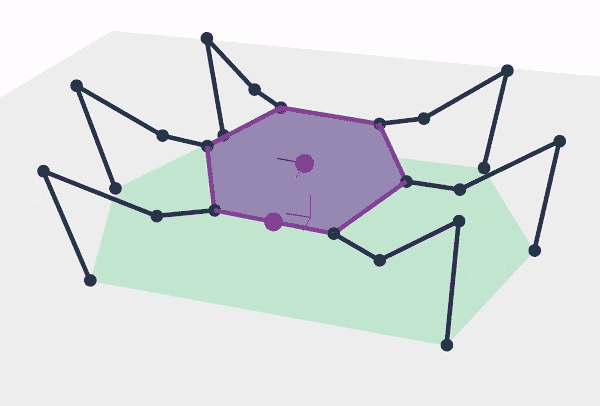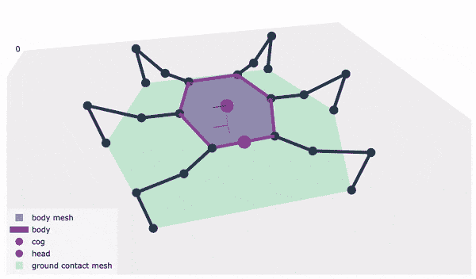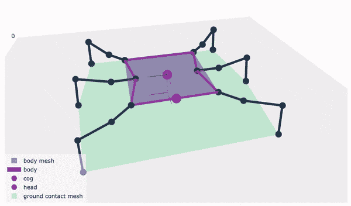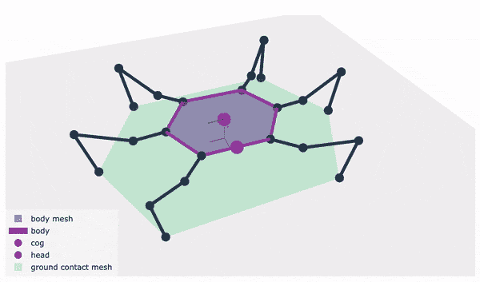

我希望每个人都还好，我知道每个人都因为 CoVid19 而有点沮丧，让我们尽最大努力保持安全和其他人的安全。

我知道我已经一年多没有在 Medium 上发帖了。差不多半年没查过 LinkedIn 了。

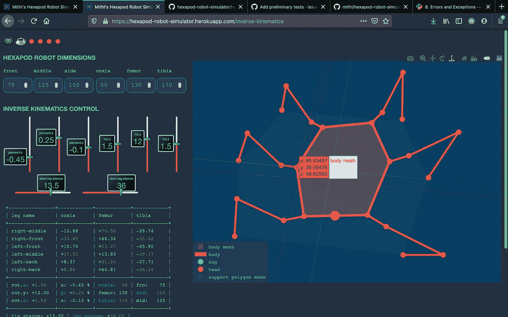

我只是想让你们很快了解我的一些个人项目。

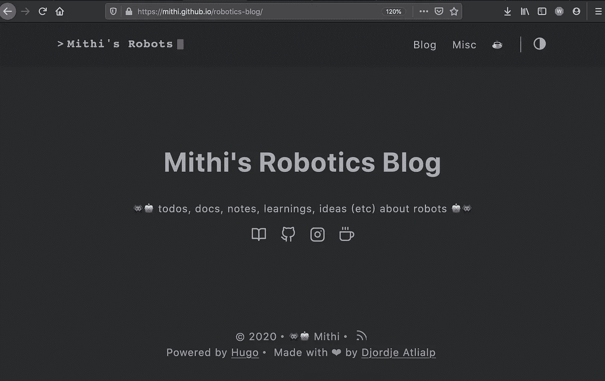

我最近开了一个[机器人博客](https://mithi.github.io/robotics-blog/)，我计划在那里记录我个人的机器人项目，并分享我对机器人的学习。我有这么多东西想做，时间却这么少(钱更少了，哈哈)，这太让人受不了了。下面是[我不断增长的想法清单](https://mithi.github.io/robotics-blog/ideas/)，如果我能实现其中的 5%，我会认为这是一项成就！

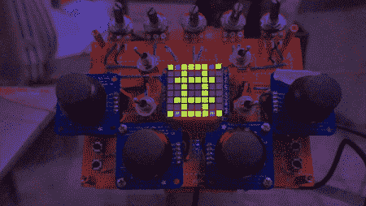

我在博客中记录的第一件事是一个简陋的 DIY 项目。我已经有将近三年没有焊接或者更少使用 Arduino 了，我认为这是一个很好的方式来重新开始。我设计并构建了一个定制的可黑客攻击的通用无线控制器，并配备了现成的组件。它基于 Arduino，使用 nrF24l01+无线传输命令。

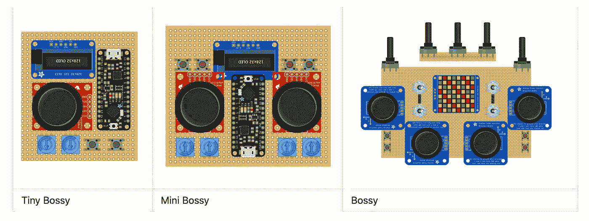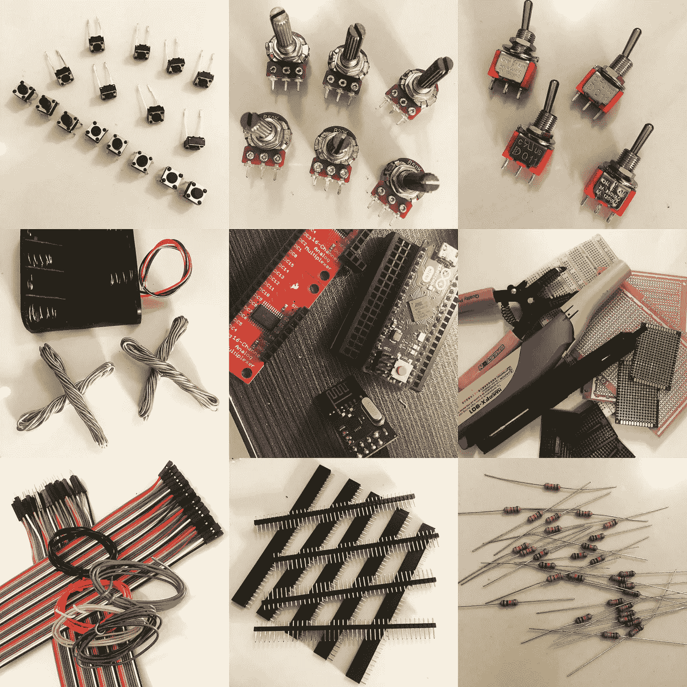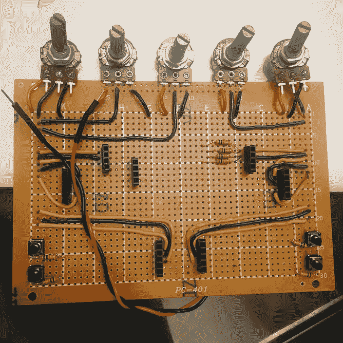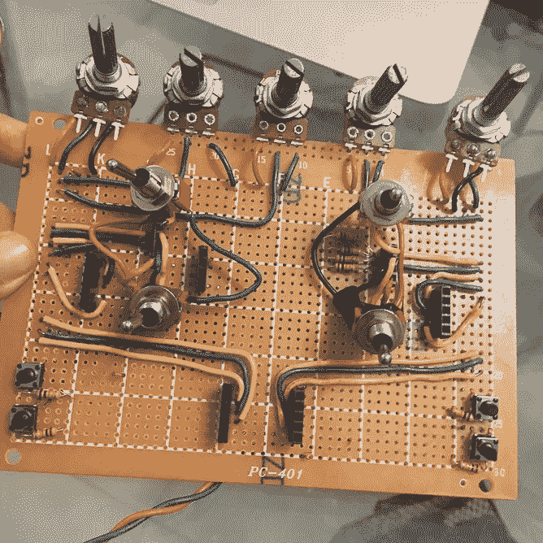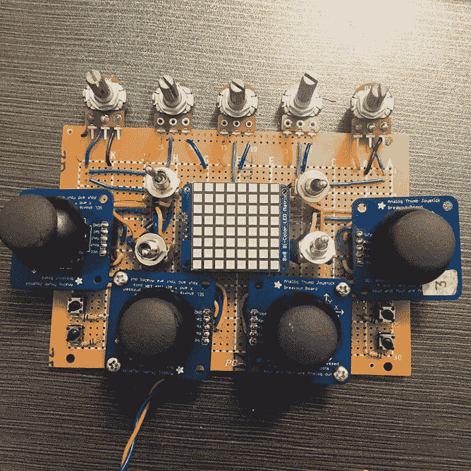

我的博客记录了我的进展，还包括[BOM/购物清单](https://mithi.github.io/robotics-blog/blog/bossy/02-bill-of-materials/)，一步一步的构建说明，以及如果你想跟进的故障排除技巧。我希望你在阅读我的小冒险时能像我一样开心。

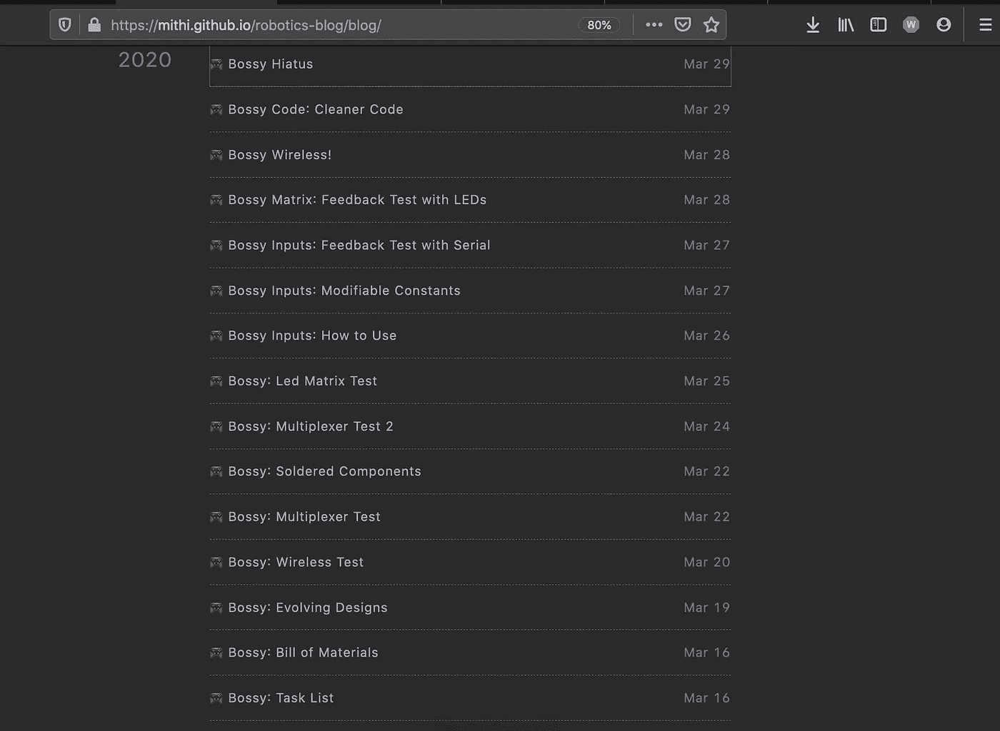

我也开始用 Plotly Dash 构建一个基于网络的六足机器人模拟器

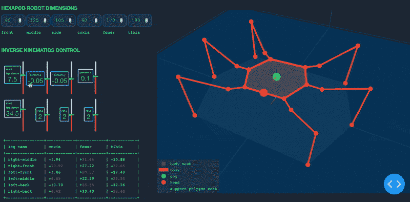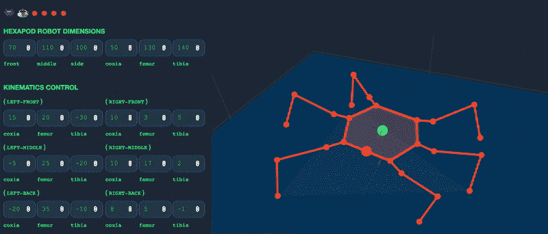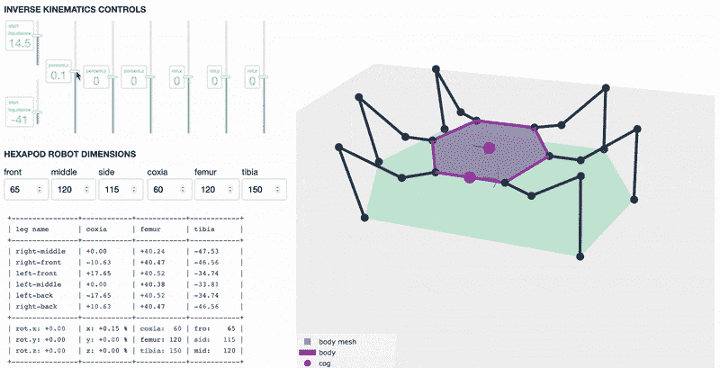

…如果你还没有看到这个，我已经整理了一个为期五周的自学计划，供任何人开始学习人工智能和深度学习。如果你一直想了解深度学习，这是一个很好的起点！

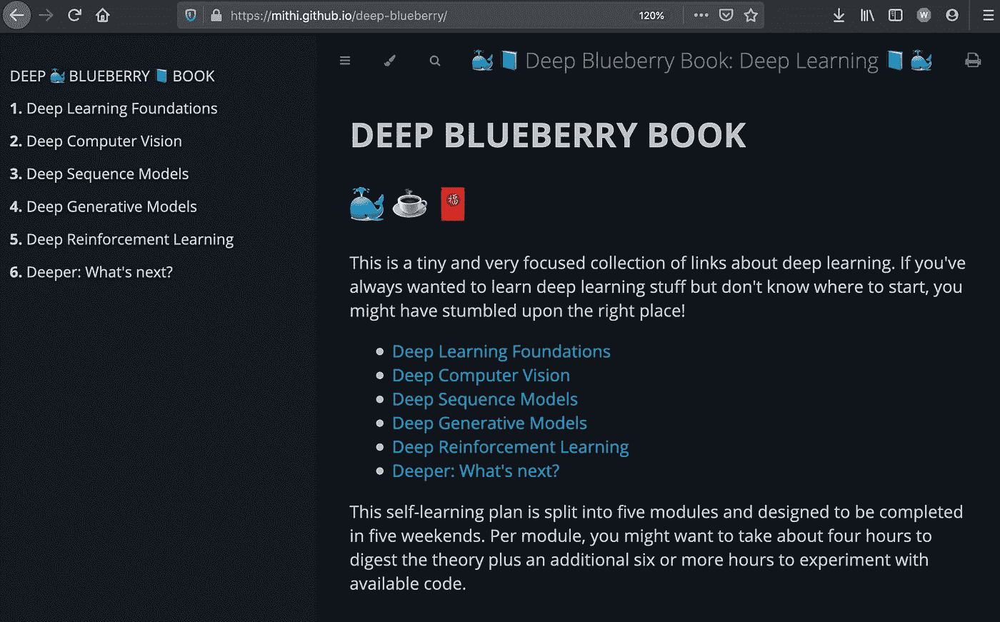

**如果你有兴趣看到我的一些** [**列出的机器人项目创意**](https://mithi.github.io/robotics-blog/ideas/) **实现，考虑** [**为我买杯咖啡**](https://ko-fi.com/minimithi) **，我会用它来为那些项目购买物品(物品列在我的** [**愿望清单**](https://mithi.github.io/robotics-blog/wish-list/) **)。❤️**

如果你想了解我的机器人项目的最新进展，请在 [Github](https://github.com/mithi) 上关注我，或者偶尔访问我的[机器人博客](https://mithi.github.io/robotics-blog/)，我可能一年只会在 Medium 上发布两三次😉。

 [## 给米蒂买杯咖啡。ko-fi.com/minimithi

### 和 Ko-fi.com 一起给米西买杯咖啡

ko-fi.com](https://ko-fi.com/minimithi)  [## 论机器人权利:机器人可以被奴役吗？数据驱动的投资者

### 人们可以随心所欲地对待他们的机器人吗？一个人可以对他们的机器人“暴力”吗？机器人应该是…

www.datadriveninvestor.com](https://www.datadriveninvestor.com/2020/02/13/on-robot-rights-can-robots-be-enslaved/) 

# **就这些，感谢阅读！**