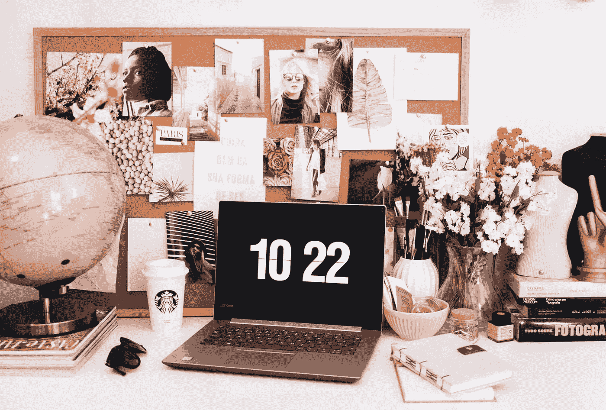

# 喜欢也好，讨厌也好，在家工作会生存吗？

> 原文：<https://medium.datadriveninvestor.com/love-it-or-hate-it-will-work-at-home-survive-c08482c9eccb?source=collection_archive---------12----------------------->

## 远离办公室的辛苦工作混合了吸引力和可能的倦怠

Photo by Ella Jardim on Unsplash

在家工作是一种新的时尚。除了员工拥有合适的工具，领导者还需要知道如何[远程管理团队](https://medium.com/datadriveninvestor/remote-workers-out-of-sight-not-out-of-mind-f62b9f70dc1d?source=friends_link&sk=710ea5b4314b87582e8ee5bed66c895f)。

这是[薇薇安·凯利](https://twitter.com/VivianLKelly)的时刻。她是战略传播公司[inter play](https://twitter.com/interprosepr/)的创始人兼首席执行官。她创建并管理战略沟通、公共关系和社交媒体活动，为科技公司、组织和协会创造商业价值。

Interprose 的员工已经远程工作了 20 多年，这让 Kelly 和她的团队走在了前沿，并让他们了解了在家工作的重要性。

Kelly 与社交媒体经理 Carol Stephen 谈论了当员工在物理上分离时的利弊以及如何取得成功。

 [## 当没有比家更好的地方时如何成功

### 维持家庭办公室的有效方法

medium.com](https://medium.com/an-idea/how-to-succeed-when-theres-no-place-like-home-dc53f418a8f) 

从办公室过渡到远程工作环境时，最大的挑战是士气低落和孤立无援。

凯利说:“视频会议有所帮助，它将业务和‘仅仅因为’的追赶健康地结合在一起。”“对于管理者来说，这是一种眼不见心不烦的综合症。如果看不到员工，有些人很难相信他们在工作。信任至关重要。

“今天很孤独，”她说。“夸大你的行为很重要，因为这是我们被迫进入的陌生领域。有很多接触。更多地了解你的同事。”

组织需要记住，远程员工是团队的一部分，尊重他们的工作能力，而不是不断检查以确保他们在自己的办公桌前。

“适应新环境，”凯利说。“一整天的视频会议既无益又令人沮丧。鼓励“正常”的工作时间，不要整天整夜地工作。[避免倦怠](https://www.datadriveninvestor.com/2019/01/15/burnout-exhausts-easy-answers/)。促进工作与生活的平衡对员工和组织来说至关重要。[介绍好玩的](https://medium.com/datadriveninvestor/have-a-little-fun-and-profit-4dd7b69d6a90?source=friends_link&sk=a19519d465c91249e96752310482b29b)也是

# **突出好的**

领导应该完全精通与远程员工沟通的最新方法。无论团队是在一个地方还是在遥远的地方，一些备用领导原则仍然有效。

“赞扬人们的良好工作，”凯利说。“要透明公开。授权给团队。定期征求他们的意见和建议，并付诸行动。培养同理心和同情心。请记住，孩子也是在家工作团队的一部分。”

 [## 远程工作人员:眼不见，心不烦

### 了解你自己的文化，这样你才能招聘到合适的人

medium.com](https://medium.com/datadriveninvestor/remote-workers-out-of-sight-not-out-of-mind-f62b9f70dc1d) 

有几个工具和平台可以帮助团队保持联系和协作，即使他们在地理上是分开的。似乎每个人都知道如何变焦。

“22 年前，inter plays 只有电子邮件、互联网和寻呼机，”凯利说。“今天的通信和协作工具非常复杂。ZDnet 在列出它们方面做得非常好。

她为经理们提供了短期和长期的建议，帮助他们过渡到在家工作的模式。

“支持你的团队，”凯利说。“向他们报到。当我们的危机结束时，人们将根据我们的领导能力和我们处理危机的能力来评判我们。人们有选择。当被引导、欣赏和倾听时，他们表现出持久的忠诚。如果没有，谁知道他们会去哪里。”

对于领导者来说，这是激励团队并让他们专注于完成工作的关键时刻。

“经理们，不要创造繁忙的工作，”凯利说。“员工们，关注结果。

“继续向高层汇报，”她说。“要知道衡量你的标准是你的贡献，而不是你的外表。分清主次。协作解决问题。庆祝一下。举行婴儿送礼会——或者其他什么——但是是虚拟的。”

 [## 保持距离的终极方法

### 大大小小的组织都在努力应对远程工作

medium.com](https://medium.com/datadriveninvestor/the-ultimate-way-to-keep-your-distance-a4d86d46dd62) 

分配有期限的任务。优秀工作的标准是按时完成高质量的任务，而不是监督香肠是如何制作的。

“在要求的时间框架内交付成果证明人们正在工作，”凯利说。“如果员工有分心的倾向，要求更新以保持事情正常进行。如果有人需要时不时地被推一把，温柔而坚定地去做。要善良。你会得到回报的。”

# **更加信任**

远程管理人性化的一面是记住你的员工也是人。

“不能直视员工的眼睛需要更大的信任和自主权，”凯利说。“避免微观管理。每个人都有压力。学会发现员工不正常的迹象。如果你的本能依然存在，伸出手，伸出肩膀。”

即使出现遥远、困难的人际关系或与绩效相关的情况。更复杂的是，领导者无法与员工面对面交流。

“让每个人都在同一个虚拟房间里，”凯利说。“给每个人自己的发言权。概述你认为的问题，这样每个人都在同一页上。鼓励他们提出解决问题的方法。如果找不到，那就是执行决策的时候了。”

 [## 在家工作:城堡中的城堡

### 离开办公室辛苦工作需要不同的心态

medium.com](https://medium.com/datadriveninvestor/working-at-home-your-castle-within-a-castle-1ab710aecd6a) 

除了物理距离之外，在家工作模式还提供了切实的好处。

“你的人才库是无限的，”凯利说。“很少有负面的水冷器谈话。人们更加相互支持。那些擅长在家工作的人生产率很高。喜欢它的人珍惜它的灵活性。气候将受益于更少的通勤。”

在家工作的模式还在继续发展。如果把这种安排作为一种更长久的固定措施，而不是勉强的管理者在硝烟散尽后才采取的措施，它可能会获得更多的认可。

“我们目前的环境是在家工作的游戏规则改变者，”凯利说。“有些人会喜欢它，[有些人会讨厌它，](https://www.theatlantic.com/magazine/archive/2017/11/when-working-from-home-doesnt-work/540660/)，但将来会有更多的公司再次接受它。令人惊讶的是，事情会因为难以想象的原因而变化得如此之快。为意外做好准备。”

为了获得更多在家工作的实用技巧，inter plays 团队成员[在博客中分享了他们的经验](https://interprosepr.com/2020/03/26/working-from-home/?utm_source=Twitter&utm_medium=Social&utm_campaign=2020-Blog)。

**关于作者**

吉姆·卡扎曼是拉戈金融服务公司的经理，曾在空军和联邦政府的公共事务部门工作。你可以在[推特](https://twitter.com/JKatzaman)、[脸书](https://www.facebook.com/jim.katzaman)和[领英](https://www.linkedin.com/in/jim-katzaman-33641b21/)上和他联系。