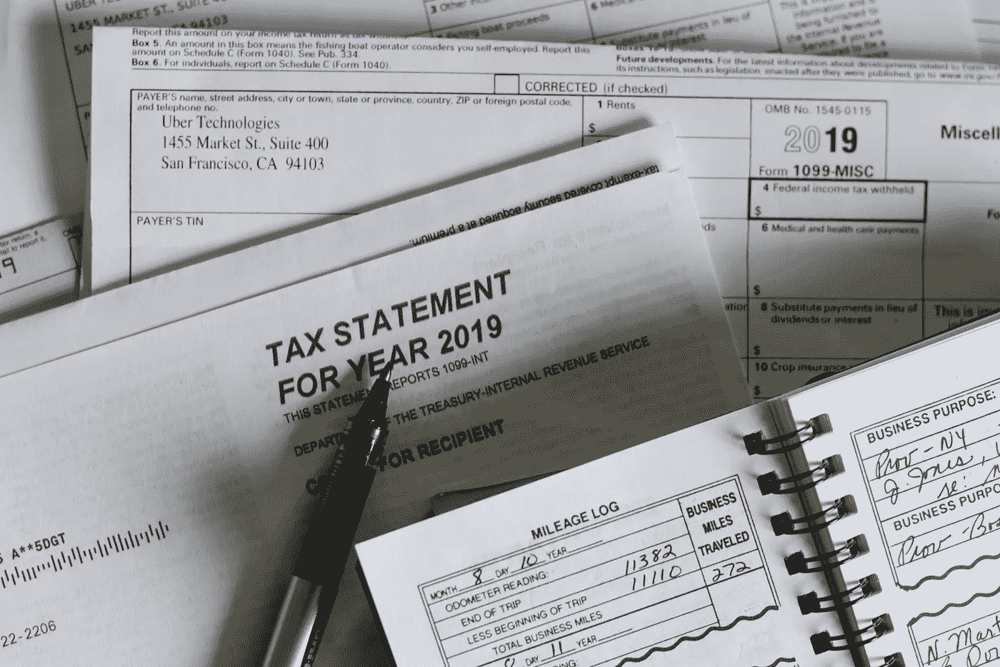
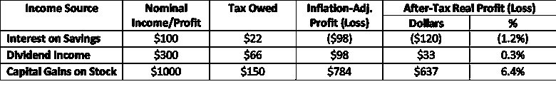
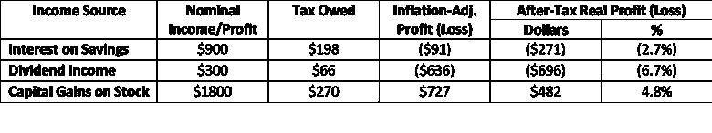

# 通货膨胀损害了你的投资结果——该怎么办

> 原文：<https://medium.datadriveninvestor.com/low-inflation-helps-your-taxable-portfolio-821a5fbd8aaa?source=collection_archive---------6----------------------->

## 你知道你的虚拟收益要缴税吗？

## 你的投资策略需要考虑通货膨胀，以及它如何与税收相互作用…

Photo by [Olga DeLawrence](https://unsplash.com/@walkingondream?utm_source=unsplash&utm_medium=referral&utm_content=creditCopyText) on [Unsplash](https://unsplash.com/s/photos/tax?utm_source=unsplash&utm_medium=referral&utm_content=creditCopyText)

众所周知，美国税法非常复杂。

几十年来，国会制定了税收措施(并将继续这样做)，认为这些措施将有益于社会(或至少是他们比其他人更关心的社会阶层，也就是所谓的专款专用或“猪肉”)。

令我困惑的一个方面是，我们被要求以名义美元计算收入利息和资本利得，这意味着当你没有真正赚钱时，你必须缴纳所得税。

# 不同的收入方案

这里有三种情况，如果你的“收入”不在免税或延税账户中，那么在每种情况下你都要被征税。

对于每一种情况，让我们假设两种情况，一种是通货膨胀率在 2%左右，多年来一直如此，另一种是通货膨胀率飙升至 10%，大约相当于 70 年代初的水平。

为了简单起见，让我们假设你的资本利得税率为 15%，利息税率为 22%。

## 场景#1:利息收入

1 月 2 日，你将 10，000 美元存入一个利息为 1%的储蓄账户，并让它在那里存放一年。

## 场景#2:股息收入

你拥有价值 10，000 美元的股票，每年支付 3%的股息。

## 场景#3:资本收益收入

你在 1 月 2 日买入价值 10，000 美元的股票，并在一年零一天后卖出。

# 事情如何发展取决于通货膨胀

如果通货膨胀以每年 2%的速度运行，就像多年来一直保持的那样，下面是你可以预期的情况。

*Comparing after-tax real profits between three investments in a 2%-inflation environment.*

如果年通胀率达到 10%，就像 70 年代初那样，考虑到储蓄账户可能要支付更高的利息，股票价格可能会增长更快，这就是你可以预期的情况。

*Comparing after-tax real profits between three investments in a 10%-inflation environment.*

# 外卖

看这两张表，这里是我们应该吸取的教训。让我们从一般真实的事情开始。

*   现金及其等价物是一种糟糕的长期“投资”，因为扣除税收和通货膨胀后，你可能每年都在亏损。
*   如果这些股票也经历了股价上涨，股票股息可能是一个很好的投资选择。如果他们不这样做，他们就不是应税账户的好投资。
*   从长期来看，将投资组合中的很大一部分配置到股票上是积累财富的一个关键部分。

接下来，让我们看看通过比较两个表中的结果可以了解到什么。

*   当通货膨胀率很高时，你的税后通货膨胀调整结果对现金等价物来说有点糟糕，对股票股息来说更糟糕(因为这些通常不随通货膨胀率上升)。
*   当通胀高企时，我们按名义回报率而非经通胀调整后的实际回报率征税，这意味着我们的很大一部分回报消失了。比较以上两种情况，你实际税后收益的整整 25%消失了，因为对通胀吞噬掉的虚幻“收益”征税。事实上，如果只对真实资本利得征税，10%通胀情况下的最终结果将是 6.2%，与 2%通胀情况下的 6.4%几乎相同。

最后，也是最普遍的教训是，我们的税法意味着，当通胀高企时，将退休投资组合放入延税账户而非应税账户的好处变得更加重要。

# 底线

没有多少人意识到通货膨胀对我们的影响远远超出了我们为所购物品支付的高价。以上显示了它是如何影响我们的税收，并让我们为没有增加我们购买力的虚幻收入买单的。

你的投资策略，尤其是退休等长期目标，需要考虑到通货膨胀及其与税收的相互影响。否则，当你准备称之为职业时，你可能会发现这两个因素导致退休生活远没有那么舒适。

# 关于作者

Opher Ganel 已经建立了几个成功的小企业，包括支持 NASA 和政府承包商的咨询公司。他最近的冒险是为独立专业人士提供的[金融策略服务](https://www.opherganel.com/)。你可以在那里与他联系，或者关注他的媒体出版物[金融战略](https://medium.com/financial-strategy)。

# 放弃

*本文仅供参考，不应视为财务建议。在做出任何重大财务决定之前，你应该咨询财务专家。*

*最初发表于*[*https://wealthtender.com*](https://wealthtender.com/insights/investing/low-inflation-helps-your-taxable-portfolio/)*。*