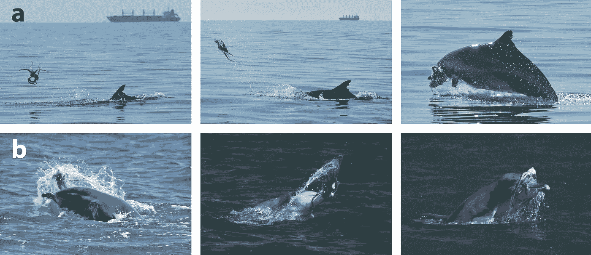
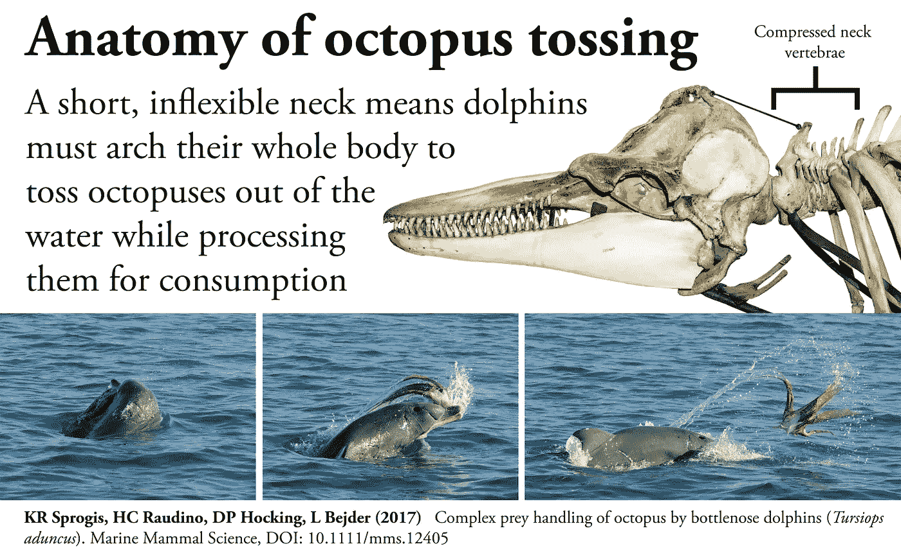
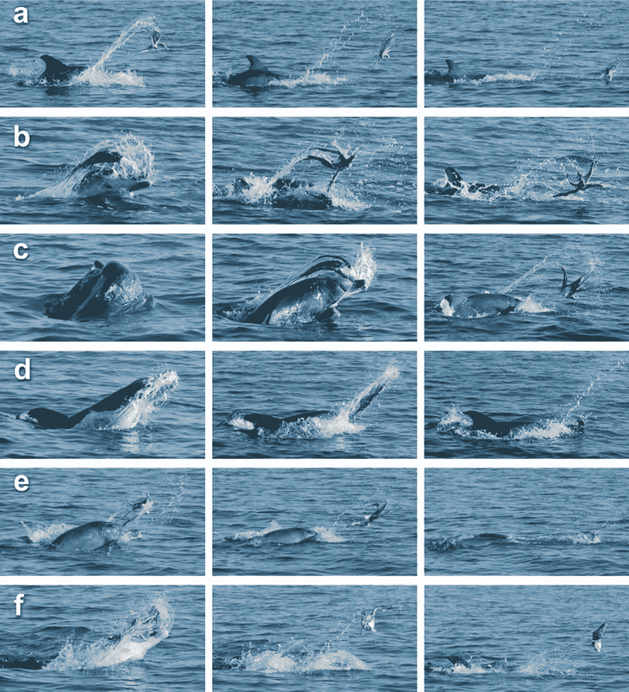
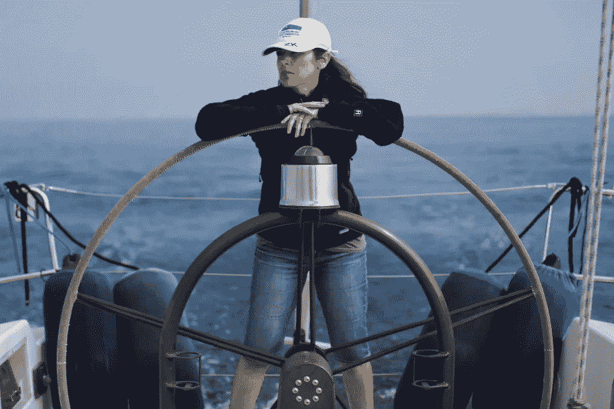

# 午餐时间:海豚对章鱼

> 原文：<https://medium.datadriveninvestor.com/lunch-time-dolphin-vs-octopus-426e682c73a?source=collection_archive---------6----------------------->

**如何不用手吃章鱼**

Bottlenose dolphin handling an octopus. Image:©K. Sprogis & M. Franklin/Murdock University

当猎物大到无法整个吞下时，捕食者会怎么做？它实际上取决于目标受害者的大小、质地和形状，但一般来说，它在被消费之前要经过某种形式的“加工”。
世界各地的不同动物都发现了聪明、有趣、有时甚至危险的游戏方式。在海洋中，豹海豹痛打海豹幼崽和海鸟，将它们分解成更小、更易消化的大块。摇晃和投掷猎物是澳大利亚毛皮海豹对付大型鱼类和头足类动物的一种有据可查的方式，虎鲸可以投掷一只海狮或把一只黑海豚的整个身体抛向空中。

另一种使用“摇晃”方法的物种是宽吻海豚。在我对南加州外的海洋哺乳动物进行的[实地研究](http://www.oceaconservation.org)中，我偶尔会看到沿海和近海的宽吻海豚摇晃大型猎物——通常是鱼，但有时甚至是章鱼——然后反复将它们抛向高空。

我一直着迷于观察和阅读这些大脑巨大的复杂动物所采用的这种不寻常的食物处理技术。因此，当我看到凯特·斯普罗吉斯(Kate Sprogis)和她的同事们写的一篇科学论文时，我立刻被迷住了，凯特·斯普罗吉斯是默多克大学鲸类研究部门的行为生态学家，她第一次详细描述了一群印度太平洋宽吻海豚对活章鱼的“摇晃和折腾”行为。想象一下捕捉并吃掉一只章鱼:如果你没有手，这可不是一件容易的事！考虑到章鱼已经被观察到将[锁定](http://www.grindtv.com/wildlife/dolphin-takes-octopus-clever-adversary-mounts-counterattack-photos/#ZGlyvHxfyquXFsDQ.97)在海豚的侧面和背部——危险地靠近喷水孔——附着在海豚的腹部(和它的[生殖器裂缝](http://io9.gizmodo.com/5919278/and-now-a-dolphin-with-an-octopus-stuck-to-its-naughty-bits))上，这也是一项危险的任务！)，甚至是[用自己长长的触角令人窒息的](https://theconversation.com/tackling-the-kraken-unique-dolphin-strategy-delivers-dangerous-octopus-for-dinner-75222)攻击者。

Anatomy of octopus tossing. Image: ©K. Sprogis / Murdoch

Sprogis 和她的团队在澳大利亚西南部本伯里海岸的浑浊浅水区记录了 45 次海豚(大多为成年雌性)处理章鱼的技巧。这些研究人员发现的是一个与厨师没有太大区别的食谱…首先，海豚移除章鱼的头；然后，是时候通过摇动来软化它的整个身体了——也确保通过一些额外的折腾来“解除”吸盘。这一过程的最后一步是将猎物在水中猛撞多次，使其破碎成更小、更易食用的碎片。瞧，食谱在几分钟内就做好了，章鱼就可以吃了！

A sequence of an octopus handling event by bottlenose dolphin off Bunbury, Western Australia. Each row (a–f) represents consecutive actions, displaying examples of the different types of handling methods: shaking (d) and tossing (a, b, c, e, f). Image: ©Kate Sprogis/Murdoch University Cetacean Research Unit

这么简单但同时又有风险的食谱有什么回报呢？Sprogis 认为这可能是这些海豚在其他地方找不到的高营养价值。关于有风险的商业部分，嗯…危险仍然存在，但事实上，这些海豚在黑暗的水域和猎物的交配季节(当它们更容易受到攻击时)捕捉章鱼可能有利于捕捉和处理它们。不错的海豚战略头脑！

原文来源: [Sprogis 等人 2017。宽吻海豚对章鱼复杂的猎物处理(*成年海豚*)。海洋哺乳动物科学 DOI 10.111/mms.12405](http://onlinelibrary.wiley.com/doi/10.1111/mms.12405/full) 。

这篇文章之前发表在 Maddalena Bearzi [国家地理](https://blog.nationalgeographic.org/tag/maddalena-bearzi/)博客上

The author during her marine mammal research off Southern California

Maddalena Bearzi 研究海洋哺乳动物的生态和保护已超过 25 年。她是[海洋保护协会](http://www.oceanconservation.org/)的主席和联合创始人，也是[美丽心灵:类人猿和海豚的平行生活](https://www.hup.harvard.edu/catalog.php?isbn=9780674046276)(哈佛大学出版社)的合著者。她也是几家出版物的摄影记者和博客作者，包括国家地理杂志。她的新书是[海豚机密:一位野外生物学家的自白](https://press.uchicago.edu/ucp/books/book/chicago/D/bo10896892.html)(芝加哥大学出版社)。