# M2GRL:一个面向网络推荐系统的多任务多视图图表示学习框架

> 原文：<https://medium.datadriveninvestor.com/m2grl-a-multi-task-multi-view-graph-representation-learning-framework-for-web-scale-recommender-a3a06655681b?source=collection_archive---------7----------------------->

*下载“*[*【KDD 论文云知识发现】*](https://resource.alibabacloud.com/whitepaper/cloud-knowledge-discovery-on-kdd-papers_2592) *”白皮书，探索 12 篇 KDD 论文和 12 位阿里巴巴专家的知识发现。*

*由王(翔宇)、林玉洁(婉容)、林(中宁)、杨克平(芍药)、明*

将图表示学习与多视图数据结合起来进行推荐是行业的新趋势。大多数现有的方法可以归类为多视图表示融合。它们将多视图数据集成到单个矢量中进行表示。然而，这引起了对不充分学习和归纳偏差的关注。在本文中，我们使用多视图表示对齐方法来解决这个问题。特别地，我们提出了一个多任务多视图图表示学习框架(M2GRL)来学习多视图图中的节点表示。M2GRL 涵盖了两类任务:视图内任务和视图间任务。视图内任务着重于学习同构图上的节点表示，而视图间任务用于学习两个不同视图之间的节点关系。此外，M2GRL 在训练过程中应用均方不确定性自适应调整任务的损失权重，以实现模型的更好收敛。根据离线和在线数据测试，该模型明显优于其他行业推荐算法，并已应用于淘宝上的多个服务。据我们所知，这是业界首次将多视图表示对齐方法应用于大规模图表示学习。

# 问题定义和抽象

多样性推荐是淘宝上的一个指标，指的是推荐用户最近没有点击的类别的商品。多样性度量基本上等同于学术社区中推荐的新颖性或多样性度量。提高多样性推荐的点击率(CTR)有助于改善淘宝上的长期用户体验。一个常见的工业推荐系统可以分为两个阶段:匹配和排序。本文主要关注匹配阶段。因此，我们的话题可以抽象为多样性匹配。根据我们的分析，多样性匹配的主要问题是数据的显著稀疏性，这增加了模型准确学习项目表示的难度。实际上，发现 CTR 比非发现 CTR 低得多。学习如何对稀疏数据建模一直是一个挑战。同时，多样性匹配和基本匹配是矛盾的。基本匹配将所有用户点击作为正样本来学习用户偏好。但是，如果分集匹配仅使用发现点击作为正样本，则可能会错过大量非发现点击。这些非发现点击也包含大量用户偏好信息。如果将它们作为负样本丢弃，模型的学习能力将大打折扣。学习如何解决发现点击样本和用户偏好之间的不匹配，以及如何在最终损失函数中反映这种不匹配仍然是重大挑战。然后，我们分析我们公司现有的技术能否解决这些问题。可行的方案是先匹配 item2item 数据，再根据用户的行为序列过滤掉非发现项。但是，这种方法无法通过模型进行优化，需要进一步考虑。

改进多样性度量的一个自然想法是推荐用户最近几天没有点击的类别中的项目；CTR 越高越好。在推荐系统中，匹配决定了推荐候选。所以我们从匹配入手，把这个问题定义为多样性匹配。由于用户行为数据的稀疏性，传统的协同过滤技术在推荐方面面临巨大挑战，尤其是在多样性匹配方面。项目嵌入可以减少稀疏性的影响。有许多方法来学习项目嵌入表示。基于图嵌入的方法在小组中得到了广泛应用。通常的做法是，所有的用户点击都被用作学习用户偏好的正面样本。但是，如果分集匹配仅使用发现点击作为正样本，则可能会错过大量非发现点击。这些非发现点击也包含大量用户偏好信息。如果将它们作为负样本丢弃，模型的学习能力将大打折扣。学习如何解决发现点击样本和用户偏好之间的不匹配，以及如何在最终损失函数中反映这种不匹配仍然是重大挑战。

然后，我们将问题分解为两个部分:学习全局基本表示和学习异构类别的度量。这类似于自然语言处理(NLP)中当前流行的预训练和微调的思想。)首先，我们使用全局基本表征来学习项目的基本表征。*注意:*这里我们使用所有用户点击，包括发现和非发现。这样，我们了解用户的全局偏好，而不丢弃有用的信息来实现多样性匹配的目的。然后，我们使用异构度量学习模型作为下游任务。我们使用所有预先训练的表示来学习用于匹配的异构类别的度量。这种分离的设计可以很好地解决我们前面强调的两个挑战。在预训练阶段，可以考虑所有用户点击，而在微调阶段，只需要考虑分集匹配的损失。此外，我们还在全局表示中引入了更多的节点信息，如知识图，它可以更好地模拟项目的表示和跨类别用户行为背后的潜在联系。

接下来，我们进一步分解问题。首先，我们把这个问题分解成一个异构的类别匹配。多样性匹配可以看作是异构类别匹配的子集。多样性匹配一定是异构类别匹配，而异构类别匹配不一定是多样性匹配。与基本的匹配和规则过滤方法相比，我们进一步收缩和限制了匹配空间。其次，我们将问题分解为两个部分，学习全局基本表示和学习异构类别的度量。这类似于 NLP 中当前流行的预训练和微调的想法。首先，我们使用全局基本表示来学习项目的基本表示。*注意:*这里我们使用所有用户点击，包括发现和非发现。这样，我们了解用户的全局偏好，而不丢弃有用的信息来实现多样性匹配的目的。然后，我们使用异构度量学习模型作为下游任务。我们使用所有预先训练的表示来学习用于匹配的异构类别的度量。这种分离的设计可以很好地解决我们前面强调的两个挑战。在预训练阶段，可以考虑所有用户点击，而在微调阶段，只需要考虑分集匹配的损失。

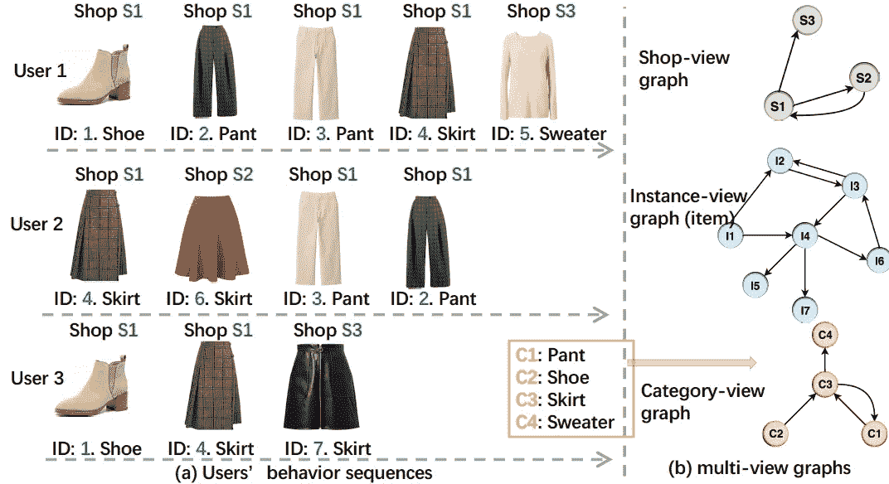

# 框架体系结构和技术选择

上图显示了我们模型的原始想法。我们基于用户行为序列构建了三个同构图，分别称为商店序列、商品序列和类别序列。如图所示，这些图形的结构各不相同。传统的只使用项目图或只构建一个异构图的方法会遗漏结构化数据。我们的目标是使用这样的结构化数据来更好地学习表示。

为了表达的方便和与我们的论文一致，从这一点开始，我们将学习全局基本表示称为 M2GRL，学习异构类别的度量称为多视图度量模型。接下来，我们将描述它们各自的细节。

## M2GRL

对于 M2GRL，我们使用来自认知图的信息，并专注于流行的图表示学习。电子商务场景以各种各样的信息为特色，从不同的角度展示商品。这可以被视为多视图学习问题，并且不同的特征可以被视为多视图数据。大规模图形表示学习的当前实践以两种方式使用多视图数据。一种是用项目建立网络，将多视角数据作为项目的属性引入网络进行表征学习。另一种是创建包含项目和多视图数据的异构图，然后通过使用图表示学习技术(如 metaath2vec)从异构图中学习表示。这里我们提出一个新的想法。首先，我们建立关于电子商务实体(单视图数据)的多个同质图(如类别图、项目图或商店图)，并从每个图中学习表示。然后，我们根据不同实体之间的连接进行多视图表示对齐。基于这一思想，我们提出了一种新的多任务多视图图表示学习框架 M2GRL。M2GRL 包含两种类型的任务:视图内任务和视图间任务。图表模型如下图所示。

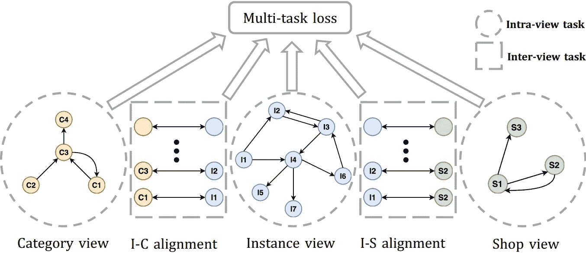

**1。视图内任务**

内视任务可以看作是同质图上的表征学习问题。理论上，我们可以使用任何图表示学习算法来学习同构图中的节点表示。在实践中，我们使用负抽样的跳格模型(SGNS。)该模型可扩展性强，便于并行化，已被证明是有效的。

对于给定的行为序列，跳格公式使平均对数概率最大化。

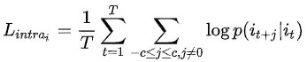

在哪里，

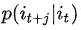

定义如下。

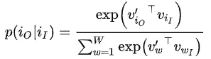

我们使用负抽样方法来近似最大化函数的对数概率。前面的公式可以转换成下面的形式。

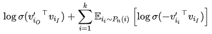

**2。视图间任务**

视图间任务的目标是了解不同实体之间的关系。例如，图中的 I-C 对齐表示学习项目和类别之间的关系。项目和类别在不同的嵌入空间中。因此，我们需要将它们映射到一个公共的关系嵌入空间，并在这个空间中学习它们的关系。具体来说，我们使用对齐变换矩阵 W 进行映射。因此，视点间任务的损失可以用下面的公式表示。

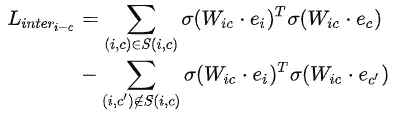

**3。学习具有同方差不确定性的任务权重**

M2GRL 需要全局优化的损失函数。通常的做法是执行加权线性组合。然而，权重是超参数，并且需要手动调整，这在具有大量数据的情况下是消耗资源的。相反，我们使用同方差不确定性思想来自动衡量模型训练期间每个任务的损失。我们给每个任务的预测结果分配一个高斯似然分布，并用它的标准差作为噪声干扰来度量不确定性。因此，我们将损失函数重写如下:

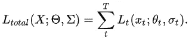

这两种类型的任务都可以视为类别分类任务。因此，我们可以使用 softmax 函数来表示可能性。

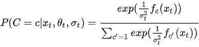

然后，我们把它放入损失函数，函数变成如下形式:

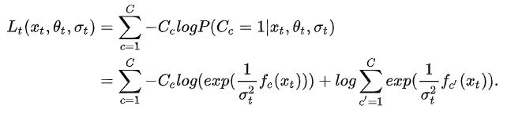

经过一些简化后，

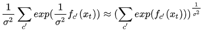

最终损失函数如下:

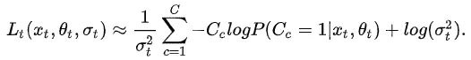

简而言之，不确定性的倒数(方差)作为每项任务的权重，权重没有标准化。当任务具有高度不确定性时，计算将具有大的梯度误差。因此，我们需要为此任务分配一个较低的权重。相反，当任务的不确定性较低时，任务的权重会增加。这样，我们可以动态调整多个任务的权重。

## 多视图度量模型

在淘宝上，推荐多样性是衡量长期用户体验的重要指标。如果推荐系统在同一类别中不断推荐类似的商品，例如不同颜色的相同裙子，顾客会感到厌烦。淘宝上的多样性推荐意味着所推荐商品的虚拟类别不会出现在用户最近 15 天的行为日志中。在传统的推荐算法中，同一类别的项目往往具有更高的相似性得分，这与我们的多样性匹配的目标相矛盾。我们相信通过 M2GRL 模型学习的多种表示可以用于多样性匹配推荐。启发性地，多样性建议是找到在实例视图嵌入空间中接近但在类别视图嵌入空间中远离的两个项目。这样，我们可以确保推荐的项目是多样的，并且是用户感兴趣的。因此，我们提出了一个简单的多视图度量模型。我们使用了两种表示:一种来自实例-视图嵌入空间，另一种来自实例-类别关系嵌入空间。

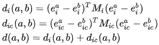

我们使用对比损失来学习度量矩阵。

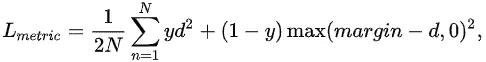

度量空间中学习到的嵌入可以用于随后的匹配操作。

# 摘要

我们提出用 M2GRL 来构建一个网络规模的推荐系统。有关建模细节和实验结果的信息，请参见下面的两个链接。

[M2GRL:来自康奈尔大学的用于网络规模推荐系统的多任务多视图图表示学习框架](https://arxiv.org/abs/2005.10110)

[开源代码](https://github.com/99731/M2GRL)

*本文观点仅供参考，不代表阿里云官方观点。*

# 原始来源:

 [## M2GRL:一个用于网络规模推荐的多任务多视图图表示学习框架…

### Alibaba Clouder 年 10 月 15 日 79 下载《KDD 论文中的云知识发现》白皮书，探索 12 KDD…

www.alibabacloud.com](https://www.alibabacloud.com/blog/m2grl-a-multi-task-multi-view-graph-representation-learning-framework-for-web-scale-recommender-systems_596742)