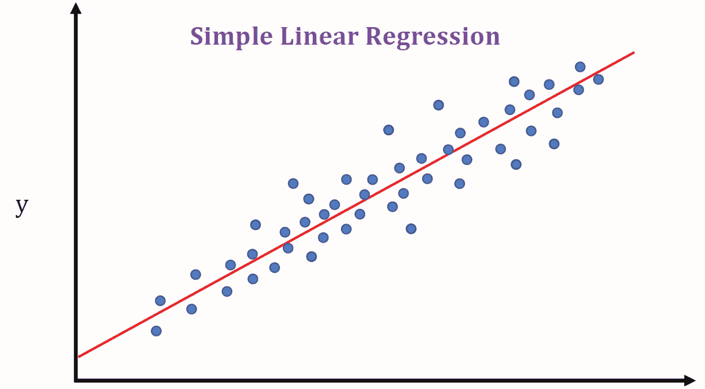
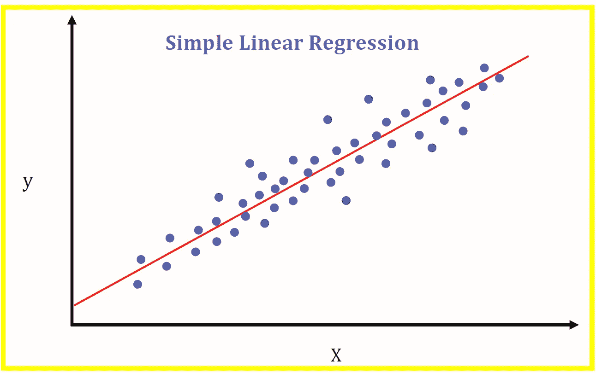

# 线性回归简介—机器学习 101

> 原文：<https://medium.datadriveninvestor.com/machine-learning-101-part-1-24835333d38a?source=collection_archive---------3----------------------->

# 简介:

嘿！我叫马丁。在过去的一周里，我一直在用 IBM 的 Coursera 课程开始机器学习:用 Python 进行机器学习。(我真的建议那些探索机器学习的人)作为初学者，我被介绍的第一个机器学习模型之一是**线性回归。**这是最受**欢迎和最基本的 mL** (机器学习)模型之一

如果你开始学习机器学习，你可能也听说过线性回归，但也许你已经陷入了术语，复杂的公式和方程。如果你有，这是给你的文章。

# 基础:(监督学习，回归等。)

在我们开始之前，让我们检查一些机器学习的基础知识。

一个**机器学习模型**是一个关于机器如何从给定数据中学习以及学习什么的框架。一般来说，**机器学习模型**可以分为两种不同的类别:**有监督的**和**无监督的**。现在，我们只需要知道监督学习模型使用**标记的训练**数据。标记的训练数据是与输出数据配对的输入数据。本质上，受监督的机器学习模型知道问题的答案，因此可以假设它们之间的联系。

现在，监督学习模型，也可以分别归类为两个一般子类:**回归**和**分类**。回归时，输出数据为**连续**，分类时，输出为**离散**。连续数据通常是数字数据，而离散数据是分类数据。线性回归是监督学习和回归的一种形式。

# 简单线性回归:

线性回归模型可以进一步分为简单线性回归和多元线性回归。简单回归是指在**奇异输出**和**输入之间映射**线性关系**的模型。**

该关系的**估计值**作为线性函数给出:

> ŷᵢ = β₀ + β₁Xᵢ

*   y hat sub i (ŷᵢ)表示给定输入的估计输出。(Xᵢ)
*   在这个等式中，β₀是一个**偏差**，β₁是模型的**权重**。如果模型被绘制成输出为 y 轴，输入为 x 轴，β₀指的是 **y 轴截距**，β₁代表**斜率。**

Example of a two dimensional representation of the equation where the x axis refers to an input and the y refers to the output. **Source: Benjamin Obi Tayo**

实际的线性关系可以表示为:

> yᵢ = β₀ + β₁Xᵢ + ε

*   y i (yᵢ)代表给定投入(Xᵢ)的实际产出
*   ε代表**随机误差项。**随机误差项表示估计关系和实际关系之间的残差。它受制于**的可变性。**

随机误差项(ε)的包含表明实际数据点总是与预测结果有一些**偏差**。因此，在线性回归中，我们找到了估计值，因为我们无法预测随机误差项。

现在，在给定输入的情况下，找到估计输出可以像假设权重和偏差的“最佳”值(β₀和β₁)一样简单。这可以通过在给定数据上训练和测试模型来完成。

本质上，这就是简单线性回归的工作方式。

# 多元线性回归:

多元线性回归与简单线性回归非常相似。然而，它映射了**多个**类型的输入和一个输出之间的关系。

该关系的估计值可由下式给出:

> ŷᵢ = β₀ + β₁Xᵢ₁ + β₂Xᵢ₂ + … βnXn

* n 代表下标 n

*   y hat sub i (ŷᵢ)表示给定输入的估计输出。(Xᵢ)
*   β₀是一个**偏差**和β₁，… βn 是模型的**权重**。
*   Xᵢ₁，……xᵢn 代表所有单独的**输入**数据点，而 Xᵢ₁代表 X₁.输入类型的单个数据点
*   n 是输入数据类型的数量

多元线性回归方程可以绘制成一个 n 维平面。

Example of n-dimensional plane where one axis represents an axis and the others represent different inputs. **Source: Boston University**

像简单的线性回归一样，训练和测试可以用来找到权重和偏差的最佳值。

# 线性回归的利弊:

线性回归极其简单，易于应用。相比之下，训练线性回归模型不需要太多时间，对于初学者来说是一个很好的开始。然而，问题是线性回归，尤其是简单的线性回归，简化了许多现实世界的问题；大多数真实生活变量没有直接的线性关系，因此拟合线性回归模型将导致不能完全代表这种联系。

我希望你对这篇文章感兴趣😀感谢阅读！！

请随时联系我的电子邮件:martintin@rogers.com