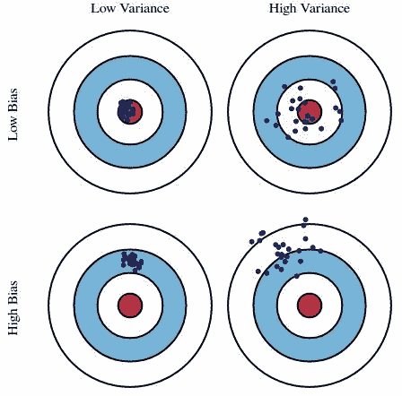
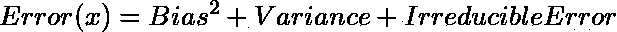
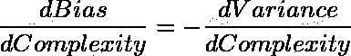

# 机器学习 101——偏差-方差难题

> 原文：<https://medium.datadriveninvestor.com/machine-learning-101-the-bias-variance-conundrum-f4143ba9f179?source=collection_archive---------12----------------------->

确定我们模型的性能是机器学习过程中最关键的步骤之一。理解偏差-方差权衡是解释我们模型结果的重要一步。尽管本质上很琐碎，但这种权衡背后的概念很容易掌握，并允许我们创建更好、更有用的模型。

Photo by [Nathan Dumlao](https://unsplash.com/@nate_dumlao?utm_source=medium&utm_medium=referral) on [Unsplash](https://unsplash.com?utm_source=medium&utm_medium=referral)

任何机器学习模型的泛化误差都可以定义为三种不同误差的总和—

1.  **不可约误差:**顾名思义，无论我们选择什么算法都是不可约的。它被引入到我们的模型中是因为我们构建问题的方式，并且可能是由影响我们目标变量预测的未知变量引起的。
2.  **偏差误差:**当我们的模型做出错误的假设时，就会出现偏差误差
3.  **方差误差:**由对训练集中微小变化的敏感性引起

> 当我们讨论预测模型时，预测误差可以分解成我们关心的两个主要子部分:由于“偏差”造成的误差和由于“方差”造成的误差。在模型最小化偏差和方差的能力之间有一个权衡。理解这两种类型的误差可以帮助我们诊断模型结果，避免过度拟合或欠拟合的错误。~斯科特·福特曼-罗

在这篇博文中，我们将重点关注*偏差误差、方差误差*和*偏差-方差权衡。*

# 偏移误差

偏差是我们模型的预期预测与实际目标值之间的差异，即我们的预测与实际值之间的差距。本质上，我们的模型的偏差是由它预测我们的目标值的假设决定的。简而言之，高偏差意味着我们的学习算法没有捕捉到潜在的模式。这种模型随后会在训练集和测试集上产生很大的误差。

*   *决策树、k 近邻*和*支持向量机*都是低偏向机器学习算法
*   *线性回归*和*逻辑回归*是高偏差机器学习算法

# 方差误差

它被定义为如果我们使用不同的训练集，我们的模型的预测将改变的量。具有高方差的模型往往更关注训练集中存在的数据，并且不能很好地概括，即，它们在测试集上表现不好。换句话说，这种机器学习算法试图尽可能地使自己适应训练数据。通过这样做，他们做出了复杂的假设，这些假设可能只对训练数据成立，因此他们在测试集上的表现要差得多。

*   *线性回归*和*逻辑回归*是低方差机器学习算法
*   *决策树、k 近邻*和*支持向量机*是高方差机器学习算法

# 偏差-方差权衡

现在，让我们借助牛眼图来尝试理解偏差和方差之间的权衡。我们已经知道的一件事是，偏差和方差彼此成反比，也就是说，如果偏差增加，那么方差减少，反之亦然。

 [## 在脑机接口中使用机器学习|数据驱动的投资者

### 神经技术是一个刚刚开始大步前进的前沿领域。有了所有的技术…

www.datadriveninvestor.com](https://www.datadriveninvestor.com/2020/07/31/using-machine-learning-in-brain-computer-interfaces/) 

我们假设图表的中心是一个完美预测目标值的模型，离中心越远，我们的预测就越差。如果我们重复我们的模型构建过程，在这里或那里做一些改变，那么每次我们都会得到多个目标，每个目标代表一个单独模型的性能。

[Bulls-eye diagram depicting the Bias-Variance Tradeoff](http://scott.fortmann-roe.com/docs/BiasVariance.html)

为了了解如何解释我们的结果，让我们来看看我们可能观察到的不同情况:

1.  **低偏差&低方差**

*   我们机器学习模型的理想情况
*   预测的误差尽可能低
*   当我们选择不同的训练集时，预测不会有太大的变化

**2。高偏置&高方差**

*   我们的机器学习模型的最坏情况
*   预测的误差极高
*   当我们使用不同的训练集时，预测波动很大

**3。高偏差&低方差**

*   通常被称为*欠拟合*，这意味着我们的模型无法捕捉数据中存在的潜在模式
*   通常是由于存在少量数据而发生的

[Underfitting vs Overfitting](https://docs.aws.amazon.com/machine-learning/latest/dg/model-fit-underfitting-vs-overfitting.html)

**4。低偏差&高方差**

*   也称为*过度拟合*，这意味着我们的模型发现了数据中存在的潜在模式，但也将噪声解释为有用的信息
*   当我们在没有被正确清理的数据上训练我们的模型时，就会发生这种情况

# 摘要

在本质上，偏差-方差权衡旨在避免欠拟合和过拟合。随着模型复杂性的增加，偏差减少，而方差也增加。换句话说，如果我们不断向模型中添加更多的特征，我们的主要关注点就会从减少偏差转移到减少模型的方差。

[Error Complexity Curve](http://scott.fortmann-roe.com/docs/BiasVariance.html)

如前所述，我们模型的泛化误差由三种不同的误差组成，可以用数学方法描述如下:

上面显示的误差复杂性曲线中的虚线表示最佳模型复杂性，并被视为我们机器学习模型的*最佳点*。当偏差的增加等于模型方差的减少时，我们可以说找到了最佳点。数学上我们得到:

如果我们模型的复杂性超过了最佳点，那么我们就过度拟合我们的模型，如果我们没有达到最佳点，那么我们就不足拟合我们的模型。

# **结束…**

本质上，我们可以将偏差和方差之间的关系定义如下:

*   增加偏差会减少方差；和
*   增加方差将减少偏差

虽然没有确定的方法来获得所谓的最佳点，但我们可以通过使用适当的指标来分析我们模型的性能，或者根据我们的目的选择正确的算法(及其适当的配置)来尽最大努力找到它。因此，我们可以得出结论，偏差-方差权衡是一个重要的考虑因素，我们可以将其用作确定我们的机器学习模型的预测性能的起点。

**资源:**

1.  [*机器学习中偏差-方差权衡的温和介绍*](https://machinelearningmastery.com/gentle-introduction-to-the-bias-variance-trade-off-in-machine-learning/)
2.  [*了解偏差-方差权衡*](http://scott.fortmann-roe.com/docs/BiasVariance.html)
3.  [*偏差-方差权衡— Bhavesh Bhatt*](https://www.youtube.com/watch?v=0UTNyTZgEWQ)

**访问专家视图—** [**订阅 DDI 英特尔**](https://datadriveninvestor.com/ddi-intel)