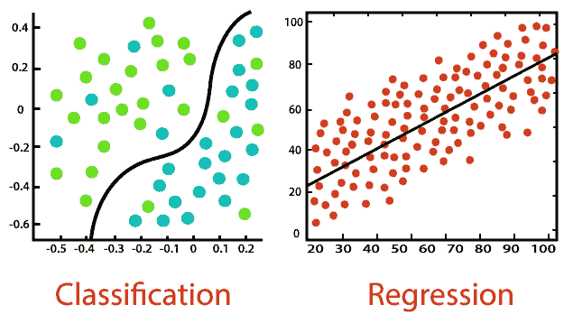

# 机器学习:简单介绍

> 原文：<https://medium.datadriveninvestor.com/machine-learning-a-simple-introduction-5772abc3cd78?source=collection_archive---------12----------------------->

## 简而言之，这很像看着一个蹒跚学步的孩子成长

Photo by [Photos Hobby](https://unsplash.com/@photoshobby?utm_source=medium&utm_medium=referral) on [Unsplash](https://unsplash.com?utm_source=medium&utm_medium=referral)

登陆月球？那是旧闻了。触摸屏手机？好吧，布玛儿。最新的技术是机器学习，它会一直存在下去。

“机器学习”这个术语经常被提起。那么，*到底是什么*？嗯，名字本身就说明了一切。机器学习算法使用经验和统计来改进。一开始，算法可能不起作用。然而，它会不断尝试，一次比一次进步。

这就像看着一个婴儿试图说出他的第一句话。几个月来，他们都会胡言乱语。然后有一天，莫名其妙地，冒出了“妈妈”这个词。

继续婴儿类比，婴儿将继续学习更多的单词并理解它们的意思。同理，机器学习也是不断学习的。它想要到达一个点，在那里它被输入一些信息，它自动地知道如何处理这些信息。

那么，*为什么*会起作用呢？

# 简要概述

机器学习、深度学习、人工智能不一样。它们更像是子文件夹中的文件夹。人工智能(AI)是机器复制人类思维的一种方式。机器学习使用*大量*数据让人工智能更像人类。深度学习试图走得更远，通过使用更多的“神经元”来做决定。

AI vs Machine Learning vs Deep Learning | [Edureka](https://www.edureka.co/blog/ai-vs-machine-learning-vs-deep-learning/)

在本文中，我们将关注机器学习。它有多种应用，从检测欺诈到股票交易。以下是一些例子:

1.  虚拟助手:我们可能都听说过苹果的 Siri 或者亚马逊的 Alexa。他们可以通过你的声音给你答案或者完成简单的任务。机器学习是他们能够理解你在说什么并意识到他们应该做什么的原因。
2.  预测软件**:如果你乘坐过优步或出租车，那么你会看到这款应用如何预测乘车费用以及司机到达你那里需要多长时间。使用你的设置的大型数据集，机器学习算法(相当准确地)预测这些事情。**
3.  **社交媒体**:可能是最有争议的，社交媒体网站使用机器学习来吸引观众。脸书的算法从海量数据中筛选出个性化的广告。根据你的视频历史，YouTube 的机器人可以推荐类似的视频。

使用三种主要方式——监督学习、非监督学习和强化学习——机器能够完成一些疯狂的壮举。

# 机器学习的过程

如果你有大量的数据，机器学习效果最好。从这些数据中，您可以找到组，将新数据分类到现有的类别中，或者预测下一个输入。

要做到这一点，你必须建立能够自我学习的模型。
你不是在建造学习的机器人。相反，你正在建造一个制造者机器人和一个测试者机器人。

创客机器人构建了无数个具有随机特征的学生机器人，并发送给测试者机器人。测试机器人分析哪些机器人工作得最好，然后将其余的机器人送回制造机器人进行改进。经过无数次迭代，学生机器人大军大多数时候都会得到正确的答案。

Machine Learning Process | [Data Science Central](https://www.datasciencecentral.com/profiles/blogs/deep-learning-pictures)

因为算法是自己进化的，即使是它的人类制造者通常也不知道它是如何工作的。这些机器人非常复杂，几乎不可能破译。

机器学习主要是试错。然而，这些学生机器人有不同的学习方式。每一种都有其优点和缺点。

 [## 什么是数据目录，它如何使机器学习取得成功？数据驱动的投资者

### 数据目录是机器学习和数据分析的燃料。没有它，你将不得不花费很多…

www.datadriveninvestor.com](https://www.datadriveninvestor.com/2020/08/27/what-is-a-data-catalog-and-how-does-it-enable-machine-learning-success/) 

# 监督学习

顾名思义，这种方法是机器“学习”的一种方式，同时人类确保它们是正确的。

## 工作原理:

想象一下，如果你是第一次学英语。你从字母表开始。你的老师拿着一张写有字母 A 的抽认卡。你认不出来，所以你猜。你觉得是 b，老师纠正你，下次你就不会错了。

就是这样。有监督的机器学习允许这些算法/机器人用现有的答案进行训练。maker bot 将测试不同的方法来猜测答案，直到有一种方法奏效。

## 使用时:

监督学习常用于**回归**和**分类**。您可以使用回归来预测未来某个时间的数值，如温度。另一方面，分类将用于为诸如“明天是冷还是热？”这样的问题提供定性答案

Classification vs Regression | [Javatpoint](https://www.javatpoint.com/regression-vs-classification-in-machine-learning)

如您所见，分类图中有一条划分数据的线。如果引入一个新的部分，它将根据数据的位置提供一个答案。回归给出了最佳拟合线。如果你有一个 x 值，它可以预测 y 值。

## 缺点是:

*   **限制使用**:输入未经训练的东西时，分类和回归“中断”。例如，如果给一个对狗和猫的图像进行分类的算法一张牛的图片，它仍然会输出狗或猫的答案。
*   **独立思考**:被监督的 ML 不能独立思考。为了训练它，人类必须通过提供答案来教它。因此，它不能得出任何创新的结论，因为它不能得出任何新的结论。

## 示例:

*   **房价:**分析完房子的数据——位置、面积、卧室和卫生间数量、地段大小等。—机器学习算法可以预测给定经济中的房价。
*   **热还是冷？**给定温度、湿度、时间、历史天气等。，一些机器人可以确定给定的一天/时间是热还是冷。

# 无监督学习

与监督学习相反，这种方法允许机器在没有人工干预的情况下得出结论。

## 工作原理:

回想一下你的童年。你可能没有学到你所知道的一切。也许有人教过你什么是花。但是，你没有教过*每一种*类型的花；然而，你知道玫瑰和雏菊是花，但不是草。

作为人类，我们本能地在大脑中对事物进行分类。无监督学习旨在复制这一点，允许算法从给定的数据中得出结论。

## 使用时:

无监督学习最常用于**聚类**。聚类是将数据分类成组的过程。聚类最常见的用例是从给定的数据集中得出结论，而不需要设置类别。如果没有“正确的答案”或者数据是新的/复杂的，这将非常有用。

Classification vs Clustering | [Machine Learning 101](https://medium.com/@kevin.c.lee26/machine-learning-101-classification-vs-clustering-e11b12c71243)

聚类不同于分类。虽然它们都依赖于分组，但它们也有不同之处。首先，分类需要人工干预，而聚类不需要。以下是它们的定义，并列。

**分类**使用预定的组，并根据参数将新数据分类到这些组中。

**聚类**识别不同数据点之间的关联，并根据机器的基本原理对它们进行分组。

## 缺点是:

*   **不可预测**:无人监管的 ML 需要很大的耐心。通常，机器得出的结论没有价值。你只能等待，直到它找到一个对你的数据分析有帮助的模式。
*   **精度**:聚类的边缘通常是模糊的。因为输入数据没有被人类标注，所以无法判断结论是否正确。

## 示例:

*   顾客细分:一家玩具公司想知道他们的广告以哪个年龄组为目标。他们将使用聚类来发现客户之间的相似之处，并根据最有利可图的内容制定计划。
*   **降低复杂度**:有时候，需要分析的数据太多。如果你有数百万个数据点，你会希望有一台机器将它们聚类成相似的组，从而使数据分析更容易。

# 强化学习:

强化学习的目标是让机器朝着目标做出一系列正确的决策。

## 工作原理:

当解决一个复杂的数学问题时，你不能立即找到答案。相反，你必须朝着那个方向采取措施，希望把以前的难题简化成简单的步骤。

强化学习遵循类似的路径。通过反复试验，机器学会了完成目标需要做什么。设计者设定游戏的规则和目标，但是机器必须试验不同的策略。

## 使用时:

强化学习最常用于复杂的模拟。都是顺序做决策，希望能“赢得”程序员设定的游戏。主要有两种:**负**和**正**强化。

**负面强化**强化一种行为，因为避免了负面情况。在机器学习中，这是有益的，因为它增加了行为，但只是最小的量。一个很好的类比是，机器将学习如何行走，但不会学习如何奔跑。

**正强化**效果相反。机器会增加做某个行为的频率，因为它会因此得到奖励。虽然它允许机器超出最低要求，但过多的强化将导致过载(因为许多行为都有积极的结果)。

## 缺点是:

*   **应用**:强化学习在模拟中很有帮助，但是应用到现实世界中很容易出问题。由于现实生活中有这么多无形的东西，这些机器很难工作。
*   **优化**:因为这些算法的目标是找到做某件事的“最佳”方式，所以可能会为了目标而过度优化。他们可能不遵守规则，而是支持实现其目标。这里有一个例子:

Misspecified Reward Functions | [Jack Clark](https://www.youtube.com/watch?v=tlOIHko8ySg)

如你所见，目标是让机器获得尽可能多的奖励，而不是完成比赛。虽然对于人类来说，完成比赛似乎是常识，但机器不会合理化。

## 示例:

*   **机器人**:利用强化学习，机器人已经开始学习复杂的任务。例如，一些机器人学会了如何在水瓶上拧盖子。
*   游戏:机器在玩游戏方面越来越出色。例如，谷歌著名的 AlphaGo 引擎已经击败了世界上所有最好的围棋选手。如今，最好的围棋比赛都是在不同的机器之间进行。

# 外卖:

机器学习是一个复杂的话题。这里是我们在这篇文章中经历的一些要点。

*   **机器学习**有着各种各样的应用，并且正在商业应用中建立牵引力。
*   **监督学习**要求人类验证机器的答案。它可以使用分类和回归进行预测或分类。
*   **无监督学习**算法获取数据并从中得出结论，无需人工干预。聚类使人类能够看到他们可能从未认识到的大型数据集中的模式。
*   **强化学习**朝着奖励/目标优化。尽管它在模拟和效率方面很棒，但它在现实世界中的应用仍处于开发过程中。

# 参考资料:

*   [1] [机器学习中监督与非监督学习的经典例子](https://www.springboard.com/blog/lp-machine-learning-unsupervised-learning-supervised-learning/) (2020)，跳板博客
*   [2] M. Heller，[无监督学习解释](https://www.infoworld.com/article/3429017/unsupervised-learning-explained.html) (2019)，InfoWorld
*   [3] C. Granville，[用两张图概括的机器学习过程](https://www.datasciencecentral.com/profiles/blogs/deep-learning-pictures) (2018)，数据科学中心
*   [4] [机器学习中的回归 vs 分类](https://www.javatpoint.com/regression-vs-classification-in-machine-learning) (2018)，Javatpoint
*   【5】[强化学习](https://www.geeksforgeeks.org/what-is-reinforcement-learning/)。(2018)，GeeksforGeeks

伊森·魏是特洛伊高中十年级的学生。请随时在 LinkedIn 上联系他！

## 访问专家视图— [订阅 DDI 英特尔](https://datadriveninvestor.com/ddi-intel)