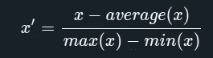

# 机器学习概念✅

> 原文：<https://medium.datadriveninvestor.com/machine-learning-concepts-207ec1e352f9?source=collection_archive---------27----------------------->

## 特征、正则化、缺失值等！


Photo by [Matthew Henry](https://unsplash.com/@matthewhenry?utm_source=unsplash&utm_medium=referral&utm_content=creditCopyText) on [Unsplash](https://unsplash.com/s/photos/machine-learning?utm_source=unsplash&utm_medium=referral&utm_content=creditCopyText)

这是机器学习系列的第二篇博文，在这里，我们将讨论机器学习最常见的概念，如特征类型、缺失值、正则化等

## 特征

当设计一个学习特征的算法时，我们的目标是分离变异的**个因素**📊解释观察到的数据。

特征是我们的数据集中有助于构建 ML 算法的组件。基于这些值有不同类型的特征，如**数字、序数**等。

> **名义值—** 具有名义值的变量自然没有任何顺序。例如，一个人的名字可以被认为是一种名义上的数据类型，因为我们不能将一个名字与另一个名字进行比较。
> 
> **序数—** 具有自然顺序的变量本质上是序数。例如，**教育程度**(“高中”、“理科”、“理科”、“博士”)。

因此，在对数据集应用算法之前，我们需要将数据集转换为算法可以使用的格式。例如，我们可以处理分类值，通过将它转换成一个**独热编码**，类似于将类别映射到数值。


**Figure 1:** AILabPage Machine Learning Series — Machine Learning Process

## **特征工程**

机器学习中的任何问题都需要大量的特征工程，这意味着人们不能简单地在数据集上做`model.fit(x, y)`并获得 SOTA 结果。

**特征工程需要创造力和对领域的理解。**

> 例如，在 X 地区，大小为“a”的房屋的价格高于 Y 地区相同大小的房屋，即使该地区不是原始数据集中的一个要素。

## **一个热编码**

很少有像决策树这样的算法，它将具有值为“红”、“蓝”等的颜色等分类特征作为输入，而不进行一次性编码，但大多数算法要求特征值为**数字**。要转换这些功能，我们可以使用一个热编码。

```
 red = [1, 0, 0]    
  blue = [0, 1, 0]
orange = [0, 0, 1]
```

> 一种热编码增加了特征向量的维数，并且还变换了像颜色这样的特征——红色为 1，蓝色为 2 等，这将使颜色特征生成算法的值“有序”,以将某种颜色比其他颜色分配更大的重要性。一定是 avoided❌.

## **处理缺失值**

原始数据面临着不同的挑战，一个常见的挑战是要素值缺失。要克服缺失值问题，可以采取以下措施:

*   如果数据集足够大，则丢弃样本。
*   进行数据插补，以填补缺失值的缺口。
*   很少有算法对缺失值具有鲁棒性。

## **数据插补**

*   一种估算方法是找出特征的平均值并替换缺失值。(如果存在异常值，请小心)。
*   替换为特征范围之外的值，即如果特征 x 为[0，1]，则用-1 或 2 替换缺少的值。它单独为这个样本提供了一个独特的特征值。
*   替换为范围中间的值，即如果特征 x 为[-1，1]，则用 0 替换缺少的值。这使得算法较少受到 0 的影响。

## **缩放**

## **为什么要缩放？**

在构建/应用 ML 算法之前，缩放特征是一项重要的任务。例如，如果某个算法没有使用要素缩放，那么它会认为 300 米的值大于 5 km，这是不正确的，在这种情况下，该算法会通过赋予 300 米比 3 km 更大的重要性来给出错误的预测。因此，我们使用特征缩放来归一化它的值。

## **缩放类型**

*   最小-最大缩放或归一化
*   均值归一化
*   标准化或 Z 分数标准化

***最小-最大缩放*** 有助于将特征值重新缩放到[0，1]或[-1，1]的范围内。


Min-Max Scaling

***表示归一化***



Mean Normalization

***特征的标准化*** 使数据中每个特征的值具有零均值和单位方差。这是一种广泛使用的标准化技术，因为像 SVM、神经网络和逻辑回归这样的主要算法都遵循这种标准化。


Standaridization

## 偏差和方差的权衡


Model Complexity vs Error

B 例如，在抽样调查中，偏差是样本统计系统地高估或低估总体参数的趋势。在机器学习中，当模型在训练集上表现不佳时，即模型不能识别训练集中的模式，使其过于简单时，该模型被称为遭受偏差。**随着模型复杂度的增加，偏倚减小。**

当统计模型或机器学习算法无法捕捉数据的潜在趋势时，就会出现欠拟合。直观地说，当模型或算法与数据拟合得不够好时，就会出现拟合不足。具体来说，**如果模型或算法显示低方差但高偏差，则出现欠拟合**😥**。**

V **方差**在机器学习的上下文中，是由于模型对训练集中的小波动的敏感性而发生的一种错误。高方差会导致算法对训练集中的噪声进行建模。这通常被称为过度拟合。

在上图中，随着模型复杂性的增加，方差也在增加，导致模型过度拟合。**为了避免这种情况，我们跟踪验证损失，如果模型过拟合，验证损失会很高。在深度学习中，我们执行*提前停止*** 🙂**避免过度拟合。**

O **过拟合**是指过于拟合训练数据的模型。当一个模型学习了训练数据中的所有细节和噪声，以至于对新数据的模型性能产生负面影响时，称为**过拟合模型**😥**。**

## 权重多久更新一次

在训练模型时，算法迭代地更新权重或参数，以减少估计 y 和目标 y 之间的误差，权重更新的频率取决于训练集的批量大小。


Batch vs Stochastic vs Mini-Batch

**批量梯度下降**是对权重矩阵进行梯度更新(权重更新)的过程。**如果我们有 1000 个数据点，那么在对模型的权重进行任何更新之前，模型在 1000 个数据点上被训练。**

**随机梯度下降**是对权重矩阵进行梯度更新(权重更新)的过程。**如果我们有 1000 个数据点，那么在 1 个数据点上训练模型，并更新模型的权重。**

**小批量梯度下降**是对权重矩阵进行梯度更新(权重更新)的过程。**如果我们有 1000 个数据点，那么我们给 batch_size 赋值，如果 batch_size 是 10，那么在 10 个数据点上训练模型，并且对模型的权重进行更新。这种情况反复发生，取 10 个数据点，然后更新。**

## **正规化**

假设我们有一个包含两个要素和一个目标变量的简单数据集，我们可以对两个变量使用具有两个系数的简单模型，也可以使用具有更多系数的复杂模型来了解潜在因素，并且会过度拟合简单数据集。复杂模型不会对新数据进行归纳，因为它是一个过拟合模型。

***为了克服过拟合，选择一个简单的模型，我们可以使用正则化。***

## **L1 正规化**

在计算误差(E)时，我们添加模型系数的绝对值。在简单模型情况下，我们有 2 个系数 w1，w2，


Total Error with two coefficients

在复杂模型情况下，假设有 5 个系数 w_1，w_2，w_3，w_4，w_5，


Total Error with five Coefficients

因此，对于简单模型，我们得到较小的误差，并且将同样用于一般化。

**L2 正规化**

在计算误差(E)时，我们对模型的系数取平方值。在简单模型情况下，我们有 2 个系数 w1，w2，


在复杂模型情况下，假设有 5 个系数 w_1，w_2，w_3，w_4，w_5，


因此，对于简单模型，我们得到较小的误差，并且将同样用于一般化。**参数数量越多，模型越复杂。**

**如何选择正则化参数(** ƛ **)？**

基于数据的复杂性，模型往往是复杂的。所以ƛ值就像一个开关，要么增加复杂性，要么不增加复杂性。如果我们保持小的ƛ值，并将其乘以模型的复杂性部分，即“w”参数，那么与具有“w”参数的简单模型相比，我们得到更小的误差。而如果ƛ很大，那么我们就把复杂的部分罚得很重，从而使得复杂的模型有很大的误差。


模型的复杂性由方程中参数(w)的数量来定义。

在 [YouTube](https://www.youtube.com/channel/UCFKxdpoc4KdMjUaAsMi7gmg) 、 [LinkedIn、](https://www.linkedin.com/in/mayur-jain-ds)和 [Twitter](https://twitter.com/mayur__22) ✋上与我联系