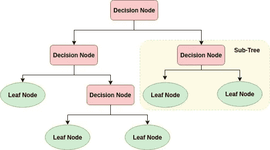
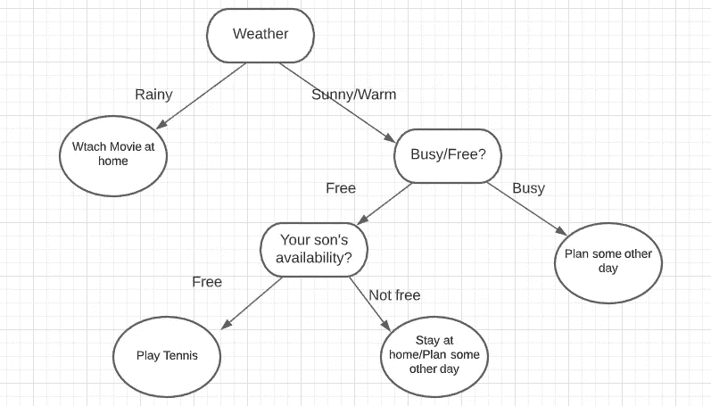
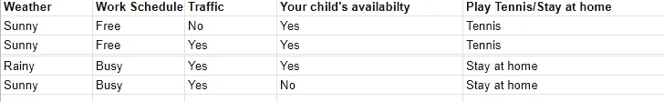
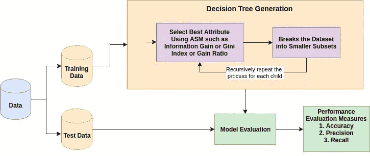
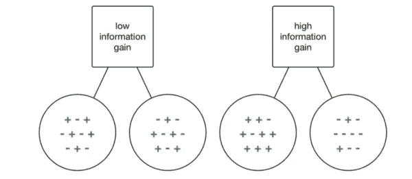
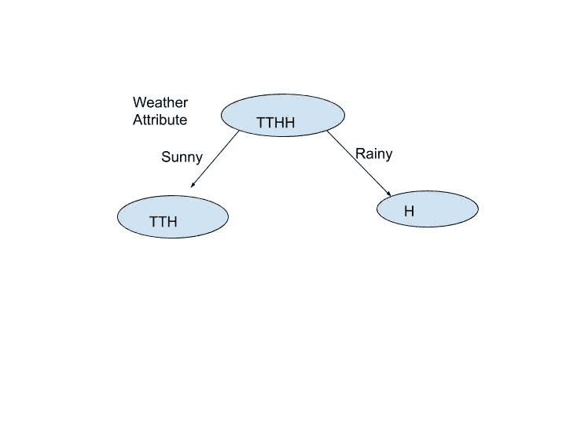
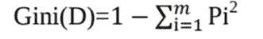
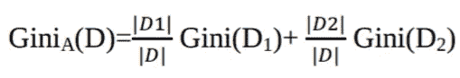
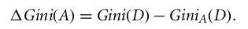

# 机器学习:现实生活中的决策树示例

> 原文：<https://medium.datadriveninvestor.com/machine-learning-decision-trees-example-in-real-life-b78865015b6f?source=collection_archive---------2----------------------->

正如树是人类生活的重要组成部分一样，基于树的算法是机器学习的重要组成部分。树的结构给了开发算法的灵感，并将其输入到机器中，以学习我们希望它们学习的东西，并解决现实生活中的问题。这些基于树的学习算法被认为是最好的和最常用的监督学习方法之一。决策树、随机森林、梯度推进等方法在各种数据科学问题中得到了广泛应用。因此，对于每个机器学习的初学者来说，学习这些算法并将其用于建模是非常重要的。

# 什么是决策树？

决策树是一个树状图形，节点代表我们选择属性和提出问题的位置；边代表问题的答案，叶子代表实际输出或类标签。它们用在具有简单线性决策表面的非线性决策中。

决策树通过从根到某个叶节点对示例进行排序来对示例进行分类，叶节点为示例提供分类。树中的每个节点都充当某个属性的测试用例，从该节点开始向下延伸的每条边都对应于测试用例的一个可能答案。这个过程本质上是递归的，并且对以新节点为根的每个子树重复这个过程。

**现实生活中的决策树**

你可能在自己的生活中使用过决策树来做决定。让我们举一个关于你是否想在某一天和你的孩子打网球的决定的例子。

这可能取决于各种因素，如你是否能准时离开办公室，是否能足够早地离开，是否能在晚上 6 点前到家，这取决于交通状况或你的孩子当天是否有其他活动已经安排好；在所有情况下，你和你儿子出去打网球的决定主要取决于你和你的孩子在那一天是否有空以及外面的天气。

如果天气很好，你从办公室出来并按时回家，而你的孩子没有其他课，你可能想和他一起去网球场。如果你准时到达，但他那天已经有其他活动安排了，你可能只想在家放松，看些电影。

这是*现实生活中决策树*的一个明显例子。我们已经建立了一个树来模拟一组**顺序的、**层级的决策，这些决策最终会导致一些最终的结果。请注意，我们还选择了相当“高层次”的决策，以保持树小。例如，如果我们为*设置许多*可能的天气选项，如 25 度晴天、25 度雨天、26 度晴天、26 度雨天、27 度晴天……等等，我们的树会很大！确切的温度真的不太相关，我们只想知道在室外是否可以。

所以，你计算过去几天的所有这些因素，并形成一个类似下面的查找表。

**决策树算法是如何工作的？**

任何决策树算法背后的基本思想如下:

1.  使用属性选择度量(ASM)选择最佳属性来拆分记录。
2.  使该属性成为决策节点，并将数据集分成更小的子集。
3.  通过对每个孩子递归地重复该过程来开始树构建，直到其中一个条件匹配:

*   所有的元组属于相同的属性值。
*   没有更多的剩余属性。
*   没有更多的实例。

ASM 通过解释给定的数据集为每个特征(或属性)提供一个等级。最佳分数属性将被选为分割属性()。在连续值属性的情况下，分支的分割点也需要定义。最受欢迎的选择指标是**信息增益**、**增益比率、**和**基尼指数**。

## **什么是信息增益，如何衡量？**

信息增益是一种统计属性，用于衡量给定属性根据目标分类将训练样本分开的程度。

信息增益是熵(随机性)的减少。它根据给定的属性值计算数据集分割前的熵和分割后的平均熵之差。计算熵的基本公式是:

其中 Pi 是 D 中的任意元组属于类 Ci 的概率。

信息增益计算如下:

现在，让我们计算每个父节点和子节点的熵:

e(父节点)= -[P(网球)log(base2)P(网球)

+ P(Home)log(base2)P(Home)]

=—[(1/2)log(base 2)(1/2)+(1/2)log(base 2)(1/2)]

= 1

因为 P(网球)= 1/2，P(家庭)= 1/2

现在，让我们看看父节点是否通过第一个属性分裂，即**天气**。

如果我们看到上面给定的数据，根据属性 weather，我们会得到下面的值来决定玩还是不玩:

雨天:呆在家里

桑妮:网球，网球，寄宿家庭

右子节点熵:E(雨天):

= -P(Home)log(base2)P(Home)

=-1log(1)= 0

左子节点熵:E(晴天):

-[P(Home)log(base2)P(Home)

+ P(网球)log(base2)P(网球)]

=-[(1/3)log(base 2)(1/3)+(2/3)log(base 2)(2/3)]= 0.9

所以，信息增益(天气)=熵(父项)——[(加权平均值*每个孩子的熵)之和]

= 1 — [(3/4)*(0.9)+(1/4)*0] = 0.325

同样，我们计算了其他属性的熵和信息增益，得到以下结果:

IG(工作计划)= 1

IG(交通)= 0.325

IG(可用性)= 0.325

由于属性的信息增益，“工作安排”是最高的，我们可以说预测你那天是否会打网球的最准确的属性是你的**工作安排**。

**什么是基尼指数？**

决策树算法 CART(分类和回归树)使用基尼方法来创建拆分点。

其中 pi 是 D 中的元组属于类 Ci 的概率。

**基尼系数(Gini Index)，也称为基尼系数，计算随机选择时某一特定属性被错误分类的概率。如果所有的元素都与一个类联系在一起，那么它可以被称为纯类。基尼指数考虑了每个属性的二元分裂。你可以计算每个分区的杂质的加权和。如果属性 A 上的二进制分割将数据 D 划分为 D1 和 D2，则 D 的基尼系数为:**

在离散值属性的情况下，给出所选属性的最小基尼指数的子集被选为分裂属性。在连续值属性的情况下，策略是选择每对相邻值作为可能的分割点，并选择基尼系数较小的点作为分割点。

选择具有最小基尼系数**的属性作为分割属性。**

现在，让我们尝试根据属性来计算上述数据的基尼指数。**天气**

基尼(Sunny)= 1—[(2/3)*(2/3)+(1/3)*(1/3)]= 4/9 = 0.444

基尼(雨天)= 1 — [(1/1)*(1/1)] = 0

所以，基尼(天气)= (3/4) * 0.444 + (1/4) * 0 = 0.333

根据其他属性，基尼指数如下:

基尼(交通)=(3/4)* { 1—[(1/3)*(1/3)+(2/3)*(2/3)]}+(1/4)* { 1-[(1/1)*(1/1)]} = 0.333

基尼(作息时间)=(2/4)*[1—(1 * 1)]+(2/4)*[1—(1 * 1)]= 0

基尼系数(可用性)= 0.333

所以，具有最小基尼指数的属性，即**工作日程**是这里用于决策的拆分属性。

*原载于 2020 年 10 月 18 日 https://www.numpyninja.com***。**