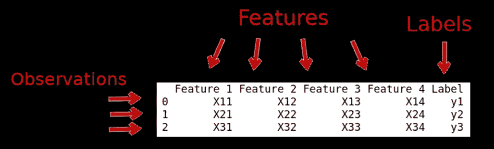
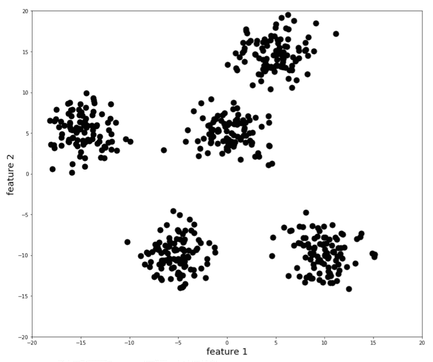
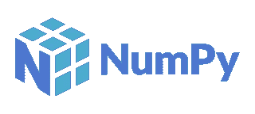
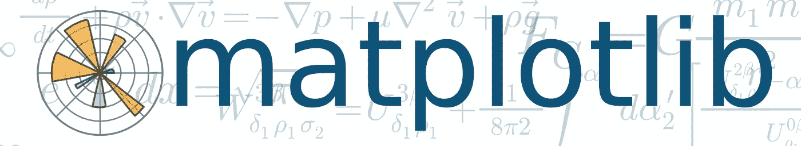
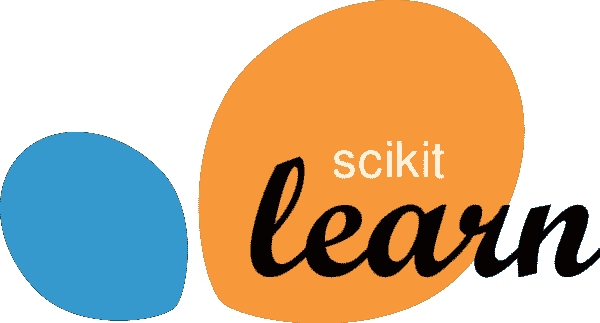
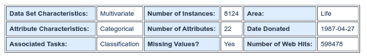
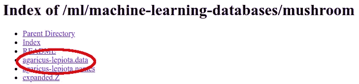
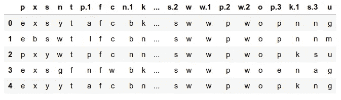
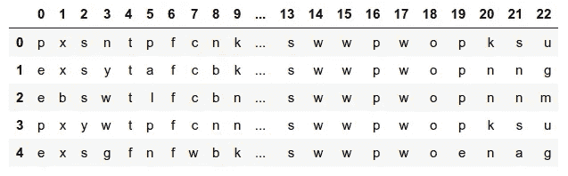
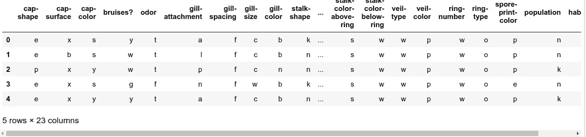

# 完全初学者的机器学习。引言。

> 原文：<https://medium.datadriveninvestor.com/machine-learning-for-complete-beginners-introduction-61b3a961b5ae?source=collection_archive---------6----------------------->

## 这是一个全面的使用 Python 开始实践机器学习(ML)的指南，适合完全的初学者，并附有实际操作的例子。学习 ML，把自己从一个完全的初学者→提升为 ML 从业者。解释机器学习的基础、动机和工具。


Photo by [Andy Kelly](https://unsplash.com/@askkell?utm_source=unsplash&utm_medium=referral&utm_content=creditCopyText) on [Unsplash](https://unsplash.com/s/photos/machine-learning?utm_source=unsplash&utm_medium=referral&utm_content=creditCopyText)

# 介绍

你好。前阵子，我一直在和一个朋友聊天，话题触及到了机器学习。在谈话结束时，我得出结论，许多人对“智能机器”的整个话题都有一些偏见，甚至可能因为信息量过大而不敢开始学习过程。所以，

> 我决定为每个刚刚开始掌握机器学习之旅的人打破僵局。

让我们明确一点——**机器学习**不是魔法。机器学习(所谓的 **ML** )是对通过经验自动改进的计算机算法的研究。总的来说，ML 是计算机科学的一个子领域，与数据科学高度关联。这些领域结合了数学、计算、统计和演示技能。那是一种形式的**逻辑**和**结构**。

在这一系列教程中，我将帮助你深入*机器学习*领域。随着这个领域的巨大发展和各种各样的信息，如果你是一个完全的初学者，实际开始可能是极其困难的。因此，我决定为所有热爱 ML 的人创造一个简短的系列课程。

> 这里的主要思想是用简单的语言解释事情，这样即使是孩子也能理解，并开始练习机器学习(是的，我们在内心深处都是孩子，对吗？).

在这一部分，我们将简要介绍学习 ML 的原因，浏览一般术语/定义，探索哪些常见的 Python 库用于数据科学和机器学习，并加载我们的第一个数据集！

换句话说，我们正在为机器学习之旅做准备。

# 为什么是机器学习？

机器是伟大的工作者，但它们通常是愚蠢的。因为他们只做程序员/工程师让他们做的唯一的任务。不多也不少地给出了要遵循的指示或要采取的明确步骤。

对于简单的任务来说，给机器编个程序让它做好工作更容易。但是对于涉及许多步骤的复杂问题，这不是一个微不足道的任务。

> 如果机器真的可以自己学习，而不需要明确的编程，那会怎么样？这个问题也是为什么这个领域如此热门的答案。尤其是现在，当计算能力足以将一些想法转化为现实生活的时候。

综上所述，机器学习是人工智能的分支，涵盖了它的统计部分。它教会计算机通过查看数百(或数千)个例子来解决问题，从中学习，然后在新的情况下使用这些经验来解决相同的问题。

我希望这能满足你的好奇心。因为我很珍惜你我的时间，所以我想继续，从实际动手的例子开始。

但是首先。

为了确保我们都在同一页上，让我们简要地浏览一下数据科学和机器学习领域中使用的常用术语和定义。

# 有用的术语

> 这里的所有工作都围绕着数据。我们周围的一切都是某种形式的数据:文本(包括你现在正在阅读的内容)、声音、图像、视频等等。

数据通常以**数据集**的形式被观察、收集和存储。如果你愿意，我们可以把数据集的一般形式想象成矩阵(或表格)。其中，列代表可观察值(特征)，而 raw 代表观察值(实例)。如下图所示:



Made by Author. Visual representation of the discussed terminology.

*   输入值(X)有几个名称。这些名字基本都是类比的:
    `**inputs** = features = attributes = independent variables`

> *注:*独立变量**的名称**暗示这些特性互不影响，各自独立影响输出。一般来说，这些是功能的**输入**。

*   类似的描述也适用于输出值(y)。他们有几个名字:
    `**outputs** = labels = dependent variable`

> *注:*因变量**的名称**意味着这些值依赖于其他变量。一般来说是一个函数的**输出**。

*   原始数据被称为数据的`**observations**`或`instances`。还有一个简单的公式:

```
Number of Features = **Dimension** of Dataset
```

因此，如果数据集只有两个特征，它可以显示为二维(2D)分布。例如，它可能是这样的:



Made by Author. Illustration of the distribution of the 2D clusters ([from here](https://medium.com/ai-in-plain-english/understanding-k-means-clustering-hands-on-visual-approach-c2dc46f0ed18)).

最后，数据集的形状基本上就是矩阵的形状。换句话说，观察值(实例)的数量乘以特征(维度)的数量。

那么，我们如何将这些定义与 ML 分析的实际过程联系起来呢？

> 这个想法是使用一组特征(X)作为我们机器学习模型的输入来预测输出(y)。

我相信进步的最好方式是通过实践，所以这些初步的理论应该足以让我们开始。下一个自然的问题是*我们实际上如何在实践中进行建模？*在我们谈论这个问题之前，让我们简单地谈谈 Python 库的一个非常重要的话题。

# 使用哪个 Python 库？

众所周知，Python 是一种强大而流行的通用编程语言。最棒的是，Python 是在 OSI 批准的开源许可下开发的，这使得它可以自由使用和分发，甚至可以用于商业用途。

如果你刚刚开始使用 Python，请查看这个简短的 [Python 教程](https://medium.com/datadriveninvestor/python-tutorial-for-complete-beginners-from-hello-world-to-functions-47ceb8b96555)，从“Hello World”到函数。以后会有帮助的。

> *补充说明:*开源许可证是符合开源定义的许可证——简而言之，它们允许自由使用、修改和共享软件。要获得开源计划(也称为 OSI)的批准，许可证必须通过开源计划的许可证审查过程。这里的指的是这个定义的[。](https://opensource.org/licenses#:~:text=Open%20source%20licenses%20are%20licenses,Source%20Initiative's%20license%20review%20process.)

此外，它的库和模块可以免费使用。这意味着，一些人开发模块，世界各地的每个人都可以使用它们。是不是很棒？

从这里得出的主要结论是:

> Python 中已经实现了许多库和模块，这将使我们的生活变得更加容易。

这里是我们在数据科学和实践机器学习中需要了解的 Python 模块列表:

*   **NumPy** —这个 Python 库支持大型多维(N 维)数组和矩阵，以及大量高级数学函数集合来操作这些数组。如果你使用数组、字典、函数、数据类型和图像，你需要了解 NumPy。因为图像基本上是数字的数组。



The author of NumPy is Travis Oliphant.

*   **SciPy** —这个库非常适合科学、技术和高性能计算。SciPy 是一个数值算法和特定领域工具箱的集合，包括线性代数、积分、优化、信号处理、统计等等！


The authors of SciPy are Travis Oliphant, Eric Jones, and Pearu Peterson.

*   Matplotlib —这是最流行的绘图 Python 库之一。它具有绘制 2D 和 3D 图像、图形和图表的能力。

    知道这是一个伟大的图书馆。当然，还有 *seaborn* ，举例来说，它更专注于统计可视化，这使得它在数据科学中非常受欢迎。然而，即使是 Matplotlib，它更面向基本的可视化(线条、散点图、条形图、饼图等)。)，我们可以得到一些漂亮的视觉效果。



The original creator of Matplotlib is John D. Hunter.

*   这个库是一个快速、灵活、易于使用的开源数据分析和操作工具。它是一个高级 Python 库，因为它是建立在它之上的。 *Pandas* 提供了高性能易用的数据结构。

    如果你正在做或者想做数据科学，这个库是必须的，因为它有很多数据导入、操作和分析的功能。值得注意的是，它提供了数据结构和操作来处理数字表和时间序列。


The original creator of Pandas library is Wes McKinney.

*   **SciKit Learn** —这个库是用于预测数据分析和机器学习的简单而高效的工具的集合。

    SciKit Learn(或者所谓的 **sklearn** )在数据科学家中很受欢迎。它拥有大部分回归、分类和聚类算法，并且构建在 NumPy、SciPy 和 Matplotlib 库之上。正如我前面提到的，数据不会干净整洁地放在银盘子里。在现实世界中，数据是杂乱的，需要进行预处理。一般来说，数据预处理是数据科学中非常重要的一部分。幸运的是，SciKit Learn 为数据科学和机器学习实现了许多任务。这包括数据预处理、特征选择和提取、训练测试分割、定义算法、拟合模型、评估、预测等等。



The original Author of the SciKit Learn library is David Cournapeau.

在这一系列教程中，我们将通过动手示例来学习 SciKit 学习算法。我的主要想法是描述和解释在上述每个算法的下*发生了什么，这样即使一个孩子也能理解。*

那么，让我们开始动手的例子。

# Python 中的数据集

现在，我们已经对 ML 有了一个概念，并且对开始使用 ML 所需的 Python 库有了一个概述，让我们开始动手的例子。从这里开始，我们将会经常使用熊猫图书馆。

## 获取数据集

原则上，您应该从现实世界中获得自己的数据集。然而，这是一个教程，所以我们将假设我们已经完成了所有的工作:走到野外，收集数据，并将其放入一个数据集。为了让我们的生活更简单，让我们简单地去[机器学习库](https://archive.ics.uci.edu/ml/datasets.php)获取一个数据集。

为了举例，让我们拿起[不同种类的蘑菇](https://archive.ics.uci.edu/ml/datasets/Mushroom)的数据集。

## 数据集摘要

我们可以立即看出这是一个 ***分类*** 数据集，因此应用的优选模型是分类。这个数据集中的实例数是 8124，属性数是 22。看完这篇教程，你应该能认出这些术语了吧？



Mushroom dataset summary.

## 数据集信息

> *从这个网站上我们可以找到标签:*这个数据集包括对应于姬松茸和双孢蘑菇科 23 个种的假想样本的描述(第 500-525 页)。每个物种被标识为**绝对可食用**、**绝对有毒**或**未知可食用且不推荐**。后一类与有毒的一类结合在一起。该指南明确指出，确定蘑菇的可食用性没有简单的规则；对于有毒的橡树和常春藤，没有像“传单三，随它去”这样的规则。

## 属性信息

在那里你可以看到所有 22 个特征的列表，比如瓶盖形状、瓶盖表面、瓶盖颜色、气味等等。这些都是描述我们蘑菇数据集的独立变量。

## 如何打开这个数据集？

要下载这个数据集，我们只需下载一个**。数据**文件，即 *CSV* 文件(或逗号分隔文件)。



Downloading Mushroom Dataset.

然后，在 Python 脚本或 [Jupyter Notebook](https://medium.com/datadriveninvestor/python-tutorial-for-complete-beginners-from-hello-world-to-functions-47ceb8b96555) 中，我们导入 Pandas 库并使用它打开这个数据集:

```
import pandas as pd
```

正如我前面提到的，Pandas 是一个顶级的 Python 库。打开一个 CSV 表就像使用它的方法`read_csv()`一样简单:

```
data = pd.read_csv('agaricus-lepiota.data')
```

要查看该数据集的前 5 个原始数据，我们可以使用 head()方法:

```
data.head()
```

如果您愿意，输出将是数据框或表:



正如我们所看到的，有些事情似乎不太对劲。最初，我们没有任何头，所以我们可以指定如下:

```
data = pd.read_csv('agaricus-lepiota.data', header = None)
data.head()
```



这一次，它看起来好多了，因为我们有一个从 0 到 22 的数字范围(正好是一些特性)。问题是我们想知道那些特征是什么。

我们可以用一个`.columns`属性在 Pandas 数据框中手动添加名称/值。我手工输入了所有 22 个特性名称，因为没有其他方法可以轻松导入它们。

```
# Let us manually add the features/columns names
data.columns = ['cap-shape', 'cap-surface', 'cap-color', \
                'bruises?', 'odor', 'gill-attachment', 
                'gill-spacing' ,'gill-size', 'gill-color', 
                'stalk-shape', 'stalk-root', 'stalk-surface-above-ring', 
                'stalk-surface-below-ring', 'stalk-color-above-ring', 
                'stalk-color-below-ring', 'veil-type', 'veil-color', 
                'ring-number', 'ring-type', 'spore-print-color', 
                'population', 'habitat', 'class' ]data.head()
```

生成的数据框如下所示:



所有的 23 列(22 个特征+类别标签)在屏幕上不适合，但是你有一个想法。原则上，我们可以开始处理这个数据集:预处理、清洗等。

> **Pro 提示 1:** *要查看 5 行以上的数据帧，只需在* `*.head(n)*` *方法中指定行数即可。如，* `*data.head(10)*` *查看前 10 行。对于负值* `*n*` *，该函数返回除最后 n 行以外的所有行，如* `*data.head(-7)*` *返回从 0 到倒数第 7 个元素的所有行。*
> 
> **亲提示 2:** *从背面看元素，使用类比函数，调用* `*.tail()*` *。*

## 如何处理这个数据集？

我们可以建立一个分类算法来训练如何基于这个蘑菇数据集来识别不同类型的蘑菇，然后将训练好的模型应用于未知(或样本外)的情况来预测蘑菇类型。

这可能是有用的，例如，如果你是一个蘑菇采集者，或者可以进入周围有许多不同蘑菇的森林。或者别的什么。

重点不是蘑菇，而是建立一个算法的想法，以创建一个能够预测未知/新病例的类别/标签的模型。综上所述，这类算法是一种分类，是一种有监督的机器学习算法。

# 结论

至此，我们结束了对机器学习指南的介绍。在下一篇教程中，我将解释应用于真实数据集的分类算法。所以，敬请关注。

## 想了解更多？

正如我之前提到的，这里是我从头到尾解释的几个我的项目。这是一个尝试实践一些 Python 技能以增强您的体验的绝佳机会:

*   [用 Python 从头开始追踪你的体重](https://medium.com/swlh/track-your-weight-with-python-4bf0cae42ef3)
*   解析[新冠肺炎科技论文](https://medium.com/swlh/analyzing-covid-19-papers-with-python-part-1-22706eb92270)
*   从头开始创建一个[生产力应用](https://medium.com/datadriveninvestor/create-productivity-app-in-python-from-scratch-part-1-d715d1f393db)(番茄)

谢谢你一直读到最后。我希望你学到了新的东西。如果你想连接，有任何问题，建议，和/或发现任何错误，请不要犹豫通过 [LinkedIn](https://www.linkedin.com/in/ruslan-brilenkov/) 联系我。

*附:如果你喜欢 Medium.com 这个美丽平台上这种不间断的阅读体验，可以考虑通过注册成为会员来支持这个社区的作家，* [*这里*](https://ruslan-brilenkov.medium.com/membership) *。它每月只需 5 美元，支持所有的作家。*