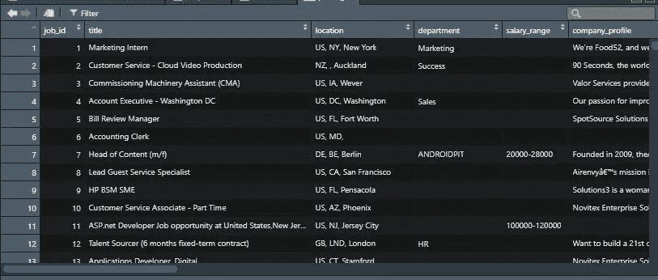
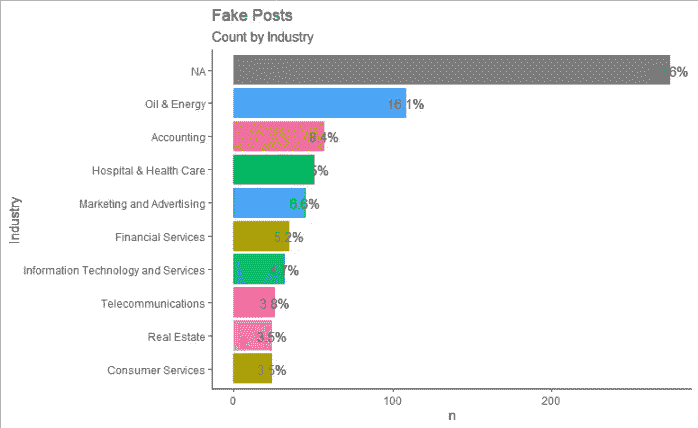
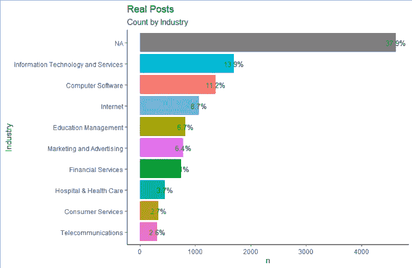
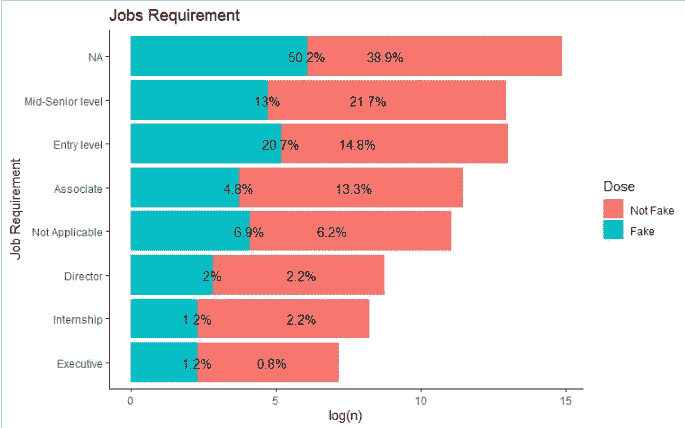
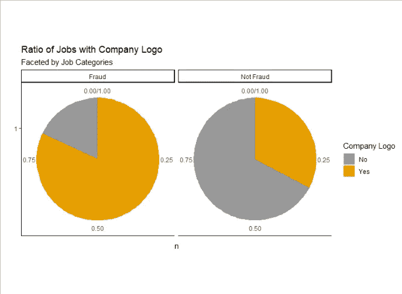
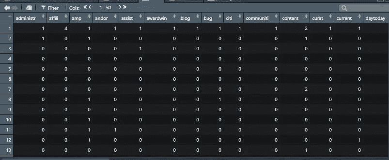
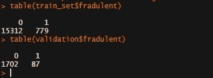
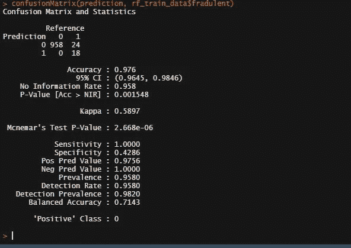
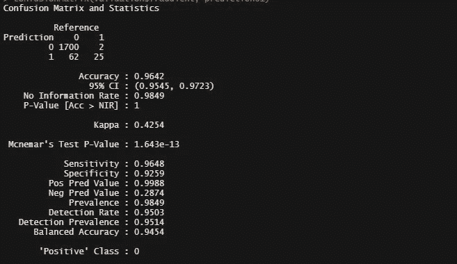

# 用于虚假工作检测的机器学习

> 原文：<https://medium.datadriveninvestor.com/machine-learning-for-fake-job-detection-6e89d8e5c963?source=collection_archive---------2----------------------->

## 虚假工作检测模型


[mohamed_hassan](https://pixabay.com/users/mohamed_hassan-5229782/)/Pixabay

机器学习模型有很多用例。文本分析是自然语言处理的一个分支，它提供了允许机器学习算法应用于分类模型的文本数据的方法。模式存在于数据中，我们通常无法一直检测到，但是使用分析工具，我们能够检测到这些存在的模式。使用机器学习，这些模式甚至变得更容易和可扩展，我们可能每天都会遇到的一个典型例子是垃圾邮件分类器。

本文将带您了解如何使用编码来表示文本数据，然后将这些数据输入到机器学习模型中。这方面的数据可以从[这里](https://www.kaggle.com/shivamb/real-or-fake-fake-jobposting-prediction/download)下载；

第一步是做一点探索性的数据分析。这是为了让我们熟悉数据集。我们加载数据集并调用所需的库；

```
library(tidytext)
library(tidyverse)
library(tidygraph)
library(tm)
library(SnowballC)
library(randomForest)

#Read in the dataset
posting <- read.csv("fake_job_postings.csv") 
```



A snippet of the data

一旦数据被加载，我们将可视化每个行业的职位数量。注 t ***帽子欺诈一栏的 0 代表真实工作，1 代表虚假工作*** 。

[](https://www.datadriveninvestor.com/2020/02/19/five-data-science-and-machine-learning-trends-that-will-define-job-prospects-in-2020/) [## 将定义 2020 年就业前景的五大数据科学和机器学习趋势|数据驱动…

### 数据科学和 ML 是 2019 年最受关注的趋势之一，毫无疑问，它们将继续发展…

www.datadriveninvestor.com](https://www.datadriveninvestor.com/2020/02/19/five-data-science-and-machine-learning-trends-that-will-define-job-prospects-in-2020/) 

根据欺诈栏可视化虚假和真实工作中的工作发布的顶级行业；

```
posting %>% 
  group_by(fraudulent) %>% 
  count(industry) %>% 
  arrange(desc(n)) %>%
  top_n(10) %>% 
  mutate_if(is.character, list(~na_if(.,""))) %>% 
  mutate(total = paste(round(100*n/sum(n), 1), "%", sep = "")) %>% 
  filter(fraudulent == 1)%>% 
  ggplot(., aes(reorder(industry, n), n, fill = industry)) +
  geom_bar(stat = "identity", show.legend = F) +
  coord_flip() + 
  geom_text(aes(label = total), color = "black", size = 4) +
  labs(title = "Fake Posts", subtitle = "Count by Industry",
       x = 'Industry') + theme_classic()
```



Prevalent industries in Fake Job Posts

可视化真实职位的顶级行业；



Prevalent industries in Real Job Posts

我们可以看到，在这两种情况下，更大比例的工作没有指定他们的行业，因此这不是一个很好的衡量标准来判断工作通知是真是假。

看一看每种工作岗位类型的工作要求，即真实或虚假，我们挖掘以找到一些信息；

```
#Job Requirements
posting %>% 
  group_by(fraudulent) %>% 
  count(required_experience) %>% 
  mutate(percentage = paste(round(100*n/sum(n), 1), "%", sep = "")) %>% 
  mutate_if(is.character, list(~na_if(.,""))) %>% 
  ggplot(., aes(reorder(required_experience, n), log(n), fill = factor(fraudulent))) +
  geom_bar(stat = "identity") +
  geom_text(aes(label = percentage)) +
  labs(x = "Job Requirement", title = "Jobs Requirement") +
  scale_fill_discrete(name = "Dose", labels = c("Not Fake", "Fake")) +
  coord_flip() +
  theme_classic()
```



取一个记录值，以便更好地观察轴线。从这里我们还可以看到，更大比例的实际工作没有具体说明他们的教育要求。

检查有公司标识的工作职位类别。有趣的是，你会发现大多数有实际工作岗位的公司都没有标识，而假岗位则相反。也许是为了确保它们看起来是真的？我的意思是，任何可疑的企业都想掩盖他们的踪迹，因此，需要这个标志。



从这里开始，我们继续进行实际的预处理过程，这样我们就可以将数据输入到机器学习算法中。

## 数据预处理/清理

我们将首先删除停用词、标点符号、超链接和其他不需要的词。

```
#Data Cleaning
corpus <- Corpus(VectorSource(posting$description))inspect(corpus[1:5])#Convert to lower cast
corpus <- tm_map(corpus, tolower)#Remove Punctuationa and inspect
corpus <- tm_map(corpus, removePunctuation)inspect(corpus[1:5])#Remove stopwords
corpus <- tm_map(corpus, removeWords, stopwords(kind = "en"))#Stem document
corpus <- tm_map(corpus, stemDocument)
```

我们将创建一个清理数据的术语文档矩阵，这是一个主要的预处理阶段

```
#Create document frequency
freq <- DocumentTermMatrix(corpus)
freq#remove sparsity
freq_sparsed <- removeSparseTerms(freq, sparse = 0.995)freq_sparsed#Convert cleaned document to a df
df <- as.data.frame(as.matrix(freq_sparsed))#Give unique names to colnames
colnames(df) <- make.names(colnames(df))#Add the fraudelent colum
df$fradulent <- posting$fraudulent#Remove duplicate column names
colnames(df) <-  make.unique(colnames(df), sep = "_")
```



Term Document Matrix

上图是当您执行术语-文档频率操作时，您的新数据帧应该是什么样子。

## 训练集和测试集的拆分

我们将使用 caTools 库上的 split 组件和 ML 模型的 caret

```
#Create train and test dataset
library(caTools)
library(caret)#Convert target variable to factor type
df$fradulent <- as.factor(df$fradulent)#Split
set.seed(2020, sample.kind = "Rounding")
test_index <- createDataPartition(y = df$fradulent, times = 1, p = 0.1, list= FALSE)
train_set <- df[-test_index, ]
validation <- df[test_index, ]#Check the split ratio of the target variable
table(train_set$fradulent)
table(validation$fradulent)
```



由于计算时间和巨大的类别不平衡的存在，我们将只使用 1000 个随机数据样本，但是如果适合你，你可以决定在整个数据集上训练。

```
library(caret)
#Get a sample number
n <- 1000#Cross validation contro;
control<- trainControl(method = "cv", number = 5, verboseIter = TRUE)#Number of trees for each train
grid <-data.frame(mtry = c(1, 5, 10, 25, 50, 100))#create a sample from n number from dataset
index <- sample(nrow(train_set), n)#subset data
rf_train_data <- train_set[index, ]#Train random forest model
subset_train_rf <- train(fradulent ~ ., method = "rf", data = rf_train_data, ntree = 150, trControl = control, tuneGrid = grid)#Accuracy on the sample train data
prediction <- predict(subset_train_rf, rf_train_data)#Confusion matrix
confusionMatrix(prediction, rf_train_data$fradulent)
```



Accuracy from Confusion Matrix on the train data

训练数据上的 ***97.6%*** 看起来不错，但我们需要看看它在验证集的早期分割上的表现如何(尽管我们使用了 1000 行的小集合来训练数据)。

```
#predict on the train set
prediction01 <- predict(subset_train_rf, validation)#confusion matrix
confusionMatrix(validation$fradulent, prediction01)
```



Accuracy from Confusion Matrix on Validation data

有趣的是，该模型在超过 1800 个样本的验证集上仍然表现良好。

你也可以继续使用其他模型，但在我的模型中，我使用了 K-fold 交叉验证来处理很可能由于类别不平衡而导致的过度拟合。最后，使用网格搜索为模型选择最佳超参数。

## 结论

请注意，只有欺诈列旁边的功能描述列是唯一使用的列。但是，您可以通过编码来决定使用所有其他列。例如，诸如 has_company_logo 和 telecommuting 之类的列可以在创建术语文档之后添加到数据框中，从而被包括在内。其他列，如 industry，可以简单地进行编码和追加。

但是，您应该考虑到您正在创建更多的要素，因此增加了计算时间。

**访问专家视图—** [**订阅 DDI 英特尔**](https://datadriveninvestor.com/ddi-intel)