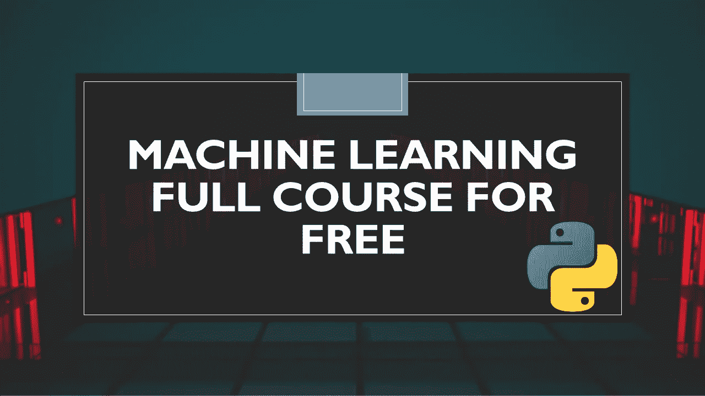

# 免费的机器学习完整课程

> 原文：<https://medium.datadriveninvestor.com/machine-learning-full-course-for-free-e64d5575f75e?source=collection_archive---------1----------------------->

## 机器学习的完整课程，免费使用 Python。

在本文中，我将带您免费学习完整的机器学习课程。这个机器学习课程是为那些自学机器学习的人准备的。是的，你自己学习它是可能的，你只需要一步一步地遵循课程，然后如果你开始处理现实世界的任务，你就会成为机器学习的专家。

本课程结束时，您将:

*   理解机器学习的核心思想
*   学习建立机器学习模型
*   学会处理缺失值、数据泄漏和数据清理
*   了解数据可视化
*   最后，最好的部分是你会得到实时项目来提升你的投资组合

# 机器学习完整课程

在开始这门课之前，我会推荐你学习 python，因为我已经用 Python 解释了机器学习的每个概念。如果你没有一个学习 python 的好平台，那么你可以从[这里](https://github.com/amankharwal/Website-data/blob/master/PythonNotesForProfessionals.pdf)下载一本学习 Python 的好电子书。现在，如果您知道 python 的基础知识，让我们开始学习机器学习的完整课程:

 [## 机器学习和人工智能如何改变电子商务的面貌？|数据驱动…

### 电子商务开发公司，现在，整合先进的客户体验到一个新的水平…

www.datadriveninvestor.com](https://www.datadriveninvestor.com/2020/11/19/how-machine-learning-and-artificial-intelligence-changing-the-face-of-ecommerce/) 

# 1.机器学习导论

1.  [**什么是机器学习&当我们需要使用机器学习的时候？**](https://thecleverprogrammer.com/2020/09/21/when-do-we-need-machine-learning/)
2.  [**机器学习系统的类型。**](https://thecleverprogrammer.com/2020/07/24/all-machine-learning-systems/)
3.  [**机器学习算法及其类型**](https://thecleverprogrammer.com/2020/08/11/machine-learning-algorithms/)

# 2.数据入门

1.  [**数据科学的进程**](https://thecleverprogrammer.com/2020/09/01/process-of-data-science/)
2.  [**用于机器学习的数值计算**](https://thecleverprogrammer.com/2020/06/06/numpy-tutorial-for-data-science/)
3.  [**用熊猫数据操纵**](https://thecleverprogrammer.com/2020/06/07/pandas-tutorial-for-data-science/)
4.  [**用熊猫清理数据**](https://thecleverprogrammer.com/2020/08/24/data-cleaning-with-python/)
5.  [**处理数据泄露**](https://thecleverprogrammer.com/2020/09/05/data-leakage-in-machine-learning/)
6.  [**用 Matplotlib 实现数据可视化**](https://thecleverprogrammer.com/2020/06/08/matplotlib-tutorial-for-data-science/)
7.  [**用 Seaborn 实现数据可视化**](https://thecleverprogrammer.com/2020/07/03/data-visualization-with-seaborn/)
8.  [**数据可视化与 Plotly**](https://thecleverprogrammer.com/2020/07/25/data-visualization-with-plotly/)

# 3.算法入门

1.  [**线性回归模型**](https://thecleverprogrammer.com/2020/07/03/train-and-run-a-linear-regression-model/)
2.  [**Logistic 回归模型**](https://thecleverprogrammer.com/2020/07/02/logistic-regression-in-machine-learning-with-python/)
3.  [**K-Means 算法**](https://thecleverprogrammer.com/2020/07/12/k-means-in-machine-learning/)
4.  [**支持向量机**](https://thecleverprogrammer.com/2020/07/06/support-vector-machines-svm-in-machine-learning/)
5.  [**决策树**](https://thecleverprogrammer.com/2020/07/07/decision-trees-in-machine-learning/)
6.  [**神经网络**](https://thecleverprogrammer.com/2020/05/24/artificial-neural-networks-with-machine-learning/)
7.  [**神经网络是如何工作的？**](https://thecleverprogrammer.com/2020/09/05/what-are-neural-networks-in-machine-learning/)
8.  [**所有机器学习算法**](https://thecleverprogrammer.com/2020/06/05/all-machine-learning-algorithms-explained/)
9.  [**如何选择算法？**](https://thecleverprogrammer.com/2020/09/18/choose-algorithm-in-machine-learning/)

# 4.深度学习入门

1.  [**什么是深度学习？**](https://thecleverprogrammer.com/2020/08/16/what-is-deep-learning/)
2.  [**深度学习 tensor flow**](https://thecleverprogrammer.com/2020/07/10/tensorflow-tutorial/)
3.  [**深度学习 py torch**](https://thecleverprogrammer.com/2020/07/16/pytorch-for-deep-learning/)

# 5.机器学习中的重要概念

1.  [**如何成为机器学习专家？**](https://thecleverprogrammer.com/2020/09/16/machine-learning-roadmap/)
2.  [**如何推出机器学习模型？**](https://thecleverprogrammer.com/2020/09/11/launch-a-machine-learning-model/)
3.  [**如何部署机器学习模型？**](https://thecleverprogrammer.com/2020/07/14/deploy-a-machine-learning-model/)
4.  [**机器学习的未来**](https://thecleverprogrammer.com/2020/08/15/future-of-machine-learning/)

在学习完这个机器学习课程的上述所有主题后，接下来要做的就是开始做项目，这样你就可以将你的知识运用到实践中。从 [**这里**](https://thecleverprogrammer.com/2020/06/01/work-on-data-science-projects/) 可以得到很多机器学习解决和解释的项目。

我希望你喜欢这篇文章。欢迎在下面的评论区提出你有价值的问题。

**访问专家视图—** [**订阅 DDI 英特尔**](https://datadriveninvestor.com/ddi-intel)