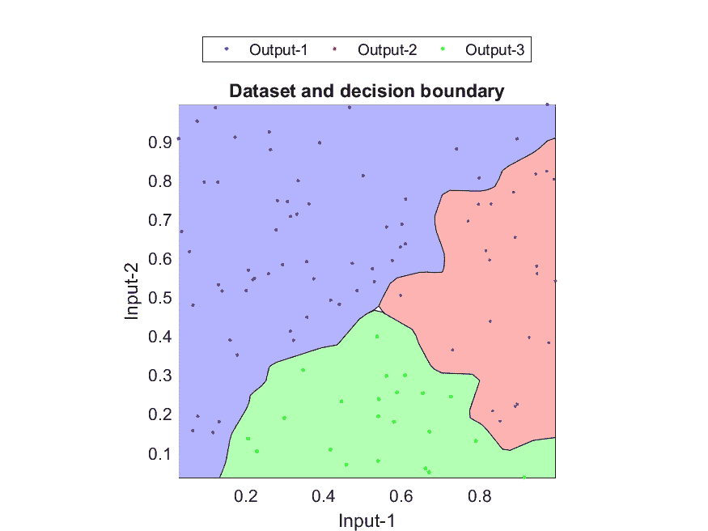
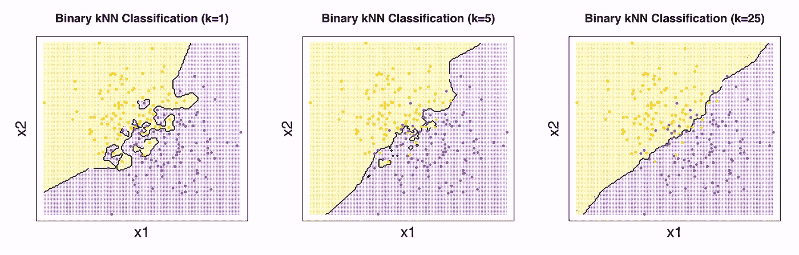
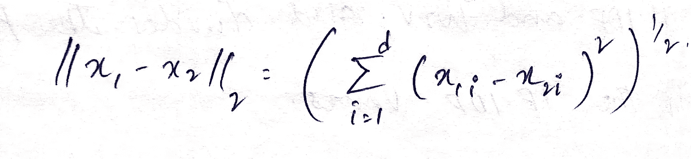
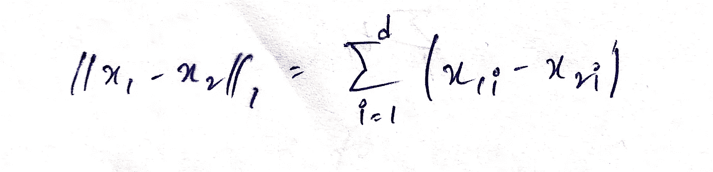
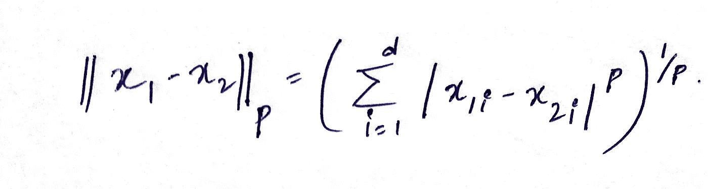
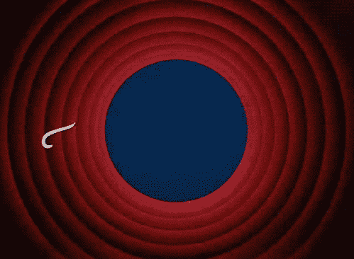

# 机器学习:K 近邻入门。

> 原文：<https://medium.datadriveninvestor.com/machine-learning-getting-started-with-k-nearest-neighbours-6851280d4c93?source=collection_archive---------2----------------------->

source: Google

**我们将从这篇文章中学到什么:**

1.  K-NN 是什么？
2.  决策面如何随着 K 值的变化而变化
3.  K-NN 的过拟合和欠拟合
4.  K-NN 中使用的距离类型
5.  K-NN 的时空复杂度
6.  回归的 K-NN
7.  K-NN 在现实世界中的应用

K-最近邻或 K-NN 是一种基本、简单但功能强大的机器学习算法之一。K-NN 可用于分类和回归。在这篇博客中，我们将主要关注分类部分，因为 K-NN 主要用于分类。

**什么是 K-NN？它是做什么的？这个算法是如何工作的？**

简而言之，给定一个用于分类的数据集，K-NN 试图在类之间绘制一个边界表面来分隔它们。现在，当一个查询点被提供给 K-NN 时，它计算该查询点和周围 K 个最近的数据点之间的距离，并且基于大多数类点，给定的查询点被分类。

# 示例:

source: Google

从上图可以看出:

**图 1:** 我们的数据中有两类，分别是星形和三角形。数据集中引入了一个新点，我们需要对这个新点进行分类。

**图片 2:** 计算距离我们新数据点最近的点之间的距离。离新数据点最近的点是相邻的数据点。

**图 3:** 假设我们已经给定了 K 值为 3。所以这里考虑最近的三个相邻点。在最近的三个相邻点中，我们认为大多数点是三角形(三角形= 2，星形=1)。因此，我们的新数据点现在被归类为三角形。

**简单对吧？？**恭喜，现在你已经理解了 K 近邻的基本功能。

source: Google

你可能会有疑问。**我们如何挑选 K 的正确值？**

这里 K-NN 中的 K 是一个 ***超参数*** 。通常我们使用奇数作为 K 的值，因为算法基于多数来决定查询点的类别。k 可以是 3，5，7，…但不能是 1。我们在选择 K 值时需要小心，因为它可能会导致过拟合或欠拟合的问题。k 既不能太小，也不能太大。

那么，**什么是过拟合和欠拟合呢？？**

在理解过拟合和欠拟合的概念之前，我们先来理解一下决策曲面的概念。

**决策面:**它可以被定义为一个在给定的数据集中分离类的面。

source: Google

上图中分隔三个类别的表面称为决策表面或决策边界。

当 K 值改变时，决策面如何改变:

source: Google

**K = 1**

如上图所示，当 K=1 时，我们的算法试图确保它创建一个完全分隔两个类的表面。假设，我们在黄色区域中有一个紫色点 P1，当在黄色区域中给定一个查询点，并且该查询点的最近邻居是 P1(黄色区域中的紫色点)时，该查询点被分类为紫色点，尽管该查询点周围的所有点都是黄色点。由于 K 的值=1，我们不考虑其他邻居。这里，查询点可能被错误分类。

当 K-NN 算法创建了如图 1 所示的完全分离两个类的表面时，那么可以说它正在试图**过度拟合**。

**K = 5，7，15..**

如上图所示，随着 K 值的增加，决策面变得更加平滑。

**K = n**

类似地，当我们在给定的数据集中有 n 个数据点并且 K = n 时，无论我们的查询属于哪个类，我们的算法返回的查询点都是具有最高个数据点的类。这里，这被认为是 K-NN 中的**欠拟合**。

# K-NN 如何计算两点之间的距离？

K-NN 中的距离可以通过三种方式计算:

1.  欧几里得距离
2.  曼哈顿距离
3.  闵可夫斯基距离

**欧几里德距离(L2):**

向量的 L2 范数通常被称为两个数据点或两个向量之间最短直线的距离。两点 X1 和 X2 之间的欧几里德距离可以通过给定的公式计算:

其中 X1 和 X2 属于 d 维。

**曼哈顿距离(L1):**

通常被称为向量的 L1 范数。两点 X1 和 X2 之间的曼哈顿距离可以通过以下公式计算:

**P.S.: it is the sum of all the absolute differences between the two points in d-dimensions. |X1i-X2i|*****

其中 X1 和 X2 属于 d 维。

**闵可夫斯基距离(LP):**

通常称为向量的 LP 范数。两点 X1 和 X2 之间的闵可夫斯基距离可以通过以下公式计算:

如果 P 的值是 2，那么闵可夫斯基距离与欧几里德距离相同。

如果 P 的值为 1，那么闵可夫斯基距离与曼哈顿距离相同。

在实现 K-NN 算法时，欧几里德距离被用作默认距离。

**K-NN 的空间和时间复杂度:**

K-NN 的时间和空间复杂度较高，被认为是其局限性之一。

空间复杂度:O(nd)

时间复杂度:O(nd)

**偏差&方差权衡:**

如果 K 值很低，模型会尝试过度拟合。

如果 K 值很高，模型会尝试进行欠拟合。

这都是为了 K-NN 分类。现在让我们来看看 K-NN 是如何实现回归的。

**用于回归的 K-NN:**

正如我们前面讨论的，在 K-NN 分类中，在计算查询点和 K 个最近邻点之间的距离之后，该算法基于多数投票对查询点进行分类。

类似地，在 K-NN 回归中，我们计算查询点和 K 个最近邻点之间的距离，现在我们计算所有最近邻点的平均值/中值，而不是进行多数投票。

注意:平均值会受到异常值的影响，但是，中位数受异常值的影响最小。

**K 近邻在现实世界中的应用:**

1.  K-NN 可以用来对文本进行分类。
2.  股票市场预测是 KNN 最核心的财务任务之一。
3.  推荐系统也是 K-NN 可以应用的一个领域。
4.  K-NN 在医学领域也有很多应用。

**关于 K-NN 的更多信息，可以参考:**

1.  【https://scikit-learn.org/stable/modules/neighbors.html 
2.  [https://sci kit-learn . org/stable/modules/generated/sk learn . neighbors . kneighborsclassifier . html](https://scikit-learn.org/stable/modules/generated/sklearn.neighbors.KNeighborsClassifier.html)

# 如果你学到了一些新的东西或者喜欢阅读这篇文章，请分享给其他人看。也可以随意发表评论。

