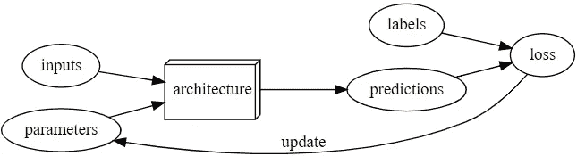

# 机器学习——它是如何工作的

> 原文：<https://medium.datadriveninvestor.com/machine-learning-how-it-works-900b53d0e3d7?source=collection_archive---------7----------------------->

Photo by [Alina Grubnyak](https://unsplash.com/@alinnnaaaa?utm_source=medium&utm_medium=referral) on [Unsplash](https://unsplash.com?utm_source=medium&utm_medium=referral)

如今，你会听到“机器学习”和“人工智能”这些词被抛来抛去。关于人工智能(AI)如何被用于预测性警务的新闻文章不断涌现。你会听到公司如何急于将机器学习(ML)应用到他们的产品中。但是**AI 和 ML** 是什么？**它是如何工作的**？请继续阅读，寻找答案。

# 有什么区别？它们是什么？

在日常生活中，我们将 ML 与 AI 互换使用，但它们是不同的！ **AI** 是整个**域**而 **ML** 是 AI 中的一个**特定域**。换句话说，人工智能对于数学就像人工智能对于几何一样。

那么它们是什么呢？**人工智能**是指**让一台机器做通常**需要人类智慧**的动作**。这是一个宽泛的定义，因为它是整个领域的定义。人工智能的应用范围很广，从聊天机器人到作曲，到设计飞机部件！

AI 是如何做到这一点的？一种方法是 ML。**机器学习**过程给机器数据，然后让它们**从该数据自动**学习到**产生动作**。这乍一看似乎很简单，但实际上编写一个程序来对猫和狗进行分类似乎是一项不可能完成的任务！但是不要担心，这是可能的，您将在下一节了解它是如何工作的。

 [## 什么是数据目录，它如何使机器学习取得成功？数据驱动的投资者

### 数据目录是机器学习和数据分析的燃料。没有它，你将不得不花费很多…

www.datadriveninvestor.com](https://www.datadriveninvestor.com/2020/08/27/what-is-a-data-catalog-and-how-does-it-enable-machine-learning-success/) 

# ML 是如何工作的？

那么我们如何让一个程序处理数据，然后自动从中学习呢？这似乎是一项艰巨的任务，但所有的 ML 模型都要经历一个简单的过程来学习:

[ML Diagram from FastAI v4 Lesson 1](https://www.fast.ai/)

**流程:**

1.  将您的数据(**输入**)插入一个函数(**架构**)。
2.  该功能将在一些内部值(**参数**)的帮助下处理数据，以产生一些**预测。**
3.  预测将与实际答案(**标签**)进行比较，并将用于计算**损失。**
4.  这个丢失将会返回并且**更新**该函数的内部值。

我们**运行这个过程几次**，不断更新我们的参数，我们**最终得到一个 ML 模型**！YouTube 算法、特斯拉的 autos 和 Alpha Go 的算法都经历了这个过程，以便推荐视频、驾驶汽车和击败围棋选手！好吧，但是参数、架构、损耗和所有这些术语到底是什么？在下一节中，我们将定义并讨论这些术语。

AlphaGo Beating the Go Master

## ML 的定义:

*   输入:**数字形式的数据**。例如:图像被分解成比特，每个比特有 3 个通道(RGB)，这些数字被输入到架构中。
*   参数:**架构内部的数字**。这些将**通过一系列数学运算(主要是加法和乘法，但也可能有其他运算，具体取决于架构)与输入相互作用**。我们更新这些数字，纯粹是从这些数字中，我们可以用 ML 做这么多。
*   架构:ML 模型的**外壳或框架**。输入和参数填充它，以及依赖于架构类型的其他层/特征。
*   预测:**以**数字**的形式输出模型的**。输入被输入到架构中，然后与参数和特征交互以产生预测。
*   标签:**以**数字**的形式正确回答**输入。这些标签将与预测进行比较，以计算…
*   损失:**函数**计算预测与答案的差距。有许多方法可以做到这一点，并且会因应用而异。

如果你打算钻研 ML 领域，理解这些基本定义是很重要的，因为它们是整个领域的基础。

感谢阅读！我是 Dickson，17 岁的技术爱好者，很高兴能加速自己的步伐，影响数十亿人🌎

如果你想跟随我的旅程，你可以加入[我的每月简讯](https://bit.ly/DicksonNewsletter)，查看[我的网站](https://bit.ly/DicksonWebsite)，连接 [Linkedin](https://bit.ly/DicksonLinkedin) 或 [Twitter](https://bit.ly/DicksonTwitter) 😃

## 访问专家视图— [订阅 DDI 英特尔](https://datadriveninvestor.com/ddi-intel)