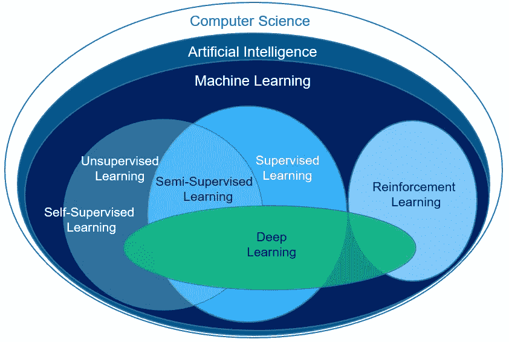
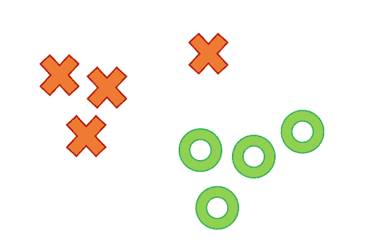
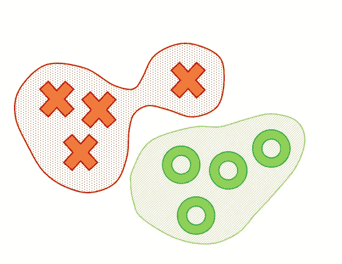
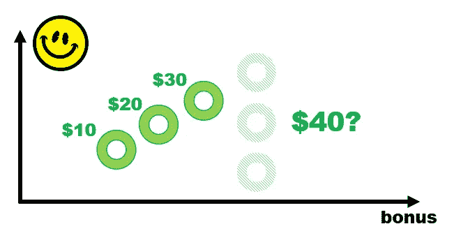
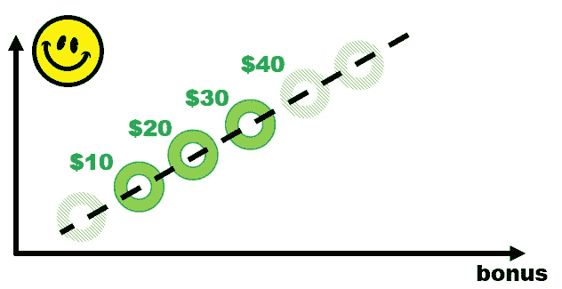
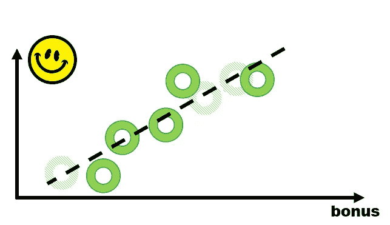
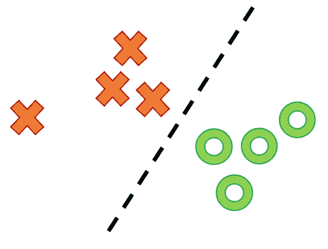
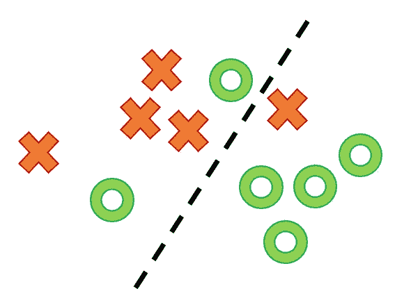
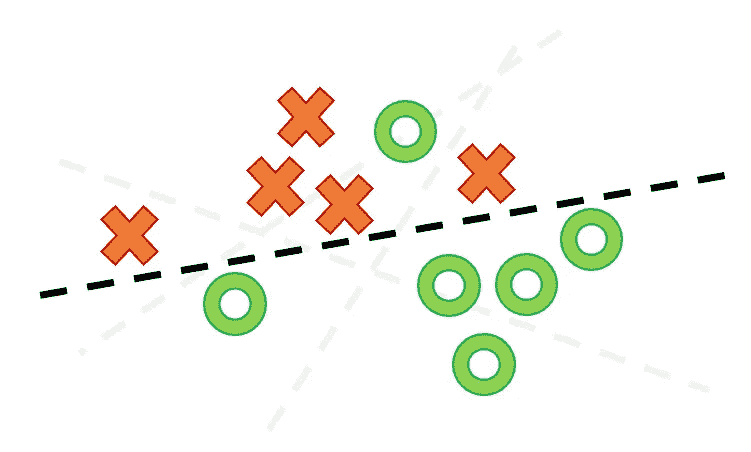

# 10 分钟机器学习

> 原文：<https://medium.datadriveninvestor.com/machine-learning-in-10-minutes-354d83e5922e?source=collection_archive---------1----------------------->

机器学习(ML)是对通过经验自动改进的计算机算法的研究。ML 是人工智能的一个子集，建立在一个统计框架之上。机器学习的最终目标是将计算机算法应用于可用数据，以创建数学 ***模型*** ，该模型可以在没有明确编程的情况下做出未来预测或决策。

# 无监督学习

这是一类 ML 算法，让计算机在最少或没有人工监督的情况下自行识别模式。想象一下有人给你看下面这张图:

你的大脑识别两种类型的物体 Xs 和 Os，不需要任何额外的指令。无监督学习也是如此。该机器正在将[聚类](https://towardsdatascience.com/unsupervised-learning-and-data-clustering-eeecb78b422a)和[其他方法](https://towardsdatascience.com/an-overview-of-different-unsupervised-learning-techniques-facb1e1f3a27)应用于数据，并可以自行发现模式。

# 监督学习

这类最大似然算法需要可以学习的前期例子。这个过程被称为训练，通常机器需要人类创造的大量例子来识别规则。例如，你有一千张宠物的照片，你想要一个算法来判断一张照片中是狗还是猫。你要做的第一件事是[标注](https://en.wikipedia.org/wiki/Labeled_data)哪些图片有狗，哪些有猫。你可以拍摄一些带有标签的照片，并通过算法进行处理，这样它就可以学习模式，并创建一个数学模型，可以自己区分狗和猫的照片。然后，您将在标记图像的剩余部分上测试该模型，您将这些图像放在一边以检查它的学习效果。第一部分称为[训练数据集](https://en.wikipedia.org/wiki/Training,_validation,_and_test_sets)，第二部分是测试数据集。您还可以拥有一个验证数据集，用于在测试模型之前对其进行微调。

 [## 认知计算——一套被广泛认为是……

### 作为它的用户，我们已经习惯了科技。这些天几乎没有什么是司空见惯的…

www.datadriveninvestor.com](https://www.datadriveninvestor.com/2020/02/19/cognitive-computing-a-skill-set-widely-considered-to-be-the-most-vital-manifestation-of-artificial-intelligence/) 

监督学习算法可以用来解决两个问题——回归和分类。

# 监督学习—回归

[这些算法](https://towardsdatascience.com/selecting-the-best-machine-learning-algorithm-for-your-regression-problem-20c330bad4ef)可以找到一个或多个预测变量与一个结果变量之间的关系。因为这是一个监督学习算法，需要数据来学习。回归使用统计数据来了解模式。一个例子是，如果你给某人 40 美元小费，那么你可以预测他的快乐程度。你要有历史数据，这个人在过去你给他不同的奖金时有多开心。

[线性回归](https://machinelearningmastery.com/linear-regression-for-machine-learning/)是最直接的回归算法。该方法将尝试通过所有已知值画一条直线，并假设所有未来值也在这条直线上。*换句话说，它将利用当前的观测数据进行推断。*

你很少能画出一条总是给你正确预测的线。在我们的情况下，会有许多其他因素影响一个人的幸福。因此这种方法的[精度](https://www.includehelp.com/ml-ai/root-mean-square%20error-rmse.aspx)不可能是 100%，会有误差。

# 监督学习—分类

这是一类监督算法，用于将项目分类。这种算法最基本的版本是找到一条线来分隔两种类型的对象。这种方法叫做线性分类法。

就像在回归算法的幸福例子中一样，你可能会发现没有办法画出一条直线来完美地区分两类对象:

当算法学习时，它会尝试绘制尽可能多的线，以找到在哪个位置和什么角度会给出最准确的结果。

还有更高级的[非线性分类算法](https://nlp.stanford.edu/IR-book/html/htmledition/linear-versus-nonlinear-classifiers-1.html)。这些算法可以使用更复杂的数学方程来区分类别。大多数当前使用的分类算法是非线性的。下面是非线性[核近似算法](http://jmlr.org/papers/volume18/15-025/15-025.pdf\)如何划分我们的类:

训练数据集具有完美的准确性可能是危险的。该模型从异常值中学习，可能无法在现实世界中推广。这个问题叫做[过拟合一个模型](https://statisticsbyjim.com/regression/overfitting-regression-models/)。

# 半监督学习

这些算法使用监督和非监督学习方法的组合。在[半监督学习](https://en.wikipedia.org/wiki/Semi-supervised_learning)中，有标记和未标记的数据集。使用这种方法，您可以使用已标注的数据来标注数据集的剩余未标注部分。例如，您希望训练一个模型来对图像进行分类，但是您希望为您的算法提供有关如何构建类别的提示。您希望只使用一小部分已标记的图像，因为并非每张图片都已标记，同时您希望模型根据已标记的图像尽可能准确地对未标记的图片进行分类。

# 自我监督学习

[自我监督学习](https://lilianweng.github.io/lil-log/2019/11/10/self-supervised-learning.html) (SSL)是一种特殊的学习情况，其中人类不手动标记训练数据集，但无监督学习算法会生成标签。世界上未标记的数据比标记的数据多得多。这种方法首先使用非监督学习技术来发现数据中的共同模式，这将有助于稍后建立更好的监督模型。有人说这只是无监督学习的一个变种，但 SSL 是一个两步走的过程，它的最终目标是建立一个有监督的学习模型。

# 强化学习

这是一种机器学习技术，它使算法能够在交互式环境中使用来自其动作和经验的反馈通过试错来学习。有了这个方法，有了一个持续的反馈循环，你的[模型可以随着时间的推移而自我改进](https://lilianweng.github.io/lil-log/2018/02/19/a-long-peek-into-reinforcement-learning.html)。

# 深度学习

这是一个[大脑启发的算法家族](https://towardsdatascience.com/deep-learning-algorithms-the-complete-guide-ce020bd47ecc)。它利用了人脑的信息处理原理。在深度学习中，有许多层的 ML 算法一起工作，每一层都提供对它所依赖的数据的不同解释。因为它试图模仿人脑中神经网络的工作，所以它需要强大的计算能力来进行训练和大数据才能成功。

希望这能给你一个 ML 方法的概念，以及哪些算法可以用于给定的情况。如果你是产品经理，想开始为你的产品实现机器学习，可以看看我写的关于[人工智能产品管理](https://medium.com/@vlad.mysla/my-first-year-as-a-product-manager-for-artificial-intelligence-ai-f8485c644713)的文章。

如果你想更深入地研究 ML 方法，并能为此多花几个小时，我还会推荐你阅读[机器学习很有趣](https://medium.com/@ageitgey/machine-learning-is-fun-80ea3ec3c471)一文。

*非常感谢* [*塞维多夫*](https://www.linkedin.com/in/yuriy-muzychuk-b7893914/)*[*安德烈【博雷科】*](https://www.linkedin.com/in/andrey-boreyko-9236442/) *和* [*帕维尔*](https://medium.com/u/d002f056f8c?source=post_page-----f8485c644713----------------------) *对本文的帮助。**